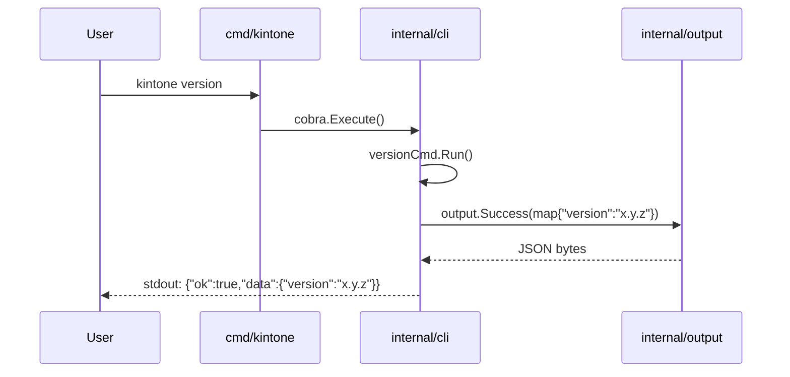

# Plan: kintone CLI / MCP サーバー ロードマップ作成

## Context

`docs/specs/kintone_spec.md` に kintone REST API を操作する統合ツール (CLI + MCP サーバー) の超詳細仕様書が存在するが、`plans/` は空でマイルストーン計画が未策定。スコープ大（OAuth/idproxy/multi-user/cache/Resolver/MCP remote 等）のため、無計画に着手すると実装が発散する。

このスキルでは以下を成果物とする:

1. **`plans/kintone-roadmap.md`** — プロジェクト全体のロードマップ（M1〜M11）
2. **`plans/kintone-m01-project-skeleton.md`** — M1 の詳細計画（着手用）
3. M2 以降は概要のみ（着手時に `/devflow:plan` で詳細生成）

**重要**: このプランファイル (`graceful-snacking-wilkinson.md`) は、ユーザー承認後に上記 2 ファイルへ展開するための「中間プラン」である。実装は行わず、計画ドキュメントの作成のみ。

---

## インタビュー結果サマリ

| 項目 | 決定 |
|------|------|
| M1 スコープ | プロジェクト雛形 + JSON 出力規約のみ（最小） |
| 分割スタイル | 垂直スライス進行（各 M で動くものが増える） |
| 認証優先度 | API Token 先行、OAuth/idproxy は後段 |
| キャッシュ/Resolver | 動作確認後に追加（M7-M8 で導入） |
| MCP SDK | mark3labs/mcp-go（公式 Go MCP SDK） |
| kintone クライアント | net/http で薄いラッパーを自作 |
| テスト戦略 | TDD 必須（Red → Green → Refactor） |
| 配布/CI | go install + GitHub Releases + Homebrew + Docker(ghcr.io) + GitHub Actions |

---

## 探索結果（コードベース現状）

| 項目 | 内容 |
|------|------|
| Go バージョン | 1.26（mise.toml） |
| 既存コード | なし（go.mod 未作成） |
| ディレクトリ | `docs/specs/`, `plans/`, `mise.toml`, `.git/` のみ |
| 仕様書 | `docs/specs/kintone_spec.md`（スペック確認済み） |

→ 完全な新規開発。スペックのディレクトリ構成（`cmd/kintone`, `internal/{cli,config,auth,idproxy,tokenstore,cache,resolver,kintoneapi,service,mcp,output}`）に従って構築する。

---

## 成果物 1: `plans/kintone-roadmap.md` の内容

````markdown
# Roadmap: kintone CLI / MCP サーバー

## Meta
| 項目 | 値 |
|------|---|
| ゴール | kintone REST API を操作する統合 CLI / MCP サーバーをリリース可能な品質で提供する |
| 成功基準 | (1) CLI から API Token + OAuth で record CRUD と app_describe が実行可能 (2) MCP サーバーが remote/multi-user で動作 (3) GoReleaser/Homebrew/Docker で配布可能 (4) JSON 固定出力 (5) TDD によるユニットテスト網羅 |
| 制約 | Go 1.26 / 仕様書（docs/specs/kintone_spec.md）準拠 / multi-user 対応 / profile + env override / 配布形態 4 種 |
| 対象リポジトリ | /Users/youyo/src/github.com/youyo/kintone |
| 作成日 | 2026-04-29 |
| 最終更新 | 2026-04-29 07:55 |
| ステータス | 未着手 |

## Current Focus
- **マイルストーン**: M1: プロジェクト雛形 + JSON 出力規約
- **直近の完了**: ロードマップ作成
- **次のアクション**: M1 着手（`/devflow:implement`）

## Progress

### M1: プロジェクト雛形 + JSON 出力規約
- [ ] go.mod 作成（module github.com/youyo/kintone, go 1.26）
- [ ] cmd/kintone/main.go（Cobra root）
- [ ] internal/cli/{root.go, version.go}
- [ ] internal/output/{json.go, json_test.go}（成功/エラー JSON フォーマット統一）
- [ ] .github/workflows/ci.yml（go test / go vet / golangci-lint）
- [ ] README.md（最小）/ LICENSE / .gitignore
- [ ] 実行確認: `go run ./cmd/kintone version` で `{"ok":true,"data":{"version":"..."}}` 出力
- 詳細: plans/kintone-m01-project-skeleton.md

### M2: config 層（toml + env + profile）
- [ ] internal/config/{config.go, profile.go, env.go, *_test.go}
- [ ] ~/.config/kintone/config.toml ローダー
- [ ] 優先順位: CLI > ENV > config 実装
- [ ] KINTONE_PROFILE / KINTONE_CONFIG_PATH / KINTONE_DOMAIN / KINTONE_AUTH 等環境変数
- [ ] CLI: `kintone config show` / `kintone config init`
- 詳細: 着手時に /devflow:plan で生成

### M3: kintoneapi クライアント + API Token 認証
- [ ] internal/auth/{apitoken.go, *_test.go}
- [ ] internal/kintoneapi/{client.go, transport.go, errors.go, *_test.go}（net/http 薄ラッパー）
- [ ] エンドポイント: GET /k/v1/records.json, GET /k/v1/record.json, GET /k/v1/app.json, GET /k/v1/app/form/fields.json
- [ ] レート制限・リトライ（Retry-After 対応）
- [ ] httptest によるモック動作確認
- 詳細: 着手時生成

### M4: service 層（read 系 operations）+ CLI api コマンド
- [ ] internal/service/api/{*.go}（薄い API 透過層）
- [ ] internal/service/operations/{records_query.go, app_describe.go, *_test.go}（LLM 向け抽象化）
- [ ] internal/cli/api/{records.go, app.go}
- [ ] 動作確認: 実 kintone 環境で record query が JSON で返る
- 詳細: 着手時生成

### M5: CLI ops コマンド（write 系 + describe）
- [ ] operations: record_create / record_update / record_delete / app_describe（fields 含む）
- [ ] internal/cli/ops/{record.go, app.go}
- [ ] バリデーション（必須項目・型）
- [ ] dry-run フラグ
- 詳細: 着手時生成

### M6: MCP サーバー雛形 + Facade 層
- [ ] internal/mcp/server/{stdio.go, *_test.go}（mark3labs/mcp-go）
- [ ] internal/mcp/facade/{tools.go, apps_search.go, app_describe.go, records_*.go}
- [ ] CLI: `kintone mcp serve` (stdio mode)
- [ ] 6 つの MCP tools 実装: apps_search, app_describe, records_query, record_create/update/delete
- [ ] 動作確認: Claude Desktop からの接続テスト
- 詳細: 着手時生成

### M7: SQLite キャッシュ + TokenStore
- [ ] internal/cache/{sqlite.go, schema.sql, ttl.go, *_test.go}（modernc.org/sqlite または mattn/go-sqlite3）
- [ ] internal/tokenstore/{store.go, sqlite.go, *_test.go}（Get/Put/Delete, Key=Domain+PrincipalID+AuthType）
- [ ] CLI: `kintone cache clear` / `kintone cache stats`
- [ ] TTL: apps/fields/resolver=1 年
- [ ] パス: ~/.cache/kintone/cache.db (host) / /data/kintone/cache.db (container)
- 詳細: 着手時生成

### M8: Resolver（名前解決）
- [ ] internal/resolver/{app.go, field.go, *_test.go}
- [ ] App: ID → code → name → partial の順
- [ ] Field: code → label → partial の順
- [ ] キャッシュ統合
- [ ] CLI/MCP からの透過利用
- 詳細: 着手時生成

### M9: OAuth 認証 + 自動更新
- [ ] internal/auth/oauth/{flow.go, refresh.go, *_test.go}
- [ ] access_token: 1h / refresh_token: 無期限 / 自動更新あり
- [ ] Scope: record/app/file read/write
- [ ] KINTONE_OAUTH_CLIENT_ID/SECRET/REDIRECT_URL
- [ ] CLI: `kintone auth login --oauth` / `kintone auth status`
- [ ] PKCE 対応・state 検証
- 詳細: 着手時生成

### M10: idproxy + multi-user MCP（remote/oidc）
- [ ] internal/idproxy/{provider.go, oidc.go, *_test.go}
- [ ] principal_id = provider:sub
- [ ] MCP Auth: none / oidc
- [ ] MCP AuthZ: oauth / api-token
- [ ] KINTONE_MCP_AUTH_MODE / KINTONE_MCP_AUTHZ_MODE
- [ ] HTTP/SSE remote MCP サーバー
- [ ] multi-user TokenStore 連携
- 詳細: 着手時生成

### M11: completion + Docker + GoReleaser リリース
- [ ] CLI: `kintone completion {bash|zsh|fish|powershell}`
- [ ] Dockerfile（multi-stage build, alpine base）
- [ ] .goreleaser.yaml（cross-compile + GitHub Releases + Homebrew Tap + ghcr.io）
- [ ] .github/workflows/release.yml（タグプッシュで起動）
- [ ] README 完備（インストール 4 方式 / 認証 3 方式 / CLI コマンド一覧 / MCP セットアップ）
- 詳細: 着手時生成

## Blockers
なし

## Architecture Decisions
| # | 決定 | 理由 | 日付 |
|---|------|------|------|
| 1 | MCP SDK は mark3labs/mcp-go を採用 | Go エコシステムで最も使われており stdio/http 両対応・remote 実装が容易 | 2026-04-29 |
| 2 | kintone REST クライアントは net/http 薄ラッパーを自作 | 依存最小化・テスト容易・必要な API のみ型付きで実装 | 2026-04-29 |
| 3 | TDD 必須（Red → Green → Refactor） | 認証・キャッシュ・Resolver など複雑ロジックの品質担保 | 2026-04-29 |
| 4 | 垂直スライス進行（M1 ごとに動く成果物） | 大規模仕様に対し早期動作確認とフィードバック反映を優先 | 2026-04-29 |
| 5 | API Token を先行実装、OAuth/idproxy は後段 | 動作確認が早期に可能・実装難易度を平準化 | 2026-04-29 |
| 6 | キャッシュ/Resolver は M7-M8 で導入 | データ整合性問題を避けるため CLI/MCP の主要機能が動作確認後 | 2026-04-29 |

## Changelog
| 日時 | 種別 | 内容 |
|------|------|------|
| 2026-04-29 07:55 | 作成 | ロードマップ初版作成（インタビューに基づき M1-M11 を確定） |
````

---

## 成果物 2: `plans/kintone-m01-project-skeleton.md` の内容

````markdown
# M01: プロジェクト雛形 + JSON 出力規約

## Overview
| 項目 | 値 |
|------|---|
| ステータス | 未着手 |
| 依存 | なし |
| 対象ファイル | go.mod / cmd/kintone/main.go / internal/cli/{root.go,version.go} / internal/output/{json.go,json_test.go} / .github/workflows/ci.yml / README.md / LICENSE / .gitignore |

## Goal
仕様書のディレクトリ構成に沿ったプロジェクト骨組みを作り、`kintone version` が JSON 規約 `{"ok":true,"data":{...}}` で結果を返すまでを完成させる。後続マイルストーンが乗せやすい基盤を確立する。

## Sequence Diagram


## TDD Test Design

### internal/output/json_test.go
| # | テストケース | 入力 | 期待出力 |
|---|-------------|------|---------|
| T1 | 成功 JSON: 単純な data | `Success(map[string]string{"version":"0.1.0"})` | `{"ok":true,"data":{"version":"0.1.0"}}` |
| T2 | 成功 JSON: nil data | `Success(nil)` | `{"ok":true,"data":null}` |
| T3 | エラー JSON: 標準エラー | `Failure(&Error{Code:"CONFIG_NOT_FOUND",Message:"..."})` | `{"ok":false,"error":{"code":"CONFIG_NOT_FOUND","message":"..."}}` |
| T4 | エラー JSON: details 付き | `Failure(&Error{Code:"X",Message:"y",Details:map{...}})` | `{"ok":false,"error":{"code":"X","message":"y","details":{...}}}` |
| T5 | 改行つき出力 | `Write(stdout, Success(...))` | 末尾改行 1 つ |
| T6 | エンコード安定性 | 同じ input で 2 回呼んでも同一 byte 列 | 等価 |

### internal/cli/version_test.go
| # | テストケース | 入力 | 期待出力 |
|---|-------------|------|---------|
| T7 | version コマンド: stdout に JSON | `kintone version` | exit=0, stdout に `"ok":true` を含む |
| T8 | version コマンド: --short フラグ | `kintone version --short` | プレーンな `0.1.0\n` (人間向け、JSON 規約の例外として規定) |

## Implementation Steps
- [ ] **Step 1**: `go mod init github.com/youyo/kintone` 実行 / .gitignore 作成（bin/, *.test, .env, .DS_Store, *.db, build/）
- [ ] **Step 2 (Red)**: `internal/output/json_test.go` を T1〜T6 で作成（実装ファイル無しでコンパイルエラー or fail）
- [ ] **Step 3 (Green)**: `internal/output/json.go` を実装（`Success(data any) []byte` / `Failure(err *Error) []byte` / `Error{Code,Message,Details}` / `Write(io.Writer, []byte)`）
- [ ] **Step 4 (Refactor)**: encoding/json 使用、改行ポリシー、エラー型の export ルール整理
- [ ] **Step 5 (Red)**: `internal/cli/version_test.go` を T7-T8 で作成
- [ ] **Step 6 (Green)**: `internal/cli/root.go`（cobra root: `kintone` / PersistentFlags 雛形）と `internal/cli/version.go`（versionCmd）実装
- [ ] **Step 7**: `cmd/kintone/main.go`（cli.Execute() 呼び出しのみ）
- [ ] **Step 8**: `.github/workflows/ci.yml` 作成（matrix: go-1.26 / steps: checkout, setup-go, go vet, go test ./..., golangci-lint）
- [ ] **Step 9**: README.md（最小: 概要・ビルド方法・version 例）/ LICENSE（MIT 推奨だが要確認）
- [ ] **Step 10**: 動作確認: `go run ./cmd/kintone version` が JSON 出力すること / `go test ./...` が全 pass すること

## Verification
1. `go build ./...` がエラーなく完了
2. `go test ./...` が pass（カバレッジは output パッケージ 100% 目標）
3. `go run ./cmd/kintone version` 実行 → stdout に `{"ok":true,"data":{"version":"0.1.0"}}` (末尾改行) が出力される
4. `go run ./cmd/kintone version --short` → `0.1.0` のみ出力
5. `go vet ./...` / `golangci-lint run` がクリーン
6. CI ワークフローが GitHub Actions で green になる（push 後）

## Risks
| リスク | 影響度 | 対策 |
|--------|--------|------|
| Go 1.26 がまだ安定提供されていない可能性 | 中 | mise.toml で固定済み。CI も同バージョン使用。問題があれば 1.25 にフォールバック検討 |
| Cobra のバージョン選定（v1.x） | 低 | 最新安定の `github.com/spf13/cobra` v1.8 系を採用 |
| LICENSE の選定（MIT vs Apache-2.0） | 低 | 着手時にユーザー確認（デフォルト MIT 提案） |
| JSON 出力規約の例外（completion / version --short など） | 低 | プレーン出力が必要な箇所は明示的にフラグで切り替え、規約からの逸脱を文書化 |
| golangci-lint の設定で衝突 | 低 | 初期は標準 linter のみ有効化、徐々に追加 |
````

---

## 次のステップ（実装フェーズで実行する操作）

ExitPlanMode 承認後、以下の Write 操作のみを実行する:

1. `Write` → `plans/kintone-roadmap.md`（上記「成果物 1」の内容）
2. `Write` → `plans/kintone-m01-project-skeleton.md`（上記「成果物 2」の内容）

その後、Next Action ブロックを提示して終了:

```
ロードマップを作成しました:
- plans/kintone-roadmap.md
- plans/kintone-m01-project-skeleton.md

次のステップ:
1. M1 の実装を開始する場合は `/devflow:implement` を実行してください
2. M2 以降の詳細計画が必要になったら `/devflow:plan` を実行してください
3. 全マイルストーンを自律ループで連続実行する場合は `/devflow:cycle` を実行してください
```

実装（コード作成）はこのスキルの範囲外であり、`/devflow:implement` 等の別スキル起動でユーザーが明示指示するまで一切行わない。
