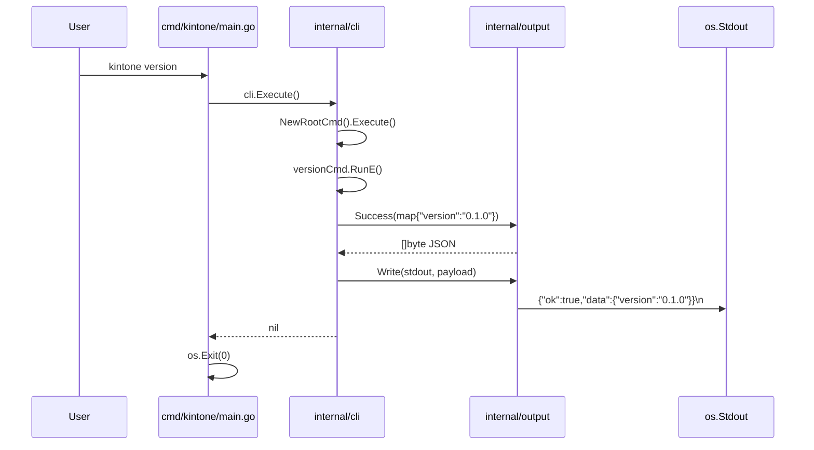
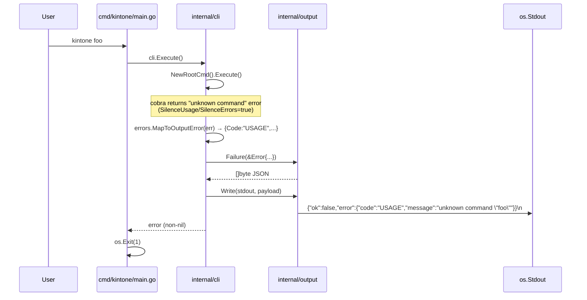

# M01: プロジェクト雛形 + JSON 出力規約

## Overview
| 項目 | 値 |
|------|---|
| ステータス | 未着手 |
| 依存 | なし |
| 想定期間 | 0.5 〜 1 日 |
| 対象ファイル | go.mod / go.sum / cmd/kintone/main.go / internal/cli/{root.go,version.go,errors.go,version_test.go,root_test.go,errors_test.go} / internal/output/{json.go,json_test.go} / .github/workflows/ci.yml / .golangci.yml / README.md / LICENSE / .gitignore |

## Goal
仕様書（docs/specs/kintone_spec.md）のディレクトリ構成・層構造・JSON 出力規約に沿ったプロジェクト骨組みを構築し、`kintone version` が `{"ok":true,"data":{"version":"0.1.0"}}` を stdout に出力する状態を達成する。後続マイルストーン（M2 config, M3 kintoneapi, …）が積み上げ可能な基盤を確立する。

### 完了条件
1. `go run ./cmd/kintone version` が JSON 規約準拠の出力を返す
2. `go run ./cmd/kintone version --short` がプレーン出力を返す（規約例外）
3. `go test ./...` が全 pass
4. CI workflow（`.github/workflows/ci.yml`）が syntactically valid（`actionlint` または GitHub Actions の構文チェッカでエラーなし）。**push は不要**（実際の CI green 検証は merge 後の自然タイミングで確認）
5. `cmd/kintone/main.go` が「`cli.Execute()` のみ」の最小化を達成

---

## Architecture Alignment（仕様書との整合）

| 仕様書要件 | M1 での扱い |
|-----------|-------------|
| ディレクトリ構成（cmd / internal/cli / internal/output ほか） | `cmd/kintone`, `internal/cli`, `internal/output` を本マイルストーンで作成。他層（config/auth/kintoneapi/...）は後続で追加 |
| レイヤー（CLI/MCP → facade → operations → api → client → auth → cache） | M1 は CLI 最上層 + output ユーティリティのみ。下位層に依存しないことで M2 以降の差し込みを阻害しない |
| JSON 出力規約（成功 `{ok:true,data:{}}` / エラー `{ok:false,error:{}}`） | `internal/output` で唯一の正典として実装。CLI 全コマンドはこの API のみを通す |
| LLM フレンドリー（JSON 固定出力） | 例外（completion / version --short / --help）は明示フラグで切り替え、デフォルトは常に JSON |
| multi-user / profile / env override | M1 では未着手。PersistentFlags は **M1 では未登録**（M2 着手時に `--profile` `--config` 等を一括追加）。詳細は Notes 参照 |

---

## Output Policy（規約と例外の整理）

| コマンド | 出力先 | フォーマット | 終了コード | 備考 |
|---------|--------|-------------|-----------|------|
| `kintone version` | stdout | JSON `{ok:true,data:{version,...}}` | 0 | 規約準拠 |
| `kintone version --short` | stdout | プレーン `0.1.0\n` | 0 | **規約例外**（人間/シェルスクリプト向け） |
| `kintone --help` / `kintone version --help` | stdout | cobra デフォルト helptext | 0 | **規約例外**（cobra 標準） |
| `kintone completion {bash\|zsh\|fish\|powershell}` | stdout | シェルスクリプト | 0 | **規約例外**（M11 で実装、M1 ではコマンド未登録） |
| usage error（未知サブコマンド等） | stdout | JSON `{ok:false,error:{code:"USAGE",...}}` | 1 | cobra のデフォルト stderr 出力は **抑止**。`SilenceUsage=true` & `SilenceErrors=true` で Execute 側に伝播 |
| 内部エラー（panic 含まず） | stdout | JSON `{ok:false,error:{code:"INTERNAL",...}}` | 1 | M1 段階の最小マッピング |

**設計原則**: LLM/パイプ消費者は stdout のみを読めば成功/失敗を判別できる（`.ok` フィールド）。stderr は cobra の `--help` 起動時等を除き原則使わない。

---

## Sequence Diagrams

### 正常系: `kintone version`


### 異常系: 未知サブコマンド `kintone foo`


---

## Public API: internal/output

```go
package output

// Error は失敗 JSON の `error` 値に詰める標準形。
type Error struct {
    Code    string         `json:"code"`              // 例: "USAGE", "INTERNAL", "CONFIG_NOT_FOUND"
    Message string         `json:"message"`           // 人間可読説明（英語、機微情報含めない）
    Details map[string]any `json:"details,omitempty"` // 任意の追加情報。無ければ omit
}

// Success は成功 JSON `{"ok":true,"data":<data>}` をエンコードして返す。
// data は nil 不可（呼び出し側は空オブジェクトを表現したい場合 struct{}{} か map[string]any{} を渡す）。
// 戻り値は末尾改行なし（Write が付与する）。
func Success(data any) ([]byte, error)

// Failure は失敗 JSON `{"ok":false,"error":{...}}` をエンコードして返す。
// e は nil 不可。
func Failure(e *Error) ([]byte, error)

// Write は payload を w に書き、末尾改行 1 つを保証する。
// 部分書き込み発生時はエラーを返す。
func Write(w io.Writer, payload []byte) error
```

### 振る舞いの確定事項
- `encoding/json` 標準ライブラリを使用。HTML エスケープは無効化（`json.Encoder.SetEscapeHTML(false)`）して LLM が読みやすい出力にする。
- フィールド順序は `ok` → `data` または `ok` → `error` を保証（Go の `encoding/json` は struct タグ順なので問題なし）。`map` は使わない（順序不定回避）。
- 内部実装は struct（`type successEnvelope struct { OK bool; Data any }`, `type failureEnvelope struct { OK bool; Error *Error }`）でラップ。
- `Success`/`Failure` の error 戻り値は実質発生しないが、`json.Marshal` 仕様上残す（`chan` や関数を渡されたケース等の防衛）。
- 改行は LF (`\n`) 固定（CRLF にしない、stdout バッファをそのまま流す）。

---

## Public API: internal/cli

```go
package cli

// Version はビルド情報。ldflags で上書き可能にするため var として宣言。
//   go build -ldflags "-X github.com/youyo/kintone/internal/cli.Version=v1.2.3"
var Version = "0.1.0"

// Commit / Date は M11 (GoReleaser) で注入予定。M1 では空文字でよい。
var (
    Commit = ""
    Date   = ""
)

// NewRootCmd はテスト可能な root コマンドを毎回新規生成する。
// グローバル変数を持たず、args / out / err を呼び出し側から差し替え可能にする設計。
func NewRootCmd() *cobra.Command

// Execute はバイナリ起動エントリ。
// 内部で executeWith(os.Args[1:], os.Stdout, os.Stderr) を呼ぶだけ。
// main は戻り error が non-nil なら os.Exit(1)。
func Execute() error

// executeWith はテストおよび Execute() 本体の共通実装。
// args / out / errOut を差し替え可能にし、エラー時は output.Failure を out に書く。
// 失敗 JSON を stdout に統一する（Output Policy 参照）。
func executeWith(args []string, out, errOut io.Writer) error

// versionPayload は `kintone version` の data 部分。
// Commit / Date は ldflags 注入時のみ含まれる（omitempty）。
// map ではなく struct を使うことで JSON フィールド順序を保証する。
type versionPayload struct {
    Version string `json:"version"`
    Commit  string `json:"commit,omitempty"`
    Date    string `json:"date,omitempty"`
}
```

### root.go の責務
- `NewRootCmd()` の生成のみ。
- `Use: "kintone"`, `Short`, `Long`, `SilenceUsage: true`, `SilenceErrors: true` を設定。
- **PersistentFlags は M1 では未登録**（`--profile` `--config` 等は M2 で一括追加）。
- `versionCmd` を `AddCommand` する。
- グローバル変数 `rootCmd` は持たない（テスト時の状態汚染を避けるため）。

### version.go の責務
- `versionCmd` の構築（`func newVersionCmd() *cobra.Command`）。
- `--short` フラグを定義。
- `RunE` 内で:
  - `--short` が true → `fmt.Fprintln(cmd.OutOrStdout(), Version)`（プレーン）
  - false → `output.Success(versionPayload{Version: Version, Commit: Commit, Date: Date})` → `output.Write(cmd.OutOrStdout(), payload)`
    - `Commit` / `Date` は M1 では空文字 → `omitempty` により JSON に出現しない
    - 結果: `{"ok":true,"data":{"version":"0.1.0"}}`（Goal 行と完全一致）
  - エラー時は error を return（cobra の Execute 側でハンドル）。

### errors.go の責務
- cobra の error を `*output.Error` に変換するマッピング関数 `MapToOutputError(err error) *output.Error` を提供。
- M1 段階のマッピング:
  - cobra の "unknown command" / flag parse error → `Code:"USAGE"`
  - その他 → `Code:"INTERNAL"`
- M2 以降で `CONFIG_NOT_FOUND` などを追加していく。

### Execute() / executeWith() の流れ
```go
// Execute は os の入出力を executeWith に委譲する薄ラッパ。
func Execute() error {
    return executeWith(os.Args[1:], os.Stdout, os.Stderr)
}

// executeWith はテスト可能な実装本体。
func executeWith(args []string, out, errOut io.Writer) error {
    cmd := NewRootCmd()
    cmd.SetArgs(args)
    cmd.SetOut(out)
    cmd.SetErr(errOut) // cobra 自身のメッセージ用（SilenceErrors=true なので原則出ない）
    if err := cmd.Execute(); err != nil {
        oe := MapToOutputError(err)
        payload, _ := output.Failure(oe)
        _ = output.Write(out, payload) // 失敗 JSON は stdout (= out) に統一
        return err
    }
    return nil
}
```

---

## cmd/kintone/main.go の最小化

```go
package main

import (
    "os"

    "github.com/youyo/kintone/internal/cli"
)

func main() {
    if err := cli.Execute(); err != nil {
        os.Exit(1)
    }
}
```

これ以上は何も持たない。バージョン文字列も `internal/cli.Version` に集約。

---

## Version 文字列の管理方針

| 観点 | 採用方針 |
|------|---------|
| 宣言 | `var Version = "0.1.0"` （`internal/cli/root.go` または `version.go`） |
| なぜ const ではないか | M11 で GoReleaser が `-ldflags "-X .../cli.Version=v1.2.3"` で注入する。const は ldflags で書き換え不可 |
| 開発時の値 | `0.1.0` 固定。タグ未付与状態でも問題なし |
| リリース時の値 | GoReleaser が git tag → ldflags 経由で `v<semver>` を注入 |
| Commit / Date | 同様に var で宣言、M11 で ldflags 注入。M1 では空文字 |
| `version` 出力 | `versionPayload` struct + `omitempty` で吸収。M1 は `Commit=""`/`Date=""` のため出力に現れず `{"version":"0.1.0"}`。M11 で ldflags 注入後は自動的に `commit`/`date` も含まれる（互換破壊なし＝フィールド追加のみ） |
| テスト時の状態管理 | `Version` を test で書き換える場合は **必ず `t.Cleanup` で復元**。`t.Parallel()` するテストでは書き換えない（race detector 回避） |

---

## TDD Test Design

### internal/output/json_test.go

| # | テストケース | 入力 | 期待出力 / 検証点 |
|---|-------------|------|-------------------|
| O-1 | Success: シンプルな data | `Success(struct{Version string `json:"version"`}{"0.1.0"})` | bytes が `{"ok":true,"data":{"version":"0.1.0"}}`（末尾改行なし） |
| O-2 | Success: ネストした data | struct（json タグ付き） | `{"ok":true,"data":{"a":1,"b":["x"]}}` |
| O-3 | Success: 空オブジェクト | `Success(struct{}{})` | `{"ok":true,"data":{}}` |
| O-4 | Failure: 標準エラー（details 無し） | `Failure(&Error{Code:"CONFIG_NOT_FOUND",Message:"config not found"})` | `{"ok":false,"error":{"code":"CONFIG_NOT_FOUND","message":"config not found"}}` |
| O-5 | Failure: details 付き | `Failure(&Error{Code:"X",Message:"y",Details:map{"path":"/a"}})` | `{"ok":false,"error":{"code":"X","message":"y","details":{"path":"/a"}}}` |
| O-6 | Failure: nil Error | `Failure(nil)` | error 戻り値が non-nil（防衛コード） |
| O-7 | Write: 末尾改行 1 つ | `Write(buf, []byte("{}"))` | `buf.String() == "{}\n"` |
| O-8 | Write 契約: 改行なしで渡す | `Write(buf, payload)` の payload は改行なし | Write が常に `\n` を 1 つ追加して書く |
| O-9 | エンコード安定性 | 同じ input で 2 回呼んでも同一 byte 列 | `bytes.Equal(a, b)` |
| O-10 | HTML エスケープ無効化 | `Success(struct{Q string `json:"q"`}{"a&b<c>"})` | 出力に `&` / `<` を **含まず**、`a&b<c>` がそのまま含まれる（`SetEscapeHTML(false)` 検証） |

### internal/cli/version_test.go

| # | テストケース | 入力 | 期待出力 / 検証点 |
|---|-------------|------|-------------------|
| V-1 | `version` サブコマンド: JSON 出力（M1: commit/date 無し） | `cmd.SetArgs([]string{"version"})` → `cmd.Execute()` | err nil, stdout が `{"ok":true,"data":{"version":"0.1.0"}}\n` ちょうど（commit/date キーが含まれないことも検証） |
| V-2 | `version` JSON 構造妥当性 | 同上 | stdout を `json.Unmarshal` した結果 `.ok==true && .data.version=="0.1.0"`、`.data` のキー集合が `{"version"}` のみ |
| V-3 | `version --short`: プレーン出力 | `cmd.SetArgs([]string{"version","--short"})` | err nil, stdout が `"0.1.0\n"` ちょうど（JSON でない） |
| V-4 | `version --help`: cobra ヘルプ | `cmd.SetArgs([]string{"version","--help"})` | err nil, stdout に `Usage:` を含む |

### internal/cli/root_test.go

| # | テストケース | 入力 | 期待出力 / 検証点 |
|---|-------------|------|-------------------|
| R-1 | 未知サブコマンド | `cmd.SetArgs([]string{"foo"})` | err non-nil（NewRootCmd().Execute() 直接） |
| R-2 | サブコマンド無し | `cmd.SetArgs([]string{})` | cobra デフォルト動作（ヘルプ表示）。err nil, stdout に Usage |
| R-3 | executeWith() 経由の失敗パス（統合テスト） | `executeWith([]string{"foo"}, &outBuf, &errBuf)` | stdout に `{"ok":false,"error":{"code":"USAGE",...}}`、err non-nil |

### internal/cli/errors_test.go

| # | テストケース | 入力 | 期待 |
|---|-------------|------|------|
| E-1 | cobra の unknown command エラー | `errors.New("unknown command \"foo\" for \"kintone\"")` | `MapToOutputError(err).Code == "USAGE"` |
| E-2 | 不明エラー | `errors.New("boom")` | `Code == "INTERNAL"`, `Message == "boom"` |
| E-3 | nil 入力 | `MapToOutputError(nil)` | `nil`（防衛） |

---

## Implementation Steps（atomic、順次実行）

各ステップ完了時にコミット可能（feat:/test:/chore:）。

- [ ] **Step 1: リポジトリ初期化**
  - `go mod init github.com/youyo/kintone`（go 1.26）
  - `.gitignore` 作成（`bin/`, `*.test`, `.env`, `.DS_Store`, `*.db`, `build/`, `dist/`, `coverage.out`）
  - 動作確認: `go env GOMOD` がパス表示

- [ ] **Step 2 (Red): output パッケージのテスト先行**
  - `internal/output/json_test.go` に O-1〜O-10 を記述
  - `go test ./internal/output/...` がコンパイルエラー（実装未存在）を確認

- [ ] **Step 3 (Green): output パッケージの最小実装**
  - `internal/output/json.go` に `Error`, `Success`, `Failure`, `Write` を実装
  - O-1〜O-10 が全 pass するまで
  - 動作確認: `go test ./internal/output/...` 緑

- [ ] **Step 4 (Refactor): output パッケージ整理**
  - struct 化、HTML エスケープ無効化、改行ポリシー統一、godoc コメント
  - テスト緑のまま `go vet` / `gofmt -l` クリーン

- [ ] **Step 5: cobra 依存追加**
  - `go get github.com/spf13/cobra@v1.8.x`
  - `go mod tidy`

- [ ] **Step 6 (Red): cli パッケージのテスト先行**
  - `internal/cli/version_test.go`（V-1〜V-4）
  - `internal/cli/root_test.go`（R-1〜R-3）
  - `internal/cli/errors_test.go`（E-1〜E-3）
  - コンパイルエラー / fail を確認

- [ ] **Step 7 (Green): cli パッケージ最小実装**
  - `internal/cli/root.go`: `NewRootCmd`, `executeWith`, `Execute`
  - `internal/cli/version.go`: `newVersionCmd`, `Version` var
  - `internal/cli/errors.go`: `MapToOutputError`
  - 全テスト pass

- [ ] **Step 8 (Refactor): cli パッケージ整理**
  - 重複削除、godoc、`SilenceUsage`/`SilenceErrors` 確認

- [ ] **Step 9: main.go 作成**
  - `cmd/kintone/main.go`: `cli.Execute()` を呼び `os.Exit` するだけ
  - ビルド確認: `go build -o /tmp/kintone ./cmd/kintone`

- [ ] **Step 10: 手動動作確認**
  - `go run ./cmd/kintone version` → JSON
  - `go run ./cmd/kintone version --short` → プレーン
  - `go run ./cmd/kintone foo` → 失敗 JSON, exit 1
  - `go run ./cmd/kintone --help` → cobra ヘルプ
  - `echo $?` で終了コード確認

- [ ] **Step 11: 補助ファイル**
  - `LICENSE` （**未確定: ユーザーに MIT / Apache-2.0 を確認**）
  - `README.md`（最小: プロジェクト概要 / ビルド / `version` コマンド例 / ロードマップへのリンク）

- [ ] **Step 12: lint 設定**
  - `.golangci.yml`（最小: `errcheck`, `govet`, `staticcheck`, `gofmt`, `goimports`, `unused`, `ineffassign` のみ）

- [ ] **Step 13: CI 構築**
  - `.github/workflows/ci.yml`（後述の最小構成）
  - `actionlint` で構文検証（`brew install actionlint` または `go install github.com/rhysd/actionlint/cmd/actionlint@latest`）
  - **push は不要**（実 CI green 検証は merge 後の自然なタイミングで行う）

- [ ] **Step 14: 最終チェック**
  - `go test -race -cover ./...` 全 pass / output パッケージ 100% カバレッジ
  - `golangci-lint run` クリーン
  - `gofmt -l .` 差分なし
  - 初回コミット作成（Conventional Commits, 日本語）

---

## CI 最小構成（.github/workflows/ci.yml）

```yaml
name: CI
on:
  push:
    branches: [main]
  pull_request:

jobs:
  test:
    runs-on: ubuntu-latest
    timeout-minutes: 10
    steps:
      - uses: actions/checkout@v4
      - uses: actions/setup-go@v5
        with:
          go-version-file: go.mod
      - name: gofmt check
        run: |
          diff=$(gofmt -l .)
          if [ -n "$diff" ]; then echo "$diff"; exit 1; fi
      - name: go vet
        run: go vet ./...
      - name: go test
        run: go test -race -cover ./...

  lint:
    runs-on: ubuntu-latest
    timeout-minutes: 10
    steps:
      - uses: actions/checkout@v4
      - uses: actions/setup-go@v5
        with:
          go-version-file: go.mod
      - uses: golangci/golangci-lint-action@v6
        with:
          version: latest
```

> 注: `cache: true` は actions/setup-go@v5 のデフォルトのため明示しない。`go-version-file: go.mod` により go.mod の `go 1.26` 行を信頼する（mise.toml と整合）。Windows / macOS matrix は M11 で追加。

---

## Verification

### 自動テスト
1. `go test -race -cover ./...` → 全 pass。`internal/output` カバレッジ 100%、`internal/cli` 80% 以上を目標
2. `go vet ./...` → 警告なし
3. `gofmt -l .` → 出力なし
4. `golangci-lint run` → クリーン
5. `actionlint .github/workflows/ci.yml` → エラーなし（実 CI green は push 後の自然タイミングで確認）

### 手動コマンド
```bash
# 1. 成功系（JSON 規約準拠）
$ go run ./cmd/kintone version
{"ok":true,"data":{"version":"0.1.0"}}
$ echo $?
0

# 2. 規約例外（プレーン）
$ go run ./cmd/kintone version --short
0.1.0
$ echo $?
0

# 3. 失敗系（JSON 規約準拠、stdout 出力、exit 1）
$ go run ./cmd/kintone foo
{"ok":false,"error":{"code":"USAGE","message":"unknown command \"foo\" for \"kintone\""}}
$ echo $?
1

# 4. ヘルプ（規約例外）
$ go run ./cmd/kintone --help
Usage:
  kintone [command]
...

# 5. パース可能性確認（LLM/シェルスクリプト想定）
$ go run ./cmd/kintone version | jq -r '.data.version'
0.1.0
$ go run ./cmd/kintone foo 2>/dev/null | jq -r '.error.code'
USAGE
```

### ビルド確認
```bash
$ go build -o /tmp/kintone ./cmd/kintone
$ /tmp/kintone version
{"ok":true,"data":{"version":"0.1.0"}}

# ldflags 注入の確認（M11 への先行検証）
$ go build -ldflags "-X github.com/youyo/kintone/internal/cli.Version=v9.9.9" -o /tmp/kintone ./cmd/kintone
$ /tmp/kintone version
{"ok":true,"data":{"version":"v9.9.9"}}
```

---

## Risks

| # | Risk | Impact | Likelihood | Mitigation |
|---|------|--------|-----------|-----------|
| R-1 | Go 1.26 が CI ランナーで提供されない | 中 | 中 | `actions/setup-go@v5` は最新 toolchain を取得可。問題発生時は 1.25 にダウングレードしロードマップで合意 |
| R-2 | Cobra v1.8 系の API 変更 | 低 | 低 | `go.sum` でロック。M1 完了後の minor up は別 PR |
| R-3 | LICENSE 未確定によるブロック | 低 | 中 | Step 11 直前にユーザーへ MIT / Apache-2.0 を確認 |
| R-4 | JSON 出力規約の例外（completion / version --short / --help）が後で増える | 低 | 中 | Output Policy 表に明記。新コマンド追加時はこの表を必ず更新する規約を README に書く |
| R-5 | グローバル `rootCmd` 利用でテスト並列実行不可 | 中 | 高 | `NewRootCmd()` 関数化で回避（採用済み） |
| R-6 | `os.Args` / `os.Stdout` 直接利用でテスト困難 | 中 | 高 | `executeWith(args, out, errOut)` 内部関数で抽象化（採用済み） |
| R-7 | golangci-lint 設定が厳しすぎて Step 13 でブロック | 低 | 中 | M1 は 7 linter のみ有効化、M2 以降で段階的に拡張 |
| R-8 | `Success(nil)` 許容の解釈ブレ | 低 | 低 | 契約違反として扱い、`struct{}{}` を渡す方針に統一（テスト O-3 で担保） |
| R-9 | 失敗 JSON を stderr に出すべきという要望 | 低 | 低 | Output Policy で「stdout 統一」を明文化。変更要望時は ADR で議論 |
| R-10 | ldflags で var 上書きを忘れる | 低 | 低 | M11 で .goreleaser.yaml に明記。M1 で動作確認テストを Verification に含める |
| R-11 | `Version` var を test で書き換えて t.Parallel() 並列実行するとレース | 中 | 低 | テスト書き換え時は必ず `t.Cleanup` で復元。並列テストでは Version を触らない規約（Version 文字列管理方針表に明記済み） |
| R-12 | cobra の "unknown command" メッセージ文言が i18n / version up で変わる | 中 | 低 | E-1 は文字列マッチングではなく cobra の挙動（err non-nil + cobra のエラー型または prefix `unknown command`）で判定。実装時に最小限の prefix チェックに留める |

---

## Open Questions（未確定事項）

| # | 項目 | 確認先 | デッドライン |
|---|------|--------|-------------|
| Q-1 | LICENSE: MIT or Apache-2.0 | ユーザー | Step 11 着手前 |
| Q-2 | README に英語版を作るか | ユーザー | M11（M1 では日本語のみ） |
| Q-3 | `KINTONE_NO_COLOR` / TTY 判定 | M2 以降で議論 | M2 着手時 |
| Q-4 | 失敗 JSON を stderr に出すオプション (`--errors-to-stderr`) を導入するか | ユーザー | M11 までに判断（cron/systemd 等の運用パターン需要が出た段階で再検討） |

---

## Notes / 後続マイルストーンへの引き継ぎ

- `internal/cli/root.go` に PersistentFlags（`--profile`, `--config`, `--no-color` など）を追加するのは **M2** の責務。M1 では未登録のままにし、M2 のテストが flag 登録を検証する。
- `internal/output` は今後 `Failure` の `Code` 体系を拡張する。M3（kintoneapi）以降で `KINTONE_API_ERROR`, `RATE_LIMITED` などを追加。命名規約: SCREAMING_SNAKE_CASE。
- `Version` / `Commit` / `Date` の var は M11 で GoReleaser から ldflags 注入される。今 const にしない理由をコードコメントに残すこと。
- 失敗 JSON は stdout に出力する設計は LLM パイプ消費を意識した結果。MCP サーバー（M6 以降）でも同方針を継続する。

---

## Changelog

| 日時 | 種別 | 内容 |
|------|------|------|
| 2026-04-29 | 作成 | 初版ドラフト |
| 2026-04-29 | planning-agent による精緻化 | TDD test 表の拡充（O-1〜O-10 / V-1〜V-4 / R-1〜R-3 / E-1〜E-3）／Output Policy 表追加／Sequence Diagram 正常系・異常系を分離／internal/output と internal/cli の Public API を確定／cmd/kintone/main.go の最小化方針確定／Version 管理を `var` に決定（ldflags 対応）／JSON 規約例外を表で明示／エラー伝播フロー（cobra → MapToOutputError → output.Failure → stdout）を確定／NewRootCmd / executeWith による testability 確保／Risk 表を 10 項目に拡充／CI 最小構成を確定／Open Questions セクション追加 |
| 2026-04-29 | devils-advocate / advocate レビュー反映 | (1) `versionPayload` struct を Public API に追加（map 不使用方針との整合・omitempty で M1/M11 差分吸収）／(2) `executeWith` シグネチャを Public API に明記し Execute() を委譲構造に変更／(3) `--profile` を M1 では「未登録」一択に統一（行 31/161 の矛盾解消）／(4) O-10 期待値の論理を反転（HTML エスケープ無効化の正しい検証）／(5) V-1/V-2 で commit/date キー非含有を厳格チェック／(6) Q-4 (`--errors-to-stderr` 余地) を Open Questions に追加／(7) CI yaml に `timeout-minutes: 10` と `go-version-file: go.mod` 追加・golangci-lint version を latest 化／(8) Risk 表に R-11 (Version var 並列テスト race) と R-12 (cobra メッセージ文言依存) を追加／(9) Version 文字列管理方針表にテスト時の状態管理欄を追加 |
| 2026-04-29 | advisor() 最終ゲート反映 | 完了条件 #4 / Step 13 / Verification 自動テスト #5 を「actionlint による構文検証」に書き換え、cycle ルール（push 不要）と完了条件の矛盾を解消 |
