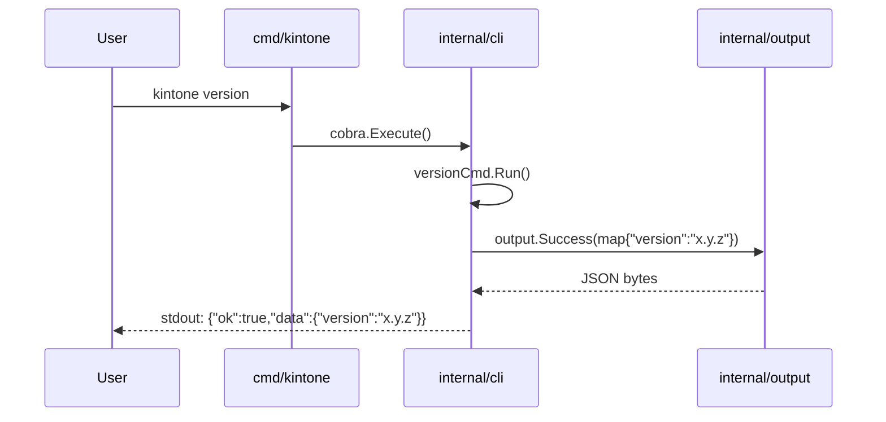

# M01: プロジェクト雛形 + JSON 出力規約

## Overview
| 項目 | 値 |
|------|---|
| ステータス | 未着手 |
| 依存 | なし |
| 対象ファイル | go.mod / cmd/kintone/main.go / internal/cli/{root.go,version.go,version_test.go} / internal/output/{json.go,json_test.go} / .github/workflows/ci.yml / README.md / LICENSE / .gitignore |

## Goal
仕様書のディレクトリ構成に沿ったプロジェクト骨組みを作り、`kintone version` が JSON 規約 `{"ok":true,"data":{...}}` で結果を返すまでを完成させる。後続マイルストーンが乗せやすい基盤を確立する。

## Sequence Diagram

## TDD Test Design

### internal/output/json_test.go
| # | テストケース | 入力 | 期待出力 |
|---|-------------|------|---------|
| T1 | 成功 JSON: 単純な data | `Success(map[string]string{"version":"0.1.0"})` | `{"ok":true,"data":{"version":"0.1.0"}}` |
| T2 | 成功 JSON: nil data | `Success(nil)` | `{"ok":true,"data":null}` |
| T3 | エラー JSON: 標準エラー | `Failure(&Error{Code:"CONFIG_NOT_FOUND",Message:"..."})` | `{"ok":false,"error":{"code":"CONFIG_NOT_FOUND","message":"..."}}` |
| T4 | エラー JSON: details 付き | `Failure(&Error{Code:"X",Message:"y",Details:map{...}})` | `{"ok":false,"error":{"code":"X","message":"y","details":{...}}}` |
| T5 | 改行つき出力 | `Write(stdout, Success(...))` | 末尾改行 1 つ |
| T6 | エンコード安定性 | 同じ input で 2 回呼んでも同一 byte 列 | 等価 |

### internal/cli/version_test.go
| # | テストケース | 入力 | 期待出力 |
|---|-------------|------|---------|
| T7 | version コマンド: stdout に JSON | `kintone version` | exit=0, stdout に `"ok":true` を含む |
| T8 | version コマンド: --short フラグ | `kintone version --short` | プレーンな `0.1.0\n` (人間向け、JSON 規約の例外として規定) |

## Implementation Steps
- [ ] **Step 1**: `go mod init github.com/youyo/kintone` 実行 / .gitignore 作成（bin/, *.test, .env, .DS_Store, *.db, build/）
- [ ] **Step 2 (Red)**: `internal/output/json_test.go` を T1〜T6 で作成（実装ファイル無しでコンパイルエラー or fail）
- [ ] **Step 3 (Green)**: `internal/output/json.go` を実装（`Success(data any) []byte` / `Failure(err *Error) []byte` / `Error{Code,Message,Details}` / `Write(io.Writer, []byte)`）
- [ ] **Step 4 (Refactor)**: encoding/json 使用、改行ポリシー、エラー型の export ルール整理
- [ ] **Step 5 (Red)**: `internal/cli/version_test.go` を T7-T8 で作成
- [ ] **Step 6 (Green)**: `internal/cli/root.go`（cobra root: `kintone` / PersistentFlags 雛形）と `internal/cli/version.go`（versionCmd）実装
- [ ] **Step 7**: `cmd/kintone/main.go`（cli.Execute() 呼び出しのみ）
- [ ] **Step 8**: `.github/workflows/ci.yml` 作成（matrix: go-1.26 / steps: checkout, setup-go, go vet, go test ./..., golangci-lint）
- [ ] **Step 9**: README.md（最小: 概要・ビルド方法・version 例）/ LICENSE（MIT 推奨だが要確認）
- [ ] **Step 10**: 動作確認: `go run ./cmd/kintone version` が JSON 出力すること / `go test ./...` が全 pass すること

## Verification
1. `go build ./...` がエラーなく完了
2. `go test ./...` が pass（カバレッジは output パッケージ 100% 目標）
3. `go run ./cmd/kintone version` 実行 → stdout に `{"ok":true,"data":{"version":"0.1.0"}}` (末尾改行) が出力される
4. `go run ./cmd/kintone version --short` → `0.1.0` のみ出力
5. `go vet ./...` / `golangci-lint run` がクリーン
6. CI ワークフローが GitHub Actions で green になる（push 後）

## Risks
| リスク | 影響度 | 対策 |
|--------|--------|------|
| Go 1.26 がまだ安定提供されていない可能性 | 中 | mise.toml で固定済み。CI も同バージョン使用。問題があれば 1.25 にフォールバック検討 |
| Cobra のバージョン選定（v1.x） | 低 | 最新安定の `github.com/spf13/cobra` v1.8 系を採用 |
| LICENSE の選定（MIT vs Apache-2.0） | 低 | 着手時にユーザー確認（デフォルト MIT 提案） |
| JSON 出力規約の例外（completion / version --short など） | 低 | プレーン出力が必要な箇所は明示的にフラグで切り替え、規約からの逸脱を文書化 |
| golangci-lint の設定で衝突 | 低 | 初期は標準 linter のみ有効化、徐々に追加 |
