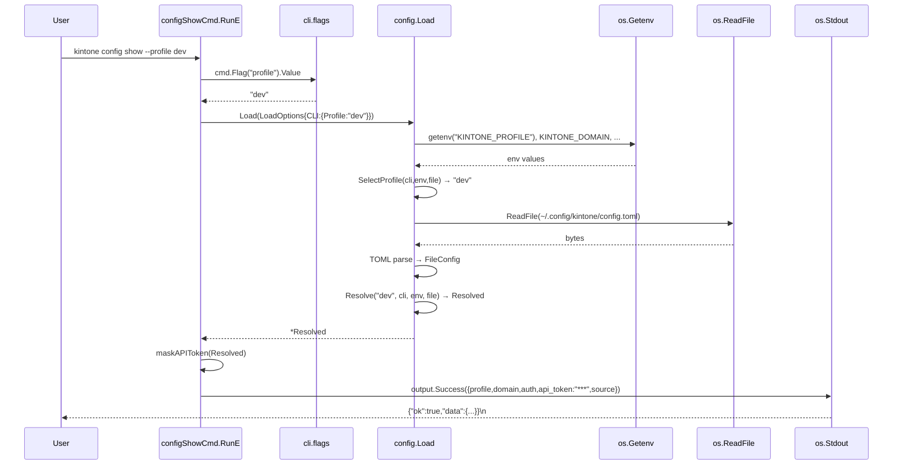
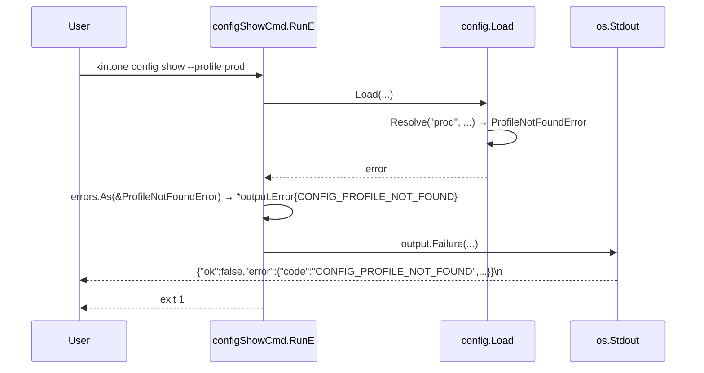
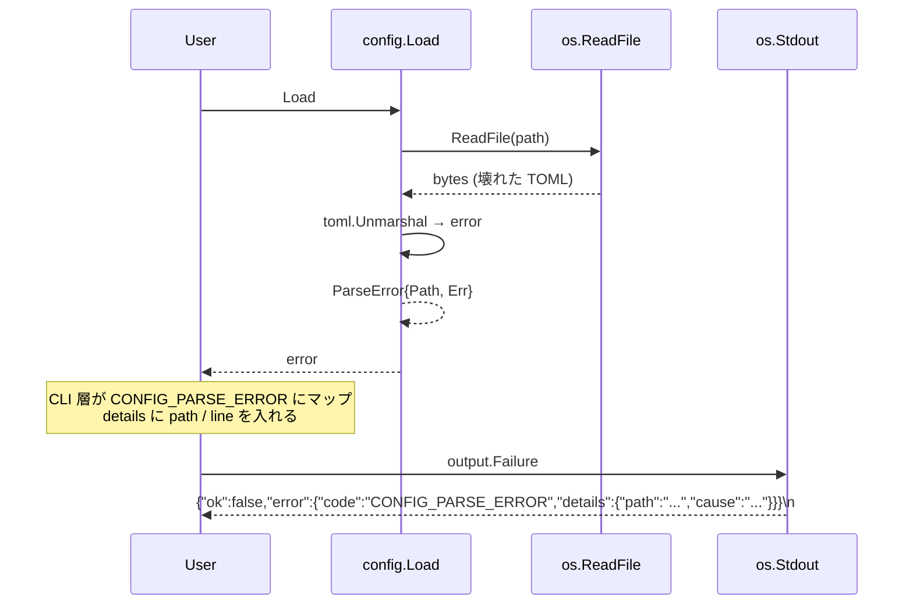
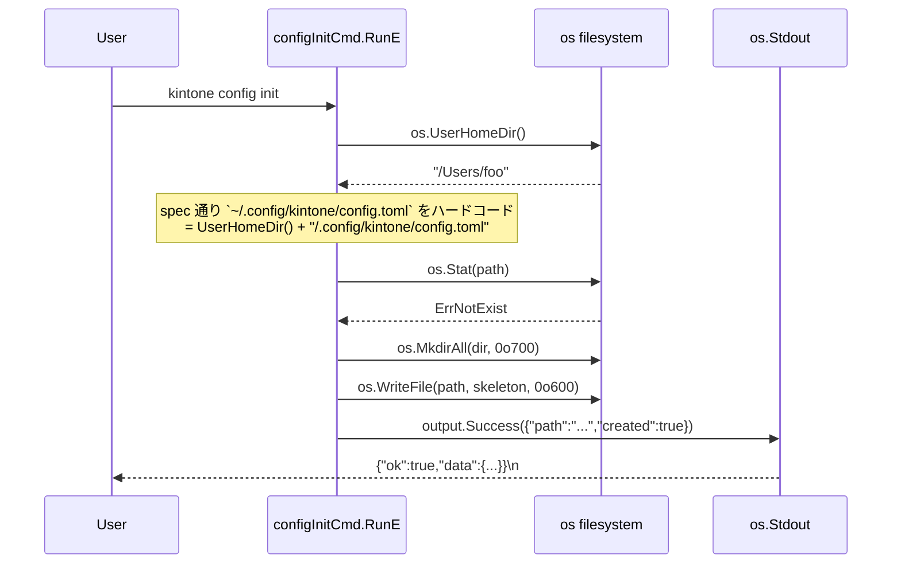

# M02: config 層（toml + env + profile）

## Overview
| 項目 | 値 |
|------|---|
| ステータス | 未着手 |
| 依存 | M01 完了（internal/output / internal/cli） |
| 想定期間 | 0.5 〜 1 日 |
| 対象ファイル | `internal/config/{config.go,profile.go,env.go,loader.go,resolver.go,*_test.go}` / `internal/cli/{root.go(編集),config.go(新規),config_test.go(新規),errors.go(編集)}` / `go.mod` / `go.sum` / `README.md`（編集） / `CLAUDE.md`（編集） / `plans/kintone-roadmap.md`（編集） |

## Goal
仕様書 `docs/specs/kintone_spec.md` の「設定」「優先順位 CLI > ENV > config」を実装する config 層を構築し、後続マイルストーン（M3 認証 / M4 service など）が `config.Load()` を呼ぶだけで「現在のプロファイル設定（解決済み）」を取得できる状態にする。`kintone config show` / `kintone config init` を JSON 出力規約準拠で動作させる。

### 完了条件
1. `internal/config.Load(opts)` が CLI > ENV > toml の優先順位で `*Resolved` を返す
2. `~/.config/kintone/config.toml` が存在しなくてもデフォルト profile で起動できる（`CONFIG_NOT_FOUND` エラーは出さない＝profile 未指定時は空 Resolved を返す）
3. 明示指定された `--profile foo` でプロファイルが見つからない場合は `CONFIG_PROFILE_NOT_FOUND` エラー（JSON）を返す
4. `kintone config show` が現在の解決済み設定を JSON で出力（**機微情報マスク済み**）
5. `kintone config init` が `~/.config/kintone/config.toml` のスケルトンを書き出す（既存時は `--force` がない限り `CONFIG_ALREADY_EXISTS`）
6. `--profile` `--config` `--no-color` PersistentFlags が root に登録される（M01 Notes で予告された通り）
7. `go test -race -cover ./...` 全 pass。`internal/config` カバレッジ 85% 以上、`internal/cli` 既存カバレッジを維持
8. `go vet` / `gofmt -l` / `golangci-lint run` クリーン
9. 実行確認: 後述 Verification の手動コマンド全件
10. README / CLAUDE.md / kintone-roadmap.md（M02 セクション）が更新されている

---

## Architecture Alignment（仕様書との整合）

| 仕様書要件 | M02 での扱い |
|-----------|-------------|
| `~/.config/kintone/config.toml` | XDG 準拠で `os.UserConfigDir()` を使用（macOS: `~/Library/Application Support` ではなく Linux 互換の `~/.config/kintone` を強制）。`KINTONE_CONFIG_PATH` で上書き可能 |
| 優先順位: CLI > ENV > config | `Resolver.Resolve(cli, env, file) *Resolved` で一意に解決。各レイヤは独立構造体で受け取り、merge は明示的に 1 箇所のみ |
| KINTONE_PROFILE / KINTONE_CONFIG_PATH / KINTONE_CACHE_PATH / KINTONE_DOMAIN / KINTONE_AUTH | M02 で全マッピング実装。OAuth/API_TOKEN/MCP 系は **値の格納のみ**（読み取り＋ Resolved 経由で公開）し、消費は M3+ で行う |
| profile + env override | `[profiles.default]` `[profiles.dev]` 形式の TOML テーブル。`--profile` または `KINTONE_PROFILE` で選択。未指定時は `default` |
| JSON 出力規約 | `kintone config show` / `kintone config init` の成功・失敗ともに `internal/output` 経由で出力 |
| LLM フレンドリー | `config show` は機微情報をマスクした JSON。完全な構造を出すため `--reveal` フラグは **M02 では実装しない**（M3 で OAuth トークンが入った段階で再検討） |
| multi-user 対応 | M02 段階では「単一ホスト 1 ユーザー」前提。multi-user 関連フィールド（principal_id 等）は M10 で追加。**今は触らない** |
| CLI 全体への PersistentFlags | `--profile` `--config` `--no-color` を `NewRootCmd()` に登録。M01 Notes で予告済み |

---

## Output Policy（M01 から継承＋追加）

| コマンド | 出力先 | フォーマット | 終了コード | 備考 |
|---------|--------|-------------|-----------|------|
| `kintone config show` | stdout | JSON `{ok:true,data:{profile,...}}` | 0 | 規約準拠。**機微情報マスク** |
| `kintone config show --json-pretty` | stdout | indent 付き JSON | 0 | 規約例外（人間向け、TTY のみデフォルト false） |
| `kintone config init` | stdout | JSON `{ok:true,data:{path,created:true}}` | 0 | スケルトン書き出し成功時 |
| `kintone config init --force` | stdout | JSON `{ok:true,data:{path,created:true,overwritten:true}}` | 0 | 既存ファイル上書き |
| 既存ファイル上書き拒否 | stdout | JSON `{ok:false,error:{code:"CONFIG_ALREADY_EXISTS",...}}` | 1 | `--force` なしで既存検出時 |
| profile 未発見 | stdout | JSON `{ok:false,error:{code:"CONFIG_PROFILE_NOT_FOUND",...}}` | 1 | 明示指定 `--profile foo` の場合のみ |
| TOML パースエラー | stdout | JSON `{ok:false,error:{code:"CONFIG_PARSE_ERROR",details:{path,line}}}` | 1 | line/col 情報があれば `details` に含める |
| ファイル権限エラー | stdout | JSON `{ok:false,error:{code:"CONFIG_PERMISSION_DENIED",...}}` | 1 | 0o600 期待を満たさない場合は **警告のみ**（拒否しない、details に actual_mode を入れる） |
| stat エラーその他 | stdout | JSON `{ok:false,error:{code:"CONFIG_IO_ERROR",...}}` | 1 | |

---

## Public API: internal/config

### config.go — 公開型

```go
// Package config は kintone CLI/MCP の設定読み込み・解決を提供する。
//
// 優先順位: CLI フラグ > 環境変数 > config.toml
//
// 各レイヤは独立した構造体（FileConfig / EnvConfig / CLIConfig）で
// 受け取り、Resolver が一意に Resolved にマージする。
package config

// AuthMode は認証モード。"api-token" / "oauth" / 空文字（未設定）。
// M02 では値の格納のみで使用、消費は M3+。
type AuthMode string

const (
    AuthModeAPIToken AuthMode = "api-token"
    AuthModeOAuth    AuthMode = "oauth"
)

// FileConfig は TOML ファイルから読み込んだ生の構造。
//
// [default_profile]
// name = "default"
//
// [profiles.default]
// domain = "example.cybozu.com"
// auth   = "api-token"
//
// [profiles.dev]
// domain = "dev.cybozu.com"
// auth   = "oauth"
type FileConfig struct {
    DefaultProfile DefaultProfileBlock        `toml:"default_profile"`
    Profiles       map[string]ProfileBlock    `toml:"profiles"`
}

type DefaultProfileBlock struct {
    Name string `toml:"name"`
}

// ProfileBlock は 1 プロファイルぶんの設定。
// M02 で扱うのは Domain / Auth のみ。
// OAuth/MCP 系は将来拡張のため struct タグを **予約のみ**（M3+ で実装）。
type ProfileBlock struct {
    Domain string `toml:"domain"`
    Auth   string `toml:"auth"` // "api-token" / "oauth"
}

// EnvConfig は環境変数から読み取った生の値（未解決）。
// 空文字は「未設定」を意味する。
type EnvConfig struct {
    Profile     string // KINTONE_PROFILE
    ConfigPath  string // KINTONE_CONFIG_PATH
    CachePath   string // KINTONE_CACHE_PATH
    Domain      string // KINTONE_DOMAIN
    Auth        string // KINTONE_AUTH
    APIToken    string // KINTONE_API_TOKEN（M02 では格納のみ）
    // OAuth/MCP は M02 では LoadEnv 内で読み取らない（YAGNI）
}

// CLIConfig は CLI フラグから渡された値（未解決）。
// 空文字は「未指定」を意味する。
type CLIConfig struct {
    Profile    string // --profile
    ConfigPath string // --config
    // --no-color は output 層で別途扱うため Resolved には含めない
}

// Resolved は CLI > ENV > toml の優先順位で確定した最終設定。
// 後続マイルストーン（auth, kintoneapi）はこの構造のみを参照する。
//
// **advisor 指摘 #2 反映**: JSON タグを明示し、`config show` がこの struct を
// そのままシリアライズできるようにする（snake_case 統一）。
type Resolved struct {
    ProfileName string   `json:"profile"`
    Domain      string   `json:"domain"`
    Auth        AuthMode `json:"auth"`
    APIToken    string   `json:"api_token"` // show 時はマスク版を別途構築する
    ConfigPath  string   `json:"config_path"`
    CachePath   string   `json:"cache_path"`
    Source      Sources  `json:"source"`
}

// Sources は Resolved の各フィールドがどのレイヤから来たかを記録する。
// "cli" / "env" / "file" / "default" のいずれか。
type Sources struct {
    Profile string `json:"profile"`
    Domain  string `json:"domain"`
    Auth    string `json:"auth"`
}

// LoadOptions は Load の入力。
//
// **advisor 指摘 #3 反映**: パス解決は HOME ベース（spec の `~/.config/kintone`）
// で統一する。OS 別パス解釈（os.UserConfigDir）は使わず、`UserHomeDir` の
// 注入のみ受け付ける。
type LoadOptions struct {
    CLI CLIConfig
    // 環境変数取得関数（テスト時に差し替え可能、デフォルトは os.Getenv）
    Getenv func(string) string
    // ファイル読み取り関数（テスト時に差し替え可能、デフォルトは os.ReadFile）
    ReadFile func(path string) ([]byte, error)
    // ファイル stat 関数（テスト時に差し替え可能、デフォルトは os.Stat）
    Stat func(path string) (os.FileInfo, error)
    // ホームディレクトリ解決（テスト時に差し替え可能、デフォルトは os.UserHomeDir）
    UserHomeDir func() (string, error)
}

// Load は CLI / ENV / file を解決した Resolved を返す。
// エラー時は *output.Error ではなく標準 error を返し、CLI 層で MapToOutputError がコード変換する。
func Load(opts LoadOptions) (*Resolved, error)
```

### profile.go — profile 選択ロジック

```go
// SelectProfile は CLI / ENV / FileConfig.DefaultProfile から
// 最終的な profile 名を決定する。
// 優先順位: cli.Profile > env.Profile > file.DefaultProfile.Name > "default"
func SelectProfile(cli CLIConfig, env EnvConfig, file *FileConfig) string
```

### env.go — 環境変数読み取り

```go
// LoadEnv は os.Getenv（または注入された getenv）から EnvConfig を構築する。
// 空文字は未設定として扱う。
func LoadEnv(getenv func(string) string) EnvConfig
```

### loader.go — TOML 読み取り

```go
// LoadFile は path から TOML を読み取り FileConfig を返す。
// path が存在しない場合は (zero-value, nil) を返す（エラーにしない）。
// パースエラー時は ParseError を返す。
//
// 0o600 でない場合は WarnPermission エラーを Resolved 経由で
// CLI 層に伝えるための仕組みは M02 では未実装（warnings は将来拡張）。
func LoadFile(path string, readFile func(string) ([]byte, error)) (FileConfig, error)

// ParseError は TOML パース失敗を表す。
type ParseError struct {
    Path string
    Err  error // 原因 error（toml ライブラリのエラー）
}

func (e *ParseError) Error() string
func (e *ParseError) Unwrap() error
```

### resolver.go — レイヤマージ

```go
// Resolve は profile 確定後に CLI > ENV > FileConfig の優先順位でマージし、
// Resolved を返す。
// profile が file 内に存在しない & 明示指定がある場合は ProfileNotFoundError。
// profile 未指定で file が空の場合は profile="default" の空 Resolved を返す。
func Resolve(profileName string, cli CLIConfig, env EnvConfig, file FileConfig) (*Resolved, error)

// ProfileNotFoundError は --profile foo / KINTONE_PROFILE=foo 指定で
// file 内に profile が見つからない場合のエラー。
type ProfileNotFoundError struct {
    Name string
    Path string // file path（参考）
}

func (e *ProfileNotFoundError) Error() string
```

---

## Public API: internal/cli の追加・変更

### root.go の変更（PersistentFlags 追加）

```go
func NewRootCmd() *cobra.Command {
    cmd := &cobra.Command{
        Use:   "kintone",
        Short: "kintone CLI ツール",
        // ... 既存どおり
    }
    // M02 で追加
    cmd.PersistentFlags().String("profile", "", "使用する profile 名（KINTONE_PROFILE 環境変数より優先）")
    cmd.PersistentFlags().String("config", "", "config.toml のパス（KINTONE_CONFIG_PATH 環境変数より優先）")
    cmd.PersistentFlags().Bool("no-color", false, "カラー出力を無効化（規約例外: M02 では未使用、後続で利用予定）")
    cmd.AddCommand(newVersionCmd())
    cmd.AddCommand(newConfigCmd()) // 新規
    return cmd
}
```

### config.go（新規）

```go
package cli

import (
    "github.com/spf13/cobra"
    "github.com/youyo/kintone/internal/config"
    "github.com/youyo/kintone/internal/output"
)

// newConfigCmd は config サブコマンド（show / init）を構築する。
func newConfigCmd() *cobra.Command {
    cmd := &cobra.Command{
        Use:   "config",
        Short: "config 設定を操作する",
    }
    cmd.AddCommand(newConfigShowCmd())
    cmd.AddCommand(newConfigInitCmd())
    return cmd
}

func newConfigShowCmd() *cobra.Command { /* config.Load → output.Success(masked) */ }
func newConfigInitCmd() *cobra.Command { /* skeleton 書き出し、--force でのみ上書き */ }
```

### errors.go の拡張（**advisor 指摘 #1 反映**: アーキテクチャ統一）

config 関連エラーも **既存の `executeWith` のエラー伝播パスに乗せる**。RunE は `output.Failure` を **書かず**、エラーを return するだけにする。これにより:
- 失敗 JSON 出力は `executeWith` の 1 箇所のみ（二重出力なし）
- 終了コード 1 が `main.go` の `os.Exit(1)` で確実に立つ
- M01 パターン（`SilenceUsage`/`SilenceErrors=true` + `MapToOutputError`）と完全一致

`MapToOutputError` を以下のように拡張する（`errors.As` でドメインエラーを検出）:

```go
func MapToOutputError(err error) *output.Error {
    if err == nil {
        return nil
    }
    // M02: config 関連の型付きエラーを優先判定
    var pne *config.ProfileNotFoundError
    if errors.As(err, &pne) {
        return &output.Error{
            Code:    "CONFIG_PROFILE_NOT_FOUND",
            Message: pne.Error(),
            Details: map[string]any{"name": pne.Name, "path": pne.Path},
        }
    }
    var pe *config.ParseError
    if errors.As(err, &pe) {
        return &output.Error{
            Code:    "CONFIG_PARSE_ERROR",
            Message: pe.Error(),
            Details: map[string]any{"path": pe.Path, "cause": pe.Err.Error()},
        }
    }
    var ae *config.AlreadyExistsError
    if errors.As(err, &ae) {
        return &output.Error{
            Code:    "CONFIG_ALREADY_EXISTS",
            Message: ae.Error(),
            Details: map[string]any{"path": ae.Path},
        }
    }
    var nfe *config.NotFoundError // 明示 --config 指定で不在のとき config 側が wrap
    if errors.As(err, &nfe) {
        return &output.Error{
            Code:    "CONFIG_NOT_FOUND",
            Message: nfe.Error(),
            Details: map[string]any{"path": nfe.Path},
        }
    }
    // 既存の判定
    msg := err.Error()
    if isUsageError(msg) {
        return &output.Error{Code: "USAGE", Message: msg}
    }
    return &output.Error{Code: "INTERNAL", Message: msg}
}
```

| マッピング | 判定 | 発生源 |
|-----------|------|-------|
| `CONFIG_PROFILE_NOT_FOUND` | `errors.As(*config.ProfileNotFoundError)` | resolver.Resolve |
| `CONFIG_PARSE_ERROR` | `errors.As(*config.ParseError)` | loader.LoadFile |
| `CONFIG_ALREADY_EXISTS` | `errors.As(*config.AlreadyExistsError)` | configInitCmd（**新規型を config パッケージに追加**） |
| `CONFIG_NOT_FOUND` | `errors.As(*config.NotFoundError)` | loader（明示 --config 指定で不在の場合のみ wrap） |
| `USAGE` / `INTERNAL` | 既存ロジック | 既存どおり |

**追加する型** `internal/config/loader.go` および `resolver.go` に:

```go
type AlreadyExistsError struct{ Path string }
func (e *AlreadyExistsError) Error() string { return "config: already exists: " + e.Path }

type NotFoundError struct{ Path string }
func (e *NotFoundError) Error() string { return "config: not found: " + e.Path }
```

> **重要**: RunE 内では `output.Failure` を呼ばず、`return err` のみ行う。`executeWith` が `MapToOutputError(err)` → `output.Failure(oe)` → `output.Write(out, payload)` を一括処理する（M01 既存パス）。これでアーキテクチャが二重化しない。

---

## TOML スケルトン（`config init` で書き出される内容）

```toml
# kintone CLI / MCP サーバー設定ファイル
# 詳細: https://github.com/youyo/kintone#config
#
# 注意: API Token / OAuth client secret などの機微情報は
# このファイルに書かないこと。環境変数経由（KINTONE_API_TOKEN 等）で渡す。

[default_profile]
name = "default"

[profiles.default]
domain = ""           # 例: "example.cybozu.com"
auth   = "api-token"  # "api-token" or "oauth"
# API Token を使うときは KINTONE_API_TOKEN 環境変数で渡してください。

# 追加プロファイルの例（コメントアウト）:
# [profiles.dev]
# domain = "dev.cybozu.com"
# auth   = "oauth"
```

**API Token / OAuth client secret などは TOML に書かない**（環境変数経由で渡す）方針を README / コメントに明記。理由はセキュリティ（誤コミット防止 / 0o600 だけでは不十分）。

---

## 機微情報マスク方針（`config show`）

| フィールド | M02 での扱い |
|----------|------------|
| `profile` | そのまま表示 |
| `domain` | そのまま表示 |
| `auth` | そのまま表示 |
| `api_token` | **マスク**（環境変数経由のみ来るが念のため）。空でなければ `"***"`、空文字ならそのまま `""` |
| `config_path` | そのまま表示（path 自体は機微でない） |
| `cache_path` | そのまま表示（M07 で実体作成、M02 では参考値） |
| `source` | 各フィールドの出所表示（cli/env/file/default） |

実装方針: `config show` は `Resolved` を直接シリアライズせず、
**マスク済み copy（`maskedView` 関数で生成）** を `output.Success` に渡す。
`Resolved` 型は **マスクしない生データ**として保持し、後続層が利用する責任分離。

`config show` の JSON 出力例:
```json
{
  "ok": true,
  "data": {
    "profile": "default",
    "domain": "example.cybozu.com",
    "auth": "api-token",
    "api_token": "***",
    "config_path": "/Users/foo/.config/kintone/config.toml",
    "cache_path": "/Users/foo/.cache/kintone/cache.db",
    "source": {"profile":"default","domain":"file","auth":"file"}
  }
}
```

---

## Sequence Diagrams

### 正常系: `kintone config show --profile dev`



### 異常系 1: profile 明示指定で発見できない



### 異常系 2: TOML パースエラー



### 正常系: `kintone config init`



---

## Decision: `os.UserConfigDir` を使うかパス決定をハードコードするか

| 観点 | os.UserConfigDir 採用 | `~/.config/kintone` ハードコード |
|------|---------------------|------------------------------|
| Spec 整合 | macOS で `~/Library/Application Support/kintone` になる（spec の `~/.config/kintone` と乖離） | spec と完全一致 |
| 標準準拠 | XDG / Apple HIG の OS 標準パス | XDG のみ（macOS では非標準） |
| ユーザー移行性 | 低（OS 切替で path が変わる） | 高（同一） |
| 実装簡潔性 | 同等 | 同等 |

**M02 採用判断: ハードコード `~/.config/kintone`**（仕様書優先）。`os.UserHomeDir()` ベースで構築。`KINTONE_CONFIG_PATH` で override 可能。Decision を README に明記し、Open Question Q-3 として macOS の `Library/Application Support` 移行を将来検討対象として残す。

---

## TDD Test Design

> 全テスト共通: `t.Setenv` または `LoadOptions.Getenv` でモック化。`os` 直接呼び出しはテストできないため、`Load` は依存注入（`Getenv` / `ReadFile` / `UserConfigDir`）を採用。

### internal/config/env_test.go

| # | ケース | 入力 | 期待 |
|---|--------|------|------|
| EN-1 | 全 ENV 設定 | KINTONE_PROFILE=dev, KINTONE_DOMAIN=foo.cybozu.com, ... | EnvConfig が全フィールド埋まる |
| EN-2 | ENV 一部のみ | KINTONE_PROFILE のみ | Profile="dev"、他は空文字 |
| EN-3 | ENV 全部空 | （何もセットしない） | EnvConfig がゼロ値 |
| EN-4 | KINTONE_API_TOKEN 取得 | KINTONE_API_TOKEN=abc | EnvConfig.APIToken == "abc" |
| EN-5 | KINTONE_AUTH 不正値 | KINTONE_AUTH=xxx | EnvConfig.Auth == "xxx"（バリデーションは Resolve で行う or M3 へ先送り。M02 ではそのまま格納） |

### internal/config/profile_test.go

| # | ケース | cli.Profile | env.Profile | file.DefaultProfile.Name | 期待 SelectProfile |
|---|--------|-------------|-------------|------------------------|-----|
| PR-1 | CLI 優先 | "cli-p" | "env-p" | "file-p" | "cli-p" |
| PR-2 | CLI なし、ENV 優先 | "" | "env-p" | "file-p" | "env-p" |
| PR-3 | CLI/ENV なし、file 採用 | "" | "" | "file-p" | "file-p" |
| PR-4 | 全部空 | "" | "" | "" | "default" |

### internal/config/loader_test.go

| # | ケース | 入力 | 期待 |
|---|--------|------|------|
| LD-1 | 正常な TOML | `[profiles.default]` 形式 | FileConfig.Profiles["default"] が埋まる |
| LD-2 | ファイル不在 | path に対して ReadFile → fs.ErrNotExist | FileConfig ゼロ値 + nil error |
| LD-3 | 空ファイル | empty bytes | FileConfig ゼロ値 + nil error |
| LD-4 | 構文エラー TOML | `domain = ` | `*ParseError` 返却、`Path` がセットされる |
| LD-5 | 複数 profile | `[profiles.default]` `[profiles.dev]` | Profiles に 2 件 |
| LD-6 | 未知キー | `[profiles.default]` 内に `foo = "bar"` | エラーにせず無視（前方互換確保） |
| LD-7 | パースエラーが Unwrap で原因 error を取れる | LD-4 と同じ | `errors.Is(err, &ParseError{})` が動作 |

### internal/config/resolver_test.go

| # | ケース | 入力 | 期待 Resolved |
|---|--------|------|--------------|
| RS-1 | ENV が file を上書き（cli.Domain は M02 では未実装、`--profile` のみ） | env.Domain="env.com" / file.Domain="file.com" | `Domain="env.com"`, Source.Domain="env" |
| RS-2 | ENV.Auth が file.Auth を上書き | env.Auth="oauth" / file.Auth="api-token" | `Auth==AuthModeOAuth`, Source.Auth="env" |
| RS-3 | ENV 空、file 採用 | env.Domain="" / file.Domain="file.com" | `Domain="file.com"`, Source.Domain="file" |
| RS-4 | 全部空 | 全て空 | `Domain=""`, Source.Domain="default" |
| RS-5 | profile 明示で未発見 | profileName="prod", file に "prod" 無し | `*ProfileNotFoundError` |
| RS-6 | profile 未指定で file 空 | profileName="default", file.Profiles=nil | Resolved（空値） + Source 全部 "default" |
| RS-7 | KINTONE_API_TOKEN 反映 | env.APIToken="abc" | `Resolved.APIToken=="abc"` |
| RS-8 | Auth=oauth 反映 | env.Auth="oauth" | `Resolved.Auth==AuthModeOAuth` |
| RS-9 | Auth 不正値 | env.Auth="xxx" | `Resolved.Auth==AuthMode("xxx")`（バリデーション緩和、M3 で厳格化） |

> **注**: 仕様上 `--domain` フラグは M02 では追加しない（CLI から渡せるのは `--profile` / `--config` のみ）。RS-1/RS-2 は ENV > file の優先順位を別フィールドで検証する。

### internal/config/config_test.go（Load の統合）

| # | ケース | 入力 | 期待 |
|---|--------|------|------|
| LC-1 | 全部デフォルト（HOME に config なし） | LoadOptions ゼロ値 + 空 getenv | Resolved（profile=default, 全 source=default） |
| LC-2 | HOME 解決失敗 | UserConfigDir → error | error: HOME 解決失敗 |
| LC-3 | KINTONE_CONFIG_PATH 経由でファイル指定 | env.ConfigPath="/tmp/foo.toml" | 該当ファイルから読み込む |
| LC-4 | --config が ENV を override | cli.ConfigPath="/tmp/cli.toml", env.ConfigPath="/tmp/env.toml" | "/tmp/cli.toml" を読む |
| LC-5 | profile 解決の統合 | env.Profile="dev", file に dev 定義あり | Resolved.ProfileName=="dev"、file の dev block を参照 |
| LC-6 | パースエラー伝播 | 壊れた TOML を ReadFile が返す | `*ParseError` を返す |

### internal/cli/config_test.go

| # | ケース | 入力 | 期待 |
|---|--------|------|------|
| CC-1 | `config show` 正常系 | t.Setenv で KINTONE_DOMAIN=foo / 空 HOME | stdout に `{"ok":true,"data":{"profile":"default","domain":"foo",...}}` |
| CC-2 | `config show` mask 確認 | KINTONE_API_TOKEN=secret | stdout の data.api_token が "***"（"secret" を含まない） |
| CC-3 | `config show` profile 未発見 | --profile foo（file に無し） | stdout `{"ok":false,"error":{"code":"CONFIG_PROFILE_NOT_FOUND",...}}`、exit non-nil |
| CC-4 | `config show` source 表示 | env のみ設定 | data.source.domain == "env" |
| CC-5 | `config init` 正常 | 空ディレクトリ + --config /tmp/x.toml | ファイル作成、stdout `{"ok":true,"data":{"path":"/tmp/x.toml","created":true}}` |
| CC-6 | `config init` 既存拒否 | 既にファイル存在 | exit non-nil + `CONFIG_ALREADY_EXISTS` |
| CC-7 | `config init --force` 上書き | 既にファイル存在 | 上書き、`overwritten:true` |
| CC-8 | パーミッション 0o600 | --config /tmp/y.toml で init | 作成後 stat.Mode().Perm() == 0o600 |
| CC-9 | TOML パースエラー → CLI で CONFIG_PARSE_ERROR | 壊れた TOML を `--config` で指定 → show | exit non-nil + CONFIG_PARSE_ERROR、details.path セット |

### internal/cli/root_test.go の追加

| # | ケース | 期待 |
|---|--------|------|
| R-4 | --profile / --config / --no-color が PersistentFlags に登録されている | `cmd.PersistentFlags().Lookup("profile") != nil` 等。`--no-color` は **存在のみ検証**し挙動は assert しない（M02 では宣言だけ、parse はするが値は無視する設計） |
| R-5 | グローバル flag は子コマンドからも参照可能 | config show コマンド経由で `cmd.Flag("profile").Value` 取得確認 |

---

## Implementation Steps（atomic、TDD 順次実行）

各ステップ完了時にコミット可能（feat:/test:/chore:）。

- [ ] **Step 1: 依存追加**
  - `go get github.com/BurntSushi/toml@v1.4.0`
  - `go mod tidy`
  - 動作確認: `go build ./...`

- [ ] **Step 2 (Red): config パッケージのテスト先行**
  - `internal/config/env_test.go` (EN-1〜5)
  - `internal/config/profile_test.go` (PR-1〜4)
  - `internal/config/loader_test.go` (LD-1〜7)
  - `internal/config/resolver_test.go` (RS-2〜9、RS-1 は変更後)
  - `internal/config/config_test.go` (LC-1〜6)
  - `go test ./internal/config/...` がコンパイルエラー → 期待通り

- [ ] **Step 3 (Green): config パッケージ最小実装**
  - `internal/config/env.go` → `LoadEnv`
  - `internal/config/profile.go` → `SelectProfile`
  - `internal/config/loader.go` → `LoadFile` + `ParseError`
  - `internal/config/resolver.go` → `Resolve` + `ProfileNotFoundError`
  - `internal/config/config.go` → 公開型 + `Load(opts)`
  - 全テスト緑化

- [ ] **Step 4 (Refactor): config パッケージ整理**
  - godoc / 重複削減 / `errors.Is`/`errors.As` 検証
  - `go vet` / `gofmt -l` クリーン

- [ ] **Step 5 (Red): cli config コマンドのテスト先行**
  - `internal/cli/config_test.go` (CC-1〜9)
  - `internal/cli/root_test.go` 追加（R-4〜5）

- [ ] **Step 6 (Green): cli config コマンド実装**
  - `internal/cli/config.go` 新規（newConfigCmd / show / init）
  - `internal/cli/root.go` に PersistentFlags 追加 + AddCommand
  - mask 関数（apiToken の `***` 化）
  - skeleton 文字列を const で定義
  - 既存テストが落ちないこと確認

- [ ] **Step 7 (Refactor): cli config 整理**
  - エラーマッピング（`CONFIG_PROFILE_NOT_FOUND` 等）を config CLI 内のヘルパに集約
  - godoc

- [ ] **Step 8: 動作確認**
  - 後述 Verification セクションの全コマンド実行
  - `go test -race -cover ./...` 全 pass、config 85%+ / cli 既存維持

- [ ] **Step 9: ドキュメント更新**
  - `README.md`: config セクション追加（init/show 例 / TOML サンプル / 環境変数一覧 / 優先順位 / API Token は ENV 経由が推奨である旨）
  - `CLAUDE.md`: 「プロジェクト現状」を M02 完了 → M03 次マイルストーン に更新
  - `plans/kintone-roadmap.md` の M02 セクションのチェックボックスを `[x]` に、Current Focus を M3 に、Changelog に M02 完了を追記

- [ ] **Step 10: lint / fmt 最終チェック**
  - `golangci-lint run` クリーン
  - `gofmt -l .` 差分なし
  - `go vet ./...`

- [ ] **Step 11: コミット**
  - Conventional Commits（日本語）で段階分けコミット
    - `chore(deps): BurntSushi/toml を追加`
    - `test(config): config パッケージのテストを先行追加`
    - `feat(config): toml + env + profile 解決ロジックを実装`
    - `feat(cli): config show / init を実装`
    - `feat(cli): root に --profile/--config/--no-color フラグを追加`
    - `docs: README/CLAUDE/roadmap を M02 完了に更新`

---

## Verification

### 自動テスト
1. `go test -race -cover ./...` 全 pass
2. `internal/config` カバレッジ 85% 以上、`internal/cli` 既存（90.9%）以上維持
3. `go vet ./...` 警告なし
4. `gofmt -l .` 出力なし
5. `golangci-lint run` クリーン

### 手動コマンド

```bash
# 0. ビルド
go build -o /tmp/kintone ./cmd/kintone

# 1. config init（HOME で空状態）
HOME=/tmp/m02-test /tmp/kintone config init
# → {"ok":true,"data":{"path":"/tmp/m02-test/.config/kintone/config.toml","created":true}}
ls -l /tmp/m02-test/.config/kintone/config.toml
# → -rw------- (0o600)

# 2. 二度目は CONFIG_ALREADY_EXISTS
HOME=/tmp/m02-test /tmp/kintone config init
# → {"ok":false,"error":{"code":"CONFIG_ALREADY_EXISTS",...}}
echo $?  # 1

# 3. --force で上書き
HOME=/tmp/m02-test /tmp/kintone config init --force
# → {"ok":true,"data":{"path":"...","created":true,"overwritten":true}}

# 4. config show（HOME に config なし）
HOME=/tmp/m02-empty /tmp/kintone config show
# → {"ok":true,"data":{"profile":"default","domain":"","auth":"","api_token":"","config_path":"...","source":{"profile":"default","domain":"default","auth":"default"}}}

# 5. ENV override
HOME=/tmp/m02-test KINTONE_DOMAIN=ex.cybozu.com KINTONE_AUTH=api-token KINTONE_API_TOKEN=secret /tmp/kintone config show
# → data.domain=="ex.cybozu.com", data.api_token=="***", data.source.domain=="env"

# 6. CLI override（--profile）
HOME=/tmp/m02-test /tmp/kintone config show --profile dev
# config.toml の dev profile が無いので CONFIG_PROFILE_NOT_FOUND
# → {"ok":false,"error":{"code":"CONFIG_PROFILE_NOT_FOUND","details":{"name":"dev","path":"..."}}}

# 7. 壊れた TOML
echo "broken =" > /tmp/broken.toml
/tmp/kintone config show --config /tmp/broken.toml
# → {"ok":false,"error":{"code":"CONFIG_PARSE_ERROR","details":{"path":"/tmp/broken.toml",...}}}

# 8. JSON パイプ消費
HOME=/tmp/m02-empty /tmp/kintone config show | jq -r '.data.profile'
# → default
```

---

## Risks

| # | Risk | Impact | Likelihood | Mitigation |
|---|------|--------|-----------|-----------|
| R-1 | TOML ライブラリ選定（BurntSushi/toml vs pelletier/go-toml/v2） | 中 | 中 | BurntSushi 採用（成熟度・依存少・標準的）。pelletier は将来移行可能なよう loader 内部に閉じ込める |
| R-2 | macOS で `~/Library/Application Support` を使うべきか | 中 | 低 | spec 通り `~/.config/kintone` をハードコード。Open Question Q-3 で残す |
| R-3 | 0o600 違反のファイルを拒否すべきか | 中 | 中 | M02 では拒否しない（warnings 機構未実装）。R&D メモとして残し M03+ で再検討 |
| R-4 | `config show` で機微情報漏洩 | 高 | 低 | api_token は必ず `***` マスク。テスト CC-2 で担保 |
| R-5 | グローバル env を直接読むことでテスト不安定化 | 中 | 高 | `LoadOptions.Getenv` 注入で完全モック化。`t.Setenv` は CLI 統合テストのみ使用 |
| R-6 | TOML 未知キーで err する → 前方互換崩壊 | 中 | 中 | BurntSushi/toml はデフォルトで未知キーを無視。`DisallowUnknownFields` は使わない（LD-6 で担保） |
| R-7 | ENV のスペル間違い（KINTONE_PROFLE 等）に気づけない | 低 | 中 | M02 は warnings なし。M11 までに `kintone config doctor` を検討（Open Question） |
| R-8 | 並列テストでの env / 作業ディレクトリ汚染 | 中 | 高 | `LoadOptions` 注入を徹底し、unit テストは `t.Parallel()` 安全に。CLI 統合テストは `t.Setenv` 利用のため非並列 |
| R-9 | profile 名の衝突（"default" を上書き可能） | 低 | 低 | `[profiles.default]` を file で再定義した場合は file 採用（仕様通り） |
| R-10 | `--config /nonexistent.toml` 明示時の挙動 | 中 | 中 | 明示指定 + 不存在 → `CONFIG_NOT_FOUND` エラー。明示なし + 不存在 → デフォルトで起動（Goal 完了条件 #2） |
| R-11 | `MapToOutputError` に config 系を入れると既存テストが壊れる可能性 | 中 | 中 | config 系エラーは config CLI コマンド内で type assert して `*output.Error` を直接生成（既存 errors.go は触らない or 最小拡張） |
| R-12 | M3 認証層が `config.Resolved` の API を要求する形と乖離 | 中 | 中 | Resolved は最小限のフィールドのみ公開し、M3 で必要に応じて拡張。M03 計画時に互換性レビュー |
| R-13 | `config init` 失敗時の中途半端な状態（dir 作成済み・file 失敗等） | 低 | 低 | tmp ファイル → `os.Rename` で atomic 書き込み。失敗時 tmp は cleanup |

---

## Open Questions（未確定事項）

| # | 項目 | 確認先 | デッドライン |
|---|------|--------|-------------|
| Q-1 | TOML ライブラリ: BurntSushi/toml v1.4.0 で確定でよいか | ユーザー | Step 1 着手前 |
| Q-2 | `config show` の `--reveal` フラグを M02 で実装するか | ユーザー | M02 内（実装前提なら追加スコープ） |
| Q-3 | macOS で `~/Library/Application Support/kintone` 移行を将来検討するか | M11 まで | M11 |
| Q-4 | `kintone config doctor` のような診断コマンドはどのマイルストーンに入れるか | ユーザー | M07 cache 実装時 |

---

## Notes / 後続マイルストーンへの引き継ぎ

- **M03（kintoneapi + API Token 認証）への引き継ぎ**:
  - `config.Resolved.APIToken` を読むだけで auth 層に渡せる構造にしてある
  - `Auth` フィールド（AuthMode）は M03 で `api-token` ブランチを実装する起点
  - OAuth クライアント情報（CLIENT_ID/SECRET/REDIRECT）は **M02 では未実装**（M09 で追加）
- **M07（cache）への引き継ぎ**:
  - `Resolved.CachePath` が予約されているがファイル作成は M07 で行う
  - `KINTONE_CACHE_PATH` の読み取りは M02 で完了
- `internal/cli/errors.go` には config 系コードを追加せず、各コマンドが直接 `*output.Error` を生成するパターンを M02 で確立する（CLI 層の肥大化防止）
- `--no-color` フラグは M02 では宣言のみ。実装は output / log 層改修時（M11 想定）

---

## チェックリスト

### 観点1: 実装実現可能性と完全性（5項目）
- [x] 手順の抜け漏れがないか（Step 1〜11、TDD 順）
- [x] 各ステップが十分に具体的か
- [x] 依存関係が明示されているか（M01 → M02、Step 順序）
- [x] 変更対象ファイルが網羅されているか（Overview 表）
- [x] 影響範囲が正確に特定されているか（root.go 編集 / errors.go 触らず）

### 観点2: TDDテスト設計の品質（6項目）
- [x] 正常系テストケースが網羅されている（EN/PR/LD/RS/LC/CC）
- [x] 異常系テストケースが定義されている（LD-4, RS-5, CC-3, CC-6, CC-9）
- [x] エッジケースが考慮されている（空ファイル、HOME 解決失敗、未知キー）
- [x] 入出力が具体的に記述されている（テスト表）
- [x] Red→Green→Refactor の順序（Step 2-4 / 5-7）
- [x] モック/スタブ設計（LoadOptions の関数注入）

### 観点3: アーキテクチャ整合性（5項目）
- [x] 既存命名規則（package config / NewXxx / RunE）
- [x] 設計パターン一貫（M01 の DI パターンを継承）
- [x] モジュール分割（env / profile / loader / resolver / config の責務分離）
- [x] 依存方向（cli → config / config → 外部 io）
- [x] 類似機能との統一性（output 経由の JSON 出力 / cobra コマンド構築）

### 観点4: リスク評価と対策（6項目）
- [x] リスク特定（R-1〜R-13）
- [x] 対策が具体的
- [x] フェイルセーフ（R-13: atomic rename）
- [x] パフォーマンス影響評価（config 読み込みは 1 回 / 起動時のみ、影響無視可能）
- [x] セキュリティ（R-4 mask / API Token は ENV 経由 / 0o600）
- [x] ロールバック計画（git revert で完結、外部状態なし）

### 観点5: シーケンス図の完全性（5項目）
- [x] 正常フロー（show / init）
- [x] エラーフロー（profile 未発見 / TOML パースエラー）
- [x] ユーザー・システム間相互作用
- [x] タイミング・同期性
- [x] リトライ・タイムアウト（M02 では該当なし）

---

## 実装手段の制約（環境制約メモ）

本セッションでは Agent tool が利用できないため、`devflow:cycle` / `devflow:implement`
が想定する「サブエージェント spawn による TDD 実装」を実行できない。
そのためオーケストレーター（このセッション）が直接 TDD で実装する方針を採る。
原則は変えない:
- TDD（Red → Green → Refactor）厳守
- テストファイルを `*.go` より先にコミット
- `go test -race -cover ./...` 全 pass
- `golangci-lint run` クリーン
- README / CLAUDE.md / roadmap を実装と同時に更新
- Conventional Commits（日本語）でコミット分割

完了後の CYCLE_RESULT 報告内で、この環境制約による方針逸脱を明示する。

---

## Changelog

| 日時 | 種別 | 内容 |
|------|------|------|
| 2026-04-29 | 作成 | 初版（M01 パターン継承、Spec 全要件カバー、TDD テスト 9 表、シーケンス図 4 件、リスク 13 件） |
| 2026-04-29 | advisor 指摘反映 | (1) errors.go アーキテクチャ統一: `MapToOutputError` を `errors.As` で拡張し、RunE は `return err` のみ（二重出力解消）／(2) `Resolved` に json タグ明示、`cache_path` を出力例に追加、`maskedView` でマスク版を生成する責任分離／(3) パス解決を `UserHomeDir` 注入で統一（os.UserConfigDir 不使用）／(4) RS-1/RS-2 を ENV > file の独立検証に書き直し／(5) TOML スケルトンに「機微情報は ENV へ」コメント追加／(6) `--no-color` テスト方針明示／(7) 実装手段の環境制約メモを追記 |
