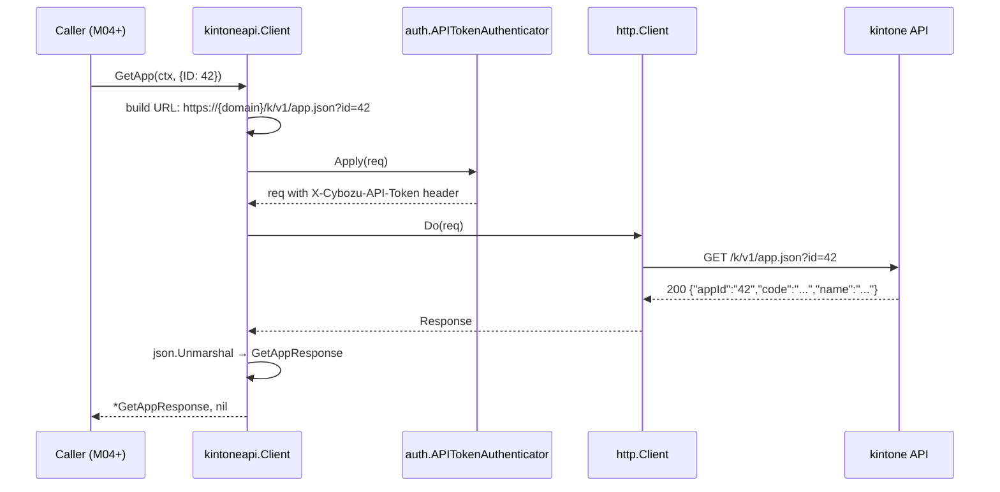
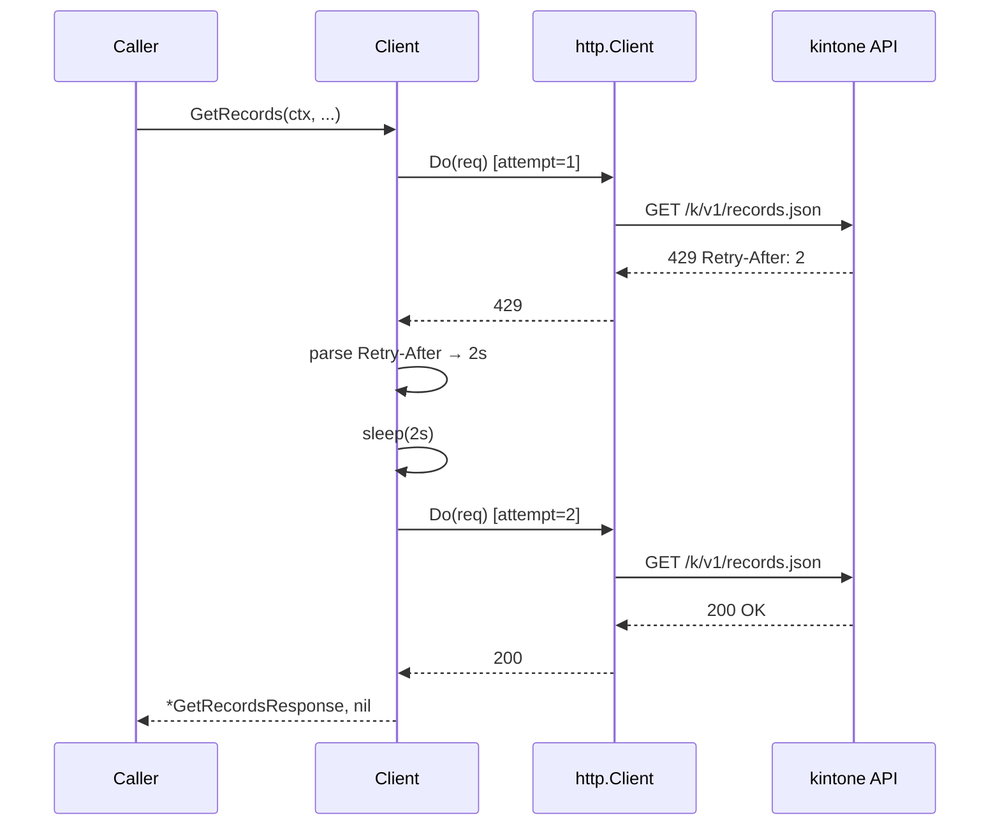
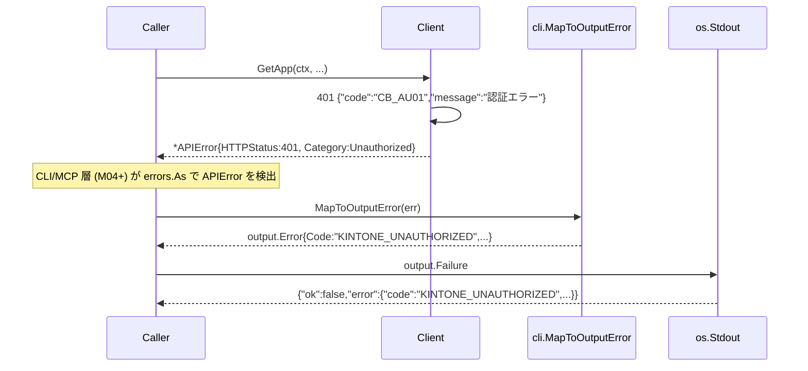

# M03: kintoneapi クライアント + API Token 認証

## Overview
| 項目 | 値 |
|------|---|
| ステータス | 未着手 |
| 依存 | M02 完了（`config.Resolved` から Domain / Auth / APIToken を取得可能） |
| 想定期間 | 0.5 〜 1.5 日 |
| 対象ファイル | `internal/auth/{apitoken.go,apitoken_test.go}` / `internal/kintoneapi/{client.go,transport.go,errors.go,records.go,record.go,app.go,fields.go,*_test.go}` / `internal/cli/errors.go`（編集） / `go.mod`・`go.sum`（依存追加なし） / `README.md`（編集） / `CLAUDE.md`（編集） / `plans/kintone-roadmap.md`（編集） |

## Goal
仕様書 `docs/specs/kintone_spec.md` の「認証 / api / client」層に基づき、
`net/http` 薄ラッパーで kintone REST API クライアント（`internal/kintoneapi`）と API Token 認証 Authenticator（`internal/auth`）を実装する。
M04 以降の `service/api` / `service/operations` がこのクライアントを 1 行で使えるよう、`config.Resolved` を入力にして `kintoneapi.Client` を構築する `New(...)` ファクトリと、`X-Cybozu-API-Token` を自動付与する `RoundTripper` を提供する。

### 完了条件
1. `internal/auth.NewAPITokenAuthenticator(token string)` が、各 HTTP リクエストに `X-Cybozu-API-Token: <token>` ヘッダを付与する `auth.Authenticator` 実装を返す
2. `internal/kintoneapi.New(opts ClientOptions) (*Client, error)` が `Resolved.Domain` ベース URL（`https://{domain}`）と Authenticator を受け取り、`http.Client` を内部に保持する Client を返す
3. 4 つの GET エンドポイントが型付きメソッドで叩ける:
   - `Client.GetRecords(ctx, GetRecordsRequest) (*GetRecordsResponse, error)` → `GET /k/v1/records.json`
   - `Client.GetRecord(ctx, GetRecordRequest) (*GetRecordResponse, error)` → `GET /k/v1/record.json`
   - `Client.GetApp(ctx, GetAppRequest) (*GetAppResponse, error)` → `GET /k/v1/app.json`
   - `Client.GetFormFields(ctx, GetFormFieldsRequest) (*GetFormFieldsResponse, error)` → `GET /k/v1/app/form/fields.json`
4. レート制限 / 5xx 応答に対するリトライが指定可能 (`ClientOptions.RetryPolicy`)。`429`/`503` で `Retry-After` ヘッダを尊重し、最大 3 回まで指数バックオフで再送する
5. kintone 標準エラーレスポンス（`{"code":"...","id":"...","message":"..."}`）を構造化エラー `*kintoneapi.APIError` に変換、HTTP ステータス・kintone コードからエラーカテゴリ（`Unauthorized` / `Forbidden` / `NotFound` / `RateLimited` / `Validation` / `Internal`）を分類する
6. `httptest.Server` ベースの mock テストで実 kintone 環境なしに 4 エンドポイント全件を検証
7. `internal/cli/errors.go` の `MapToOutputError` を拡張し、`*kintoneapi.APIError` を以下に対応:
   - 401 → `KINTONE_UNAUTHORIZED`
   - 403 → `KINTONE_FORBIDDEN`
   - 404 → `KINTONE_NOT_FOUND`
   - 429 / 503 → `KINTONE_RATE_LIMITED`
   - 4xx 検証 → `KINTONE_VALIDATION`
   - 5xx その他 → `KINTONE_INTERNAL`
   - ネットワーク/タイムアウト → `KINTONE_NETWORK`
8. `go test -race -cover ./...` 全 pass。新規 `internal/kintoneapi` 80% 以上、`internal/auth` 90% 以上、`internal/cli` 80% 以上を維持
9. `go vet ./...` / `gofmt -l .` / `golangci-lint run` クリーン
10. README / CLAUDE.md / kintone-roadmap.md の M03 セクションを更新

---

## Architecture Alignment（仕様書との整合）

| 仕様書要件 | M03 での扱い |
|-----------|-------------|
| `client` 層（net/http 薄ラッパー） | `internal/kintoneapi/client.go` で `*http.Client` を内部保持。SDK は使わない |
| `auth` 層（API Token / OAuth / idproxy） | M03 では API Token のみ。OAuth は M09、idproxy は M10 |
| `API Token` 認証 | `Authenticator` インターフェイス越しに統一抽象化。実装は `apitoken.go` |
| 出力 JSON 規約 | クライアント自体は struct を返すのみ。CLI/MCP 層が `output.Success` / `output.Failure` でラップ |
| multi-user 対応 | M03 は単一トークン。`Authenticator` を後で principal 単位に切り替えられるよう interface 化 |
| `config.Resolved` 統合 | `kintoneapi.NewFromResolved(*config.Resolved) (*Client, error)` 便利関数を提供。`Resolved.Auth=="api-token"` のときに `Resolved.APIToken` を渡す |
| 名前解決（resolver） | M08 で `Client` を利用する Resolver を別途実装。M03 では関与しない |

---

## Public API: internal/auth

### apitoken.go

```go
// Package auth は kintone REST API への認証戦略を提供する。
//
// Authenticator はリクエストに認証情報を付与する責務のみを持つ。
// HTTP 通信は kintoneapi 層が担当する。
package auth

import "net/http"

// Authenticator はリクエストに認証情報を付与する。
// 実装は冪等であり、同じリクエストに対して何度呼ばれても同じ結果を返す。
//
// 実装一覧:
//   - APITokenAuthenticator (M03)
//   - OAuthAuthenticator    (M09)
//   - IDProxyAuthenticator  (M10)
//
// **設計判断**: Apply はあえて ctx を受け取る。M03 (API Token) では ctx は使わないが、
// M09 (OAuth) は refresh トークン HTTP 呼び出しに ctx が必須となる。
// M09 で interface を変更すると M03 に破壊的変更が逆流するため、最初から ctx を含める。
type Authenticator interface {
    // Apply はリクエストに認証ヘッダを付与する。
    // ctx は認証情報の取得（OAuth refresh 等）の HTTP 呼び出しに使う。
    Apply(ctx context.Context, req *http.Request) error
}

// APITokenAuthenticator は X-Cybozu-API-Token ヘッダを付与する。
//
// 仕様: https://cybozu.dev/ja/kintone/docs/rest-api/overview/auth/
//   - 単一トークン形式: X-Cybozu-API-Token: <token>
//   - 複数トークン形式: X-Cybozu-API-Token: <token1>,<token2>（カンマ区切り）
//
// M03 は単一/複数いずれも文字列としてそのまま透過する（呼び出し側責務）。
type APITokenAuthenticator struct {
    token string
}

// NewAPITokenAuthenticator は API Token 認証を行う Authenticator を返す。
// token が空文字の場合は ErrEmptyAPIToken を返す。
func NewAPITokenAuthenticator(token string) (*APITokenAuthenticator, error)

// Apply は X-Cybozu-API-Token ヘッダを req に付与する。
// ctx は本実装では未使用（インターフェイス契約のみ）。
func (a *APITokenAuthenticator) Apply(ctx context.Context, req *http.Request) error

// ErrEmptyAPIToken は空トークンが渡されたエラー。
var ErrEmptyAPIToken = errors.New("auth: API Token is empty")
```

---

## Public API: internal/kintoneapi

### client.go

```go
// Package kintoneapi は kintone REST API への薄い HTTP クライアントを提供する。
//
// 設計方針:
//   - 外部 SDK 非依存（net/http 薄ラッパー）
//   - エンドポイントごとに型付き Request/Response 構造体
//   - 認証は auth.Authenticator 経由で抽象化
//   - レート制限/5xx は ClientOptions.RetryPolicy で扱う
//   - 戻り値の error は *APIError か net 系 error
package kintoneapi

import (
    "net/http"
    "time"

    "github.com/youyo/kintone/internal/auth"
    "github.com/youyo/kintone/internal/config"
)

// Client は kintone REST API クライアント。
type Client struct {
    baseURL    string // "https://{domain}"
    httpClient *http.Client
    auth       auth.Authenticator
    userAgent  string
    retry      RetryPolicy
    now        func() time.Time // テスト用注入
    sleep      func(time.Duration) // テスト用注入
}

// ClientOptions は Client コンストラクタの入力。
type ClientOptions struct {
    Domain        string             // 必須。"example.cybozu.com" 形式（スキーム不要）
    Authenticator auth.Authenticator // 必須
    HTTPClient    *http.Client       // 任意。nil の場合 http.DefaultTransport ベース + 30s timeout
    UserAgent     string             // 任意。デフォルト "kintone-cli/<version>"
    RetryPolicy   RetryPolicy        // 任意。ゼロ値は DefaultRetryPolicy
    Now           func() time.Time   // 任意（テスト用）
    Sleep         func(time.Duration) // 任意（テスト用）
}

// New は ClientOptions から Client を構築する。
//
// バリデーション:
//   - Domain が空 → ErrEmptyDomain
//   - Domain にスキーム混入（"://" 含む）→ ErrInvalidDomain
//   - Domain に空白・スラッシュ・先頭末尾 "." 等の不正文字 → ErrInvalidDomain
//   - Authenticator が nil → ErrNilAuthenticator
//
// **設計判断**: Domain は host 部のみを期待（"example.cybozu.com"）。
// `https://` プレフィックスや末尾スラッシュをユーザーが付けた場合、URL 組み立てで
// 二重スキームになるため、コンストラクタ時点で明示的に拒否する。
func New(opts ClientOptions) (*Client, error)

// NewFromResolved は config.Resolved から Client を構築する便利関数。
// Resolved.Auth が "api-token" のとき auth.NewAPITokenAuthenticator を使い、
// それ以外は ErrUnsupportedAuthMode を返す（M09 で OAuth を追加）。
func NewFromResolved(r *config.Resolved) (*Client, error)

var (
    ErrEmptyDomain         = errors.New("kintoneapi: domain is empty")
    ErrInvalidDomain       = errors.New("kintoneapi: domain must be a bare host (no scheme, no path)")
    ErrNilAuthenticator    = errors.New("kintoneapi: authenticator is nil")
    ErrUnsupportedAuthMode = errors.New("kintoneapi: unsupported auth mode")
)
```

### transport.go — 内部リクエスト実行と RetryPolicy

```go
// RetryPolicy はリトライ戦略。MaxAttempts=0 ならリトライなし。
type RetryPolicy struct {
    MaxAttempts int           // 初回 + リトライ回数の合計（>= 1 が有効）
    BaseBackoff time.Duration // バックオフ初期値（指数: base * 2^(n-1)）
    MaxBackoff  time.Duration // バックオフ上限
    // RetryOn は HTTP ステータスを指定。空ならデフォルト [429, 503]。
    RetryOn []int
}

// DefaultRetryPolicy は推奨デフォルト。
//   MaxAttempts=3, BaseBackoff=500ms, MaxBackoff=5s, RetryOn=[429, 503]
var DefaultRetryPolicy = RetryPolicy{
    MaxAttempts: 3,
    BaseBackoff: 500 * time.Millisecond,
    MaxBackoff:  5 * time.Second,
    RetryOn:     []int{429, 503},
}

// doJSON は GET リクエストを実行し、レスポンス body を out にデコードする。
// out が nil の場合はデコードしない。
//
// 流れ:
//  1. URL 組み立て（baseURL + path + ?query）
//  2. http.NewRequestWithContext で Request 構築
//  3. auth.Apply でヘッダ付与
//  4. User-Agent / Accept: application/json 付与
//  5. RetryPolicy に従って実行（429/503 は Retry-After 尊重、その他は 1 回のみ）
//  6. ステータスコード判定。2xx なら out にデコード、そうでなければ APIError
func (c *Client) doJSON(ctx context.Context, method, path string, query url.Values, out any) error
```

### errors.go — 構造化エラー

```go
// APIError は kintone REST API のエラーレスポンスを表す。
//
// kintone 標準エラー形式:
//   { "code": "GAIA_AP01", "id": "abc...", "message": "指定したアプリ..." }
//
// 一部のエラー（特にネットワーク層・5xx で空 body）では Code/ID/Message が空。
// その場合は HTTPStatus と Category のみで判別する。
type APIError struct {
    HTTPStatus int           // 500 等
    Code       string        // "GAIA_AP01" 等。空の場合あり
    ID         string        // kintone request ID
    Message    string        // 人間向けメッセージ
    RawBody    []byte        // デバッグ用（最大 4KB に切り詰め）
    RetryAfter time.Duration // Retry-After ヘッダ値（あれば）
    Category   ErrorCategory // 派生分類
}

func (e *APIError) Error() string

// ErrorCategory は HTTP ステータス + kintone コードから派生した分類。
type ErrorCategory int

const (
    CategoryUnknown ErrorCategory = iota
    CategoryUnauthorized   // 401
    CategoryForbidden      // 403
    CategoryNotFound       // 404
    CategoryRateLimited    // 429
    CategoryValidation     // 4xx かつ Validation 系コード
    CategoryServerError    // 5xx（503 含む）
    CategoryClientError    // その他 4xx
)

// classify は HTTP ステータスと kintone コードからカテゴリを決定する。
func classify(status int, code string) ErrorCategory
```

### records.go / record.go / app.go / fields.go — エンドポイント

```go
// records.go
type GetRecordsRequest struct {
    App        int64    // 必須
    Query      string   // 任意（kintone クエリ言語）
    Fields     []string // 任意
    TotalCount bool     // 任意
}
type GetRecordsResponse struct {
    Records    []map[string]any `json:"records"`
    TotalCount *string          `json:"totalCount"` // 文字列で返る
}
func (c *Client) GetRecords(ctx context.Context, req GetRecordsRequest) (*GetRecordsResponse, error)

// record.go
type GetRecordRequest struct {
    App int64 // 必須
    ID  int64 // 必須
}
type GetRecordResponse struct {
    Record map[string]any `json:"record"`
}
func (c *Client) GetRecord(ctx context.Context, req GetRecordRequest) (*GetRecordResponse, error)

// app.go
type GetAppRequest struct {
    ID int64 // 必須
}
type GetAppResponse struct {
    AppID       string `json:"appId"`
    Code        string `json:"code"`
    Name        string `json:"name"`
    Description string `json:"description"`
    SpaceID     string `json:"spaceId"`
    ThreadID    string `json:"threadId"`
    CreatedAt   string `json:"createdAt"`
    Creator     map[string]any `json:"creator"`
    ModifiedAt  string `json:"modifiedAt"`
    Modifier    map[string]any `json:"modifier"`
}
func (c *Client) GetApp(ctx context.Context, req GetAppRequest) (*GetAppResponse, error)

// fields.go
type GetFormFieldsRequest struct {
    App  int64 // 必須
    Lang string // 任意 ("ja" / "en" / "zh" / "user" / "default")
}
type GetFormFieldsResponse struct {
    Properties map[string]map[string]any `json:"properties"`
    Revision   string                    `json:"revision"`
}
func (c *Client) GetFormFields(ctx context.Context, req GetFormFieldsRequest) (*GetFormFieldsResponse, error)
```

各メソッドはリクエスト構造体を `url.Values` にシリアライズ → `c.doJSON("GET", path, query, &resp)` を呼ぶだけの薄い実装。

---

## CLI 層への統合（errors.go 拡張）

`internal/cli/errors.go` の `MapToOutputError` に `*kintoneapi.APIError` の判定を追加する。

```go
// 既存の config 系エラー判定の **後** に追加（呼び出し順は影響軽微だが、
// 既存の振る舞いを壊さないために順序を維持）:
var apiErr *kintoneapi.APIError
if errors.As(err, &apiErr) {
    code := mapKintoneCategory(apiErr.Category) // CategoryUnauthorized → "KINTONE_UNAUTHORIZED" 等
    details := map[string]any{
        "http_status": apiErr.HTTPStatus,
    }
    if apiErr.Code != "" {
        details["kintone_code"] = apiErr.Code
    }
    if apiErr.ID != "" {
        details["kintone_id"] = apiErr.ID
    }
    if apiErr.RetryAfter > 0 {
        details["retry_after_sec"] = int(apiErr.RetryAfter.Seconds())
    }
    return &output.Error{Code: code, Message: apiErr.Message, Details: details}
}

// ネットワーク系（context.DeadlineExceeded / *url.Error / net.OpError）
var netErr *url.Error
if errors.As(err, &netErr) {
    return &output.Error{
        Code:    "KINTONE_NETWORK",
        Message: netErr.Error(),
        Details: map[string]any{"op": netErr.Op, "url": netErr.URL, "timeout": netErr.Timeout()},
    }
}
if errors.Is(err, context.DeadlineExceeded) {
    return &output.Error{Code: "KINTONE_NETWORK", Message: err.Error(), Details: map[string]any{"timeout": true}}
}
```

| Category / 例外 | output.Error.Code |
|----------------|-------------------|
| CategoryUnauthorized | `KINTONE_UNAUTHORIZED` |
| CategoryForbidden | `KINTONE_FORBIDDEN` |
| CategoryNotFound | `KINTONE_NOT_FOUND` |
| CategoryRateLimited | `KINTONE_RATE_LIMITED` |
| CategoryValidation | `KINTONE_VALIDATION` |
| CategoryServerError | `KINTONE_INTERNAL` |
| CategoryClientError | `KINTONE_VALIDATION`（fallback） |
| `*url.Error` / DeadlineExceeded | `KINTONE_NETWORK` |

> CLI コマンドはまだ無い（M04 で追加）ので、M03 ではマッピング関数とその unit テストのみ追加する。

---

## URL / クエリ仕様

| メソッド | path | query 例 |
|---------|------|---------|
| GetRecords | `/k/v1/records.json` | `app=42&query=updated_time>%22...%22&fields=name&fields=age&totalCount=true` |
| GetRecord | `/k/v1/record.json` | `app=42&id=7` |
| GetApp | `/k/v1/app.json` | `id=42` |
| GetFormFields | `/k/v1/app/form/fields.json` | `app=42&lang=ja` |

- `fields` は **複数回繰り返し**で送信（`fields=a&fields=b`）
- `totalCount` は `true`/`false` 文字列
- 数値型は `strconv.FormatInt(i, 10)`

URL 組み立ては `url.URL{Scheme: "https", Host: domain, Path: path, RawQuery: query.Encode()}.String()` を使用。

---

## レート制限・リトライ戦略

### Retry 対象
- `429 Too Many Requests` および `503 Service Unavailable`
- ネットワーク一時エラー（`net.Error.Timeout()` true）

### Retry 非対象
- `4xx` 全般（429 を除く）→ 即時 `*APIError`
- `5xx`（503 を除く）→ 即時 `*APIError`（再送しても改善しない可能性が高い）
- `context.Canceled` → 即時返却

### バックオフ
- `Retry-After` ヘッダがあればその秒数を採用（最大 `MaxBackoff` でクランプ）
- なければ `BaseBackoff * 2^(attempt-1)` を採用（最大 `MaxBackoff` でクランプ）
- 0 < attempt < MaxAttempts の間だけ待機 → 再送

### 擬似コード

```
for attempt := 1; attempt <= policy.MaxAttempts; attempt++ {
    resp, err := c.httpClient.Do(req)
    if err != nil {
        if isTimeout(err) && attempt < policy.MaxAttempts {
            sleep(backoff(attempt, retryAfter=0))
            continue
        }
        return wrapNetErr(err)
    }
    if !shouldRetry(resp.StatusCode, policy.RetryOn) || attempt == policy.MaxAttempts {
        return decodeOrAPIError(resp, out)
    }
    retryAfter := parseRetryAfter(resp.Header)
    resp.Body.Close()
    sleep(backoff(attempt, retryAfter))
}
```

---

## Sequence Diagrams

### 正常系: GetApp



### 異常系: 429 + Retry-After を尊重したリトライ



### 異常系: 401 → 即時 APIError、CLI 層でマッピング



---

## TDD Test Design

> 全テスト共通方針:
> - `httptest.NewServer` で kintone API を mock。`Client` の `baseURL` を `server.URL` に上書きして検証
> - `Client.now` / `Client.sleep` を注入し、リトライ待機を実時間ゼロでテスト
> - レスポンスヘッダ・ステータス・body を sub-test 単位で組み立て
> - **既存テストを壊さない**: M01/M02 のテストは全 pass のまま

### internal/auth/apitoken_test.go

| # | ケース | 入力 | 期待 |
|---|--------|------|------|
| AT-1 | 正常生成 | `NewAPITokenAuthenticator("abc")` | `*APITokenAuthenticator`, no error |
| AT-2 | 空トークン拒否 | `NewAPITokenAuthenticator("")` | `ErrEmptyAPIToken` |
| AT-3 | Apply ヘッダ付与 | 既存 req に `Apply(ctx, req)` | `req.Header.Get("X-Cybozu-API-Token") == "abc"` |
| AT-4 | Apply は冪等 | 同一 req に 2 回 `Apply(ctx, req)` | ヘッダ値は変わらず、req.Header の "X-Cybozu-API-Token" は "abc" 1 つ（重複なし）|
| AT-5 | カンマ区切り複数トークン透過 | `NewAPITokenAuthenticator("a,b,c")` → Apply | ヘッダ値が `"a,b,c"` のまま |
| AT-6 | nil ctx でも動作 | `Apply(nil, req)` | パニックせずヘッダ付与（ctx は未使用） |

### internal/kintoneapi/client_test.go（コンストラクタ）

| # | ケース | 入力 | 期待 |
|---|--------|------|------|
| CL-1 | 正常生成 | `New({Domain:"x.cybozu.com", Authenticator:auth})` | `*Client, nil` |
| CL-2 | Domain 空 | `New({Domain:"", ...})` | `ErrEmptyDomain` |
| CL-3 | Authenticator nil | `New({Domain:"x", Authenticator:nil})` | `ErrNilAuthenticator` |
| CL-4 | NewFromResolved api-token | `Resolved{Auth:"api-token", APIToken:"t", Domain:"x"}` | `*Client, nil` |
| CL-5 | NewFromResolved oauth 未対応 | `Resolved{Auth:"oauth"}` | `ErrUnsupportedAuthMode` |
| CL-6 | NewFromResolved 空 token | `Resolved{Auth:"api-token", APIToken:""}` | `auth.ErrEmptyAPIToken` を wrap |
| CL-7 | デフォルト UserAgent | `New(opts)` UserAgent 未指定 | 内部 UA が "kintone-cli/" prefix |
| CL-8 | Domain にスキーム混入を拒否 | `New({Domain:"https://x.cybozu.com", ...})` | `ErrInvalidDomain` |
| CL-9 | Domain にスラッシュ混入を拒否 | `New({Domain:"x.cybozu.com/", ...})` | `ErrInvalidDomain` |
| CL-10 | Domain に空白混入を拒否 | `New({Domain:" x.cybozu.com", ...})` | `ErrInvalidDomain` |

### internal/kintoneapi/transport_test.go

| # | ケース | server 振る舞い | 期待 |
|---|--------|-----------------|------|
| TR-1 | 200 デコード成功 | `200 OK` body=`{"appId":"42",...}` | `*GetAppResponse` 正常デコード |
| TR-2 | 認証ヘッダ付与確認 | server がヘッダを assert | `X-Cybozu-API-Token` が必ず付く |
| TR-3 | User-Agent 付与 | server がヘッダ assert | UA 付与確認 |
| TR-4 | 401 即時 APIError | `401` body=`{"code":"CB_AU01","message":"..."}` | `*APIError{HTTPStatus:401, Code:"CB_AU01", Category:CategoryUnauthorized}` |
| TR-5 | 403 → Forbidden | `403` body=`{"code":"GAIA_NO01","message":"..."}` | `Category:CategoryForbidden` |
| TR-6 | 404 → NotFound | `404` body 適切 | `Category:CategoryNotFound` |
| TR-7 | 5xx 空 body 耐性 | `500` body=`""` | `*APIError{HTTPStatus:500, Code:"", Category:CategoryServerError}` |
| TR-8 | 429 リトライ → 200 | 1 回目 `429` Retry-After=1, 2 回目 `200` | sleep 1s が記録され、最終的に成功レスポンス |
| TR-9 | 429 連続 → 最終失敗 | `429` を MaxAttempts 回 | `*APIError{Category:CategoryRateLimited}`、attempt 数だけ sleep |
| TR-10 | 503 リトライ | `503` → `200` | リトライして成功 |
| TR-11 | Retry-After なし → 指数バックオフ | `429` のみ（ヘッダなし）→ `200` | sleep が `BaseBackoff` |
| TR-12 | Retry-After HTTP-date 形式 | `429 Retry-After: <RFC1123>` | 適切に sleep（`now()` 比較） |
| TR-13 | context cancel 即時返却 | server 遅延 + `ctx.Cancel()` | `ctx.Err()` を含む error、retry しない |
| TR-14 | network error 1 回 → 成功 | server を一度落とす（Close + reopen） | timeout 系 net error はリトライ対象。**注**: httptest では実装複雑のため、`http.RoundTripper` モック（`TestRoundTripper`）で代替実装する |
| TR-15 | RawBody が 4KB に切り詰め | 巨大 body でエラー | `len(apiErr.RawBody) <= 4096` |
| TR-16 | 不正 JSON でも APIError 構築 | `400` body=`"not json"` | `Code:"" Message: <body or fallback> Category:CategoryClientError` |
| TR-17 | リトライ前にレスポンス body が Close される | `RoundTripper` モックで body の Close 回数を計測。1回目=429（body.Close 呼ばれる）、2回目=200 | `body.Close` が attempt 数だけ呼ばれる（リーク防止 R-4 の保険） |

### internal/kintoneapi/records_test.go / record_test.go / app_test.go / fields_test.go

各エンドポイントごとに最小ケース:

| # | エンドポイント | ケース | 検証 |
|---|----------------|--------|------|
| EP-Records-1 | GetRecords | 全 query パラメータ送信 | server 側で `r.URL.Query()` を assert: `app=42`, `query=...`, `fields=name`, `fields=age`, `totalCount=true` |
| EP-Records-2 | GetRecords | 最小 (App のみ) | `app=42` のみ送信 |
| EP-Records-3 | GetRecords | 422 validation | `*APIError{Category:CategoryValidation}` |
| EP-Record-1 | GetRecord | id 送信 | `app=42&id=7` |
| EP-App-1 | GetApp | id 送信 | `id=42` + body decode |
| EP-Fields-1 | GetFormFields | lang 指定 | `app=42&lang=ja` |
| EP-Fields-2 | GetFormFields | lang 省略 | `lang` クエリが付かない |

### internal/kintoneapi/errors_test.go

| # | ケース | 入力 | 期待 |
|---|--------|------|------|
| ER-1 | classify 401 | (401, "CB_AU01") | `CategoryUnauthorized` |
| ER-2 | classify 403 | (403, "GAIA_NO01") | `CategoryForbidden` |
| ER-3 | classify 404 | (404, "GAIA_AP01") | `CategoryNotFound` |
| ER-4 | classify 429 | (429, "") | `CategoryRateLimited` |
| ER-5 | classify 503 | (503, "") | `CategoryServerError` |
| ER-6 | classify 422 | (422, "CB_VA01") | `CategoryValidation` |
| ER-7 | classify 400 unknown | (400, "") | `CategoryClientError` |
| ER-8 | APIError.Error() フォーマット | full struct | "kintone API error: HTTP 401 (CB_AU01): 認証エラー" 形式 |
| ER-9 | parseRetryAfter 数値 | "5" | 5s |
| ER-10 | parseRetryAfter HTTP-date | RFC1123 過去/未来 | now との差分 |
| ER-11 | parseRetryAfter 空 / 不正 | "" / "abc" | 0 |

### internal/cli/errors_test.go の追加

| # | ケース | 入力 err | 期待 output.Error |
|---|--------|---------|------------------|
| E-10 | APIError 401 | `&APIError{HTTPStatus:401, Code:"CB_AU01"}` | Code=`KINTONE_UNAUTHORIZED`, details.http_status=401, details.kintone_code="CB_AU01" |
| E-11 | APIError 403 | `&APIError{HTTPStatus:403}` | Code=`KINTONE_FORBIDDEN` |
| E-12 | APIError 404 | `&APIError{HTTPStatus:404}` | Code=`KINTONE_NOT_FOUND` |
| E-13 | APIError 429 + Retry-After | `&APIError{HTTPStatus:429, RetryAfter:2s}` | Code=`KINTONE_RATE_LIMITED`, details.retry_after_sec=2 |
| E-14 | APIError 422 Validation | `&APIError{HTTPStatus:422, Category:Validation}` | Code=`KINTONE_VALIDATION` |
| E-15 | APIError 500 | `&APIError{HTTPStatus:500}` | Code=`KINTONE_INTERNAL` |
| E-16 | url.Error timeout | `&url.Error{Op:"Get", URL:"...", Err:contextDeadline}` | Code=`KINTONE_NETWORK`, details.timeout=true |
| E-17 | wrap された APIError | `fmt.Errorf("getApp: %w", apiErr)` | `errors.As` で検出され `KINTONE_UNAUTHORIZED` |

---

## Implementation Steps（atomic、TDD 順次実行）

各ステップ完了時に Conventional Commits（日本語）でコミット可能。

- [ ] **Step 1: 依存確認**
  - 新規依存追加なし（`net/http` / `encoding/json` のみ）
  - `go build ./...` 通ること

- [ ] **Step 2 (Red): auth パッケージのテスト先行**
  - `internal/auth/apitoken_test.go` (AT-1〜5)
  - `go test ./internal/auth` がコンパイルエラー → 期待通り

- [ ] **Step 3 (Green): auth パッケージ実装**
  - `internal/auth/apitoken.go`
  - 全テスト緑化

- [ ] **Step 4 (Red): kintoneapi errors / classify テスト先行**
  - `internal/kintoneapi/errors_test.go` (ER-1〜11)

- [ ] **Step 5 (Green): kintoneapi/errors.go 実装**
  - `APIError` / `ErrorCategory` / `classify` / `parseRetryAfter`

- [ ] **Step 6 (Red): kintoneapi/client コンストラクタテスト**
  - `internal/kintoneapi/client_test.go` (CL-1〜7)

- [ ] **Step 7 (Green): client.go 実装**
  - `New(opts)` / `NewFromResolved(*config.Resolved)`
  - 内部状態のみ。HTTP は次 Step で

- [ ] **Step 8 (Red): transport テスト先行**
  - `internal/kintoneapi/transport_test.go` (TR-1〜16)
  - `httptest.Server` ベース、`time.Sleep` を Client.sleep 注入で計測

- [ ] **Step 9 (Green): transport.go 実装**
  - `RetryPolicy` / `DefaultRetryPolicy`
  - `Client.doJSON` （URL 組み立て→auth→retry→json decode）

- [ ] **Step 10 (Red): 各エンドポイントテスト**
  - `records_test.go` / `record_test.go` / `app_test.go` / `fields_test.go`

- [ ] **Step 11 (Green): エンドポイント実装**
  - `records.go` / `record.go` / `app.go` / `fields.go`
  - `GetRecordsRequest.toQuery() url.Values` 等の薄いシリアライザ

- [ ] **Step 12 (Red→Green): cli/errors.go 拡張**
  - `internal/cli/errors_test.go` に E-10〜17 追加（Red）
  - `MapToOutputError` に `*kintoneapi.APIError` / `*url.Error` ブランチ追加（Green）

- [ ] **Step 13 (Refactor)**
  - godoc 整備、重複削減、`gofmt -l .` 確認、`go vet`

- [ ] **Step 14: 動作確認**
  - `go test -race -cover ./...` 全 pass、各カバレッジ閾値達成
  - `golangci-lint run` クリーン
  - 後述 Verification 自動テスト・スモーク

- [ ] **Step 15: ドキュメント更新**
  - `README.md`: 「使い方」に M03 で叩ける API（プログラマ向けの説明）と環境変数 `KINTONE_API_TOKEN` の使用例を追記
  - `CLAUDE.md`: 「プロジェクト現状」を M03 完了 → M04 次マイルストーン に更新
  - `plans/kintone-roadmap.md` の M03 セクションを `[x]` 化、Current Focus を M04、Changelog 追記

- [ ] **Step 16: コミット**
  - 例:
    - `feat(auth): API Token 認証 Authenticator を実装`
    - `feat(kintoneapi): 構造化エラーと classify を実装`
    - `feat(kintoneapi): Client コンストラクタを実装`
    - `feat(kintoneapi): リトライ付き transport.doJSON を実装`
    - `feat(kintoneapi): GetRecords/GetRecord/GetApp/GetFormFields を実装`
    - `feat(cli): kintoneapi.APIError → output.Error マッピングを追加`
    - `docs: README/CLAUDE/roadmap を M03 完了に更新`

---

## Verification

### 自動テスト
1. `go test -race -cover ./...` 全 pass
2. カバレッジ: `internal/auth` 90%+ / `internal/kintoneapi` 80%+ / `internal/cli` 80%+ / 既存（output / config）破壊なし
3. `go vet ./...` 警告なし
4. `gofmt -l .` 出力なし
5. `golangci-lint run` クリーン

### スモークテスト（mock 経由 / 実 kintone なし）

`internal/kintoneapi` 内の example テスト（`Example_*`）または専用の e2e テストファイルで以下を 1 回ずつ通過:

```go
// httptest.Server を立て、Client が GetRecords/GetRecord/GetApp/GetFormFields を
// それぞれ正しい URL/ヘッダで呼び、レスポンスをデコードできることを確認。
```

実 kintone 環境を持っているユーザー向けの README サンプル（任意）:

```bash
export KINTONE_DOMAIN=example.cybozu.com
export KINTONE_AUTH=api-token
export KINTONE_API_TOKEN=xxxxxxxxxxxxxxxxxxxx

# M03 段階では CLI から直接 records 取得は **未実装**（M04 で追加）
# 動作確認は go test の httptest mock のみで行う
```

---

## Risks

| # | Risk | Impact | Likelihood | Mitigation |
|---|------|--------|-----------|-----------|
| R-1 | 実 kintone API のエラーレスポンス形式が分岐する（401 が body 空 / 403 が HTML 等） | 中 | 中 | `decodeOrAPIError` を防御的に実装。JSON でないボディは `Code=""` のままにして `RawBody` で残す。TR-7/16 で担保 |
| R-2 | Retry-After に HTTP-date 形式が来る | 中 | 中 | `parseRetryAfter` で数値・RFC1123 両対応。TR-12 で担保 |
| R-3 | リトライ無限ループ | 高 | 低 | `MaxAttempts` で上限。`DefaultRetryPolicy` は 3 回 |
| R-4 | レスポンス body のリーク（Close 忘れ） | 中 | 中 | `defer resp.Body.Close()` を必ず付与し、リトライ前に `io.Copy(io.Discard, ...)` + Close する。lint で検出 |
| R-5 | 認証トークン漏洩（ログ出力に含めない） | 高 | 低 | `APIError.Error()` / RawBody にトークンを含めない。`Authenticator.Apply` のテストで本物のトークンを使わない |
| R-6 | 並列リクエスト時の `Client.sleep` 注入が他テストに影響 | 中 | 低 | `Client` は単一インスタンスごとに sleep 関数を持つ（global state を使わない） |
| R-7 | `*url.Error` や `context.DeadlineExceeded` の判定が誤検出 | 低 | 中 | `errors.As` / `errors.Is` を使う。E-16 で担保 |
| R-8 | `RetryPolicy.RetryOn` 配列が大きいと毎回線形探索 | 低 | 低 | 想定 3 要素以内のため気にしない |
| R-9 | カバレッジ閾値達成困難（HTTP リトライ分岐が深い） | 中 | 中 | `Client.sleep` 注入で全分岐を mock 可能。閾値 80% を採用（90% は過剰） |
| R-10 | `NewFromResolved` が将来の auth mode 拡張で肥大化 | 低 | 中 | switch 文で明示的に列挙。M09 で OAuth 追加時にメソッド分割を検討 |
| R-11 | kintone REST のクエリパラメータ（特に query 文字列）が URL 長制限超過 | 中 | 低 | M03 では POST フォールバックを実装しない。仕様書の上限超え時は 414 が返るので APIError として伝播。M04+ で `record/query.json` の POST 版（`X-HTTP-Method-Override`）を検討 |
| R-12 | httptest が macOS でポート枯渇 | 低 | 低 | `httptest.NewServer` を defer Close。並列テスト数を制限（`t.Parallel()` 使用判断は ergonomic に委ねる） |
| R-13 | `interface{}` / `any` 多用で型安全性低下 | 中 | 中 | M03 では `records` フィールドは `[]map[string]any`、`record` は `map[string]any`（kintone のフィールドが動的型のため必然）。M05 で typed 化を再検討 |
| R-14 | `NewFromResolved` で `Resolved.APIToken` を持たない（OAuth トークンが入る）と動かない | 中 | 中 | 明示的に `Auth=="api-token"` 分岐のみハンドル。それ以外は `ErrUnsupportedAuthMode` |
| R-15 | `Resolved` を呼び出し側が直接 `json.Marshal` するとトークン漏洩（M02 で `api_token` JSON タグが付いている） | 高 | 低 | M03 範囲としては (a) `Resolved.APIToken` 上のコメントで「直接シリアライズせず必ず `maskedView` 経由で出力する」旨を強調、(b) `internal/kintoneapi` 内では `Resolved` をログ・エラーに含めない、(c) M02 の `maskedView` 設計を踏襲。本格的なリファクタ（タグを `json:"-"` に変更）は M11 リリース直前のセキュリティレビュー時に再検討 |
| R-16 | Domain にスキーム混入で URL 二重化 | 高 | 中 | `New()` で `strings.Contains(domain, "://")` / `strings.ContainsAny(domain, " /\\\\\\t\\n")` をチェックして `ErrInvalidDomain`。CL-8〜10 で担保 |

---

## Open Questions（未確定事項）

| # | 項目 | 確認先 | デッドライン |
|---|------|--------|-------------|
| Q-1 | `record.GetRecords` のクエリパラメータ `query` が長くなる場合に POST フォールバックを実装するか | ユーザー | M04（CLI から records 操作する段階） |
| Q-2 | `Client.UserAgent` の version をどこから取るか（`internal/cli/version.go` の `Version` を参照すべきか） | ユーザー | Step 7 着手時。一旦 `kintone-cli/dev` を hardcode し、M11 リリース時に注入する方針で進める |
| Q-3 | APIError 経由で kintone の `errors` フィールド（フィールド単位の詳細エラー）を露出するか | ユーザー | M05（CLI write 系で必要） |
| Q-4 | レート制限の **事前 throttling**（リクエスト前に間隔を空ける）を実装するか | ユーザー | M07 cache 実装時 |

---

## Notes / 後続マイルストーンへの引き継ぎ

- **M04（service 層 + CLI api コマンド）への引き継ぎ**:
  - `kintoneapi.NewFromResolved(r)` を 1 行で呼べば API client が手に入る
  - 各エンドポイントは `Get*` メソッドで揃っており、薄い `service/api/*.go` でラップ可能
  - エラーは `*APIError` を伝播するだけ。CLI コマンドの RunE は `return err` のみで OK（M02 と同じパターン、`MapToOutputError` が `KINTONE_*` コードに変換）
- **M07（cache）への引き継ぎ**:
  - 名前解決（apps / fields）の cache 化は `Client.GetApp` / `Client.GetFormFields` を呼んで結果をキャッシュする方針。Client インターフェイス化（`AppGetter` 等）は M07 着手時に検討
- **M09（OAuth）への引き継ぎ**:
  - `auth.Authenticator` インターフェイスがある。`OAuthAuthenticator` 実装を追加し、`NewFromResolved` の switch 文に分岐を足すだけで統合できる
  - `Authenticator.Apply` が `*http.Request` を受けるので、refresh トークン処理も Apply 内に閉じ込められる

---

## 実装手段の制約（環境制約メモ）

本セッションでは Agent tool（subagent spawn）が利用できないため、`devflow:cycle` / `devflow:implement` が想定する「Planner / Implementer / Reviewer の subagent 構成」は実行できない。
オーケストレーター（このセッション）が直接 TDD で実装する方針を採る（M02 と同じ）。
原則は変えない:
- TDD（Red → Green → Refactor）厳守
- テストファイルを `*.go` より先にコミット（または同一コミット内でも Red→Green の順序を保つ）
- `go test -race -cover ./...` 全 pass
- `golangci-lint run` クリーン
- README / CLAUDE.md / roadmap を実装と同時に更新
- Conventional Commits（日本語）でコミット分割

完了後の CYCLE_RESULT 報告内で、この環境制約による方針逸脱を明示する。

---

## チェックリスト

### 観点1: 実装実現可能性と完全性
- [x] 手順の抜け漏れがないか（Step 1〜16、TDD 順）
- [x] 各ステップが十分に具体的か
- [x] 依存関係が明示されているか（M02 → M03、Step 順序）
- [x] 変更対象ファイルが網羅されているか（Overview 表）
- [x] 影響範囲が正確に特定されているか（cli/errors.go の追加分のみ・既存 config テスト破壊なし）

### 観点2: TDDテスト設計の品質
- [x] 正常系テストケースが網羅されている（AT/CL/TR/EP）
- [x] 異常系テストケースが定義されている（TR-4〜16, EP-Records-3, ER-1〜11, E-10〜17）
- [x] エッジケースが考慮されている（5xx 空 body, Retry-After HTTP-date, ctx cancel, 不正 JSON）
- [x] 入出力が具体的に記述されている（テスト表）
- [x] Red→Green→Refactor の順序が明示されている
- [x] モック/スタブ設計（`httptest.Server` / `Client.sleep` 注入 / `RoundTripper` モック）

### 観点3: アーキテクチャ整合性
- [x] 既存命名規則に従っている（package auth / kintoneapi / NewXxx / Get*）
- [x] 設計パターン一貫（M02 の DI パターンを継承: `now`/`sleep`/`Authenticator` 注入）
- [x] モジュール分割（auth / kintoneapi/{client, transport, errors, records, record, app, fields}）
- [x] 依存方向（cli → kintoneapi → auth → net/http、循環なし）
- [x] 類似機能との統一性（M02 の error 型 + `errors.As` + `MapToOutputError` パターン継承）

### 観点4: リスク評価と対策
- [x] リスク特定（R-1〜R-14）
- [x] 対策が具体的
- [x] フェイルセーフ（R-3 MaxAttempts / R-4 body Close / R-5 トークン漏洩防止）
- [x] パフォーマンス影響評価（リトライ最大 3 回 + バックオフ、想定リクエスト数極小）
- [x] セキュリティ（R-5 トークン非ログ / TLS 強制（https のみ）/ RawBody サイズ制限）
- [x] ロールバック計画（git revert で完結、外部状態なし）

### 観点5: シーケンス図の完全性
- [x] 正常フロー（GetApp）
- [x] エラーフロー（429 retry → 200 / 401 即時失敗 → CLI マッピング）
- [x] ユーザー・システム間相互作用
- [x] タイミング・同期性（attempt 番号、sleep）
- [x] リトライ・タイムアウト

---

## Changelog

| 日時 | 種別 | 内容 |
|------|------|------|
| 2026-04-29 | 作成 | 初版（M02 計画書スタイル踏襲、TDD テスト 8 表、シーケンス図 3 件、リスク 14 件、Step 1〜16） |
| 2026-04-29 | 内部レビュー反映 | (1) `Authenticator.Apply` に ctx を含める（M09 OAuth 破壊変更回避）／(2) Domain バリデーション追加（`ErrInvalidDomain`、CL-8〜10）／(3) リトライ時 body Close を TR-17 で担保／(4) Risk 表に R-15 (Resolved 漏洩) / R-16 (Domain スキーム混入) を追加 |
