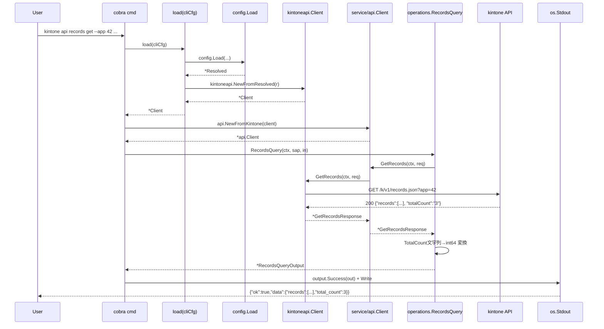
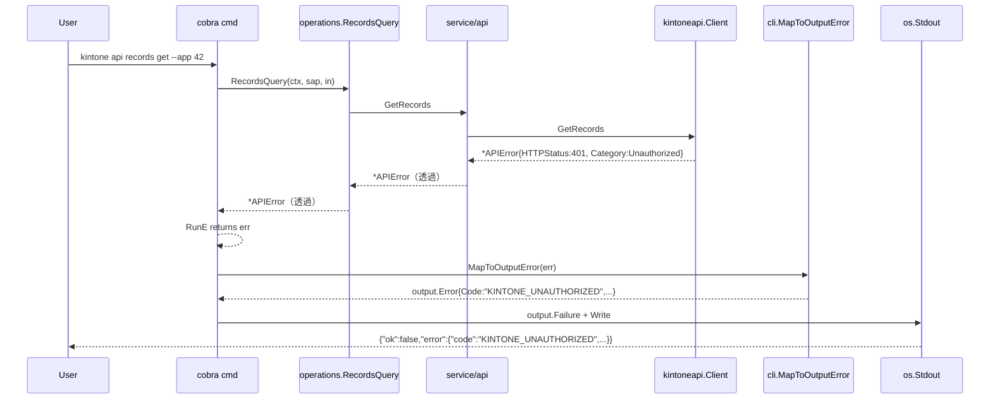
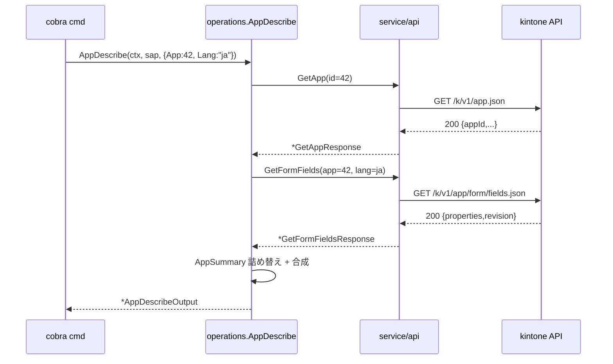

# M04: service 層（read 系 operations）+ CLI api コマンド

## Overview
| 項目 | 値 |
|------|---|
| ステータス | 計画完成 |
| 依存 | M03 完了（`kintoneapi.Client.{GetRecords, GetRecord, GetApp, GetFormFields}` が利用可能） |
| 想定期間 | 0.5 〜 1.0 日 |
| 対象ファイル（新規） | `internal/service/api/{records.go, record.go, app.go, fields.go, doc.go, *_test.go}` / `internal/service/operations/{records_query.go, app_describe.go, doc.go, *_test.go}` / `internal/cli/api/{root.go, records.go, record.go, app.go, fields.go, helpers.go, *_test.go}` |
| 対象ファイル（編集） | `internal/cli/root.go`（`api` サブコマンド追加） / `README.md` / `CLAUDE.md` / `plans/kintone-roadmap.md` |
| 新規依存 | なし（標準ライブラリ + 既存 cobra のみ） |

## Goal
仕様書 `docs/specs/kintone_spec.md` の「service / api / operations」層と「CLI api」セクションに基づき、
read 系の **薄い API 透過層**（`service/api`）と **LLM 向け抽象化**（`service/operations`）を導入し、
CLI から `kintone api records get` 等で kintone 上のデータを取得できる状態を作る。

### 完了条件（Definition of Done）
1. `internal/service/api` がエンドポイント単位の薄い透過層を提供し、`kintoneapi.Client` を直接公開しない（依存方向: `cli → service/{api,operations} → kintoneapi → auth`）
2. `internal/service/operations` が以下 2 つの read 系操作を提供する:
   - `RecordsQuery`: app + query + fields + totalCount を受け取り、レコード一覧を返す
   - `AppDescribe`: app を受け取り、**app 情報 + フィールド定義** を合成した記述オブジェクトを返す
3. CLI コマンドが以下 4 つ追加される:
   - `kintone api records get --app <ID> [--query Q] [--field F ...] [--total-count]`
   - `kintone api record get --app <ID> --id <ID>`
   - `kintone api app get --app <ID>`
   - `kintone api app fields --app <ID> [--lang ja|en|zh|user|default]`
   - `kintone api app describe --app <ID> [--lang ...]` （operations 版、app + fields 合成）
4. JSON 出力は既存規約 `{"ok":true,"data":{...}}` / `{"ok":false,"error":{...}}` に準拠
5. 設定解決は `config.Load(...)` → `kintoneapi.NewFromResolved(...)` のフローで統一
6. エラーマッピングは既存 `internal/cli.MapToOutputError` を再利用（kintone 系は M03 で完了）。新規 CLI 固有エラーは `KINTONE_VALIDATION` 系を使う or 必要なら追加（極力追加せず既存に集約）
7. 全テスト pass: `go test -race -cover ./...`、`internal/service/api` 80%+、`internal/service/operations` 85%+、`internal/cli` 80%+ 維持
8. `go vet ./...` / `gofmt -l .` / `golangci-lint run` クリーン
9. README / CLAUDE.md / kintone-roadmap.md の M04 セクションを更新（[x] 化、Current Focus を M5 に）

---

## Architecture Alignment（仕様書との整合）

| 仕様書要件 | M04 での扱い |
|-----------|-------------|
| `service/api`（薄い API 透過層） | `kintoneapi.Client` のメソッドを 1:1 で透過。型変換・名前解決・キャッシュ等は一切しない |
| `service/operations`（LLM 向け抽象化） | `service/api` を組み合わせて意味のある操作単位を提供。`AppDescribe` は app + fields の合成 |
| CLI `kintone api ...` | API 透過層を直接叩く CLI。LLM がやりやすい引数（`--app` / `--query` / `--field`） |
| JSON 固定出力 | `output.Success` / `output.Failure` を再利用。既存 `internal/cli` errors を共有 |
| multi-user 対応 | この層では関与しない。`config.Resolved` を受け取るだけで M07/M10 の TokenStore 拡張に影響しない |
| 名前解決 | M08 で operations 層に挿入する。M04 の operations は `app` / `field code` 等を **数値 ID / 文字 code そのまま** 受ける（resolver 未挿入） |

### 依存方向（循環なし）

```
cmd/kintone
  → internal/cli                 ← root, version, config, errors, api/*
        ├→ internal/cli/api      ← cobra コマンド層（新規）
        │    └→ internal/service/operations  ← LLM 向け抽象化（新規）
        │         └→ internal/service/api    ← 薄い API 透過層（新規）
        │              └→ internal/kintoneapi
        │                   └→ internal/auth
        ├→ internal/output
        └→ internal/config
```

> **設計原則**: CLI コマンドが `kintoneapi` を直接 import することは禁止。**必ず `service/api` または `service/operations` を経由** する。これにより M07 のキャッシュ・M08 の resolver 挿入時に CLI 修正が要らなくなる。

---

## Public API

### internal/service/api（薄い API 透過層）

**責務**: `kintoneapi.Client` の各エンドポイントを 1:1 で薄くラップする。
**設計判断**: なぜこの層を **わざわざ作るか** は次の 2 点で正当化する:
1. CLI / operations / facade（M06）からの依存を **interface** で受けられるようにし、テスト時に mock 可能にする
2. M07 でキャッシュを挿入する際、`Client` 直接利用箇所を 1 箇所に集約しておくと修正範囲を最小化できる

#### `internal/service/api/doc.go`

```go
// Package api は kintone REST API の薄い透過層を提供する。
//
// 設計原則:
//   - kintoneapi.Client の各 GetX メソッドを 1:1 で透過する
//   - 型変換・名前解決・キャッシュは行わない（M07 cache / M08 resolver で別途実装）
//   - operations / facade / cli から **必ずこの層を経由** して kintoneapi にアクセスする
//
// 利用例:
//
//	apiClient := api.NewFromKintone(kclient)
//	resp, err := apiClient.GetRecords(ctx, kintoneapi.GetRecordsRequest{App: 1})
package api
```

#### `internal/service/api/api.go`

```go
package api

import (
    "context"

    "github.com/youyo/kintone/internal/kintoneapi"
)

// API は kintone REST API への薄い透過層インターフェイス。
//
// このインターフェイス自体は read/write 全エンドポイントを将来的に持つが、
// M04 では read 系のみ実装する。M05 で write 系（Insert/Update/Delete）を追加する。
type API interface {
    GetRecords(ctx context.Context, req kintoneapi.GetRecordsRequest) (*kintoneapi.GetRecordsResponse, error)
    GetRecord(ctx context.Context, req kintoneapi.GetRecordRequest) (*kintoneapi.GetRecordResponse, error)
    GetApp(ctx context.Context, req kintoneapi.GetAppRequest) (*kintoneapi.GetAppResponse, error)
    GetFormFields(ctx context.Context, req kintoneapi.GetFormFieldsRequest) (*kintoneapi.GetFormFieldsResponse, error)
}

// Client は API インターフェイスの kintoneapi.Client ベース実装。
type Client struct {
    k *kintoneapi.Client
}

// NewFromKintone は kintoneapi.Client から API 実装を構築する。
// k が nil の場合 ErrNilClient を返す。
func NewFromKintone(k *kintoneapi.Client) (*Client, error)

// 透過メソッド群（実装は kintoneapi の同名メソッドを呼ぶだけ）
func (c *Client) GetRecords(ctx context.Context, req kintoneapi.GetRecordsRequest) (*kintoneapi.GetRecordsResponse, error)
func (c *Client) GetRecord(ctx context.Context, req kintoneapi.GetRecordRequest) (*kintoneapi.GetRecordResponse, error)
func (c *Client) GetApp(ctx context.Context, req kintoneapi.GetAppRequest) (*kintoneapi.GetAppResponse, error)
func (c *Client) GetFormFields(ctx context.Context, req kintoneapi.GetFormFieldsRequest) (*kintoneapi.GetFormFieldsResponse, error)

var ErrNilClient = errors.New("service/api: kintoneapi.Client is nil")
```

> 各透過メソッドは「`return c.k.GetX(ctx, req)`」の 1 行のみ。テスト負担を最小化するため引数バリデーションも `kintoneapi.Client` 側に委譲する。

---

### internal/service/operations（LLM 向け抽象化）

**責務**: 意味のある操作単位（task）を提供する。複数 API 呼び出しを内包したり、戻り値を LLM が消費しやすい形に整形する。
**設計判断**:
- M04 では 2 つに絞る（`RecordsQuery`, `AppDescribe`）
- `RecordsQuery` は単体エンドポイント呼び出しの **薄いラッパ**（後で resolver / cache を挿入できる接合点）
- `AppDescribe` は **app + fields の合成** であり、複数 API を呼ぶ最初のオペレーション

#### `internal/service/operations/doc.go`

```go
// Package operations は LLM / CLI 向けの意味付けされた操作（オペレーション）を提供する。
//
// 設計原則:
//   - 1 オペレーションは「ユーザーがやりたいこと」の単位（複数 API 呼び出しを内包しても良い）
//   - 戻り値は LLM が消費しやすい構造を返す（薄いマッピング）
//   - 名前解決（resolver）は M08 でこの層に挿入する
//   - キャッシュ（cache）は M07 で service/api 層に挿入する（operations は意識しない）
package operations
```

#### `internal/service/operations/records_query.go`

```go
package operations

import (
    "context"

    "github.com/youyo/kintone/internal/kintoneapi"
    "github.com/youyo/kintone/internal/service/api"
)

// RecordsQueryInput は records_query オペレーションの入力。
type RecordsQueryInput struct {
    App        int64    // 必須
    Query      string   // 任意（kintone クエリ言語）
    Fields     []string // 任意
    TotalCount bool     // 任意
}

// RecordsQueryOutput は records_query オペレーションの出力。
//
// LLM 消費しやすさを重視し、TotalCount を **数値**（int64 ポインタ）に正規化する。
// kintone REST は totalCount を文字列で返すため、operations 層でパースする。
type RecordsQueryOutput struct {
    Records    []map[string]any `json:"records"`
    TotalCount *int64           `json:"total_count,omitempty"`
}

// RecordsQuery は GET /k/v1/records.json を呼び、レコード一覧を取得する。
//
// バリデーション:
//   - Input.App <= 0 → ErrInvalidApp
//
// 名前解決（M08）はこの関数の **冒頭**（kintoneapi コール前）で挿入する想定。
func RecordsQuery(ctx context.Context, a api.API, in RecordsQueryInput) (*RecordsQueryOutput, error)

var ErrInvalidApp = errors.New("operations: app must be > 0")
```

#### `internal/service/operations/app_describe.go`

```go
package operations

import (
    "context"

    "github.com/youyo/kintone/internal/kintoneapi"
    "github.com/youyo/kintone/internal/service/api"
)

// AppDescribeInput は app_describe オペレーションの入力。
type AppDescribeInput struct {
    App  int64  // 必須
    Lang string // 任意（fields 取得時の表示言語）
}

// AppDescribeOutput は app + fields を合成したアプリ記述。
//
// LLM 消費しやすさを重視し、app と fields を **同一オブジェクトに合成** する。
// fields は kintone REST の生 properties をそのまま転載（型変換は M05 以降で検討）。
type AppDescribeOutput struct {
    App      AppSummary                       `json:"app"`
    Fields   map[string]map[string]any        `json:"fields"`
    Revision string                           `json:"revision"`
}

// AppSummary は GetAppResponse の主要フィールドを抜粋したもの。
// LLM 文脈で不要な creator / modifier の細部はそのまま map で保持しつつ、
// 主要フィールド（appId/code/name/description）はトップレベルに昇格させる。
type AppSummary struct {
    AppID       string         `json:"app_id"`
    Code        string         `json:"code"`
    Name        string         `json:"name"`
    Description string         `json:"description"`
    SpaceID     string         `json:"space_id,omitempty"`
    ThreadID    string         `json:"thread_id,omitempty"`
    CreatedAt   string         `json:"created_at,omitempty"`
    Creator     map[string]any `json:"creator,omitempty"`
    ModifiedAt  string         `json:"modified_at,omitempty"`
    Modifier    map[string]any `json:"modifier,omitempty"`
}

// AppDescribe は GetApp と GetFormFields を順次呼び、合成結果を返す。
//
// バリデーション:
//   - Input.App <= 0 → ErrInvalidApp
//
// **設計判断**: 並列呼び出しはしない（順次）。理由:
//   1. M07 でキャッシュが入れば 2 回目以降は高速化される
//   2. 並列にすると errgroup 等の依存が増え、デバッグ難易度が上がる
//   3. レイテンシ要件が厳しくない（CLI / MCP の単発操作）
func AppDescribe(ctx context.Context, a api.API, in AppDescribeInput) (*AppDescribeOutput, error)
```

> 戻り値の JSON タグは **snake_case** に統一（既存 `output` パッケージ規約と一貫）。kintoneapi が camelCase を返すため operations 層で詰め替える。

---

### internal/cli/api（CLI コマンド層）

**責務**: cobra のコマンドツリーを構築し、`config.Load` → `kintoneapi.NewFromResolved` → `service/api.NewFromKintone` → `service/operations.X` のフローを実行する。

#### `internal/cli/api/root.go`

```go
// Package api は kintone CLI の `api` サブコマンドツリーを提供する。
//
// kintone REST API を直接叩く透過コマンド群:
//
//	kintone api records get   ...   # 一覧取得
//	kintone api record  get   ...   # 単件取得
//	kintone api app     get   ...   # アプリ情報
//	kintone api app     fields ...  # フィールド定義
//	kintone api app     describe ...# app + fields 合成（operations 経由）
package api

import "github.com/spf13/cobra"

// NewCmd は `kintone api` サブコマンドツリーのルートを返す。
func NewCmd() *cobra.Command
```

#### `internal/cli/api/helpers.go`

```go
package api

import (
    "github.com/spf13/cobra"
    "github.com/youyo/kintone/internal/config"
    "github.com/youyo/kintone/internal/kintoneapi"
    serviceapi "github.com/youyo/kintone/internal/service/api"
)

// loadAPI は cobra cmd の PersistentFlags から CLIConfig を組み立て、
// config.Load → kintoneapi.NewFromResolved → service/api.NewFromKintone を実行する。
//
// テスト時は loaderFn 注入でモック可能にする。
type loaderFn func(cli config.CLIConfig) (*kintoneapi.Client, error)

// defaultLoader は本番用ローダー。config.Load + kintoneapi.NewFromResolved を呼ぶ。
func defaultLoader(cli config.CLIConfig) (*kintoneapi.Client, error)

// loadAPI は cobra Command から CLIConfig を読み、API クライアントを構築する。
// テスト時に load フックを差し替えられるよう、関数値として保持する。
var load loaderFn = defaultLoader

// readCLIConfig は cobra 親コマンドの PersistentFlags から CLIConfig を構築する。
func readCLIConfig(cmd *cobra.Command) config.CLIConfig

// buildAPI は CLI 経由で API 透過層インスタンスを返す。
func buildAPI(cmd *cobra.Command) (serviceapi.API, error)
```

> `load` を `var` にすることで、テスト時に `load = mockLoader` で差し替えられる（M02 の `os.UserHomeDir` 注入と同パターン）。

#### `internal/cli/api/records.go`

```go
package api

import (
    "github.com/spf13/cobra"
    "github.com/youyo/kintone/internal/kintoneapi"
    "github.com/youyo/kintone/internal/output"
    "github.com/youyo/kintone/internal/service/operations"
)

// newRecordsCmd は `kintone api records` ツリーを構築する（現状は get のみ）。
func newRecordsCmd() *cobra.Command

// newRecordsGetCmd は `kintone api records get` を構築する。
//
// フラグ:
//   --app  int64    必須
//   --query string  任意（kintone クエリ言語）
//   --field string  任意・複数指定可（StringArrayVar）
//   --total-count   任意（フラグ存在で true）
//
// 出力:
//   {"ok":true,"data":{"records":[...], "total_count": <int64 or null>}}
func newRecordsGetCmd() *cobra.Command
```

#### `internal/cli/api/record.go`

```go
package api

// newRecordCmd / newRecordGetCmd は `kintone api record get` を構築する。
//
// フラグ:
//   --app  int64    必須
//   --id   int64    必須
//
// 出力:
//   {"ok":true,"data":{"record":{...}}}  (kintoneapi の生レスポンスをそのまま data に入れる)
```

#### `internal/cli/api/app.go`

```go
package api

// newAppCmd は `kintone api app` ツリー（get / fields / describe）を構築する。

// newAppGetCmd:
//   フラグ:    --app int64 必須
//   出力 data: AppSummary 形式に正規化（GetApp の生レスポンスを snake_case 化）

// newAppFieldsCmd:
//   フラグ:    --app int64 必須 / --lang string 任意
//   出力 data: { "properties": {...}, "revision": "..." }（GetFormFields をそのまま）

// newAppDescribeCmd:
//   フラグ:    --app int64 必須 / --lang string 任意
//   実行:      operations.AppDescribe を呼ぶ（fields も含めた合成版）
//   出力 data: AppDescribeOutput
```

#### CLI フラグ命名規約（仕様書のCLI規約との整合）

| フラグ | 型 | 必須 | 説明 |
|--------|---|------|------|
| `--app` | int64 | ◎ | kintone アプリ ID。M08 で resolver 経由 code/name 指定対応 |
| `--id` | int64 | ◎ | レコード ID（record get のみ） |
| `--query` | string | - | kintone クエリ言語（例: `'name = "foo"'`） |
| `--field` | string array | - | レスポンスを絞り込むフィールドコード（複数指定可） |
| `--total-count` | bool | - | true で `totalCount` も返す |
| `--lang` | string | - | フィールド表示言語 (`ja` / `en` / `zh` / `user` / `default`) |

> **設計判断**: `--field` は単数形（cobra 規約: 配列は `StringArrayVarP` を使い、複数指定で繰り返す）。仕様書では `--fields` 表記もあったが、cobra の `StringSliceVar`（カンマ区切り）と `StringArrayVar`（複数フラグ）の混乱を避けるため **単数 `--field`** を採用し、複数指定で繰り返す（`--field name --field age`）。`--fields` のエイリアスは登録しない（M05 で write 系を入れる際にも単数を踏襲）。

---

## 既存コード変更点

### `internal/cli/root.go`

```diff
 import (
     ...
+    cliapi "github.com/youyo/kintone/internal/cli/api"
 )

 func NewRootCmd() *cobra.Command {
     ...
     cmd.AddCommand(newVersionCmd())
     cmd.AddCommand(newConfigCmd())
+    cmd.AddCommand(cliapi.NewCmd())
     return cmd
 }
```

> 1 行追加。`internal/cli/api` を `cliapi` というエイリアスで import する（パッケージ名 `api` のため、混乱を避ける）。

---

## URL / クエリ仕様（M03 で確定済み）

M04 では新しいエンドポイントは追加しない。M03 の以下を再利用:

| メソッド | path | query 例 |
|---------|------|---------|
| GetRecords | `/k/v1/records.json` | `app=42&query=...&fields=name&fields=age&totalCount=true` |
| GetRecord | `/k/v1/record.json` | `app=42&id=7` |
| GetApp | `/k/v1/app.json` | `id=42` |
| GetFormFields | `/k/v1/app/form/fields.json` | `app=42&lang=ja` |

---

## Sequence Diagrams

### 正常系: `kintone api records get --app 42`



### 異常系: 401（kintoneapi.APIError）→ CLI が KINTONE_UNAUTHORIZED を出力



### `app describe`（複数 API 呼び出しの合成）



---

## TDD Test Design

> 全テスト共通方針:
> - `httptest.NewServer` で kintone API を mock（M03 の fixture パターン踏襲）
> - operations / cli テストは **interface mock**（`api.API` を実装した stub）で `service/api` を完全モック化（HTTP を立てない）
> - 既存テスト（M01/M02/M03）は全 pass のまま

### `internal/service/api/api_test.go`

| # | ケース | 入力 / 振る舞い | 期待 |
|---|--------|-----------------|------|
| SA-1 | NewFromKintone 正常 | `NewFromKintone(realClient)` | `*Client, nil` |
| SA-2 | NewFromKintone nil | `NewFromKintone(nil)` | `ErrNilClient` |
| SA-3 | GetRecords 透過 | httptest mock が `/k/v1/records.json` を返す | `*GetRecordsResponse` 透過 |
| SA-4 | GetRecord 透過 | mock が record 1 件 | `*GetRecordResponse` 透過 |
| SA-5 | GetApp 透過 | mock が app | `*GetAppResponse` 透過 |
| SA-6 | GetFormFields 透過 | mock が properties | `*GetFormFieldsResponse` 透過 |
| SA-7 | エラー透過 | mock が 404 | `*kintoneapi.APIError` がそのまま伝播（ラップなし） |

### `internal/service/operations/records_query_test.go`

`api.API` の **stub mock** を作って単体テストする（HTTP は立てない）。

```go
type stubAPI struct {
    getRecords func(ctx context.Context, req kintoneapi.GetRecordsRequest) (*kintoneapi.GetRecordsResponse, error)
    // 他は呼ばれない想定
}
```

| # | ケース | stub 振る舞い | 期待 |
|---|--------|--------------|------|
| OQ-1 | 正常 / 全引数 | `App=42, Query="...", Fields=[a,b], TotalCount=true` を渡し、stub が `{records:[...],totalCount:"5"}` を返す | `Records` が透過、`TotalCount=5`（int64） |
| OQ-2 | 最小 / app のみ | stub が `{records:[]}` を返す | `Records=[]`, `TotalCount=nil` |
| OQ-3 | App=0 → エラー | - | `ErrInvalidApp` |
| OQ-4 | totalCount が "0" | stub が `{records:[],totalCount:"0"}` | `TotalCount` ポインタが 0 を指す |
| OQ-5 | totalCount が不正文字列 | stub が `{records:[],totalCount:"abc"}` | エラー（`operations: parse total_count: ...`） |
| OQ-6 | api 層がエラー透過 | stub が `*APIError{401}` | `*APIError` が透過（ラップしない） |
| OQ-7 | ctx cancel | ctx をキャンセル → stub が ctx.Err() | `ctx.Err()` が伝播 |

> **設計判断**: `TotalCount` パース失敗を **エラーにする** か **nil にする** か。kintone REST 仕様では totalCount が文字列または null のみのため、不正値は実質発生しない。ただし防御的に **エラー** にして発見可能性を高める（OQ-5）。

### `internal/service/operations/app_describe_test.go`

| # | ケース | stub 振る舞い | 期待 |
|---|--------|--------------|------|
| OD-1 | 正常 | GetApp が `{appId:"42",name:"テスト"}`、GetFormFields が `{properties:{...},revision:"5"}` | `App.AppID="42"` / `Fields.{...}` / `Revision="5"` |
| OD-2 | App=0 | - | `ErrInvalidApp` |
| OD-3 | GetApp 失敗（404） | stub が APIError | エラー透過、GetFormFields は呼ばれない |
| OD-4 | GetFormFields 失敗（403） | GetApp 成功 → GetFormFields APIError | GetApp 成功後にエラー透過 |
| OD-5 | Lang 指定が下層に伝播 | stub の GetFormFields が req.Lang を assert | `Lang="ja"` が渡る |
| OD-6 | Lang 省略は空文字伝播 | stub assert | `Lang=""` のまま伝播（kintoneapi 側で省略処理） |

### `internal/cli/api/records_test.go`

CLI テストは **`load` モック注入** で `service/api.API` まで mock 化。

> **並列実行ポリシー**: `cli/api` 配下のテストは **`t.Parallel()` を使わない**。
> グローバル var (`load` / `newAPI`) を差し替えるパターンが goroutine 安全でないため、
> サブテスト並列化は行わない。各テストファイル先頭にコメントで明記する。
> （M03 transport_test は parallel を多用しているが、それは fixture が値型に閉じているため。
> cli/api では package-level var を差し替えるので方針を変える。）

```go
// stubAPI を返す load 関数を注入
old := load
load = func(cli config.CLIConfig) (*kintoneapi.Client, error) {
    // 実際にはここを通さず、別途 buildAPI を hook するパターンを採用する
    ...
}
defer func() { load = old }()
```

> **設計判断**: `load` は `*kintoneapi.Client` を返す関数だが、テストでは `service/api.API` レベルで mock したい。
> 解決策: **テスト用 hook** として `var apiBuilder = serviceapi.NewFromKintone` を導入し、テスト時に直接 `*api.Client` を mock 実装で差し替えられるようにする。
>
> 実装:
> ```go
> var newAPI = func(k *kintoneapi.Client) (serviceapi.API, error) { return serviceapi.NewFromKintone(k) }
> ```
> テスト側で `newAPI = func(_ *kintoneapi.Client) (serviceapi.API, error) { return &stubAPI{...}, nil }` に差し替える。
>
> `load` も `var loadClient = defaultLoadClient` に変更し、stub `kintoneapi.Client`（nil でも `newAPI` で stub に置き換えるので OK）を返すようにすればテストが書ける。

| # | ケース | 入力 + フラグ | 期待 |
|---|--------|--------------|------|
| CR-1 | records get 正常 | `--app 42 --query 'name="x"' --field a --field b --total-count` | stdout が `{"ok":true,"data":{"records":[...],"total_count":3}}` を含む。stub の req に `App=42, Query=..., Fields=[a,b], TotalCount=true` |
| CR-2 | --app 必須 | フラグ無し | exit error / 出力 JSON は `USAGE`（cobra `MarkFlagRequired` のメッセージ `required flag(s) "app" not set` が既存 `isUsageError` で USAGE に分類されるため） |
| CR-3 | API エラー透過 | stub が `*APIError{HTTPStatus:401, Category:Unauthorized}` | stdout が `{"ok":false,"error":{"code":"KINTONE_UNAUTHORIZED",...}}` |

### `internal/cli/api/record_test.go`

| # | ケース | フラグ | 期待 |
|---|--------|--------|------|
| CRec-1 | record get 正常 | `--app 42 --id 7` | stdout に `{"ok":true,"data":{"record":{...}}}` |
| CRec-2 | --id 必須 | `--app 42` のみ | exit error / 出力 JSON は `USAGE`（cobra `MarkFlagRequired` 経由） |

### `internal/cli/api/app_test.go`

| # | ケース | フラグ | 期待 |
|---|--------|--------|------|
| CA-1 | app get 正常 | `--app 42` | stdout に `{"ok":true,"data":{"app_id":"42",...}}`（snake_case 化） |
| CA-2 | app fields 正常 | `--app 42 --lang ja` | stdout に `{"properties":{...},"revision":"..."}` |
| CA-3 | app describe 正常 | `--app 42` | stdout に `{"app":{...},"fields":{...},"revision":"..."}` |
| CA-4 | app describe 401 | stub APIError | stdout に `{"ok":false,...,"code":"KINTONE_UNAUTHORIZED"}` |

### `internal/cli/api/root_test.go`

| # | ケース | 期待 |
|---|--------|------|
| AR-1 | NewCmd 構築 | サブコマンド `records / record / app` が登録されている |
| AR-2 | サブコマンドのフラグ登録 | 各 cmd に必要なフラグが Lookup 可能 |

---

## Implementation Steps（atomic、TDD 順次実行）

各ステップ完了時に Conventional Commits（日本語）でコミット可能。

- [ ] **Step 1: ディレクトリ準備**
  - `mkdir -p internal/service/api internal/service/operations internal/cli/api`
  - `go build ./...` 通ること（ファイル無しなので何も build されない）

- [ ] **Step 2 (Red): service/api テスト先行**
  - `internal/service/api/api_test.go`（SA-1〜7）
  - `httptest.NewServer` で kintone を mock
  - コンパイル通るためには空の API インターフェイスが必要 → 後の Green で実装

- [ ] **Step 3 (Green): service/api 実装**
  - `internal/service/api/doc.go`
  - `internal/service/api/api.go`（4 メソッド透過実装）
  - SA-1〜7 全 pass

- [ ] **Step 4 (Red): operations テスト先行（records_query）**
  - `internal/service/operations/records_query_test.go`（OQ-1〜7）
  - `stubAPI` を同パッケージ内に作成

- [ ] **Step 5 (Green): records_query 実装**
  - `internal/service/operations/doc.go`
  - `internal/service/operations/records_query.go`
  - `RecordsQuery` 関数 + `RecordsQueryInput`/`Output`
  - OQ-1〜7 全 pass

- [ ] **Step 6 (Red): operations テスト先行（app_describe）**
  - `internal/service/operations/app_describe_test.go`（OD-1〜6）

- [ ] **Step 7 (Green): app_describe 実装**
  - `internal/service/operations/app_describe.go`
  - `AppDescribe` 関数 + `AppDescribeInput`/`Output` + `AppSummary`
  - OD-1〜6 全 pass

- [ ] **Step 8 (Red): cli/api テスト先行（root + records get）**
  - `internal/cli/api/root_test.go`（AR-1〜2）
  - `internal/cli/api/records_test.go`（CR-1〜3）
  - hook 関数（`var newAPI = ...` 等）を実装ファイルに先取り定義

- [ ] **Step 9 (Green): cli/api root + records 実装**
  - `internal/cli/api/root.go` (`NewCmd`)
  - `internal/cli/api/helpers.go` (`load`, `newAPI`, `readCLIConfig`, `buildAPI`)
  - `internal/cli/api/records.go` (`newRecordsCmd`, `newRecordsGetCmd`)
  - AR-1〜2 / CR-1〜3 全 pass

- [ ] **Step 10 (Red→Green): cli/api record / app 実装**
  - `internal/cli/api/record_test.go`（CRec-1〜2）
  - `internal/cli/api/app_test.go`（CA-1〜4）
  - 対応する実装ファイル: `record.go` / `app.go`
  - app.go では `newAppGetCmd` / `newAppFieldsCmd` / `newAppDescribeCmd` を実装

- [ ] **Step 11: root に api サブコマンド統合**
  - `internal/cli/root.go` の `NewRootCmd` に `cmd.AddCommand(cliapi.NewCmd())` を追加
  - 既存 `root_test.go` の `R-2 / R-4 / R-5` が壊れないことを確認

- [ ] **Step 12 (Refactor)**
  - godoc 整備、重複削減
  - `gofmt -l .` 確認、`go vet ./...`
  - `golangci-lint run ./...` クリア

- [ ] **Step 13: 動作確認**
  - `go test -race -cover ./...` 全 pass
  - `internal/service/api` 80%+ / `internal/service/operations` 85%+ / `internal/cli` 80%+ 維持
  - `go run ./cmd/kintone api --help` が動く（手元で実行）
  - `go run ./cmd/kintone api records get --app 1` は環境変数なしなら CONFIG エラー、`KINTONE_DOMAIN=...` 設定で実 API 接続を試みる挙動

- [ ] **Step 14: ドキュメント更新**
  - `README.md`: `kintone api ...` のサブコマンド使用例を追加。環境変数 + `--app` 指定の例
  - `CLAUDE.md`: 「プロジェクト現状」を M04 完了 → M05 次マイルストーン に更新
  - `plans/kintone-roadmap.md`: M04 セクションを `[x]` 化、Current Focus を M05、Changelog 追記

- [ ] **Step 15: コミット（Conventional Commits 日本語）**
  - 例:
    - `test(service/api): 薄い API 透過層のテストを追加`
    - `feat(service/api): 薄い API 透過層を実装`
    - `test(service/operations): records_query のテストを追加`
    - `feat(service/operations): records_query を実装`
    - `test(service/operations): app_describe のテストを追加`
    - `feat(service/operations): app_describe を実装`
    - `test(cli/api): records / record / app コマンドのテストを追加`
    - `feat(cli/api): records / record / app コマンドを実装`
    - `feat(cli): root に api サブコマンドを統合`
    - `docs: README/CLAUDE/roadmap を M04 完了に更新`

---

## Verification

### 自動テスト
1. `go test -race -cover ./...` 全 pass
2. カバレッジ:
   - `internal/service/api` 80%+
   - `internal/service/operations` 85%+
   - `internal/cli` 80%+ 維持（cli/api を含めて全体）
   - 既存（output / config / kintoneapi / auth）破壊なし
3. `go vet ./...` 警告なし
4. `gofmt -l .` 出力なし
5. `golangci-lint run` クリーン

### スモークテスト（手動・任意）

```bash
# 環境変数で API Token と domain を設定
export KINTONE_DOMAIN=example.cybozu.com
export KINTONE_AUTH=api-token
export KINTONE_API_TOKEN=xxxxxxxxxxxxxxxxxxxx

# レコード一覧
go run ./cmd/kintone api records get --app 1 --total-count

# 単件
go run ./cmd/kintone api record get --app 1 --id 5

# アプリ情報
go run ./cmd/kintone api app get --app 1

# フィールド定義
go run ./cmd/kintone api app fields --app 1 --lang ja

# 合成版（operations）
go run ./cmd/kintone api app describe --app 1 --lang ja
```

### ヘルプ確認
```
$ go run ./cmd/kintone api --help
$ go run ./cmd/kintone api records get --help
$ go run ./cmd/kintone api app describe --help
```

---

## Risks

| # | Risk | Impact | Likelihood | Mitigation |
|---|------|--------|-----------|-----------|
| R-1 | `service/api` を 1:1 透過にすると「無駄な層」と評価される | 低 | 中 | 設計判断（M07 cache 挿入点 / interface mock の有用性）を doc.go に明記。M05 で write 系を入れたとき同じパターンが効くため整合的 |
| R-2 | `service/operations` のスコープが膨らんで M04 完了が遅延 | 中 | 中 | M04 は 2 オペレーションのみ（RecordsQuery / AppDescribe）に絞る。それ以外は M05/M06 |
| R-3 | LLM 向け JSON のフィールド命名（snake_case vs camelCase）が混在 | 中 | 中 | operations 出力は **snake_case 統一**。kintoneapi 生レスポンスをそのまま流す `record get` だけ camelCase を許容（kintone 側の命名）→ README に明記 |
| R-4 | `--field` の単数 / 複数（`StringArrayVar`）がユーザーに不親切 | 低 | 中 | README に複数指定例（`--field a --field b`）を明記。エイリアスは登録しない（混乱回避） |
| R-5 | `app describe` で 2 回の API 呼び出しコストが発生 | 低 | 低 | M07 で cache が入れば 1 年 TTL で実質 1 回化。当面は許容 |
| R-6 | `load` をグローバル var にするとテスト並列実行で衝突 | 中 | 中 | テスト側で `t.Setenv` のように setup/teardown を必ず行う。`t.Cleanup(func() { load = old })` を helper 化 |
| R-7 | `kintoneapi.Client` 直接 import が CLI に残る | 高 | 低 | linter の `depguard` 等で制限したいが、M04 では man-made な review で担保。CLAUDE.md に「CLI から kintoneapi 直 import 禁止」を明記 |
| R-8 | totalCount を string→int64 にする変換が破壊的（仕様書では文字列のまま） | 中 | 低 | `service/api` 層は **文字列のまま透過**（kintoneapi.GetRecordsResponse そのまま）。`operations.RecordsQuery` 層で初めて int64 化する。CLI の `records get` は **operations 経由** にして int64 を返す |
| R-9 | `app fields` を operations 経由でなく api 直叩きすると、operations と挙動差異 | 低 | 低 | `app fields` は単純な透過のため operations 不要。CLI から直接 `service/api` を叩く（operations は describe 専用） |
| R-10 | 既存 `internal/cli` パッケージへの影響範囲が広がる | 中 | 低 | `cli/api` は **新規パッケージ**。既存 `cli` の唯一の変更は `root.go` の `AddCommand` 1 行のみ |
| R-11 | cobra の `RequiredFlags` 設定漏れ | 中 | 中 | 各サブコマンドで `cmd.MarkFlagRequired("app")` を確実に呼ぶ。テスト CR-2 / CRec-2 で担保 |
| R-12 | `--app` を int64 にすると LLM が文字列で渡したとき UX 悪化 | 低 | 中 | M08 で resolver が code/name → ID に解決する。M04 では int64 のまま（LLM から数値で渡す前提）|
| R-13 | テスト hook（`var newAPI = ...`）の差し替えが goroutine 安全でない | 中 | 低 | t.Parallel() を使わない、または使う場合は subtest 単位で setup/teardown を明示。CR/CA テストは parallel 化しない方針 |
| R-14 | `app describe` で GetApp と GetFormFields の片方だけキャッシュヒット時の整合性 | 低 | 低 | M07 で cache 設計時に再考。M04 では「両方キャッシュなし or 両方キャッシュあり」前提でも問題ない（fields も app 同じ TTL=1 年） |
| R-15 | `record get` の出力 data が `{"record":{...}}` か `{...}` か | 中 | 中 | kintoneapi の生レスポンスは `{"record":{...}}` 形式。CLI 層では **そのまま `data.record` に入れる**（透過 / フィールド名重複なし）。README で明記 |
| R-16 | golangci-lint の `errcheck` / `revive` で operations の error wrap が引っかかる | 低 | 中 | `fmt.Errorf("operations: ...: %w", err)` で必ず %w wrap する。透過したい場合は wrap せず `return err` で良い |

---

## Open Questions（未確定事項）

| # | 項目 | 仮置き | デッドライン |
|---|------|--------|-------------|
| Q-1 | `--field` を `StringArrayVar`（複数フラグ繰り返し）と `StringSliceVar`（カンマ区切り）どちらにすべきか | `StringArrayVar`（kintone のフィールドコードに `,` を含む可能性は低いが防御的に） | Step 9 着手時 |
| Q-2 | `app describe` の出力に **revision のみ** を保存するか fields 全文も保存するか | fields 全文も保存（LLM に full context を提供）。M07 cache 時は 1 年 TTL でも問題ない | Step 7 着手時 |
| Q-3 | `record get` を `kintoneapi.GetRecordResponse` のまま透過するか operations を経由するか | 透過（M04 では薄く）。operations は describe / query のみ | Step 10 着手時 |
| Q-4 | `app get` を AppSummary に詰め替えるか kintoneapi 生レスポンス（camelCase）のまま出すか | **AppSummary に詰め替え**（snake_case 統一）。これも operations 不要、CLI 内部で詰め替える | Step 10 着手時 |

---

## Notes / 後続マイルストーンへの引き継ぎ

- **M05（write 系 + describe 拡張）への引き継ぎ**:
  - `service/api.API` インターフェイスに `InsertRecords` / `UpdateRecord` / `DeleteRecords` を追加
  - `service/operations` に `RecordCreate` / `RecordUpdate` / `RecordDelete` を追加
  - `cli/ops/{record,app}.go` 配下を新規作成（`api` と並列の名前空間）
  - kintoneapi 側にも対応する `PostRecords` / `PutRecord` / `DeleteRecords` を追加（M05 計画）
- **M07（cache）への引き継ぎ**:
  - キャッシュは **`service/api` 層** に挿入する（operations は意識しない）
  - キャッシュ対象: GetApp / GetFormFields（TTL=1 年）。GetRecords / GetRecord はキャッシュ対象外（リアルタイム性重視）
  - 実装方針: `service/api.Client` の各 GetX メソッド冒頭でキャッシュ参照、ヒットなら kintoneapi 呼ばずに返す。`service/api` の interface は変えない
- **M08（resolver）への引き継ぎ**:
  - 名前解決は **`service/operations` 層** に挿入する（api は数値 ID のみ受け付ける）
  - operations の各関数冒頭で `App: int64` を `string`（code/name/partial）からも受けられる **オプション引数追加** を検討。CLI フラグも `--app-code` / `--app-name` を追加
- **M06（MCP facade）への引き継ぎ**:
  - MCP の `apps_search` / `app_describe` / `records_query` ツールは **`service/operations` を直接呼ぶ**（CLI と同じ抽象化を共有）
  - facade 層は cobra に依存せず operations の呼び出しと JSON-RPC レスポンス組み立てに専念

### 既知の改善余地（M04 スコープ外、後続マイルストーンで対応）

- `kintoneapi.ErrUnsupportedAuthMode` / `ErrEmptyDomain` などの「設定不足」系エラーは現状 `MapToOutputError` で `INTERNAL` に落ちる。`KINTONE_DOMAIN` 未設定で CLI を叩くとユーザーには不親切なメッセージになる。M04 ではスコープ外として deferr し、設定改善は別マイルストーン（M07/M11 のリリース直前ポリッシュ）で `CONFIG_*` にマップする想定。
- `--app` を文字列指定（code / name）で受けたいが、resolver が未実装の M04 では int64 のみ。M08 で対応。

---

## 実装手段の制約（環境制約メモ）

本セッションでは Agent tool（subagent spawn）が利用できないため、`devflow:cycle` / `devflow:implement` が想定する「Planner / Implementer / Reviewer の subagent 構成」は実行できない。
オーケストレーター（このセッション）が直接 TDD で実装する方針を採る（M02 / M03 と同じ）。
原則は変えない:
- TDD（Red → Green → Refactor）厳守
- テストファイルを `*.go` より先にコミット（または同一コミット内でも Red→Green の順序を保つ）
- `go test -race -cover ./...` 全 pass
- `golangci-lint run` クリーン
- README / CLAUDE.md / roadmap を実装と同時に更新
- Conventional Commits（日本語）でコミット分割

完了後の CYCLE_RESULT 報告内で、この環境制約による方針逸脱を明示する。

---

## チェックリスト

### 観点1: 実装実現可能性と完全性
- [x] 手順の抜け漏れがないか（Step 1〜15、TDD 順）
- [x] 各ステップが十分に具体的か
- [x] 依存関係が明示されているか（M03 → M04、Step 順序）
- [x] 変更対象ファイルが網羅されているか（Overview 表）
- [x] 影響範囲が正確に特定されているか（cli/root.go の 1 行追加のみ）

### 観点2: TDDテスト設計の品質
- [x] 正常系テストケースが網羅されている（SA/OQ/OD/CR/CRec/CA/AR）
- [x] 異常系テストケースが定義されている（OQ-3,5,6,7 / OD-2,3,4 / CR-2,3 / CA-4）
- [x] エッジケースが考慮されている（totalCount=0/不正 / Lang 省略 / nil client）
- [x] 入出力が具体的に記述されている（テスト表）
- [x] Red→Green→Refactor の順序が明示されている
- [x] モック/スタブ設計（httptest.Server / api.API stub / load・newAPI hook）

### 観点3: アーキテクチャ整合性
- [x] 既存命名規則に従っている（package api / operations、NewXxx、GetX）
- [x] 設計パターン一貫（M02/M03 の DI パターンを継承: hook 関数の var 化）
- [x] モジュール分割（service/api, service/operations, cli/api）
- [x] 依存方向（cli → service/{api,operations} → kintoneapi → auth、循環なし）
- [x] 仕様書の層構造（CLI → operations → api → client → auth）と一致

### 観点4: リスク評価と対策
- [x] リスク特定（R-1〜R-16）
- [x] 対策が具体的
- [x] フェイルセーフ（R-2 スコープ絞り / R-7 直 import 禁止 / R-11 RequiredFlags）
- [x] パフォーマンス影響評価（R-5 describe の 2 回呼び）
- [x] セキュリティ（M03 で確立済みのトークン非ログ方針を踏襲）
- [x] ロールバック計画（git revert で完結、外部状態なし）

### 観点5: シーケンス図の完全性
- [x] 正常フロー（records get）
- [x] エラーフロー（401 → KINTONE_UNAUTHORIZED）
- [x] 複合操作（app describe）
- [x] ユーザー・システム間相互作用
- [x] 各コンポーネントの呼び出し順序

---

## Changelog

| 日時 | 種別 | 内容 |
|------|------|------|
| 2026-04-29 | 作成 | 初版（M03 計画書スタイル踏襲、TDD テスト 7 表 22 ケース、シーケンス図 3 件、リスク 16 件、Step 1〜15） |
