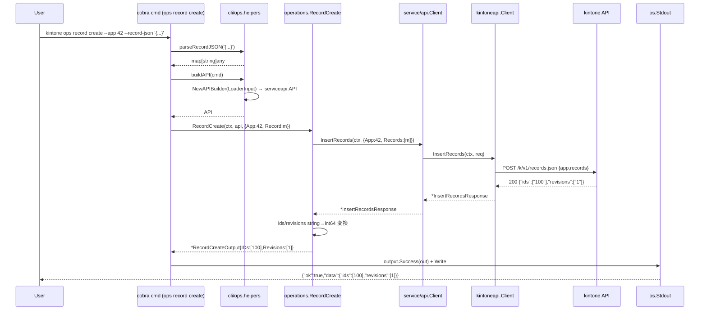
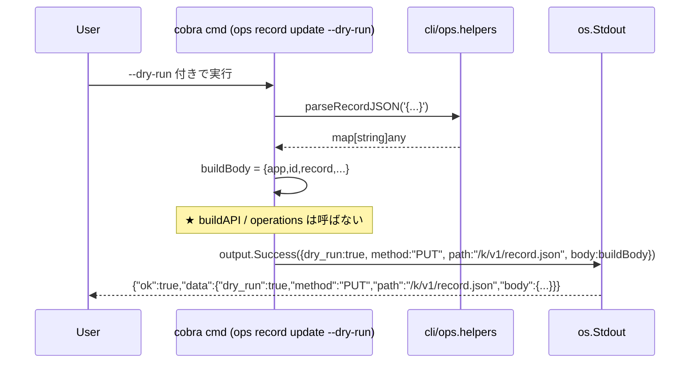
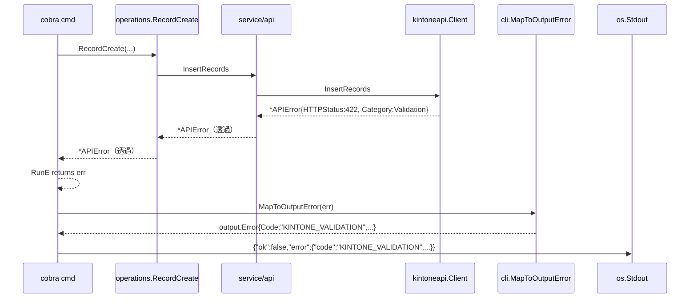
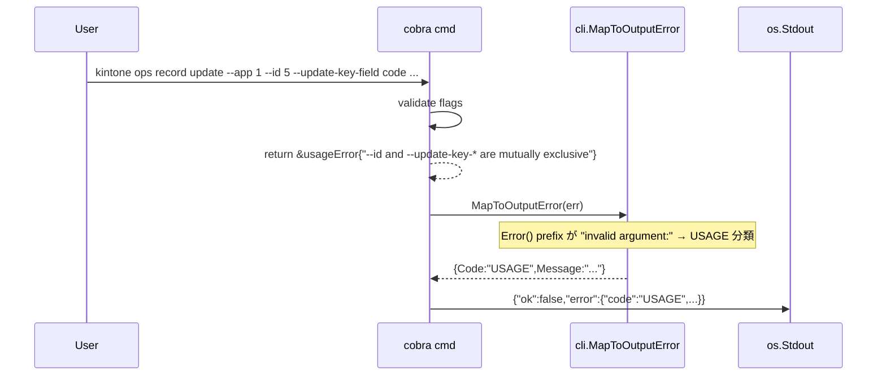

# M05: CLI ops コマンド（write 系 + describe）

## Overview
| 項目 | 値 |
|------|---|
| ステータス | 計画完成 |
| 依存 | M04 完了（`service/api.API` interface, `operations.AppDescribe`, CLI hook `NewAPIBuilder` が利用可能） |
| 想定期間 | 0.7 〜 1.2 日 |
| 対象ファイル（新規） | `internal/kintoneapi/{records_write.go, record_write.go, *_test.go}`<br>`internal/service/operations/{record_create.go, record_update.go, record_delete.go, *_test.go}`<br>`internal/cli/ops/{root.go, helpers.go, record.go, app.go, *_test.go}` |
| 対象ファイル（編集） | `internal/kintoneapi/transport.go`（doJSON にボディ送信を追加）<br>`internal/service/api/api.go`（interface に Insert/Update/Delete 追加）<br>`internal/service/api/api_test.go`（透過テスト追記）<br>`internal/cli/root.go`（`ops` サブコマンド追加）<br>`README.md` / `CLAUDE.md` / `plans/kintone-roadmap.md` |
| 新規依存 | なし（標準ライブラリ + 既存 cobra のみ） |

## Goal

仕様書 `docs/specs/kintone_spec.md`「CLI ops」「MCP tools record_create / update / delete / app_describe」セクションに基づき、
**書き込み系の薄い API 透過層**（M03 kintoneapi の拡張）と **LLM 向け書き込みオペレーション**（service/operations）を導入し、
CLI から `kintone ops record create/update/delete --app ... --record-json ...` および `kintone ops app describe --app ...` で
kintone レコードの CRUD を実行できる状態を作る。

### 完了条件（Definition of Done）

1. `internal/kintoneapi` が以下 3 エンドポイントを提供する:
   - `POST /k/v1/records.json` (`InsertRecords`) — 複数レコード新規登録
   - `PUT /k/v1/record.json` (`UpdateRecord`) — 単件更新（`id` または `updateKey` 指定、`revision` 任意）
   - `DELETE /k/v1/records.json` (`DeleteRecords`) — 複数レコード削除（`ids` 必須、`revisions` 任意）
2. `internal/service/api.API` interface に `InsertRecords` / `UpdateRecord` / `DeleteRecords` の 3 メソッドが追加され、
   `service/api.Client` がそれらを `kintoneapi.Client` の同名メソッドへ 1:1 透過する
3. `internal/service/operations` に以下 3 オペレーションが追加される:
   - `RecordCreate(ctx, api, in)` — 複数件新規登録（1 件 `--record-json` の利便性も内包）
   - `RecordUpdate(ctx, api, in)` — 単件更新（id / update_key / revision を選択的に渡す）
   - `RecordDelete(ctx, api, in)` — 複数件削除（ids 必須、revisions 任意）
4. CLI コマンドが以下 4 つ追加される:
   - `kintone ops record create --app <ID> --record-json <JSON> [--records-json <JSON>] [--dry-run]`
   - `kintone ops record update --app <ID> [--id <ID> | --update-key-field <field> --update-key-value <v>] --record-json <JSON> [--revision <N>] [--dry-run]`
   - `kintone ops record delete --app <ID> --id <ID>... [--revision <N>...] [--dry-run]`
   - `kintone ops app describe --app <ID> [--lang <ja|en|zh|user|default>]`（M04 の `api app describe` と同じ operations を呼ぶエイリアス的位置付け。LLM が `ops` 名前空間下で発見できるようにする）
5. `--dry-run` フラグはネットワーク呼び出しをスキップし、`{"ok":true,"data":{"dry_run":true,"method":"POST","path":"/k/v1/records.json","body":{...}}}` 形式の **送信予定リクエスト** を JSON 出力する
6. JSON 出力は既存規約 `{"ok":true,"data":{...}}` / `{"ok":false,"error":{...}}` に準拠
7. バリデーション（必須項目 / 排他項目）違反は CLI レベルで `USAGE` コードに分類される
8. 書き込み系のエラーハンドリングは既存 `MapToOutputError` を再利用（kintone REST が 422 / CB_VA で返す validation エラーは `KINTONE_VALIDATION` に集約）
9. 全テスト pass: `go test -race -cover ./...`、各パッケージ既存カバレッジを維持または +α
   - `internal/kintoneapi` 80%+
   - `internal/service/api` 95%+
   - `internal/service/operations` 85%+
   - `internal/cli` (cli/ops 含む) 80%+
10. `go vet ./...` / `gofmt -l .` / `golangci-lint run` クリーン
11. README / CLAUDE.md / kintone-roadmap.md の M05 セクションを更新（[x] 化、Current Focus を M6 に）

---

## Architecture Alignment（仕様書との整合）

| 仕様書要件 | M05 での扱い |
|-----------|-------------|
| `service/api`（薄い API 透過層） | `kintoneapi.Client` の write 系メソッドを 1:1 で透過。型変換・ID 解決・キャッシュ無効化等は一切しない |
| `service/operations`（LLM 向け抽象化） | `RecordCreate` / `RecordUpdate` / `RecordDelete` を提供。複数件入力の正規化（単件 → 配列詰め替え）と最低限の必須バリデーションを実装 |
| CLI `kintone ops ...` | 仕様書 `kintone\n  auth\n  api\n  ops\n  cache\n  mcp\n  completion` に従う名前空間。M04 の `api` と並列 |
| dry-run | LLM / CI 向けに **POST せずリクエスト JSON を出力**。現状 spec には明示記載なしだが「副作用ある操作の事前検証」として導入 |
| MCP tools の record_create / update / delete | M06 でこの operations を facade から再利用する。M05 では operations と CLI に閉じる |
| 名前解決（resolver） | M08 で operations 層に挿入する。M05 の operations は `app: int64` / `field code` / `id: int64` を **数値そのまま受ける** |
| キャッシュ無効化 | M07 でキャッシュ層を導入する際に write 系から invalidate を発火する。M05 ではキャッシュ層がないため何もしない |
| MCP 認証モデル | この層では関与しない |

### 依存方向（循環なし）

```
cmd/kintone
  → internal/cli                       ← root, version, config, errors, api/*, ops/*
        ├→ internal/cli/ops            ← cobra コマンド層（新規）
        │    └→ internal/service/operations  ← LLM 向け抽象化（write 系拡張）
        │         └→ internal/service/api    ← 薄い API 透過層（write 系拡張）
        │              └→ internal/kintoneapi（POST/PUT/DELETE 追加）
        │                   └→ internal/auth
        ├→ internal/cli/api            ← 既存
        ├→ internal/output
        └→ internal/config
```

> **設計原則**: CLI コマンドが `kintoneapi` を直接 import することは禁止。**必ず `service/api` または `service/operations` を経由** する。
> ただし CLI が `kintoneapi.GetAppRequest` 等の Request 構造体を引数として組み立てるのは許容（M04 既存パターンを踏襲。型は構造体としての参照のみで、Client のメソッドは呼ばない）。

---

## Public API

### internal/kintoneapi（write 系の追加）

#### transport.go（既存メソッドの拡張）

`doJSON` は M03 で `http.NoBody` 固定の GET 用に作られているため、ボディ送信に対応する **`doJSONWithBody`** を追加するのが既存コードへの影響最小。

**設計判断**: 既存 `doJSON` はそのまま温存し、新たに `doJSONWithBody(ctx, method, path, body, out)` を追加する。
理由:
1. 既存 GET 系コードを 1 行も触らないことでリグレッションを防ぐ
2. テスト負担も transport.go 側は新規ケース追加のみで済む
3. 共通ロジック（リトライ・auth・UA・APIError 構築）はヘルパ抽出し共有する

```go
// doJSONWithBody は body をエンコードして送信する非 GET リクエスト用。
// body が nil なら空 body を送信する（DELETE で query 不要なケース）。
//
// 共通動作（auth, UA, retry, APIError）は doJSON と同じ。
//   - method: POST / PUT / DELETE
//   - body: any（json.Marshal される。nil なら http.NoBody）
//   - Content-Type: "application/json" を付与
func (c *Client) doJSONWithBody(ctx context.Context, method, path string, body any, out any) error
```

**リトライ時の body 再送**: `bytes.Reader` を每 attempt で生成し直すことで `Seek` 不要に。`json.Marshal` は 1 回のみ実行（不変なので使い回し可）。

#### records_write.go（新規）

```go
package kintoneapi

import (
    "context"
    "errors"
    "net/http"
)

// InsertRecordsRequest は POST /k/v1/records.json の入力。
type InsertRecordsRequest struct {
    App     int64                       // 必須
    Records []map[string]any            // 必須・1 件以上
}

// InsertRecordsResponse は POST /k/v1/records.json のレスポンス。
type InsertRecordsResponse struct {
    IDs       []string `json:"ids"`
    Revisions []string `json:"revisions"`
}

// InsertRecords は kintone のレコードを複数件新規登録する。
func (c *Client) InsertRecords(ctx context.Context, req InsertRecordsRequest) (*InsertRecordsResponse, error)

// DeleteRecordsRequest は DELETE /k/v1/records.json の入力。
type DeleteRecordsRequest struct {
    App       int64    // 必須
    IDs       []int64  // 必須・1 件以上
    Revisions []int64  // 任意（指定時 IDs と同要素数）
}

// DeleteRecords は kintone のレコードを複数件削除する。
// kintone API は 200 OK で空 body（{} または無し）を返すため Response 型は持たない。
func (c *Client) DeleteRecords(ctx context.Context, req DeleteRecordsRequest) error
```

**エンコード方針**:
- `InsertRecords` request body: `{"app":<id>,"records":[{...},{...}]}`
- `DeleteRecords` request body: `{"app":<id>,"ids":[1,2],"revisions":[3,4]}`（revisions 省略可）

> **設計判断**: kintone REST の DELETE は **body に JSON を載せる**（クエリパラメータでは ids を `[0]/[1]` の bracket 表記が必要で UX が悪い）。RFC 7231 上 DELETE で body は許容されており、kintone の公式仕様もこの形を取る。

#### record_write.go（新規）

```go
package kintoneapi

// UpdateRecordRequest は PUT /k/v1/record.json の入力。
//
// id 指定 か update_key 指定 の **どちらか必須**（両方/どちらでもなしはエラー）。
// revision は任意（指定時のみ送信、楽観ロック）。
type UpdateRecordRequest struct {
    App       int64           // 必須
    ID        int64           // ID 指定パス
    UpdateKey *UpdateKey      // update_key 指定パス
    Revision  *int64          // 任意（楽観ロック）
    Record    map[string]any  // 必須（1 つ以上のフィールド差分）
}

// UpdateKey は updateKey 指定の構造（kintone REST の updateKey 仕様準拠）。
type UpdateKey struct {
    Field string // 必須（フィールドコード）
    Value string // 必須（一意フィールドの値）
}

// UpdateRecordResponse は PUT /k/v1/record.json のレスポンス。
type UpdateRecordResponse struct {
    Revision string `json:"revision"`
}

// UpdateRecord は kintone のレコードを単件更新する。
func (c *Client) UpdateRecord(ctx context.Context, req UpdateRecordRequest) (*UpdateRecordResponse, error)
```

**エンコード方針**:
- ID 指定:        `{"app":<id>,"id":<id>,"record":{...},"revision":<n?>}`
- updateKey 指定: `{"app":<id>,"updateKey":{"field":"...","value":"..."},"record":{...},"revision":<n?>}`
- `revision` は ポインタが nil なら省略

**バリデーション（kintoneapi 側）**:
- App <= 0 → error
- ID <= 0 かつ UpdateKey == nil → error（"either ID or UpdateKey is required"）
- ID > 0 かつ UpdateKey != nil → error（排他）
- UpdateKey != nil かつ Field 空 / Value 空 → error
- Record == nil または len == 0 → error

> **設計判断**: `service/operations` 層でも同等のバリデーションをするが、`kintoneapi` 側でも 1 段防御として書く。理由は M04 の既存 GetRecords と同じ「最低限の必須項目チェックは下層が担保」方針を踏襲。

---

### internal/service/api（write 系の追加）

#### `internal/service/api/api.go`（拡張）

```go
type API interface {
    // M04 既存
    GetRecords(ctx context.Context, req kintoneapi.GetRecordsRequest) (*kintoneapi.GetRecordsResponse, error)
    GetRecord(ctx context.Context, req kintoneapi.GetRecordRequest) (*kintoneapi.GetRecordResponse, error)
    GetApp(ctx context.Context, req kintoneapi.GetAppRequest) (*kintoneapi.GetAppResponse, error)
    GetFormFields(ctx context.Context, req kintoneapi.GetFormFieldsRequest) (*kintoneapi.GetFormFieldsResponse, error)
    // M05 追加
    InsertRecords(ctx context.Context, req kintoneapi.InsertRecordsRequest) (*kintoneapi.InsertRecordsResponse, error)
    UpdateRecord(ctx context.Context, req kintoneapi.UpdateRecordRequest) (*kintoneapi.UpdateRecordResponse, error)
    DeleteRecords(ctx context.Context, req kintoneapi.DeleteRecordsRequest) error
}

// Client は serviceapi.API の実装。
// 既存メソッドはそのまま、write 系を 1:1 で透過追加する。
func (c *Client) InsertRecords(ctx context.Context, req kintoneapi.InsertRecordsRequest) (*kintoneapi.InsertRecordsResponse, error) {
    return c.k.InsertRecords(ctx, req)
}
func (c *Client) UpdateRecord(ctx context.Context, req kintoneapi.UpdateRecordRequest) (*kintoneapi.UpdateRecordResponse, error) {
    return c.k.UpdateRecord(ctx, req)
}
func (c *Client) DeleteRecords(ctx context.Context, req kintoneapi.DeleteRecordsRequest) error {
    return c.k.DeleteRecords(ctx, req)
}
```

> **既存テストへの影響**: M04 の `cli/api/records_test.go` などが定義している `stubAPI` は 4 メソッド実装。M05 で interface が広がるため、**既存 stub に空実装の write 系メソッドを追加** する必要がある（後述「既存テストへの影響」）。

---

### internal/service/operations（write 系の追加）

#### `internal/service/operations/record_create.go`

```go
// RecordCreateInput は record_create オペレーションの入力。
//
// 単一件と複数件の両入力を許す。Record / Records どちらかが必須。
type RecordCreateInput struct {
    App     int64                       // 必須
    Record  map[string]any              // 単件用（任意）
    Records []map[string]any            // 複数件用（任意）
}

// RecordCreateOutput は record_create の出力。
//
// 文字列で返ってくる ids / revisions を **int64 にパース** して LLM 消費しやすくする。
// ただし kintone REST は数字文字列で返すため、operations 層で int64 化。
// パース失敗時は文字列をそのまま IDsString / RevisionsString として返す（フォールバック）→ 仕様簡略化のため M05 では int64 のみ、パース失敗はエラーにする。
type RecordCreateOutput struct {
    IDs       []int64 `json:"ids"`
    Revisions []int64 `json:"revisions"`
}

// RecordCreate は POST /k/v1/records.json を呼ぶ。
//
// バリデーション:
//   - App <= 0 → ErrInvalidApp
//   - len(Records)==0 かつ Record == nil → ErrEmptyRecords
//   - 両方指定された場合 → ErrConflictingRecords
func RecordCreate(ctx context.Context, a serviceapi.API, in RecordCreateInput) (*RecordCreateOutput, error)
```

#### `internal/service/operations/record_update.go`

```go
// RecordUpdateInput は record_update オペレーションの入力。
//
// ID > 0 か UpdateKeyField + UpdateKeyValue の **どちらか必須**（排他）。
type RecordUpdateInput struct {
    App            int64
    ID             int64
    UpdateKeyField string
    UpdateKeyValue string
    Revision       *int64           // nil なら省略
    Record         map[string]any   // 必須・1 つ以上
}

// RecordUpdateOutput は record_update の出力。
type RecordUpdateOutput struct {
    Revision int64 `json:"revision"`
}

// RecordUpdate は PUT /k/v1/record.json を呼ぶ。
//
// バリデーション:
//   - App <= 0 → ErrInvalidApp
//   - ID <= 0 かつ UpdateKeyField/Value どちらかが空 → ErrMissingUpdateKey
//   - ID > 0 かつ UpdateKeyField/Value どちらかが指定 → ErrConflictingUpdateKey
//   - UpdateKeyField 空 ⊕ UpdateKeyValue 空（片方のみ） → ErrMissingUpdateKey
//   - Record == nil または len == 0 → ErrEmptyRecord
func RecordUpdate(ctx context.Context, a serviceapi.API, in RecordUpdateInput) (*RecordUpdateOutput, error)
```

#### `internal/service/operations/record_delete.go`

```go
// RecordDeleteInput は record_delete オペレーションの入力。
type RecordDeleteInput struct {
    App       int64
    IDs       []int64           // 必須・1 件以上
    Revisions []int64           // 任意（指定時 len==len(IDs)）
}

// RecordDeleteOutput は record_delete の出力。
//
// 削除件数を返す。kintone REST は 200 で空 body のため、operations 層で len(IDs) を返す。
type RecordDeleteOutput struct {
    Deleted int `json:"deleted"`
}

// RecordDelete は DELETE /k/v1/records.json を呼ぶ。
//
// バリデーション:
//   - App <= 0 → ErrInvalidApp
//   - len(IDs) == 0 → ErrEmptyIDs
//   - len(Revisions) > 0 かつ len(Revisions) != len(IDs) → ErrRevisionsLengthMismatch
//   - IDs に <= 0 が含まれる → ErrInvalidID
func RecordDelete(ctx context.Context, a serviceapi.API, in RecordDeleteInput) (*RecordDeleteOutput, error)
```

#### errors.go の拡張（同パッケージ）

operations 共通エラーをここに集約（M04 の `ErrInvalidApp` も後続で move を検討するが M05 では追加のみ）:

```go
var (
    // M04 既存（records_query.go 内）
    // ErrInvalidApp は M04 から流用

    // M05 新規
    ErrEmptyRecords          = errors.New("operations: at least one record is required")
    ErrConflictingRecords    = errors.New("operations: only one of Record / Records can be set")
    ErrMissingUpdateKey      = errors.New("operations: ID or (UpdateKeyField + UpdateKeyValue) is required")
    ErrConflictingUpdateKey  = errors.New("operations: ID and UpdateKey cannot be specified together")
    ErrEmptyRecord           = errors.New("operations: record fields are required")
    ErrEmptyIDs              = errors.New("operations: at least one id is required")
    ErrRevisionsLengthMismatch = errors.New("operations: revisions length must match ids length")
    ErrInvalidID             = errors.New("operations: id must be > 0")
)
```

> **設計判断**: M04 の `ErrInvalidApp` は `records_query.go` に置かれている。M05 では新規エラーをまとめて `errors.go` に置く（M04 ErrInvalidApp は 1 件しかない既存利用なので touch しない）。

---

### internal/cli/ops（CLI コマンド層）

**責務**: cobra コマンドツリーを構築し、`config.Load → kintoneapi → service/api → service/operations` のフローを実行する。
M04 `cli/api` の **完全な並列構造**（同じ hook パターン `NewAPIBuilder`）にすることで保守容易性を確保する。

#### `internal/cli/ops/root.go`

```go
// Package ops は kintone CLI の `ops` サブコマンドツリーを提供する。
//
// LLM 向けの意味付け書き込み + describe コマンド群:
//
//	kintone ops record   create    レコード新規登録（複数件可）
//	kintone ops record   update    レコード単件更新
//	kintone ops record   delete    レコード複数件削除
//	kintone ops app      describe  app + fields 合成（M04 と同 operations を呼ぶ）
//
// 設計判断:
//   - kintoneapi を直接 import せず、必ず service/api または service/operations を経由する
//   - テスト hook（NewAPIBuilder）でグローバル var を差し替え可能（並列テストは禁止）
//   - cli/api 配下とは独立した hook を持つ（同名・同シグネチャ）。両者の独立を保つ
package ops

func NewCmd() *cobra.Command {
    cmd := &cobra.Command{
        Use:   "ops",
        Short: "kintone レコードの CRUD と app 記述（LLM 向け抽象化）",
    }
    cmd.AddCommand(newRecordCmd())
    cmd.AddCommand(newAppCmd())
    return cmd
}
```

#### `internal/cli/ops/helpers.go`

cli/api の helpers.go と **同形式** のローダー・hook。`NewAPIBuilder` は同名で別パッケージのため衝突しない:

```go
// LoaderInput は ops 用 NewAPIBuilder hook へ渡される情報。
type LoaderInput struct {
    CLI config.CLIConfig
}

// NewAPIBuilder は CLI コマンドが service/api.API を取得するための hook。
// 並列テスト禁止。
var NewAPIBuilder = defaultNewAPI

func defaultNewAPI(in LoaderInput) (serviceapi.API, error) {
    r, err := config.Load(config.LoadOptions{CLI: in.CLI})
    if err != nil {
        return nil, err
    }
    kc, err := kintoneapi.NewFromResolved(r)
    if err != nil {
        return nil, err
    }
    return serviceapi.NewFromKintone(kc)
}

func readCLIConfig(cmd *cobra.Command) config.CLIConfig
func buildAPI(cmd *cobra.Command) (serviceapi.API, error)

// parseRecordJSON は --record-json / --records-json をパースするヘルパ。
// 単件 / 複数件いずれの形でも `[]map[string]any` を返す。
//   - "[]" 配列 → そのまま []map[string]any
//   - "{...}" オブジェクト → []map[string]any{m}
// 不正 JSON は USAGE エラーになるよう os.Stderr へラップせずそのまま err 返却 →
// MapToOutputError 経由で USAGE 系扱いにするため、独自エラー型 newUsageError(msg) を導入する。
func parseRecordsJSON(s string) ([]map[string]any, error)
func parseRecordJSON(s string) (map[string]any, error)

// UsageError は cli/ops 等で「ユーザー入力ミス」を表す型付き sentinel エラー。
// internal/cli パッケージから errors.As 経由で識別され、MapToOutputError で USAGE に分類される。
type UsageError struct{ Msg string }
func (e *UsageError) Error() string { return e.Msg }
```

> **設計判断（advisor 指摘 #1 反映）**: 文字列 prefix 依存（`"invalid argument:"` で判定）は脆弱なので、
> **型付き sentinel** `*ops.UsageError` を導入し、`internal/cli/errors.go` の `MapToOutputError` 側に
> `errors.As` 分岐を 1 件追加して USAGE 分類する（`isUsageError` の文字列マッチには **頼らない**）。
>
> `internal/cli/errors.go` 修正例（最小変更）:
> ```go
> // 既存の cobra USAGE 系判定の前段に追加
> var ue *cliops.UsageError
> if errors.As(err, &ue) {
>     return &output.Error{Code: "USAGE", Message: ue.Error()}
> }
> ```
>
> import 循環が懸念だが、`internal/cli` → `internal/cli/ops` の方向は **既存 root.go が cliops.NewCmd() を呼ぶ方向と一致** するため新たな循環は発生しない。
>
> テスト方針:
> - CC-Update-4 / CC-Delete-4 等は `cli.ExecuteWith` 経由で **stdout JSON が `"USAGE"` を含むこと** を assert（cobra の RunE が `*UsageError` を return → MapToOutputError が拾う → output.Failure に書き込まれる、という **end-to-end で USAGE 分類を担保**）

#### `internal/cli/ops/record.go`

```go
package ops

// newRecordCmd は `kintone ops record` ツリー（create / update / delete）を構築する。
func newRecordCmd() *cobra.Command

// newRecordCreateCmd:
//   フラグ:
//     --app           int64    必須
//     --record-json   string   単件 JSON（"{}" 形式）
//     --records-json  string   複数件 JSON（"[{},{}]" 形式）
//     --dry-run       bool     送信前に予定 body を JSON 出力
//   バリデーション:
//     - --record-json も --records-json も無し → USAGE
//     - 両方指定 → USAGE（"only one of --record-json / --records-json")
//   実行:
//     - dry-run なら api 呼ばず {"dry_run":true,"method":"POST","path":"/k/v1/records.json","body":{...}} を data に詰めて出力
//     - そうでなければ operations.RecordCreate を呼び ids/revisions を返す

// newRecordUpdateCmd:
//   フラグ:
//     --app                int64   必須
//     --id                 int64   ID 指定パス
//     --update-key-field   string  updateKey パス（field code）
//     --update-key-value   string  updateKey パス（value）
//     --record-json        string  必須（"{}"）
//     --revision           int64   任意（0 なら未指定扱い → 送信しない）
//     --dry-run            bool

// newRecordDeleteCmd:
//   フラグ:
//     --app        int64    必須
//     --id         int64[]  必須・複数指定可（--id 1 --id 2）
//     --revision   int64[]  任意・複数指定可（--id と同要素数）
//     --dry-run    bool
```

#### `internal/cli/ops/app.go`

```go
package ops

// newAppCmd は `kintone ops app` ツリーを構築する（describe のみ）。
func newAppCmd() *cobra.Command

// newAppDescribeCmd:
//   フラグ:    --app int64 必須 / --lang string 任意
//   実行:      operations.AppDescribe を呼ぶ（M04 の cli/api 版と完全同一）
//   出力 data: AppDescribeOutput
//
// **設計判断**: M04 で `kintone api app describe` を既に実装済みだが、
// 仕様書「CLI ops」配下にも describe を露出させる（LLM が `ops` 名前空間で発見できるように）。
// 実装は **operations.AppDescribe を呼ぶだけ** の薄い wrapper（M04 とコード重複は最小: 5 行程度）。
```

> **設計判断**: `app describe` を `cli/api` と `cli/ops` の両方に置くか？
> - 案 A: `cli/api/app.go` の既存実装を `cli/ops` から再利用（パッケージ間 import）
> - 案 B: `cli/ops/app.go` で operations.AppDescribe を独立に呼び出す
>
> **採用: 案 B**。理由:
> - cli/api と cli/ops は **独立した名前空間** として保つほうが将来の進化（read 系の operations 化、ops の API key 認証化等）に対して柔軟
> - 重複コードはわずか（cobra コマンド定義 + RunE 内 5〜6 行）。DRY より「層の独立性」を優先
> - operations.AppDescribe 自体は単一定義のため、ロジック重複は **発生しない**

#### CLI フラグ命名規約（仕様書 CLI 規約との整合）

| フラグ | 型 | 必須 | 説明 |
|--------|---|------|------|
| `--app` | int64 | ◎ | kintone アプリ ID。M08 で resolver 経由 code/name 指定対応 |
| `--id` | int64 / int64 array | ◎(create以外) | レコード ID。delete のみ array、update は単一 |
| `--record-json` | string | ◎(create/update) | 単件 record の JSON（`'{"name":{"value":"foo"}}'`） |
| `--records-json` | string | - | 複数件 records の JSON（`'[{...},{...}]'`） |
| `--update-key-field` / `--update-key-value` | string | △ | id 未指定時 update に必須 |
| `--revision` | int64 / int64 array | - | update は単一・delete は array |
| `--dry-run` | bool | - | true で送信せずリクエスト JSON のみ出力 |
| `--lang` | string | - | describe のみ。`ja/en/zh/user/default` |

> **設計判断: なぜ `--data` ではなく `--record-json`?**
> - `--data` は curl 風だが、kintone REST のリクエスト全体を渡す印象になり「app をどう渡すか」が曖昧化
> - `--record-json` は **「フィールド構造体」だけ** を渡す意図が明確
> - 複数件は `--records-json` で配列を渡す（仕様書「records_*」とも整合）
> - **fields key=value 形式は採用しない**: kintone の フィールド値は `{"value": ...}` のラップが必要で、value も string/number/array 等多様。シェル CLI で `key=value` パースを実装すると「kintone の dynamic 型を CLI 構文で表現する」設計負担が極大化（M05 スコープ外）
> - 将来 stdin から JSON を渡せる `--record-json -`（`-` で stdin 読み込み）も検討するが M05 では deferr

---

## 既存コード変更点

### `internal/cli/root.go`

```diff
 import (
     ...
     cliapi "github.com/youyo/kintone/internal/cli/api"
+    cliops "github.com/youyo/kintone/internal/cli/ops"
 )

 func NewRootCmd() *cobra.Command {
     ...
     cmd.AddCommand(newConfigCmd())
     cmd.AddCommand(cliapi.NewCmd())
+    cmd.AddCommand(cliops.NewCmd())
     return cmd
 }
```

### `internal/service/api/api.go`

interface に 3 メソッド追加 + `Client` に 3 透過実装追加（前述 Public API 参照）。

### `internal/service/api/api_test.go`

httptest fixture を流用し、`InsertRecords` / `UpdateRecord` / `DeleteRecords` の透過テストを追加。

### `internal/cli/api/records_test.go`、`record_test.go`、`app_test.go`、`root_test.go`

既存 `stubAPI` を **3 メソッド分拡張**（空実装でよい）。
これは interface 拡張に伴う必須対応で、テストファイル先頭の stub 構造体に以下を足すだけ:

```go
func (s *stubAPI) InsertRecords(ctx context.Context, req kintoneapi.InsertRecordsRequest) (*kintoneapi.InsertRecordsResponse, error) {
    return &kintoneapi.InsertRecordsResponse{}, nil
}
func (s *stubAPI) UpdateRecord(ctx context.Context, req kintoneapi.UpdateRecordRequest) (*kintoneapi.UpdateRecordResponse, error) {
    return &kintoneapi.UpdateRecordResponse{}, nil
}
func (s *stubAPI) DeleteRecords(ctx context.Context, req kintoneapi.DeleteRecordsRequest) error {
    return nil
}
```

### `internal/service/operations/records_query_test.go`、`app_describe_test.go`

operations 配下の既存 `stubAPI` も同様に 3 メソッド追加。

> **影響範囲**: stub に空実装を 3 件足すだけ。ロジック変更なし。

---

## URL / リクエスト仕様

| メソッド | path | body 例 |
|---------|------|---------|
| InsertRecords (POST) | `/k/v1/records.json` | `{"app":42,"records":[{"name":{"value":"foo"}}]}` |
| UpdateRecord (PUT) ID 指定 | `/k/v1/record.json` | `{"app":42,"id":7,"record":{...},"revision":3}` |
| UpdateRecord (PUT) updateKey 指定 | `/k/v1/record.json` | `{"app":42,"updateKey":{"field":"code","value":"A1"},"record":{...}}` |
| DeleteRecords (DELETE) | `/k/v1/records.json` | `{"app":42,"ids":[1,2,3],"revisions":[10,11,12]}` |

---

## Sequence Diagrams

### 正常系: `kintone ops record create --app 42 --record-json '{"name":{"value":"foo"}}'`



### dry-run: `kintone ops record update --app 42 --id 7 --record-json '...' --dry-run`



### 異常系: validation error 422



### 異常系: 排他フラグ違反 (USAGE)



---

## TDD Test Design

> 全テスト共通方針:
> - kintoneapi 層は `httptest` 経由（既存 fixture 流用）
> - operations 層は `serviceapi.API` の **stub mock**（HTTP は立てない）
> - cli/ops 層は M04 と同じ `NewAPIBuilder` hook を差し替えて `service/api.API` レベルで mock
> - 並列実行ポリシー: **kintoneapi / service/api は parallel OK、operations / cli/ops は parallel 禁止**（grobal var 差し替えのため）

### `internal/kintoneapi/records_write_test.go`

| # | ケース | リクエスト | サーバー応答 | 期待 |
|---|--------|-----------|------------|------|
| KW-Insert-1 | 正常 (複数件) | `App:42, Records:[{a},{b}]` | `200 {"ids":["1","2"],"revisions":["1","1"]}` | `len(IDs)==2`, `IDs[0]=="1"`, body が `{"app":42,"records":[{a},{b}]}`, Method=POST, Path=/k/v1/records.json, Content-Type=application/json |
| KW-Insert-2 | App=0 → error | `App:0, Records:[{}]` | - | error（HTTP 飛ばない） |
| KW-Insert-3 | Records 空 → error | `App:42, Records:[]` | - | error |
| KW-Insert-4 | 422 validation 透過 | `App:42, Records:[{}]` | `422 {"code":"CB_VA01","message":"x"}` | `*APIError{Category:Validation}` |
| KW-Delete-1 | 正常 (revisions あり) | `App:42, IDs:[1,2], Revisions:[10,11]` | `200 {}` | nil error, body=`{"app":42,"ids":[1,2],"revisions":[10,11]}`, Method=DELETE |
| KW-Delete-2 | 正常 (revisions なし) | `App:42, IDs:[1]` | `200 ` | nil, body=`{"app":42,"ids":[1]}` (revisions キー無し) |
| KW-Delete-3 | App=0 → error | - | - | error |
| KW-Delete-4 | IDs 空 → error | `App:42, IDs:[]` | - | error |
| KW-Delete-5 | 401 透過 | - | `401` | `*APIError{Category:Unauthorized}` |

### `internal/kintoneapi/record_write_test.go`

| # | ケース | リクエスト | サーバー応答 | 期待 |
|---|--------|-----------|------------|------|
| KU-Update-1 | ID 指定 + revision なし | `App:42, ID:7, Record:{x}` | `200 {"revision":"3"}` | resp.Revision=="3", body=`{"app":42,"id":7,"record":{x}}`, Method=PUT |
| KU-Update-2 | ID 指定 + revision あり | `App:42, ID:7, Revision:&5, Record:{x}` | `200 {"revision":"6"}` | body に `"revision":5` 含む |
| KU-Update-3 | updateKey 指定 | `App:42, UpdateKey:{Field:"code",Value:"A1"}, Record:{x}` | `200 {"revision":"4"}` | body に `"updateKey":{"field":"code","value":"A1"}` 含む / `"id"` キー無し |
| KU-Update-4 | App=0 → error | - | - | error |
| KU-Update-5 | ID と UpdateKey 両方指定 → error | - | - | error |
| KU-Update-6 | ID も UpdateKey も無し → error | - | - | error |
| KU-Update-7 | UpdateKey の Field 空 → error | - | - | error |
| KU-Update-8 | Record 空 → error | - | - | error |
| KU-Update-9 | 422 透過 | - | `422 {...}` | APIError |
| KU-Update-10 | リトライ後成功（503→200） | `App:1,ID:1,Record:{x}` | 503,200 | body 再送可能（2 回呼ばれて成功） |

### `internal/kintoneapi/transport_test.go`（追記）

| # | ケース | 期待 |
|---|--------|------|
| TR-WriteBody-1 | doJSONWithBody POST が body を送る | gotBody==`{"a":1}`, Content-Type==application/json |
| TR-WriteBody-2 | body=nil なら http.NoBody | Content-Length==0、Content-Type 付与なし |
| TR-WriteBody-3 | retry 時に body が再送される | 2 回 attempt で同一 body |
| TR-WriteBody-4 | json.Marshal 失敗 | error（chan 等の Marshal 不能型） |
| TR-WriteBody-5 | DELETE+body の wire 検証 | Method==DELETE, gotBody==`{"app":1,"ids":[1]}`, Content-Type==application/json, Content-Length>0（advisor #4 反映） |

### `internal/service/api/api_test.go`（追記）

| # | ケース | 期待 |
|---|--------|------|
| SA-W-1 | InsertRecords 透過 | httptest mock が POST を受信、resp 透過 |
| SA-W-2 | UpdateRecord 透過 | 同上、PUT |
| SA-W-3 | DeleteRecords 透過 | 同上、DELETE |
| SA-W-4 | エラー透過（Insert 422） | APIError 透過 |

### `internal/service/operations/record_create_test.go`

`stubAPI` は M04 既存ファイルに新メソッドを追加（Insert/Update/Delete）。新規テスト:

| # | ケース | 入力 | stub 動作 | 期待 |
|---|--------|------|----------|------|
| OC-1 | 単件（Record 指定） | `{App:42,Record:{x}}` | Insert ok `{ids:["10"],revs:["1"]}` | stub.gotInsertReq.Records==[{x}] / out.IDs==[10], out.Revisions==[1] |
| OC-2 | 複数件（Records 指定） | `{App:42,Records:[{a},{b}]}` | Insert ok `{ids:["10","11"],revs:["1","1"]}` | stub.gotInsertReq.Records==[{a},{b}] / out.IDs==[10,11] |
| OC-3 | 両方指定 → エラー | `{App:42, Record:{x}, Records:[{y}]}` | - | ErrConflictingRecords（Insert 呼ばれない） |
| OC-4 | 両方未指定 → エラー | `{App:42}` | - | ErrEmptyRecords |
| OC-5 | App=0 → エラー | - | - | ErrInvalidApp |
| OC-6 | API エラー透過 | stub Insert が APIError 401 | - | APIError 透過 |
| OC-7 | id パース不能 | stub が `{ids:["abc"]}` | - | エラー（"parse id"）|

### `internal/service/operations/record_update_test.go`

| # | ケース | 入力 | stub 動作 | 期待 |
|---|--------|------|----------|------|
| OU-1 | ID 指定正常 | `{App:42, ID:7, Record:{x}}` | Update ok `{revision:"3"}` | stub.gotReq.ID==7 / out.Revision==3 |
| OU-2 | ID + revision 指定 | `{App:42, ID:7, Revision:&5, Record:{x}}` | Update ok | stub.gotReq.Revision==&5 |
| OU-3 | updateKey 指定 | `{App:42, UpdateKeyField:"code", UpdateKeyValue:"A1", Record:{x}}` | Update ok | stub.gotReq.UpdateKey == &{Field:"code",Value:"A1"} |
| OU-4 | ID + updateKey 両方 → エラー | - | - | ErrConflictingUpdateKey |
| OU-5 | ID なし & updateKey 半分 → エラー | `UpdateKeyField:"code"` のみ | - | ErrMissingUpdateKey |
| OU-6 | ID なし & updateKey 完全 OK | `UpdateKeyField:"code", UpdateKeyValue:"A"` | Update ok | OK |
| OU-7 | App=0 | - | - | ErrInvalidApp |
| OU-8 | Record 空 | `{App:42, ID:7, Record:nil}` | - | ErrEmptyRecord |
| OU-9 | API エラー透過 | stub APIError 422 | - | APIError 透過 |
| OU-10 | revision パース不能 | stub `{revision:"abc"}` | - | error |

### `internal/service/operations/record_delete_test.go`

| # | ケース | 入力 | stub 動作 | 期待 |
|---|--------|------|----------|------|
| OD-1 | 正常 ids のみ | `{App:42, IDs:[1,2,3]}` | Delete nil | stub.gotReq.IDs==[1,2,3] / out.Deleted==3 |
| OD-2 | 正常 ids + revisions | `{App:42, IDs:[1,2], Revisions:[10,11]}` | Delete nil | stub.gotReq.Revisions==[10,11] |
| OD-3 | App=0 | - | - | ErrInvalidApp |
| OD-4 | IDs 空 | `{App:42, IDs:[]}` | - | ErrEmptyIDs |
| OD-5 | IDs に 0 含む | `{App:42, IDs:[1,0,2]}` | - | ErrInvalidID |
| OD-6 | revisions 長さ不一致 | `{App:42, IDs:[1,2], Revisions:[10]}` | - | ErrRevisionsLengthMismatch |
| OD-7 | API エラー透過 | stub APIError 403 | - | APIError 透過 |

### `internal/cli/ops/record_test.go`

CLI テストは hook 注入で `serviceapi.API` レベルを stub。M04 cli/api と同パターン。

| # | ケース | 入力 + フラグ | 期待 |
|---|--------|--------------|------|
| CC-Create-1 | 単件正常 | `record create --app 42 --record-json '{"name":{"value":"x"}}'` | stub.Insert 受信、`Records=[{name:{value:x}}]` / 出力 `{"ok":true,"data":{"ids":[10],"revisions":[1]}}` |
| CC-Create-2 | 複数件正常 | `--records-json '[{...},{...}]'` | Insert 受信、Records 2 件 |
| CC-Create-3 | 両方指定 → USAGE | `--record-json '...' --records-json '...'` | exit error / `"USAGE"` |
| CC-Create-4 | --record-json も --records-json も無し → USAGE | `--app 42` | `"USAGE"` |
| CC-Create-5 | --app 必須 | `--record-json '{}'` | `"USAGE"`（cobra MarkFlagRequired） |
| CC-Create-6 | dry-run | `--dry-run --record-json '{}'` | stub.Insert 呼ばれない / 出力 `data.dry_run==true && data.method=="POST" && data.path=="/k/v1/records.json"` |
| CC-Create-7 | 不正 JSON | `--record-json 'not json'` | `"USAGE"` |
| CC-Update-1 | ID 指定正常 | `record update --app 42 --id 7 --record-json '{...}'` | stub.Update 受信 ID=7 |
| CC-Update-2 | updateKey 指定正常 | `--app 42 --update-key-field code --update-key-value A1 --record-json '...'` | stub.Update.UpdateKey==&{Field:"code",Value:"A1"} |
| CC-Update-3 | revision 指定 | `--id 7 --revision 3 --record-json '...'` | stub.Update.Revision==&3 |
| CC-Update-4 | --id と --update-key-* 両方 → USAGE | - | `"USAGE"` |
| CC-Update-5 | --id も --update-key-* も無し → USAGE | - | `"USAGE"` |
| CC-Update-6 | --record-json 必須 | `--id 7` のみ | `"USAGE"` |
| CC-Update-7 | dry-run | `--dry-run` | stub.Update 呼ばれない / `data.method=="PUT"` |
| CC-Update-8 | API エラー透過 | stub APIError 422 | `"KINTONE_VALIDATION"` |
| CC-Delete-1 | 正常 (1件) | `record delete --app 42 --id 7` | stub.Delete.IDs==[7] / 出力 `data.deleted==1` |
| CC-Delete-2 | 正常 (複数) | `record delete --app 42 --id 7 --id 8` | IDs==[7,8] |
| CC-Delete-3 | revisions 指定 | `--id 7 --id 8 --revision 3 --revision 4` | Revisions==[3,4] |
| CC-Delete-4 | revisions 数不一致 → USAGE | `--id 7 --id 8 --revision 3` | `"USAGE"` |
| CC-Delete-5 | --id 必須 | `--app 42` のみ | `"USAGE"`（cobra） |
| CC-Delete-6 | dry-run | `--dry-run --id 7` | stub.Delete 呼ばれない / `data.method=="DELETE"` |

### `internal/cli/ops/app_test.go`

| # | ケース | フラグ | 期待 |
|---|--------|--------|------|
| CA-Describe-1 | 正常 | `app describe --app 42 --lang ja` | stub.GetApp + stub.GetFormFields 受信、出力に `"app":{"app_id":"42",...}` |
| CA-Describe-2 | --app 必須 | フラグ無し | `"USAGE"` |
| CA-Describe-3 | API エラー透過 | stub.GetApp APIError 401 | `"KINTONE_UNAUTHORIZED"` |

### `internal/cli/ops/root_test.go`

| # | ケース | 期待 |
|---|--------|------|
| OR-1 | NewCmd 構築 | サブコマンド `record / app` が登録されている |
| OR-2 | サブコマンドのフラグ登録 | 各 cmd に必要なフラグが Lookup 可能 |

---

## Implementation Steps（atomic、TDD 順次実行）

各ステップ完了時に Conventional Commits（日本語）でコミット可能。

- [ ] **Step 1: ディレクトリ準備**
  - `mkdir -p internal/cli/ops`
  - `go build ./...` 通ること

- [ ] **Step 2 (Red): kintoneapi transport 拡張テスト先行**
  - `internal/kintoneapi/transport_test.go` に TR-WriteBody-1〜4 を追加
  - コンパイル通すために `doJSONWithBody` の空シグネチャを先に定義（`fmt.Errorf("not implemented")` 返す）

- [ ] **Step 3 (Green): doJSONWithBody 実装**
  - `internal/kintoneapi/transport.go` に `doJSONWithBody` 追加
  - body marshal、retry 時の再送、Content-Type ヘッダ
  - TR-WriteBody-1〜4 全 pass

- [ ] **Step 4 (Red): kintoneapi InsertRecords / DeleteRecords テスト**
  - `internal/kintoneapi/records_write_test.go` 新規（KW-Insert-* / KW-Delete-*）
  - 既存 `newFixture` の handler でリクエスト body を `io.ReadAll` して assert

- [ ] **Step 5 (Green): records_write.go 実装**
  - `internal/kintoneapi/records_write.go` 新規
  - `InsertRecordsRequest/Response`, `InsertRecords`, `DeleteRecordsRequest`, `DeleteRecords`
  - 全 KW-Insert / KW-Delete pass

- [ ] **Step 6 (Red): kintoneapi UpdateRecord テスト**
  - `internal/kintoneapi/record_write_test.go` 新規（KU-Update-*）

- [ ] **Step 7 (Green): record_write.go 実装**
  - `internal/kintoneapi/record_write.go` 新規
  - `UpdateRecordRequest/Response/UpdateKey`, `UpdateRecord`
  - KU-Update-* 全 pass

- [ ] **Step 8a (機械的): 既存 stub への空実装注入**
  - `internal/cli/api/records_test.go` / `record_test.go` / `app_test.go` の `stubAPI` に Insert/Update/Delete の空実装メソッドを追加
  - `internal/service/operations/records_query_test.go` / `app_describe_test.go` の `stubAPI` も同様
  - この時点では interface はまだ拡張していないので実 build は通らないが、Step 8b と一括コミット
  - （advisor 指摘: Step 8 は機能追加のため "Refactor" ではなく "feat"。8a/8b に分割して明確化）

- [ ] **Step 8b (feat): service/api interface 拡張**
  - `internal/service/api/api.go` interface に InsertRecords / UpdateRecord / DeleteRecords を追加
  - `Client` 実装も追加（1 行透過）
  - `internal/service/api/api_test.go` SA-W-1〜4 追加（Red→Green 同時）
  - Step 8a と組み合わせることで既存テスト全 pass を維持
  - **advisor 指摘 #1 反映**: `internal/cli/errors.go` の `MapToOutputError` に `*cliops.UsageError` を `errors.As` で USAGE 分類する分岐を **このステップで同時追加**（先に追加することで Step 14 以降の cli/ops テストが期待通りに USAGE を返す）

- [ ] **Step 9 (Red): operations RecordCreate テスト**
  - `internal/service/operations/record_create_test.go` 新規（OC-1〜7）
  - 既存 `stubAPI` 構造体に Insert/Update/Delete 追加（Step 8 で対応済みの場合は OK）

- [ ] **Step 10 (Green): operations record_create.go 実装**
  - `internal/service/operations/errors.go`（新規）に新エラー集約
  - `internal/service/operations/record_create.go`（新規）

- [ ] **Step 11 (Red→Green): operations record_update.go**
  - test → impl の順
  - OU-1〜10 全 pass

- [ ] **Step 12 (Red→Green): operations record_delete.go**
  - test → impl の順
  - OD-1〜7 全 pass

- [ ] **Step 13 (Red): cli/ops root + helpers + record create テスト先行**
  - `internal/cli/ops/root_test.go`（OR-*）
  - `internal/cli/ops/record_test.go`（CC-Create-*）
  - hook の var 名はあらかじめ実装ファイルに先取り定義

- [ ] **Step 14 (Green): cli/ops 実装**
  - `internal/cli/ops/root.go` (`NewCmd`)
  - `internal/cli/ops/helpers.go` (`NewAPIBuilder`, `defaultNewAPI`, `parseRecordsJSON`, `parseRecordJSON`, `usageError`, dry-run helper)
  - `internal/cli/ops/record.go` (`newRecordCmd`, `newRecordCreateCmd`, ...Update / ...Delete は次 step で先行 stub)
  - CC-Create-* / OR-* 全 pass

- [ ] **Step 15 (Red→Green): cli/ops record update / delete**
  - test 追加（CC-Update-* / CC-Delete-*）
  - 実装追加

- [ ] **Step 16 (Red→Green): cli/ops app describe**
  - `internal/cli/ops/app_test.go`（CA-Describe-*）
  - `internal/cli/ops/app.go`（newAppCmd / newAppDescribeCmd）

- [ ] **Step 17: root に ops サブコマンド統合**
  - `internal/cli/root.go` に `cmd.AddCommand(cliops.NewCmd())` 追加
  - 既存 `root_test.go` が壊れないことを確認

- [ ] **Step 18 (Refactor)**
  - godoc 整備、重複削減
  - `gofmt -l .` 確認、`go vet ./...`
  - `golangci-lint run ./...` クリア

- [ ] **Step 19: 動作確認**
  - `go test -race -cover ./...` 全 pass
  - 各パッケージのカバレッジが目標値を超える
  - `go run ./cmd/kintone ops --help` が動く
  - dry-run 出力の手動確認: `go run ./cmd/kintone ops record create --app 1 --record-json '{}' --dry-run`（API なしで JSON が返る）

- [ ] **Step 20: ドキュメント更新**
  - `README.md`: `kintone ops ...` のサブコマンド使用例（dry-run 含む）を追加
  - `CLAUDE.md`: 「プロジェクト現状」を M05 完了 → M06 次マイルストーン に更新
  - `plans/kintone-roadmap.md`: M05 セクションを `[x]` 化、Current Focus を M6、Changelog 追記

- [ ] **Step 21: コミット（Conventional Commits 日本語）**
  - 例:
    - `test(kintoneapi): doJSONWithBody / write 系エンドポイントのテストを追加`
    - `feat(kintoneapi): POST/PUT/DELETE レコードエンドポイントを実装`
    - `feat(service/api): interface に write 系を追加`
    - `test(service/operations): record_create / update / delete のテストを追加`
    - `feat(service/operations): record_create / update / delete を実装`
    - `test(cli/ops): record create / update / delete / app describe のテストを追加`
    - `feat(cli/ops): record CRUD と app describe を実装`
    - `feat(cli): root に ops サブコマンドを統合`
    - `docs: README/CLAUDE/roadmap を M05 完了に更新`

---

## Verification

### 自動テスト
1. `go test -race -cover ./...` 全 pass
2. カバレッジ目標:
   - `internal/kintoneapi` 80%+ 維持（既存 86.2% から低下しない）
   - `internal/service/api` 95%+ 維持（M04 100% から多少低下可）
   - `internal/service/operations` 85%+
   - `internal/cli` (cli/ops 含む) 80%+
3. `go vet ./...` 警告なし
4. `gofmt -l .` 出力なし
5. `golangci-lint run` クリーン（M04 既存違反 1 件のみ温存可）

### スモークテスト（手動・任意）

```bash
export KINTONE_DOMAIN=example.cybozu.com
export KINTONE_AUTH=api-token
export KINTONE_API_TOKEN=xxxx

# dry-run（API 未接続でも動く）
go run ./cmd/kintone ops record create --app 1 --record-json '{"name":{"value":"foo"}}' --dry-run
go run ./cmd/kintone ops record update --app 1 --id 1 --record-json '{"name":{"value":"bar"}}' --dry-run
go run ./cmd/kintone ops record delete --app 1 --id 1 --id 2 --dry-run

# 実 API（必要な権限あり）
go run ./cmd/kintone ops record create --app 1 --record-json '{"name":{"value":"foo"}}'
go run ./cmd/kintone ops record update --app 1 --id 1 --record-json '{"name":{"value":"bar"}}'
go run ./cmd/kintone ops record delete --app 1 --id 1
go run ./cmd/kintone ops app describe --app 1 --lang ja
```

---

## Risks

| # | Risk | Impact | Likelihood | Mitigation |
|---|------|--------|-----------|-----------|
| R-1 | 書き込み系の実 API 影響範囲（誤動作で本番データ破壊） | 高 | 低 | dry-run フラグを必ず提供。実 API テストはスモークのみ・httptest で完結。README に dry-run 推奨を明記 |
| R-2 | doJSONWithBody の retry で body が消費される（io.Reader が空になる） | 中 | 中 | bytes.Reader を attempt ごとに新規生成。テスト TR-WriteBody-3 で担保 |
| R-3 | DELETE で body を送る実装が一部 HTTP 中継機器で破棄される懸念 | 低 | 低 | kintone REST 公式仕様で DELETE+body を要求しているため許容。問題発生時はクエリパラメータ化を検討（M05 範囲外） |
| R-4 | `--record-json` のシェルエスケープが面倒（特に Windows） | 低 | 中 | README にエスケープ例を記載。stdin 入力対応は M11 で検討 |
| R-5 | UpdateKey の排他バリデーションが kintoneapi / operations / cli の 3 層で重複 | 低 | 中 | **3 層全てで重複させる** 方針を採用（Defense in depth）。各層が独立して呼ばれる可能性があるため。テストもそれぞれの層で書く |
| R-6 | dry-run の body 内容が実 API 送信時と微妙に違う | 中 | 中 | **【advisor #5: hard rule】** kintoneapi 側に `BuildInsertRecordsBody` / `BuildUpdateRecordBody` / `BuildDeleteRecordsBody` を **export** し、`InsertRecords`/`UpdateRecord`/`DeleteRecords` の内部送信ロジックと dry-run 出力の **両方が同じ関数** を使う。dry-run のテスト（CC-Create-6 等）で「実 API 送信時と byte 完全一致」を assert。この共通化を **守らない PR はレビューで却下**。 |
| R-7 | service/api interface 拡張で M04 の既存 stub がコンパイルエラー | 高 | 高 | Step 8 で全 stub に空実装を 1 度に追加。一括修正 |
| R-8 | `--id` を int64 array にすると cobra の Int64SliceVar / Int64ArrayVar の挙動差 | 低 | 中 | `Int64SliceVar`（カンマ区切り）と `Int64ArrayVar`（複数フラグ）を比較し、Int64ArrayVar (`--id 1 --id 2`) を採用（M04 の `--field` と同パターン） |
| R-9 | Update の Revision を int64 で受けると 0 と「未指定」が区別できない | 中 | 中 | cli は `--revision` の **flag.Changed** で判定（Changed=false なら未指定として送らない）。operations は `*int64` で 0 と nil を区別 |
| R-10 | Delete の Revisions も同様 | 中 | 中 | --revision array は `Changed()` で判定。Changed=false なら nil 送信 |
| R-11 | 排他フラグの USAGE 分類は cobra 標準機能でなく自前 | 中 | 中 | `usageError` で `"invalid argument:"` prefix を付与し既存 isUsageError と整合。テストで担保 |
| R-12 | dry-run 時の出力 schema が implementation-specific | 低 | 中 | 出力 schema を doc に明記し、テストで stable 性を担保（CC-Create-6 で fields 一致を assert） |
| R-13 | 既存 cli/api の stub に Insert/Update/Delete を追加すると build 失敗が広がる | 低 | 高 | Step 8 で一括対応する明示的手順を計画に組み込む |
| R-14 | `--record-json '-'` で stdin 読み込みを期待されるが M05 では未対応 | 低 | 低 | 明示的に「未対応・M11 で検討」と doc 記載 |
| R-15 | RecordCreateOutput の IDs を string→int64 にすると LLM が既存 kintone REST と差分を意識する必要 | 中 | 中 | operations は LLM 向け抽象化なので int64 化を選択。READMEに明記。kintoneapi 層は string のまま透過 |
| R-16 | 503 retry 時に POST の body 再送が問題（idempotent でない） | 中 | 中 | **【advisor #3 反映】** 既存 RetryPolicy が 429/503 のみリトライ。**書き込み系（POST/PUT/DELETE）は MaxAttempts=1（リトライ無効）をデフォルト** にする。実装: `doJSONWithBody` 内で **書き込み系 method なら policy を強制的に MaxAttempts=1 に上書き** する（最も安全側）。リトライしたい上位呼び出しは将来 `RetryWrites=true` opt-in を追加（M11）。テスト: TR-WriteBody-RetryDisabled を追加し「503 が来ても 1 回しか呼ばれない」を担保 |
| R-17 | `--id` が DELETE で必須だが cobra `MarkFlagRequired` は array でも要素 0 を「未指定」と判定するか不確実 | 中 | 中 | **【advisor #6 反映】** cobra v1 の `Int64ArrayVar` + `MarkFlagRequired` の挙動は version 依存。**実装時に空 array を確実に弾くため、cobra 任せにせず RunE 冒頭で `len(ids) == 0 → return &UsageError{Msg:"--id is required"}`** を明示実装。これにより version 差を吸収。テスト CC-Delete-5 で担保 |
| R-18 | golangci-lint の errcheck で response Body Close 漏れ | 低 | 中 | doJSONWithBody の resp.Body は既存 doJSON と同様に defer Close。テストで動作担保 |
| R-19 | M04 の既存 errcheck 警告（transport.go:125）と同種の警告が増える | 低 | 中 | 計画的に `_ =` で受ける or `nolint` を当面回避（M11 polish で全部解決） |
| R-20 | 既存 kintoneapi.GetRecordsResponse の TotalCount は `*string` で snake_case 化されてないが M05 で write 系も `*string` で返す | 低 | 低 | 一貫性のため kintoneapi 層は **kintone 仕様そのまま**（IDs/Revisions も `[]string`）。operations 層で int64 化する設計で統一 |

---

## Open Questions（未確定事項）

| # | 項目 | 仮置き | デッドライン |
|---|------|--------|-------------|
| Q-1 | DELETE で body を送るか query ?ids[0]=1&ids[1]=2 にするか | body（kintone 公式仕様準拠） | Step 5 着手時 |
| Q-2 | --records-json の input が `[]` の空配列だったらエラーにするか | エラーにする（操作意図が曖昧） | Step 14 着手時 |
| Q-3 | dry-run の body 表現で revision: nil をフィールド省略するか null で残すか | 省略（実 API 送信時と完全同一にするため） | Step 14 着手時 |
| Q-4 | UpdateKey の Field/Value バリデーションを cli 側で先行するか operations に任せるか | 両方（Defense in depth）。CLI は USAGE、operations は ErrMissingUpdateKey | Step 11 着手時 |
| Q-5 | RecordUpdateOutput.Revision のパース失敗をエラーにするか raw string で返すか | エラー（M04 の TotalCount と同方針） | Step 11 着手時 |

---

## Notes / 後続マイルストーンへの引き継ぎ

- **M06（MCP facade）への引き継ぎ**:
  - MCP の `record_create` / `record_update` / `record_delete` ツールは **`service/operations` を直接呼ぶ**（cli/ops と同じ抽象化を共有）
  - `app_describe` も同 operations を共有（CLI 2 箇所 + MCP 1 箇所で同じ関数を呼ぶ）
- **M07（cache）への引き継ぎ**:
  - 書き込み系の **キャッシュ無効化** を `service/api` 層に実装する
  - InsertRecords/UpdateRecord/DeleteRecords 後に対応 app の records 系キャッシュを invalidate（GetApp/GetFormFields は app メタデータ変更時のみ。M05 操作では invalidate 不要）
- **M08（resolver）への引き継ぎ**:
  - operations の `App: int64` を `string` でも受けられるよう拡張する
  - update の `UpdateKeyField` は **field code → label の解決** を resolver で透過化する候補（M08 で検討）
- **M09（OAuth）への引き継ぎ**:
  - 書き込み系は OAuth スコープが `record:write` 必須。`config.Resolved.Scope` を見て「書き込みスコープ無し → CLI レベルで CONFIG_INSUFFICIENT_SCOPE 系の早期エラー」を出す案。M09 で検討
- **M11（リリース直前）への引き継ぎ**:
  - dry-run 出力の schema を README に明記して stability 保証
  - stdin からの `--record-json -` 読み込みを M11 で実装（巨大 record 対応）

### 既知の改善余地（M05 スコープ外）

- ~~POST の retry はサーバ側 idempotency 保証がないため厳密には危険~~ → **M05 で対応**: 書き込み系は MaxAttempts=1 にデフォルトでロック。M11 polish で `RetryWrites=true` opt-in を検討
- **advisor 指摘 #2 反映**: M06 で MCP facade が operations を直接呼ぶ際、`operations.ErrEmptyRecords` 等のバリデーションエラーは現状 `MapToOutputError` で INTERNAL に落ちる。M06 で MCP の error mapping を拡張する際に operations errors → 適切な MCP エラーコード変換を実装する必要がある（M05 では CLI が事前バリデーションするため未到達。M06 着手時の handoff 必須項目）
- **advisor 指摘 補足**: `cli/api app describe` と `cli/ops app describe` は **byte-identical 出力**。README に「LLM の `ops` 名前空間からの発見性のため両方提供している」と明記。重複削減の検討は M11 で実施
- **advisor 指摘 補足**: `operations.ErrInvalidApp` は `records_query.go` 定義、新規エラーは `errors.go` 定義で配置不整合。M06 着手前に `errors.go` 集約への move を検討（リファクタ TODO）
- `--field key=value` 形式のサポート（kintone の `{"value":...}` ラップを CLI レイヤーで自動付与する dryer な構文）は LLM 利用文脈では不要のため M05 スコープ外。CI/手動運用向けに M11 で検討
- update の 1 リクエストで複数件更新する `PUT /k/v1/records.json`（複数件 update）は M05 では実装しない。M06 / M11 で追加検討

---

## 実装手段の制約（環境制約メモ）

本セッションでは Agent tool（subagent spawn）が利用できないため、`devflow:cycle` / `devflow:implement` が想定する「Planner / Implementer / Reviewer の subagent 構成」は実行できない。
オーケストレーター（このセッション）が直接 TDD で実装する方針を採る（M02 / M03 / M04 と同じ）。
原則は変えない:
- TDD（Red → Green → Refactor）厳守
- テストファイルを `*.go` より先にコミット（または同一コミット内でも Red→Green の順序を保つ）
- `go test -race -cover ./...` 全 pass
- `golangci-lint run` クリーン
- README / CLAUDE.md / roadmap を実装と同時に更新
- Conventional Commits（日本語）でコミット分割

完了後の CYCLE_RESULT 報告内で、この環境制約による方針逸脱を明示する。

---

## チェックリスト

### 観点1: 実装実現可能性と完全性
- [x] 手順の抜け漏れがないか（Step 1〜21、TDD 順）
- [x] 各ステップが十分に具体的か
- [x] 依存関係が明示されているか（M03 → M04 → M05、Step 順序）
- [x] 変更対象ファイルが網羅されているか（Overview 表）
- [x] 影響範囲が正確に特定されているか（既存 stub への波及含む）

### 観点2: TDDテスト設計の品質
- [x] 正常系テストケースが網羅されている（KW/KU/SA-W/OC/OU/OD/CC/CA/OR）
- [x] 異常系テストケースが定義されている（各表 `→ error` 行）
- [x] エッジケースが考慮されている（revisions 長さ不一致 / dry-run / 排他 / id=0 / record 空）
- [x] 入出力が具体的に記述されている（テスト表）
- [x] Red→Green→Refactor の順序が明示されている
- [x] モック/スタブ設計（httptest / api.API stub / NewAPIBuilder hook / dry-run）

### 観点3: アーキテクチャ整合性
- [x] 既存命名規則に従っている（package ops / NewXxx / RecordCreate 等）
- [x] 設計パターン一貫（M02/M03/M04 の DI パターンを継承: hook 関数の var 化）
- [x] モジュール分割（kintoneapi 拡張 / service/api 拡張 / operations 新規 3 ファイル / cli/ops 新規）
- [x] 依存方向（cli → service/{api,operations} → kintoneapi → auth、循環なし）
- [x] 仕様書の層構造（CLI → operations → api → client → auth）と一致
- [x] CLI namespace 仕様書との整合（`kintone ops ...`）

### 観点4: リスク評価と対策
- [x] リスク特定（R-1〜R-20）
- [x] 対策が具体的
- [x] フェイルセーフ（R-1 dry-run / R-5 多層バリデーション / R-7 stub 一括修正）
- [x] パフォーマンス影響評価（R-2 retry body 再送）
- [x] セキュリティ（書き込み破壊リスク R-1、トークン非ログ M03 踏襲）
- [x] ロールバック計画（git revert で完結、外部状態なし）

### 観点5: シーケンス図の完全性
- [x] 正常フロー（record create）
- [x] dry-run フロー
- [x] エラーフロー（422 → KINTONE_VALIDATION）
- [x] USAGE エラーフロー（排他フラグ違反）
- [x] ユーザー・システム間相互作用
- [x] 各コンポーネントの呼び出し順序

---

## Changelog

| 日時 | 種別 | 内容 |
|------|------|------|
| 2026-04-29 | 作成 | 初版（M04 計画書スタイル踏襲、TDD テスト 9 表 50+ ケース、シーケンス図 4 件、リスク 20 件、Step 1〜21） |
