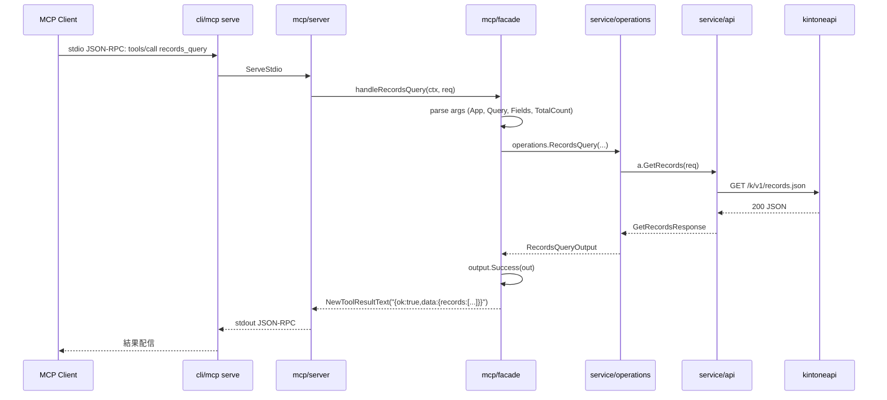

# M06 詳細計画: MCP サーバー雛形 + Facade 層

## メタ
| 項目 | 値 |
|------|---|
| マイルストーン | M06 - MCP サーバー雛形 + Facade 層 |
| 親ロードマップ | plans/kintone-roadmap.md |
| ブランチ | feat/m06-mcp-server-facade |
| 作成日 | 2026-04-29 |
| 想定期間 | 1 セッション |
| 完了条件 | (1) `kintone mcp serve` が stdio JSON-RPC で 6 tools を提供 (2) facade が operations を直接呼び・operations 例外を MCP code にマップ (3) `go test -race -cover ./...` 全 pass (4) golangci-lint クリーン (5) README/CLAUDE/roadmap 更新 |

## ゴール
- mark3labs/mcp-go v0.49.0 を採用し、`internal/mcp/server` で stdio MCP サーバーを構築
- `internal/mcp/facade` に LLM 公開層を実装し、`service/operations` を直接呼ぶ
- 6 つの MCP tools を提供: `apps_search` / `app_describe` / `records_query` / `record_create` / `record_update` / `record_delete`
- `internal/cli/mcp` に `kintone mcp serve` コマンドを追加（CLI ツリー統合）
- M05 ハンドオフ「facade 経路では cli.MapToOutputError が走らない」課題に対し、facade 専用の error mapper を実装
- JSON 固定出力規約を MCP 経路でも維持: `CallToolResult.Content[0].Text` に既存 envelope `{"ok":true,"data":{...}}` / `{"ok":false,"error":{...}}` を埋める

## 非ゴール（M06 ではやらない）
- HTTP/SSE remote MCP（M10）
- OIDC 認証 / multi-user（M10）
- キャッシュ統合（M07）
- 名前解決（M08、--app は int64 のみ）
- dry-run の MCP 露出（CLI ops の概念で MCP には不適、tool description にも記載しない）

---

## 設計方針

### レイヤー
```
MCP client (Claude Desktop 等)
  ↓ stdio JSON-RPC
internal/cli/mcp.serve     ← cobra コマンド
  ↓
internal/mcp/server.NewMCPServer() + AddTool × 6
  ↓
internal/mcp/facade        ← MCP 公開ハンドラ群（tool ごとに分離）
  ↓
internal/service/operations   ← LLM 抽象化（既存 M04/M05 を再利用）
  ↓
internal/service/api          ← API Interface（既存）
  ↓
internal/kintoneapi           ← REST 透過層（apps_search 用に ListApps を新規追加）
```

### Mermaid シーケンス図（records_query を例に）


### 横断的設計判断
- **JSON envelope を MCP でも維持**: `CallToolResult.Content[0].Text` に `output.Success` / `output.Failure` の既存出力をそのまま埋める。CLI と MCP で同じ契約を共有できる
- **tool description は LLM 向けに日本語で詳述**: 入力フィールド意味・必須性・例を明記。LLM が選びやすくする
- **`--app` は int64 のみ**: M08 resolver 完成後に code/name 解決を facade レイヤで挿入予定（DI ポイントを残しておく）
- **テスト hook**: `internal/cli/api` の `NewAPIBuilder` パターンを `internal/cli/mcp` にも踏襲し、in-process client から facade を貫通テストできる

---

## パッケージ構造

```
internal/
  mcp/
    server/
      server.go         ← NewMCPServer / AddTools / RegisterTools
      server_test.go    ← in-process client での 6 tools 往復テスト
    facade/
      facade.go         ← ToolDeps（API/Operations DI）+ tool 登録
      apps_search.go    ← apps_search ハンドラ
      app_describe.go   ← app_describe ハンドラ
      records_query.go  ← records_query ハンドラ
      record_create.go  ← record_create ハンドラ
      record_update.go  ← record_update ハンドラ
      record_delete.go  ← record_delete ハンドラ
      errors.go         ← MCP error mapping（operations.Err* / APIError → MCP code）
      result.go         ← envelope helper（success/failure を CallToolResult に変換）
      *_test.go         ← 各ハンドラ単体テスト（モック operations）
  cli/
    mcp/
      serve.go          ← `kintone mcp serve` cobra コマンド
      helpers.go        ← NewAPIBuilder hook（cli/api と同型）
      serve_test.go     ← stdio buffer での起動テスト
  kintoneapi/
    apps.go             ← GET /k/v1/apps.json（ListApps 新規）+ 既存 GetApp と同居
    apps_test.go        ← テストケース AS-1 〜 AS-N
  service/
    api/
      api.go            ← API interface に ListApps を追加（既存ファイルへ加筆）
      api_test.go       ← Client.ListApps の透過テスト
```

### 公開 API（重要部分）
```go
// internal/kintoneapi/apps.go
type ListAppsRequest struct {
    IDs      []int64
    Codes    []string
    Name     string  // 部分一致
    SpaceIDs []int64
    Limit    int64   // 1-100、0 で省略
    Offset   int64   // 0 で省略
}
type ListAppsResponse struct {
    Apps []AppListEntry `json:"apps"`
}
type AppListEntry struct {
    AppID       string         `json:"appId"`
    Code        string         `json:"code"`
    Name        string         `json:"name"`
    Description string         `json:"description"`
    SpaceID     string         `json:"spaceId"`
    ThreadID    string         `json:"threadId"`
    CreatedAt   string         `json:"createdAt"`
    Creator     map[string]any `json:"creator"`
    ModifiedAt  string         `json:"modifiedAt"`
    Modifier    map[string]any `json:"modifier"`
}
func (c *Client) ListApps(ctx context.Context, req ListAppsRequest) (*ListAppsResponse, error)

// internal/service/api/api.go（既存に追加）
type API interface {
    // ... 既存
    ListApps(ctx context.Context, req kintoneapi.ListAppsRequest) (*kintoneapi.ListAppsResponse, error)
}

// internal/mcp/facade/facade.go
type ToolDeps struct {
    API serviceapi.API
}
func RegisterTools(s *server.MCPServer, deps ToolDeps)
```

### MCP error mapping（facade/errors.go）
M05 ハンドオフの最重要事項。`cli.MapToOutputError` は cobra/cli 依存があり MCP からは使えないため、facade 専用の mapper を新設する。

| エラー種別 | output.Error.Code | コメント |
|-----------|-------------------|---------|
| `operations.ErrInvalidApp` | `INVALID_PARAMS` | App <= 0 |
| `operations.ErrEmptyRecords` | `INVALID_PARAMS` | record/records 未指定 |
| `operations.ErrConflictingRecords` | `INVALID_PARAMS` | record と records 両指定 |
| `operations.ErrMissingUpdateKey` | `INVALID_PARAMS` | id/updateKey 未指定 |
| `operations.ErrConflictingUpdateKey` | `INVALID_PARAMS` | id と updateKey 両指定 |
| `operations.ErrEmptyRecord` | `INVALID_PARAMS` | 更新フィールド空 |
| `operations.ErrEmptyIDs` | `INVALID_PARAMS` | IDs 空 |
| `operations.ErrInvalidID` | `INVALID_PARAMS` | id <= 0 |
| `operations.ErrRevisionsLengthMismatch` | `INVALID_PARAMS` | revisions と ids の長さ不一致 |
| `*kintoneapi.APIError`（Unauthorized） | `KINTONE_UNAUTHORIZED` | |
| 〃（Forbidden） | `KINTONE_FORBIDDEN` | |
| 〃（NotFound） | `KINTONE_NOT_FOUND` | |
| 〃（RateLimited） | `KINTONE_RATE_LIMITED` | retry_after_sec を details に |
| 〃（Validation/ClientError） | `KINTONE_VALIDATION` | |
| 〃（ServerError） | `KINTONE_INTERNAL` | |
| `*url.Error` / `context.DeadlineExceeded` | `KINTONE_NETWORK` | timeout=true |
| facade 自身の引数 parse 失敗 | `INVALID_PARAMS` | message に「missing/invalid <field>」 |
| その他 | `INTERNAL` | |

実装方針:
- `cli/errors.go` の `mapAPIErrorCode` ロジックを facade に複製しない。共通化のために `internal/kintoneapi` に `(e *APIError) OutputCode() string` メソッドを追加するアプローチもあるが、M06 のスコープ拡大を避けるため、facade/errors.go 内にローカル switch で書く（M11 polish 時にリファクタ余地）。
- 戻り値は `*output.Error` 型を直接返す。MCP 層は `mcp.NewToolResultError` ではなく **`mcp.NewToolResultText` で envelope を埋める**（CLI と統一）。
- isError フラグは設定しない（envelope の `ok:false` で十分）。

---

## 6 tools の入出力スキーマ

### apps_search
- **目的**: アプリ ID/code/name/space で kintone アプリを検索する
- **入力**:
  - `ids` (number[], optional): アプリ ID の配列
  - `codes` (string[], optional): アプリコードの配列
  - `name` (string, optional): アプリ名の部分一致
  - `space_ids` (number[], optional): スペース ID の配列
  - `limit` (number, optional, 1-100, default: 100): 最大件数
  - `offset` (number, optional, default: 0): オフセット
- **出力 data**: `{ apps: AppListEntry[] }`
- **エラー**: `KINTONE_*` / `INTERNAL`

### app_describe
- **目的**: 単一アプリの詳細（app + form fields）を返す
- **入力**:
  - `app` (number, required, > 0): アプリ ID
  - `lang` (string, optional): "ja"|"en"|"zh"|"user"|"default"
- **出力 data**: `{ app: AppSummary, fields: {fieldCode: {...}}, revision: string }`
- **エラー**: `INVALID_PARAMS`(app<=0) / `KINTONE_*`

### records_query
- **目的**: kintone クエリでレコード一覧取得
- **入力**:
  - `app` (number, required, > 0)
  - `query` (string, optional): kintone クエリ言語
  - `fields` (string[], optional): 返却フィールドコード配列
  - `total_count` (boolean, optional, default: false)
- **出力 data**: `{ records: [...], total_count?: number }`
- **エラー**: `INVALID_PARAMS` / `KINTONE_*`

### record_create
- **目的**: レコード新規作成（単件 or 複数件）
- **入力**:
  - `app` (number, required, > 0)
  - `record` (object, optional): 単件 fields
  - `records` (object[], optional): 複数件 fields
  - **排他**: `record` ⊕ `records`、片方必須
- **出力 data**: `{ ids: number[], revisions: number[] }`
- **エラー**: `INVALID_PARAMS`(ErrEmptyRecords/ErrConflictingRecords) / `KINTONE_*`

### record_update
- **目的**: レコード単件更新
- **入力**:
  - `app` (number, required, > 0)
  - `id` (number, optional, > 0): 対象レコード ID
  - `update_key_field` (string, optional): updateKey 用フィールドコード
  - `update_key_value` (string, optional): updateKey 用値
  - `revision` (number, optional): 楽観ロック
  - `record` (object, required, len > 0): 更新フィールド
  - **排他**: `id` ⊕ `(update_key_field + update_key_value)`、片方必須
- **出力 data**: `{ revision: number }`
- **エラー**: `INVALID_PARAMS`(ErrMissingUpdateKey/ErrConflictingUpdateKey/ErrEmptyRecord) / `KINTONE_*`

### record_delete
- **目的**: レコード複数件削除
- **入力**:
  - `app` (number, required, > 0)
  - `ids` (number[], required, len > 0, all > 0)
  - `revisions` (number[], optional): 指定時は len(ids) と一致
- **出力 data**: `{ deleted: number }`
- **エラー**: `INVALID_PARAMS`(ErrEmptyIDs/ErrInvalidID/ErrRevisionsLengthMismatch) / `KINTONE_*`

---

## TDD テストケース表

### Phase A: kintoneapi.ListApps（新規エンドポイント）
ファイル: `internal/kintoneapi/apps_test.go`（既存 `app.go` と同居）

| ID | テストケース | 期待 |
|----|-------------|------|
| AS-1 | クエリなし | `GET /k/v1/apps.json` 呼び出し、空クエリ |
| AS-2 | IDs=[1,2,3] | `?ids[0]=1&ids[1]=2&ids[2]=3` |
| AS-3 | Codes=["A","B"] | `?codes[0]=A&codes[1]=B` |
| AS-4 | Name="hr" | `?name=hr` |
| AS-5 | SpaceIDs=[10] | `?spaceIds[0]=10` |
| AS-6 | Limit=50, Offset=10 | `?limit=50&offset=10` |
| AS-7 | Limit=0/Offset=0 | クエリに含めない |
| AS-8 | API レスポンスを Apps に正しくデコード | apps[0].AppID=="1" 等 |
| AS-9 | 401 → APIError(Unauthorized) | 透過 |

### Phase B: service/api 拡張
ファイル: `internal/service/api/api_test.go`（既存に加筆）

| ID | テストケース | 期待 |
|----|-------------|------|
| SA-1 | Client.ListApps が k.ListApps を透過 | テスト用 *kintoneapi.Client で確認（または Mock） |

### Phase C: facade（モック operations / API）
ファイル: `internal/mcp/facade/*_test.go`

| ID | テストケース | 期待 |
|----|-------------|------|
| FE-1 | mapError(operations.ErrInvalidApp) | code=INVALID_PARAMS |
| FE-2 | mapError(operations.ErrEmptyRecords) | code=INVALID_PARAMS |
| FE-3 | mapError(operations.ErrConflictingRecords) | code=INVALID_PARAMS |
| FE-4 | mapError(operations.ErrMissingUpdateKey) | code=INVALID_PARAMS |
| FE-5 | mapError(operations.ErrConflictingUpdateKey) | code=INVALID_PARAMS |
| FE-6 | mapError(operations.ErrEmptyRecord) | code=INVALID_PARAMS |
| FE-7 | mapError(operations.ErrEmptyIDs) | code=INVALID_PARAMS |
| FE-8 | mapError(operations.ErrInvalidID) | code=INVALID_PARAMS |
| FE-9 | mapError(operations.ErrRevisionsLengthMismatch) | code=INVALID_PARAMS |
| FE-10 | mapError(APIError 401) | code=KINTONE_UNAUTHORIZED |
| FE-11 | mapError(APIError 429 + RetryAfter) | code=KINTONE_RATE_LIMITED, details.retry_after_sec |
| FE-12 | mapError(*url.Error timeout) | code=KINTONE_NETWORK, details.timeout=true |
| FE-13 | mapError(context.DeadlineExceeded) | code=KINTONE_NETWORK |
| FE-14 | mapError(unknown error) | code=INTERNAL |
| FA-1 | apps_search 成功 (空 args) | envelope ok:true, data.apps |
| FA-2 | apps_search 成功 (ids=[1,2]) | API.ListAppsRequest.IDs=[1,2] |
| FA-3 | apps_search 失敗 (API 500) | envelope ok:false, code=KINTONE_INTERNAL |
| FD-1 | app_describe 成功 | envelope ok:true, data.app/fields/revision |
| FD-2 | app_describe app=0 | envelope ok:false, code=INVALID_PARAMS |
| FQ-1 | records_query 成功 (totalCount=true) | data.total_count=int64 |
| FQ-2 | records_query app=0 | code=INVALID_PARAMS |
| FQ-3 | records_query API 401 | code=KINTONE_UNAUTHORIZED |
| FC-1 | record_create 単件 | data.ids/revisions |
| FC-2 | record_create record と records 両指定 | code=INVALID_PARAMS |
| FC-3 | record_create どちらも未指定 | code=INVALID_PARAMS |
| FU-1 | record_update id 経路 | data.revision |
| FU-2 | record_update updateKey 経路 | data.revision |
| FU-3 | record_update id と updateKey 両指定 | code=INVALID_PARAMS |
| FU-4 | record_update record 空 | code=INVALID_PARAMS |
| FX-1 | record_delete IDs=[1,2] | data.deleted=2 |
| FX-2 | record_delete IDs=[] | code=INVALID_PARAMS |
| FX-3 | record_delete revisions 長さ不一致 | code=INVALID_PARAMS |

### Phase D: mcp/server（in-process client 結合テスト）
ファイル: `internal/mcp/server/server_test.go`

| ID | テストケース | 期待 |
|----|-------------|------|
| MS-1 | NewMCPServer + RegisterTools 後に ListTools | 6 tools 全部含まれる |
| MS-2 | in-process client で apps_search 呼び出し | result.Content[0] が JSON envelope text |
| MS-3 | in-process client で app_describe 呼び出し | 成功 envelope |
| MS-4 | in-process client で records_query 呼び出し | 成功 envelope |
| MS-5 | in-process client で record_create 呼び出し | 成功 envelope（モック API） |
| MS-6 | in-process client で record_update 呼び出し | 成功 envelope |
| MS-7 | in-process client で record_delete 呼び出し | 成功 envelope |
| MS-8 | 不正引数（app="abc"）でも JSON envelope を返す（panic しない） | ok:false, INVALID_PARAMS |

### Phase E: cli/mcp（cobra）
ファイル: `internal/cli/mcp/serve_test.go`

| ID | テストケース | 期待 |
|----|-------------|------|
| CM-1 | `kintone mcp` 親コマンドが登録されている | `kintone --help` に "mcp" 表示 |
| CM-2 | `kintone mcp serve --help` が表示できる | exit 0、stdout に description |
| CM-3 | NewAPIBuilder hook が cli/api と同型で差し替え可能 | テストで stub 注入できる |

stdio で「実際に JSON-RPC を 1 往復させる」テストは mark3labs 側のロジックなので 1 本に絞り、
ハンドラ層は in-process client（Phase D）で網羅する方針とする。

---

## 実装順序（TDD）

1. **Phase A**: `kintoneapi/apps.go` + `apps_test.go`（Red→Green）
2. **Phase B**: `service/api/api.go` に `ListApps` を追加（既存 `Client` を拡張）+ test
3. **Phase C**: `mcp/facade/errors.go` + `*_test.go`（mapError の網羅）
4. **Phase C**: `mcp/facade/result.go` + `apps_search.go` + `apps_search_test.go`（モック API）
5. **Phase C**: 残り 5 tools のハンドラと test を 1 つずつ
6. **Phase D**: `mcp/server/server.go` + `server_test.go`（in-process client）
7. **Phase E**: `cli/mcp/serve.go` + `helpers.go` + `serve_test.go`
8. cli/root.go に `mcp` サブコマンド統合
9. `go test -race -cover ./...` 全 pass / `golangci-lint run` クリア / `go vet`
10. README / CLAUDE / roadmap 更新
11. 段階的コミット（Conventional Commits 日本語）

各 Phase ごとに Red→Green→Refactor を厳守する。

---

## モック戦略

- `service/api.API` は **interface** なので、facade テストでは `mockAPI` を `*_test.go` 内に定義（M04/M05 のテストで使った構造を踏襲）。
- mockAPI に各エンドポイントのフックを持たせ、テストごとに「何を返すか」を制御する。
- mcp-go の `client.NewInProcessClient(s)` を使い、stdio 不要で server 動作を検証。

```go
// internal/mcp/facade/facade_test.go の例
type mockAPI struct {
    listAppsFn func(ctx context.Context, req kintoneapi.ListAppsRequest) (*kintoneapi.ListAppsResponse, error)
    // ... 他 6 メソッド
}
func (m *mockAPI) ListApps(...) {...}
// ... 他
```

---

## エラーマッピング実装スケッチ

```go
// internal/mcp/facade/errors.go
package facade

import (
    "context"
    "errors"
    "net/url"

    "github.com/youyo/kintone/internal/kintoneapi"
    "github.com/youyo/kintone/internal/output"
    "github.com/youyo/kintone/internal/service/operations"
)

// MapError は facade 経路の任意 error を *output.Error にマップする。
// CLI 経路の cli.MapToOutputError と同じ意味論を持ちつつ、cobra/USAGE 概念は持たない。
func MapError(err error) *output.Error {
    if err == nil {
        return nil
    }
    // operations.* 系 → INVALID_PARAMS
    switch {
    case errors.Is(err, operations.ErrInvalidApp),
         errors.Is(err, operations.ErrEmptyRecords),
         errors.Is(err, operations.ErrConflictingRecords),
         errors.Is(err, operations.ErrMissingUpdateKey),
         errors.Is(err, operations.ErrConflictingUpdateKey),
         errors.Is(err, operations.ErrEmptyRecord),
         errors.Is(err, operations.ErrEmptyIDs),
         errors.Is(err, operations.ErrInvalidID),
         errors.Is(err, operations.ErrRevisionsLengthMismatch):
        return &output.Error{Code: "INVALID_PARAMS", Message: err.Error()}
    }
    // *kintoneapi.APIError
    var apiErr *kintoneapi.APIError
    if errors.As(err, &apiErr) {
        details := map[string]any{"http_status": apiErr.HTTPStatus}
        if apiErr.Code != "" {
            details["kintone_code"] = apiErr.Code
        }
        if apiErr.ID != "" {
            details["kintone_id"] = apiErr.ID
        }
        if apiErr.RetryAfter > 0 {
            details["retry_after_sec"] = int(apiErr.RetryAfter.Seconds())
        }
        return &output.Error{
            Code:    apiErrorCode(apiErr),
            Message: apiErr.Error(),
            Details: details,
        }
    }
    // url.Error / context error
    var urlErr *url.Error
    if errors.As(err, &urlErr) {
        return &output.Error{
            Code:    "KINTONE_NETWORK",
            Message: urlErr.Error(),
            Details: map[string]any{"timeout": urlErr.Timeout()},
        }
    }
    if errors.Is(err, context.DeadlineExceeded) || errors.Is(err, context.Canceled) {
        return &output.Error{
            Code:    "KINTONE_NETWORK",
            Message: err.Error(),
            Details: map[string]any{"timeout": true},
        }
    }
    return &output.Error{Code: "INTERNAL", Message: err.Error()}
}
```

`apiErrorCode` は cli/errors.go の `mapAPIErrorCode` と同等内容を facade 内にローカルで持つ（M11 polish 時に共通パッケージへ移動候補）。

---

## envelope helper（result.go）

```go
// internal/mcp/facade/result.go
func successResult(data any) (*mcp.CallToolResult, error) {
    payload, err := output.Success(data)
    if err != nil {
        return nil, err
    }
    return mcp.NewToolResultText(string(payload)), nil
}

func failureResult(e *output.Error) (*mcp.CallToolResult, error) {
    payload, err := output.Failure(e)
    if err != nil {
        return nil, err
    }
    // isError フラグは設定しない: envelope の ok:false で十分
    return mcp.NewToolResultText(string(payload)), nil
}

func errorResult(err error) (*mcp.CallToolResult, error) {
    return failureResult(MapError(err))
}
```

戻り値の `error` を **常に nil** にすることで、mcp-go の transport 層に「正しいレスポンス」として渡し、payload は body に格納する。tool 内エラーは MCP プロトコルエラーではなく business error として扱う方針。

---

## cli/mcp 構造（cli/api 踏襲）

```go
// internal/cli/mcp/helpers.go
package mcp

import (
    serviceapi "github.com/youyo/kintone/internal/service/api"
    "github.com/youyo/kintone/internal/config"
    "github.com/youyo/kintone/internal/kintoneapi"
)

type LoaderInput struct {
    CLI config.CLIConfig
}
var NewAPIBuilder = defaultNewAPI
func defaultNewAPI(in LoaderInput) (serviceapi.API, error) { /* cli/api と同じ */ }

// internal/cli/mcp/serve.go
func newServeCmd() *cobra.Command {
    return &cobra.Command{
        Use: "serve",
        Short: "MCP サーバーを stdio で起動する",
        RunE: func(cmd *cobra.Command, args []string) error {
            api, err := buildAPI(cmd)
            if err != nil { return err }
            srv := mcpserver.New(api)            // internal/mcp/server.New
            return mcpserver.ServeStdio(srv)     // ServeStdio をブロック
        },
    }
}
```

---

## 動作確認方針

### in-process client（推奨・高速）
- `client.NewInProcessClient(s)` で server を直結
- 各 tool に対し `Initialize → CallTool` の 1 往復をテスト
- 成功・失敗 envelope を JSON パースして検証

### stdio buffer（補完・1 本のみ）
- mcp-go 自身のテストではないので、cli/mcp でハンドラ層が呼び出されることを確認する程度
- `cmd.SetIn(stdin)` `cmd.SetOut(stdout)` で bytes.Buffer 経由
- 「unknown command エラーが USAGE になる」「--help が exit 0 で description 出力」レベル

### マニュアルテスト（実機/Claude Desktop）
- 本マイルストーンでは必須としない（M11 で実機検証）

---

## リスク評価

| リスク | 影響 | 対策 |
|------|-----|-----|
| mcp-go v0.49.0 の Go 1.26 互換性問題 | 中 | go mod tidy 後に go test ./... で即検証。問題があれば 1 つ前の安定版に戻す |
| mcp-go の API 破壊的変更（将来） | 中 | 単一の薄い `internal/mcp/server` で吸収。facade は mcp-go API に直接依存するが箇所限定 |
| facade テスト網羅不足 | 高 | テスト表で 32 項目以上を明記、in-process client で実プロトコル経路も網羅 |
| operations.Err* の facade マッピング漏れ | 高 | エラー一覧表で完全列挙、FE-1〜9 で網羅テスト |
| mcp-go の依存パッケージ追加 | 低 | go.sum を必ず commit、CI で `go mod download` のみ確認 |
| CLI/MCP で envelope が二重エンコードされる | 中 | result.go で **string(payload)** をそのまま埋める。json.Marshal を 2 重にしない |
| LLM が `ok:false` を見ずに「成功」と誤解 | 低 | tool description に「結果は {ok:true,data} or {ok:false,error} の JSON 文字列」と明記 |

---

## 完了条件チェックリスト

- [ ] kintoneapi.ListApps 実装 + テスト（AS-1〜9）
- [ ] service/api.API に ListApps を追加 + テスト
- [ ] mcp/facade/errors.go + テスト（FE-1〜14）
- [ ] mcp/facade に 6 ハンドラ実装 + テスト（FA-/FD-/FQ-/FC-/FU-/FX-）
- [ ] mcp/server.New / RegisterTools + in-process テスト（MS-1〜8）
- [ ] cli/mcp serve コマンド + テスト（CM-1〜3）
- [ ] cli/root.go に mcp サブコマンド統合
- [ ] go test -race -cover ./... 全 pass
- [ ] golangci-lint run / go vet クリア
- [ ] go.mod / go.sum 更新コミット
- [ ] README.md / CLAUDE.md / plans/kintone-roadmap.md 更新
- [ ] Conventional Commits（日本語）で段階的にコミット
