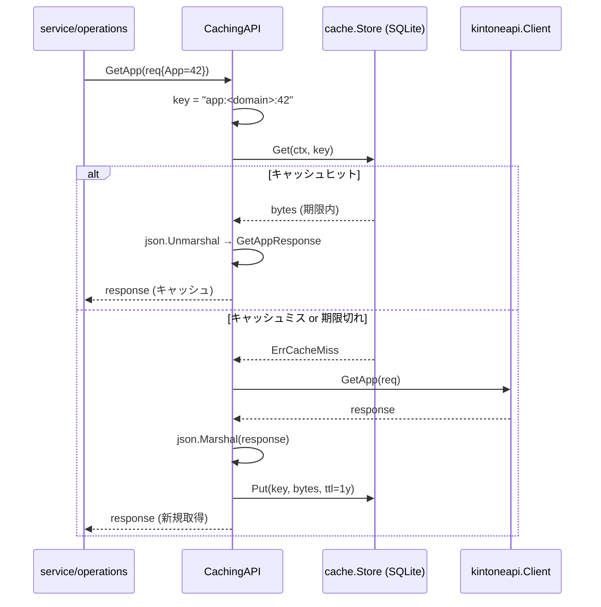

# M07 詳細計画: SQLite キャッシュ + TokenStore

## メタ
| 項目 | 値 |
|------|---|
| マイルストーン | M07 - SQLite キャッシュ + TokenStore |
| 親ロードマップ | plans/kintone-roadmap.md |
| ブランチ | feat/m07-sqlite-cache-tokenstore |
| 作成日 | 2026-04-29 |
| 想定期間 | 1 セッション |
| 完了条件 | (1) `internal/cache` が SQLite ベースの KV キャッシュを提供（TTL=1 年・WAL モード） (2) `internal/tokenstore` が `Domain+PrincipalID+AuthType` キーで Get/Put/Delete を提供 (3) `service/api` を decorator パターンで包む `CachingAPI` が apps/fields/list_apps を透過キャッシュ (4) CLI: `kintone cache clear` / `kintone cache stats` (5) `go test -race -cover ./...` 全 pass、golangci-lint クリーン (6) README/CLAUDE/roadmap を M07 完了状態に更新 |

## ゴール
- Pure Go SQLite ドライバ `modernc.org/sqlite` を採用し、cgo を不要にする（4 配布形態 = host/Homebrew/Docker/ghcr.io 全てで cgo 制約なし）
- `internal/cache` パッケージで KV キャッシュ（key/value/expires_at/created_at）を提供
- `internal/tokenstore` パッケージで認証情報の永続ストアを提供（M09 OAuth・M10 idproxy で活用）
- `service/api.API` を `CachingAPI` でラップする decorator パターンを確立。M04/M05/M06 の interface に手を入れずキャッシュを差し込める
- TTL 戦略: `apps`=1 年 / `fields`=1 年 / `list_apps`=1 年 / records 系=不キャッシュ（write 操作との不整合回避）
- CLI: `kintone cache clear [--scope=apps|fields|all]` / `kintone cache stats` を JSON 規約で出力
- キャッシュパス決定ロジック: `KINTONE_CACHE_PATH` env > デフォルト `$HOME/.cache/kintone/cache.db`（container 利用時は Dockerfile 側で `ENV KINTONE_CACHE_PATH=/data/kintone/cache.db` を明示。CLI 側に `/data` 自動検出ヒューリスティックは持たない＝予測可能性優先 / advisor 指摘 #1）
- 並行アクセス安全: SQLite WAL モード + busy_timeout 5s、トランザクション境界明確化
- ファイル権限 0o600（鍵 + キャッシュ両方）

## 非ゴール（M07 ではやらない）
- 名前解決 Resolver（M08）
- Resolver キャッシュ整合性（M08 で Resolver と統合）
- TokenStore の本格的暗号化（M09 OAuth で keyring 統合 / 本 M07 は plaintext + パーミッション 0o600 のみ）
- write 操作後の cache invalidation（records 系は元々非キャッシュ。apps/fields は 1 年 TTL を許容）
- `kintone cache list` などの読み取り系（M11 polish 候補）
- config.toml への cache_path 追加（M02 拡張になるためロードマップに追加せず env のみで運用）

---

## 設計方針

### レイヤー（更新版）
```
CLI / MCP
   ↓
facade        ← MCP 公開層（mcp/facade）
   ↓
operations    ← LLM 向け抽象化（service/operations）
   ↓
api (interface)  ← service/api.API
   ├─ Client (kintoneapi 透過)         [M04/M05/M06]
   └─ CachingAPI (decorator)           [M07 新規]   ← apps/fields/list_apps をキャッシュ
       ↓
   client                              ← kintoneapi.Client
       ↓
   cache (cache.Store)                 [M07 新規]   ← SQLite KV
   tokenstore (tokenstore.Store)       [M07 新規]   ← SQLite tokens テーブル
```

### Mermaid シーケンス図（CachingAPI が GetApp をキャッシュ）


### 横断的設計判断
- **Decorator パターン**: `CachingAPI` は `service/api.API` 自身を実装し、内部に upstream API を保持。read 系のうち TTL=1 年の `GetApp` / `GetFormFields` / `ListApps` のみキャッシュ、それ以外（GetRecords / GetRecord / 書き込み 3 種）は upstream へ素通し。
- **キーの設計**: キャッシュキーには **必ず先頭に `v1:` バージョンプレフィックスを付与する**（advisor 指摘 #3）。形式が変わったら `v2:` に上げて旧キャッシュを暗黙無効化できる。domain も必ず含めて複数 profile 切り替え時のクロス汚染を防ぐ。例:
  - `v1:app:<domain>:<appid>`
  - `v1:fields:<domain>:<appid>:<lang>`（lang 未指定時は `default` 文字列）
  - `v1:list_apps:<domain>:<args_hash>`
- **list_apps の args ハッシュ**: `(offset, limit, ids[], codes[], name, spaceIds[])` を正規化（slice はソート、nil/空配列は同一視）して JSON シリアライズ → SHA256 → 先頭 16 hex 文字。実装は `internal/service/api/caching.go` 内の `listAppsCacheKey()` ヘルパに集約しテストする
- **JSON シリアライズ**: 値は kintoneapi のレスポンス struct を `encoding/json` でそのまま保存
- **書き込み無効化は M07 ではやらない**: apps/fields は 1 年 TTL なので「変更されたら手動で `kintone cache clear`」を許容。write は records 系のみで apps/fields は kintone 上で稀
- **TokenStore の暗号化粒度**: 本 M07 は plaintext + ファイル 0o600 + ディレクトリ 0o700。M09 で keyring 統合・暗号化を上乗せ可能な interface を残す
- **DB ファイル分離**（advisor 指摘 #2）: `cache.db` と `tokens.db` を**別ファイル**にする。理由: (1) ライフサイクルが異なる（cache=TTL あり / tokens=明示削除のみ） (2) `cache clear --scope=all` が tokens を巻き込まない (3) WAL ロック競合を物理分離 (4) バックアップ/権限管理が独立。それぞれ `internal/cache.Open(cachePath)` / `internal/tokenstore.Open(tokensPath)` で個別 `*sql.DB` を持つ。tokens のデフォルトパスは `$HOME/.cache/kintone/tokens.db`（同ディレクトリ内）
- **DB ファイルの所有者作成**: 親ディレクトリが存在しない場合のみ `MkdirAll(0o700)` し、既存なら touch しない（既存パーミッションを尊重）
- **テストは `t.TempDir()` でファイルベース**: in-memory モード（`:memory:`）は WAL モード切替が効かないので避け、TempDir に実 DB を作って WAL も含めて検証する。実装初期（Step 5 終了直後）に C-15 の 100 並列 Put を smoke run し、modernc.org/sqlite + WAL + busy_timeout=5000 で即落ちしないことを確認。失敗する場合は busy_timeout を 10000 に伸ばす（advisor 加筆）
- **テスト方針**: `NewCachingAPI` が `API` 型を返すため、テストは「副作用観察」のみで CA-1〜CA-12 を検証する。具体的には `mockUpstreamAPI`（メソッド呼び出し回数を数える）+ 実 `cache.Store`（`t.TempDir()`）の組み合わせで、private フィールド観察を不要化する
- **テスト hook**: cli/api / cli/ops / cli/mcp の `NewAPIBuilder` をラップして `CachingAPI(upstream, store)` を返す。M07 では「キャッシュを有効化するか」のスイッチは default ON、env `KINTONE_CACHE_DISABLE=1` で無効化（advisor 指摘予防）
- **`KINTONE_CACHE_DISABLE` のスコープ境界**（advisor 加筆 B）:
  - 適用対象: `cli/api` / `cli/ops` / `cli/mcp` の `defaultNewAPI` のみ。1 のときは `CachingAPI` を skip して upstream を直返し
  - 適用外: `kintone cache stats` / `kintone cache clear` は **env を無視して常に Store を直接操作**（cache サブコマンドの目的が Store 操作そのもの）。実装は `cli/cache/helpers.go` で env を一切読まない
- **`--scope=invalid` の処理**（advisor 加筆 C）: cobra のネイティブフラグ機構には enum 検証がないため、cli/ops 既存パターンに揃え `internal/cli/clierr.NewUsageError("--scope must be one of: apps, fields, list_apps, all")` を `RunE` 内で返す。root の `MapToOutputError` が `*clierr.UsageError` を `USAGE` コードへ変換する

---

## SQLite ドライバ採用判断

| 候補 | cgo | 配布影響 | パフォーマンス | 安定性 | 採否 |
|------|-----|----------|----------------|--------|------|
| `modernc.org/sqlite` | 不要（pure Go） | Homebrew/Docker/ghcr.io/host 全て無修正で動作。クロスコンパイル容易（M11 GoReleaser で必須） | ネイティブ比 1.2-1.5 倍程度遅いが、KV キャッシュには十分 | 1.x 系で安定。kubernetes 等大規模 OSS で採用実績あり | **採用** |
| `mattn/go-sqlite3` | 必要 | クロスコンパイルが煩雑（CGO_ENABLED=1 + ターゲットごとの C toolchain 必要）。Docker alpine 等では追加 dep が必要 | ネイティブ速度 | 老舗安定 | 不採用 |

**結論**: M11 で配布する 4 形態（host バイナリ・Homebrew・Docker・ghcr.io）全てで動かすには cgo を避けたい。`modernc.org/sqlite` は GoReleaser のクロスコンパイルがそのまま通る。KV キャッシュ用途では性能差は無視できる。

---

## パッケージ構造

```
internal/
  cache/
    store.go            ← cache.Store interface + ErrCacheMiss
    sqlite.go           ← SQLite 実装（modernc.org/sqlite）
    schema.sql          ← cache テーブル DDL（CREATE TABLE IF NOT EXISTS）
    path.go             ← デフォルトパス決定（host: ~/.cache/kintone/cache.db, container: /data/kintone/cache.db, env override）
    ttl.go              ← 定数（TTLApps / TTLFields / TTLListApps = 365 日）
    *_test.go
  tokenstore/
    store.go            ← Store interface + Token struct + ErrNotFound
    sqlite.go           ← SQLite 実装（cache と同じ DB ファイルに tokens テーブルを同居）
    *_test.go
  service/
    api/
      caching.go        ← CachingAPI（service/api.API decorator）
      caching_test.go   ← 各メソッドのキャッシュ命中/ミス/期限切れテスト
  cli/
    cache/
      root.go           ← `kintone cache` 親コマンド
      clear.go          ← `kintone cache clear [--scope=apps|fields|all]`
      stats.go          ← `kintone cache stats`
      helpers.go        ← cache.Store 構築（path 決定 + Open）
      *_test.go
```

### 公開 API（重要部分）

```go
// internal/cache/store.go
package cache

import (
    "context"
    "errors"
    "time"
)

var ErrCacheMiss = errors.New("cache: miss")

type Store interface {
    Get(ctx context.Context, key string) ([]byte, error)         // miss は ErrCacheMiss
    Put(ctx context.Context, key string, value []byte, ttl time.Duration) error
    Delete(ctx context.Context, key string) error
    DeleteByPrefix(ctx context.Context, prefix string) (int, error)  // clear 用
    Stats(ctx context.Context) (Stats, error)
    Close() error
}

type Stats struct {
    DBPath       string    `json:"db_path"`
    DBExists     bool      `json:"db_exists"`
    DBSizeBytes  int64     `json:"db_size_bytes"`
    Total        int       `json:"total"`
    Expired      int       `json:"expired"`
    OldestStored time.Time `json:"oldest_stored,omitempty"`
}
```

```go
// internal/cache/ttl.go
package cache

import "time"

const (
    TTLApps     = 365 * 24 * time.Hour
    TTLFields   = 365 * 24 * time.Hour
    TTLListApps = 365 * 24 * time.Hour
)
```

```go
// internal/cache/path.go
package cache

// DefaultCachePath はキャッシュ DB の既定パスを返す（advisor 指摘 #1）。
// 優先順:
//   1. KINTONE_CACHE_PATH 環境変数
//   2. $HOME/.cache/kintone/cache.db
// container 利用時は Dockerfile 側で `ENV KINTONE_CACHE_PATH=/data/kintone/cache.db` を明示する。
// CLI 内で /data の自動検出は行わない（予測可能性優先）。
func DefaultCachePath(getenv func(string) string, userHomeDir func() (string, error)) (string, error)

// DefaultTokensPath はトークン DB の既定パスを返す（cache とは別ファイル / advisor 指摘 #2）。
// 優先順:
//   1. KINTONE_TOKENS_PATH 環境変数
//   2. $HOME/.cache/kintone/tokens.db
func DefaultTokensPath(getenv func(string) string, userHomeDir func() (string, error)) (string, error)
```

```go
// internal/cache/sqlite.go
type SQLiteStore struct{ /* *sql.DB */ }

// Open は DB ファイルを開く（不在時は作成・親ディレクトリ作成・スキーマ適用）。
// 通常コマンド（CachingAPI 経由）はこれを使う。
func Open(path string) (*SQLiteStore, error)   // MkdirAll(0o700) + os.Chmod(0o600)
                                                // PRAGMA journal_mode=WAL; busy_timeout=5000;

// OpenIfExists はファイルが存在する場合のみ Open する（advisor 加筆 A）。
// 不在時は (nil, false, nil) を返す。`kintone cache stats` / `cache clear` の
// 「read/clear-only でファイル auto-create しない」要件を実現するための入口。
func OpenIfExists(path string) (store *SQLiteStore, exists bool, err error)
```

```go
// internal/tokenstore/store.go
package tokenstore

import (
    "context"
    "errors"
    "time"
)

var ErrNotFound = errors.New("tokenstore: not found")

type AuthType string

const (
    AuthTypeAPIToken AuthType = "api-token"
    AuthTypeOAuth    AuthType = "oauth"
)

type Token struct {
    Domain       string
    PrincipalID  string  // provider:sub（OAuth）or "" + AuthTypeAPIToken
    AuthType     AuthType
    APIToken     string  // AuthType=api-token のとき
    AccessToken  string  // AuthType=oauth のとき
    RefreshToken string  // AuthType=oauth のとき
    ExpiresAt    time.Time
    UpdatedAt    time.Time
}

type Store interface {
    Get(ctx context.Context, domain, principalID string, t AuthType) (*Token, error)  // miss は ErrNotFound
    Put(ctx context.Context, tok Token) error
    Delete(ctx context.Context, domain, principalID string, t AuthType) error
    Close() error
}
```

```go
// internal/service/api/caching.go
package api

import (
    "context"
    "encoding/json"

    "github.com/youyo/kintone/internal/cache"
    "github.com/youyo/kintone/internal/kintoneapi"
)

// CachingAPI は service/api.API を decorator として実装する。
// apps / fields / list_apps を 1 年 TTL で SQLite cache に保存。
// 残り（records 系・write 系）は upstream に素通し。
type CachingAPI struct {
    upstream API
    store    cache.Store
    domain   string  // キャッシュキーに含める（multi-domain 対応）
}

// NewCachingAPI は decorator を構築する。
// store == nil のときは upstream をそのまま返す（advisor 指摘 #4）。
// 戻り値の API 型を CLI helpers がそのまま使えるため、フィーチャートグル
// (KINTONE_CACHE_DISABLE=1) と無 cache 環境を同一パスで処理できる。
func NewCachingAPI(upstream API, store cache.Store, domain string) API {
    if store == nil {
        return upstream
    }
    return &CachingAPI{upstream: upstream, store: store, domain: domain}
}

// Read 系のうち TTL=1 年のもの:
// (c *CachingAPI) GetApp(ctx, req) → cache lookup → miss なら upstream → put
// (c *CachingAPI) GetFormFields(ctx, req) → 同様
// (c *CachingAPI) ListApps(ctx, req) → 同様

// Read 系（records 系）:
// GetRecords / GetRecord → upstream 素通し（records は変動するため非キャッシュ）

// Write 系:
// InsertRecords / UpdateRecord / DeleteRecords → upstream 素通し
```

### スキーマ設計

```sql
-- internal/cache/schema.sql
CREATE TABLE IF NOT EXISTS cache (
    key        TEXT PRIMARY KEY,
    value      BLOB NOT NULL,
    expires_at INTEGER NOT NULL,    -- Unix epoch nano
    created_at INTEGER NOT NULL
);
CREATE INDEX IF NOT EXISTS idx_cache_expires ON cache(expires_at);

CREATE TABLE IF NOT EXISTS tokens (
    domain        TEXT NOT NULL,
    principal_id  TEXT NOT NULL,
    auth_type     TEXT NOT NULL,    -- "api-token" | "oauth"
    api_token     TEXT NOT NULL DEFAULT '',
    access_token  TEXT NOT NULL DEFAULT '',
    refresh_token TEXT NOT NULL DEFAULT '',
    expires_at    INTEGER NOT NULL DEFAULT 0,
    updated_at    INTEGER NOT NULL,
    PRIMARY KEY (domain, principal_id, auth_type)
);
```

### キャッシュパス決定ロジック（advisor 指摘 #1 反映）

| ソース | 値 | 採用優先 |
|--------|------|---------|
| `KINTONE_CACHE_PATH` env | 任意の絶対パス | 1（最優先） |
| デフォルト | `$HOME/.cache/kintone/cache.db` 固定 | 2 |

**ヒューリスティック（`/data` 自動検出）は採用しない**:
- macOS dev machine で `/data` が偶然存在するケースを誤検出するリスク
- Linux サーバで第三者が `/data` を作っただけで挙動が変わる
- 本番動作の予測可能性を優先

**コンテナ運用方針**: M11 の Dockerfile で `ENV KINTONE_CACHE_PATH=/data/kintone/cache.db` を明示記述する。仕様書記載の container パスは「コンテナ運用時の推奨デフォルト」であり、CLI 内の自動検出ではない。

トークン DB も同様に `KINTONE_TOKENS_PATH` env > `$HOME/.cache/kintone/tokens.db`。

---

## TDD 設計

### テストケース表

#### `internal/cache` パッケージ

| ID | 観点 | 入力 | 期待出力 |
|----|------|------|----------|
| C-1 | DefaultPath: env override | `KINTONE_CACHE_PATH=/foo/bar.db` | `/foo/bar.db` |
| C-2 | DefaultPath: env 空 + HOME=/h | env なし | `/h/.cache/kintone/cache.db`（自動検出ヒューリスティックなし / advisor 指摘 #1）|
| C-3 | DefaultPath: HOME 取得失敗 | UserHomeDir error | error 伝播 |
| C-4 | Open: 親ディレクトリ自動作成 | 存在しない `/tmp/.../cache.db` | DB 作成 + ディレクトリ 0o700 |
| C-5 | Open: 既存 DB 再オープン | 既存 .db ファイル | 既存スキーマ維持・WAL 有効 |
| C-6 | Open: invalid path | 書込不可な場所 | error |
| C-7 | Put → Get round trip | 任意の key, value, ttl=1h | Get で同 value |
| C-8 | Get: 未存在キー | 存在しない key | `ErrCacheMiss` |
| C-9 | Get: 期限切れ | ttl=1ns sleep 後 | `ErrCacheMiss`（自動削除しても可） |
| C-10 | Put: 上書き | 同 key で 2 回 Put | 後勝ち |
| C-11 | Delete | Put 後 Delete → Get | `ErrCacheMiss` |
| C-12 | DeleteByPrefix | `v1:app:foo:1`,`v1:app:foo:2`,`v1:fields:foo:1` を Put → `DeleteByPrefix("v1:app:foo:")` | 戻り値 2、Get で残存は `v1:fields:foo:1` のみ |
| C-13 | Stats | 3 件 Put（うち 1 件期限切れ） | `Total=3, Expired=1` |
| C-14 | TTL 定数 | `TTLApps == 365*24h` 等 | 値検証 |
| C-15 | 並行 Put | 100 goroutine で同時 Put | データ破損なし（WAL + busy_timeout） |
| C-16 | Close 後の操作 | Close 後 Get | error |
| C-17 | DB ファイル権限 | Open 直後 | 0o600 |
| C-18 | 親ディレクトリ権限 | Open 直後 | 0o700 |

#### `internal/tokenstore` パッケージ

| ID | 観点 | 入力 | 期待出力 |
|----|------|------|----------|
| T-1 | Put → Get | api-token Token | 同一値復元 |
| T-2 | Get: 未存在 | 存在しないキー | `ErrNotFound` |
| T-3 | Put: 上書き | 同キーで API Token 更新 | 後勝ち + UpdatedAt 更新 |
| T-4 | Delete | Put 後 Delete → Get | `ErrNotFound` |
| T-5 | キー一意性 | 同 domain・同 principal だが AuthType 異 | 別エントリとして両立 |
| T-6 | OAuth Token | access/refresh/expires_at 全部 | 復元一致 |
| T-7 | UpdatedAt 自動 | Put 時 UpdatedAt=0 でも | 現在時刻が保存される |
| T-8 | 並行 Put | 同キーで 10 goroutine Put | error なし、最後の値が残る |

#### `internal/service/api.CachingAPI`

| ID | 観点 | シナリオ | 期待 |
|----|------|---------|------|
| CA-0 | キー prefix `v1:` | 全 cached メソッド | キーが必ず `v1:` で始まる（advisor 指摘 #3）|
| CA-1 | GetApp: ミス | 初回 | upstream 呼ばれ、cache に Put、key=`v1:app:<domain>:<appid>` |
| CA-2 | GetApp: ヒット | 2 回目 | upstream 呼ばれず、cache から復元 |
| CA-3 | GetApp: 期限切れ | TTL 0 で Put 済み | upstream 再呼出 |
| CA-4 | GetApp: 異 domain 分離 | domain="a" と domain="b" で同 AppID | 別エントリ |
| CA-5 | GetFormFields: ヒット/ミス | 同上 | 同上 |
| CA-6 | ListApps: ヒット/ミス（args 違いで別エントリ） | offset/limit 違い | 別エントリ |
| CA-6b | listAppsCacheKey 正規化 | `(ids=[2,1])` と `(ids=[1,2])` | 同一キー（slice ソート / advisor 指摘 #6）|
| CA-6c | listAppsCacheKey: nil vs 空配列 | `ids=nil` と `ids=[]` | 同一キー |
| CA-7 | GetRecords: 素通し | キャッシュ介入なし | upstream 必ず呼ばれる |
| CA-8 | InsertRecords: 素通し | キャッシュ介入なし | upstream 必ず呼ばれる |
| CA-9 | upstream エラー時 | upstream が *kintoneapi.APIError | エラー伝播、cache に Put しない |
| CA-10 | cache.Get エラー（miss 以外）| store が IO エラー返す | upstream にフォールバック（fail-open） |
| CA-11 | cache.Put エラー | upstream 成功・Put 失敗 | レスポンスは返す（fail-silent on Put）|
| CA-12 | nil store | `NewCachingAPI(up, nil, "d")` | upstream をそのまま返す（戻り値が `API` 型なので呼び出し側は等価に扱える / advisor 指摘 #4） |

#### `internal/cli/cache`

| ID | 観点 | コマンド | 期待 |
|----|------|---------|------|
| CL-1 | `cache stats` 成功 | DB に 3 件 | `{"ok":true,"data":{"total":3,...}}` |
| CL-2 | `cache stats` DB 不在 | DB ファイルなし | `{"ok":true,"data":{"db_path":"...","db_exists":false,"total":0,...}}` を返し、**DB ファイルは作成しない**（advisor 指摘 #5: read-only コマンドの副作用排除）|
| CL-3 | `cache clear --scope=apps` | apps/fields 各 1 件 | apps のみ削除、fields 残存 |
| CL-4 | `cache clear --scope=fields` | 同上 | fields のみ削除 |
| CL-5 | `cache clear --scope=all` | 同上 | 全削除 |
| CL-6 | `cache clear --scope=invalid` | 不正 scope | USAGE エラー |
| CL-7 | `cache clear` デフォルト scope | 引数なし | デフォルト=`all` で全削除 |

### Red → Green → Refactor 順序

1. `internal/cache/store.go` の interface・error 定義（コンパイルだけ通す）
2. `path_test.go` (C-1〜C-3) → `path.go` 実装
3. `ttl_test.go` (C-14) → `ttl.go` 実装
4. `sqlite_test.go` Open 系 (C-4〜C-6, C-17, C-18) → `sqlite.go` 部分実装（Open + schema 適用）
5. Put/Get/Delete (C-7〜C-13, C-16) → `sqlite.go` 完成
6. 並行 (C-15) → 必要なら busy_timeout 調整
7. `tokenstore/store.go` interface → 実装テスト T-1〜T-8 → `sqlite.go`
8. `service/api/caching_test.go` CA-1〜CA-12 → `caching.go` 実装
9. `cli/cache` CL-1〜CL-7 → `cache.go` 群実装
10. cli/api / cli/ops / cli/mcp の `defaultNewAPI` を `CachingAPI` 経由にラップ（feature toggle で `KINTONE_CACHE_DISABLE=1` なら off）
11. README / CLAUDE / roadmap 更新

---

## CLI 仕様

### `kintone cache stats`
```
Usage: kintone cache stats

DB ファイル存在時:
{
  "ok": true,
  "data": {
    "db_path": "/Users/foo/.cache/kintone/cache.db",
    "db_exists": true,
    "db_size_bytes": 12345,
    "total": 42,
    "expired": 3,
    "oldest_stored": "2026-04-29T10:00:00Z"
  }
}

DB ファイル不在時（auto-create しない / advisor 指摘 #5）:
{
  "ok": true,
  "data": {
    "db_path": "/Users/foo/.cache/kintone/cache.db",
    "db_exists": false,
    "db_size_bytes": 0,
    "total": 0,
    "expired": 0
  }
}
```

### `kintone cache clear`
```
Usage: kintone cache clear [--scope=apps|fields|list_apps|all] (default: all)

scope ごとに DeleteByPrefix(prefix) を呼ぶ:
  apps      → "v1:app:"
  fields    → "v1:fields:"
  list_apps → "v1:list_apps:"
  all       → "v1:"

DB 不在時は何もせず {"ok":true,"data":{"scope":"all","deleted":0}}。

Output:
{
  "ok": true,
  "data": {
    "scope": "apps",
    "deleted": 12
  }
}
```

不正 scope:
```
{"ok":false,"error":{"code":"USAGE","message":"--scope must be one of: apps, fields, list_apps, all"}}
```

---

## 並行アクセス安全性

- `PRAGMA journal_mode=WAL`（連接続）：複数 reader + 単一 writer を許容、リーダがブロックされない
- `PRAGMA busy_timeout=5000`（ミリ秒）：書き込み競合時 5 秒待機
- `PRAGMA synchronous=NORMAL`：WAL ではこれが推奨（FULL は I/O コスト過大）
- 並行 100 goroutine Put テスト（C-15）でデッドロック・破損なしを検証
- writer は単一 `*sql.DB`（go-sql の connection pool が制御）

---

## TokenStore の暗号化（M07 では最低限）

| 観点 | M07 | M09 で強化予定 |
|------|-----|--------------|
| 保存形式 | plaintext（base64 すらしない） | OS keyring 統合 + AES-GCM |
| ファイル権限 | 0o600 | 同左 |
| ディレクトリ権限 | 0o700 | 同左 |
| ログ出力 | `***` でマスク | 同左 |

理由: M07 では cache と同居して動作することの検証が主眼。本格的な暗号化は OAuth 実装と同時に keyring API（macOS Keychain / Linux Secret Service / Windows Credential Manager）を選定する必要があり、M07 のスコープ膨張を避ける。

---

## リスク評価と緩和策

| リスク | 影響 | 緩和策 |
|--------|------|--------|
| **modernc.org/sqlite の依存サイズ** | バイナリサイズ +5-8MB | M11 の GoReleaser で `-ldflags="-s -w"` + `-trimpath` で削減。実測値は M07 実装後に `go build ./cmd/kintone && ls -lh kintone` で確認しコミットメッセージに記録（advisor 指摘 #7）。M11 で多 arch 配布時のサイズも検証 |
| **modernc.org/sqlite の性能** | KV 操作が ~30% 遅い | KV キャッシュ用途では問題なし。recordings 系は元々非キャッシュ |
| **キャッシュ整合性** | apps/fields が 1 年残る = kintone 側変更が反映されない | (1) `kintone cache clear` で手動更新可能 (2) M08 Resolver で同様にキャッシュした際は invalidate hook を設計 (3) ドキュメントで明記 |
| **配布 cgo 制約** | mattn/go-sqlite3 を使うとクロスコンパイルが破綻 | `modernc.org/sqlite` 採用で完全回避 |
| **TokenStore 平文保存** | ローカル攻撃で読まれる | ファイル 0o600・ディレクトリ 0o700・M09 で keyring + 暗号化 |
| **DB ファイル肥大化** | 1 年 TTL で expired 蓄積 | `cache stats` で expired 数を可視化、`cache clear` で手動 vacuum 相当（DELETE → 自動 reuse） |
| **WAL の `-wal` `-shm` 副ファイル** | バックアップ時に取りこぼし | drop-in DB として WAL を理解する必要があるが、ユーザ向け CLI なので問題小 |
| **decorator の透過性** | mock テストで CachingAPI と素の API を区別する必要 | テストは `t.Setenv("KINTONE_CACHE_DISABLE", "1")` で素の API に切替可能（NewAPIBuilder 側で実装） |
| **同 DB ファイルでの cache + tokens 同居** | 1 ファイルで TTL とライフサイクルが異なる | テーブル分離 + tokens は TTL なし（明示削除のみ）で混在問題なし |
| **`/data` 自動検出の誤判定** | host で `/data` がたまたま書き込み可能だった場合に container 用パスへ書く | テストで getenv("KINTONE_RUNTIME") も見るオプションを残す（M07 では env 一発 override で代替） |

---

## 出力規約遵守チェックリスト

- [x] `kintone cache stats`: `{"ok":true,"data":{...}}`
- [x] `kintone cache clear`: `{"ok":true,"data":{"scope":"...","deleted":N}}`
- [x] エラー: `{"ok":false,"error":{"code":"USAGE|INTERNAL|..."}}`
- [x] decoder/encoder は internal/output 経由
- [x] 機微情報（トークン）は出力に含めない（cache stats も db_path までに留める）

---

## ファイル別作業見積もり

| ファイル | 種別 | 行数目安 |
|----------|------|---------|
| internal/cache/store.go | 新規 | 60 |
| internal/cache/sqlite.go | 新規 | 220 |
| internal/cache/schema.sql | 新規 | 25 |
| internal/cache/path.go | 新規 | 60 |
| internal/cache/ttl.go | 新規 | 15 |
| internal/cache/*_test.go | 新規 | 350 |
| internal/tokenstore/store.go | 新規 | 80 |
| internal/tokenstore/sqlite.go | 新規 | 150 |
| internal/tokenstore/*_test.go | 新規 | 200 |
| internal/service/api/caching.go | 新規 | 180 |
| internal/service/api/caching_test.go | 新規 | 350 |
| internal/cli/cache/root.go | 新規 | 30 |
| internal/cli/cache/clear.go | 新規 | 70 |
| internal/cli/cache/stats.go | 新規 | 40 |
| internal/cli/cache/helpers.go | 新規 | 50 |
| internal/cli/cache/*_test.go | 新規 | 200 |
| internal/cli/root.go | 修正 | +1 行（climcache 登録） |
| internal/cli/api/helpers.go | 修正 | +20 行（CachingAPI ラップ + KINTONE_CACHE_DISABLE） |
| internal/cli/ops/helpers.go | 修正 | +20 行（同上） |
| internal/cli/mcp/helpers.go | 修正 | +20 行（同上） |
| go.mod | 修正 | +1 行（modernc.org/sqlite） |
| README.md | 修正 | +30 行（キャッシュ章・cache サブコマンド） |
| CLAUDE.md | 修正 | +10 行（M07 完了状態・次は M08） |
| plans/kintone-roadmap.md | 修正 | M07 チェック + Changelog |

合計: 約 2300 行（テスト込み）

---

## ロールバック戦略

- 何かあれば `git restore` でブランチごと作業を戻せる
- 既存の M01〜M06 ファイルへの修正は最小（cli/{api,ops,mcp}/helpers.go 各 20 行・root.go 1 行のみ）
- decorator 設計のため CachingAPI を「使わない」変更は `NewAPIBuilder` を旧形に戻すだけで可能

---

## 完了条件チェックリスト

- [ ] `internal/cache` パッケージ実装（Store interface + SQLite 実装 + path + ttl）
- [ ] `internal/tokenstore` パッケージ実装（Store interface + SQLite 実装）
- [ ] `internal/service/api/caching.go` 実装（apps/fields/list_apps をキャッシュ）
- [ ] `kintone cache stats` / `kintone cache clear --scope=...` 動作
- [ ] cli/api / cli/ops / cli/mcp の defaultNewAPI を CachingAPI でラップ
- [ ] `KINTONE_CACHE_DISABLE=1` で素の API にフォールバック
- [ ] `KINTONE_CACHE_PATH` 環境変数 override 動作
- [ ] `go test -race -cover ./...` 全 pass（cache / tokenstore / caching / cli/cache カバレッジ 80%+ 目標）
- [ ] `go vet ./...` クリア / `golangci-lint run ./...` 新規違反 0 / `gofmt -l .` 差分なし
- [ ] README.md / CLAUDE.md / plans/kintone-roadmap.md を M07 完了状態に更新
- [ ] Conventional Commits（日本語）でコミット

---

## ハンドオフ予定（M08 Resolver へ）

- `cache.Store` を Resolver 内部の名前 → ID マップにそのまま流用可能
- `internal/cache/ttl.go` に `TTLResolver = 365 * 24 * time.Hour` を追加するだけで済む
- TokenStore は M09 OAuth で多用、本 M07 で interface が固まれば M09 は実装の差し替えだけ
