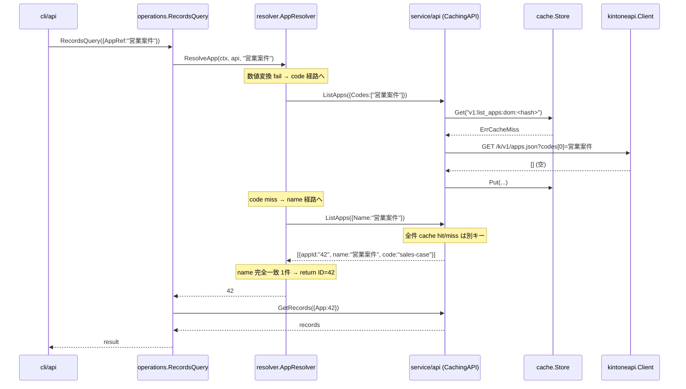

# M08 詳細計画: Resolver（名前解決）

## メタ
| 項目 | 値 |
|------|---|
| マイルストーン | M08 - Resolver（名前解決） |
| 親ロードマップ | plans/kintone-roadmap.md |
| ブランチ | feat/m08-resolver |
| 作成日 | 2026-04-29 |
| 想定期間 | 1 セッション |
| 完了条件 | (1) `internal/resolver` パッケージが App / Field の名前解決を提供 (2) operations 層に `AppRef` / `UpdateKeyFieldRef` フィールドが追加され、後方互換（`App int64` 直指定）を維持 (3) CLI: `--app` / `--update-key-field` が string も受け取れる（`<id>` / `<code>` / `<name>` / partial） (4) MCP: `apps_search` 以外の全 tools で `app` を `number` または `app_ref` を `string` で受け取る (5) `RESOLVER_NOT_FOUND` / `RESOLVER_AMBIGUOUS` エラーコードが cli/facade 双方に登録され、`details.candidates` に候補を含める (6) `go test -race -cover ./...` 全 pass、golangci-lint クリーン (7) README/CLAUDE/roadmap を M08 完了状態に更新 |

## ゴール
- 仕様書「名前解決」（App: ID → code → name → partial / Field: code → label → partial）の実装
- operations 層に挿入する Resolver により、CLI/MCP の `--app` 引数が **数値 ID も文字列 code/name/partial も**自然に受け取れる
- 既存の `App int64` 経路を**完全に後方互換**として維持（既存テスト・既存スクリプトを破壊しない）
- キャッシュは既存 `CachingAPI` 経由で apps/fields を 1 年 TTL でキャッシュ（M07 と統合済み）。Resolver 自身は cache.Store を直接保持しない（依存最小化 / advisor 指摘 #5）
- not found / ambiguous 時は **どの候補があったか**を `details.candidates` に出力して LLM が次の試行を選べるようにする

## 非ゴール（M08 ではやらない）
- OAuth 認証（M09）
- idproxy + multi-user MCP（M10）
- completion / Docker / Release（M11）
- Resolver 内部の専用キャッシュ層（`v1:resolver:app:<domain>:<name>` のような name→ID マップ）
  - 理由: CachingAPI で apps が 1 年キャッシュされていれば「`ListApps` を毎回叩いても全部キャッシュヒット」になり、追加キャッシュは複雑性に見合うメリットが小さい（advisor 指摘 #5）
  - 必要になったら M11 polish で追加検討
- records_query の `--field` / `fields` の resolve
  - 理由: LLM 用途では code 直指定が一般的。複数 fields のうち 1 件でも ambiguous で全体エラーになる UX 悪化リスクが大きい（advisor 注意点）
  - 計画上は **`--update-key-field` のみ Field Resolver を通す**

---

## 設計方針

### レイヤー（更新版）
```
CLI / MCP
   ↓
facade        ← MCP 公開層（mcp/facade）
   ↓                                ※ AppRef / UpdateKeyFieldRef を operations に渡す
operations    ← LLM 向け抽象化（service/operations）
   ↓                                ※ AppRef が空でなければ Resolver で App ID に解決
resolver      ← M08 新規（internal/resolver）
   ↓
api (interface)  ← service/api.API
   ├─ Client (kintoneapi 透過)
   └─ CachingAPI (decorator) [M07]
       ↓
   client (kintoneapi)
       ↓
   cache.Store [M07]
```

### 接合面（advisor 分岐 #1: ハイブリッド方式）

**結論**: operations 層の Input struct に **`*Ref` フィールドを追加（AppRef string、UpdateKeyFieldRef string）し、既存の `App int64` / `UpdateKeyField string` と並存させる**。

| ケース | 挙動 |
|--------|------|
| `App > 0` & `AppRef == ""` | 既存通り `App` をそのまま REST に渡す（**完全後方互換**） |
| `App == 0` & `AppRef != ""` | Resolver で `AppRef` → ID 解決し、内部的に App をセット |
| `App > 0` & `AppRef != ""` | `ErrConflictingAppRef`（USAGE） |
| `App == 0` & `AppRef == ""` | 既存 `ErrInvalidApp`（USAGE） |

**理由**:
- (a) operations を不変にして CLI/MCP 双方に重複コードを置く案 → 重複が DRY 違反
- (b) `App int64` を `App string` に置き換える案 → 既存テスト・facade コード全修正、破壊的変更が大きい
- **(c) ハイブリッド** → 既存テストは無修正、resolver パスは追加のみ。advisor 推奨

UpdateKeyField も同じパターン: `UpdateKeyField` (string) と `UpdateKeyFieldRef` (string) を並存。`UpdateKeyFieldRef != ""` のとき Resolver で field code に解決して `UpdateKeyField` を上書き。

### Mermaid シーケンス図（CLI が `--app="営業案件"` を解決）


### 解決チェーン詳細

#### App Resolver
```
Input: ref string (空でない)
Output: appID int64, error
```

| 順序 | 戦略 | 実装 | 成功条件 |
|------|------|------|----------|
| 1 | **ID 直接** | `strconv.ParseInt(ref, 10, 64)` で成功 → そのまま return | 数値変換成功（advisor 分岐 #4: fallback しない / predictability 優先） |
| 2 | **code 完全一致** | `ListApps({Codes:[ref], Limit:100})` を呼ぶ | レスポンスが 1 件 |
| 3 | **name 完全一致** | `ListApps({Name:ref, Limit:100})` を呼び、`entry.Name == ref` の **完全一致**だけを抽出 | フィルタ後 1 件（kintone REST の `name=` は部分一致なので、自前で完全一致 filter） |
| 4 | **partial（name 部分一致）** | step 3 の結果（name 部分一致）を流用、ただし `entry.Name == ref` 完全一致を除いた残り | 1 件のみ → 採用、複数 → ambiguous エラー |

**重要な判断**:
- step 1（ID 直接）で数値変換成功した場合、その ID で REST を叩く前段階で確定する → fallback しない（advisor 分岐 #4）。理由: predictability 優先 + ID として "42" を渡したのに code で偶然ヒットする現象を防ぐ
- step 2（code）は ListApps の `codes[]` パラメータで完全一致のみ取得（kintone REST 仕様）
- step 3-4 は 1 度の ListApps（`name=ref`）でまとめて取得して、自前で「完全一致」と「部分一致のみ」に振り分ける（API 呼び出し回数を最小化）
- partial が空文字列に化けて全件マッチを起こさないよう、ref が空文字の場合は最上位で `ErrEmptyRef` を返す（防御的）

#### Field Resolver
```
Input: appID int64, ref string (空でない)
Output: fieldCode string, error
```

| 順序 | 戦略 | 実装 | 成功条件 |
|------|------|------|----------|
| 1 | **code 完全一致** | `GetFormFields(appID)` で `properties[ref]` の存在チェック | キー存在 |
| 2 | **label 完全一致** | properties を全走査、`prop["label"] == ref` を抽出 | 1 件のみ |
| 3 | **partial（label 部分一致）** | properties を全走査、`strings.Contains(prop["label"], ref)` を抽出（label 完全一致を除く） | 1 件のみ → 採用、複数 → ambiguous |

**重要な判断**:
- step 1 と step 2-3 は同じ `GetFormFields` レスポンスを使うので、`GetFormFields` を 1 回呼んで 3 段階を逐次評価
- properties は `map[string]map[string]any` のため、label は `prop["label"].(string)` でキャストして比較。キャスト失敗時はスキップ
- ref が空文字なら `ErrEmptyRef`

### apps_search のページング戦略

`ListApps` は kintone REST 仕様で **1 ページ最大 100 件**。code/name 検索は kintone 側で絞り込まれるため通常 100 件以内に収まるが、**name 部分一致**で多数ヒットする可能性がある。

**ページング処理**:
- step 2-4 のいずれも、最初の 1 リクエストで `Limit: 100, Offset: 0` を投げる
- 100 件揃って返ってきたら次ページ（`Offset: 100`）を取得
- 最大ページ数 = **100 ページ（10000 件）**で打ち切り（無限ループ防止）
- 上限到達時は `ErrAppListTooLarge`（INTERNAL）として「Resolver 用途では絞り込みが弱すぎる」とエラー

**Resolver 専用 helper**: `resolver.listAllAppsByName(ctx, api, name string)` / `resolver.listAllAppsByCode(ctx, api, code string)` をパッケージ private で実装。

### キャッシュ統合（advisor 分岐 #5）

- Resolver は `service/api.API` interface に依存する（CachingAPI 経由でも素の Client でも OK）
- Resolver 内部に `cache.Store` は持たない
- **理由**:
  - CachingAPI で `ListApps` / `GetFormFields` が 1 年 TTL キャッシュされている
  - Resolver の同じ ref を 2 回引いた場合、2 回目は CachingAPI の hit で即返る（実 REST は 1 回のみ）
  - 別 cache を持つと「key を resolver 専用 namespace で持つか」「name 変更時の整合性」など複雑性が増す
  - 仕様書「TTL: apps/fields/resolver = 1 年」は CachingAPI の TTL=1 年と一致しているので、CachingAPI 経由で「実質的に resolver も 1 年キャッシュ」が達成される

### エラー設計

新規エラー（resolver パッケージで定義）:
```go
var (
    ErrAppNotFound      = errors.New("resolver: app not found")
    ErrFieldNotFound    = errors.New("resolver: field not found")
    ErrAppAmbiguous     = errors.New("resolver: app reference is ambiguous")
    ErrFieldAmbiguous   = errors.New("resolver: field reference is ambiguous")
    ErrEmptyRef         = errors.New("resolver: ref must not be empty")
    ErrAppListTooLarge  = errors.New("resolver: app list exceeded resolver limit (10000)")
)
```

ambiguous は候補情報を持つので **ラップ型**で実装:
```go
type AmbiguousError struct {
    Kind       string   // "app" | "field"
    Ref        string
    Candidates []Candidate
}

type Candidate struct {
    ID    string `json:"id,omitempty"`    // app id（field の場合は空）
    Code  string `json:"code,omitempty"`  // app code or field code
    Name  string `json:"name,omitempty"`  // app name
    Label string `json:"label,omitempty"` // field label
}

func (e *AmbiguousError) Error() string { /* ... */ }
func (e *AmbiguousError) Unwrap() error { return ErrAppAmbiguous /* or field */ }
```

NotFound も候補を出して LLM が次の試行を選べるようにしたい:
```go
type NotFoundError struct {
    Kind       string
    Ref        string
    Candidates []Candidate  // 部分一致で 0 件だった場合は空
}
```

### CLI / facade エラーマッピング（advisor ついで指摘）

新規エラーコード追加先:
- `internal/cli/errors.go` の `MapToOutputError` に `*resolver.NotFoundError` / `*resolver.AmbiguousError` の分岐を追加
- `internal/mcp/facade/errors.go` の `MapError` にも同じ分岐を追加（M06 確立のミラー設計に従う）

エラーコード:
- `RESOLVER_APP_NOT_FOUND` / `RESOLVER_APP_AMBIGUOUS`
- `RESOLVER_FIELD_NOT_FOUND` / `RESOLVER_FIELD_AMBIGUOUS`
- `RESOLVER_APP_LIST_TOO_LARGE` (INTERNAL)
- `USAGE`（empty ref / conflicting ref など）

`details`:
```json
{
  "code": "RESOLVER_APP_AMBIGUOUS",
  "message": "resolver: app reference \"営業\" is ambiguous (3 candidates)",
  "details": {
    "kind": "app",
    "ref": "営業",
    "candidates": [
      {"id": "42", "code": "sales-case", "name": "営業案件"},
      {"id": "43", "code": "sales-pipeline", "name": "営業パイプライン"},
      {"id": "55", "code": "sales-2024", "name": "営業 2024"}
    ]
  }
}
```

### MCP スキーマの number|string 表現（advisor 分岐 #2）

mark3labs/mcp-go の現状では `oneOf: [number, string]` の単一フィールドを綺麗に表現しづらい。ハマりにくい設計判断:

**採用案: 既存 `app: number` を残しつつ `app_ref: string` を新規追加**
- 既存 `app: number` を持つ tools は **後方互換維持**（M06 で動いている LLM プロンプトを破壊しない）
- 新規 `app_ref: string` フィールドを optional 追加（数値文字列 / code / name / partial を受ける）
- どちらか一方が指定される設計。両方指定はバリデーションエラー（`USAGE` / `INVALID_PARAMS`）
- どちらも未指定もバリデーションエラー（既存 `app: required` を `optional` に変えるため、サーバー側で「どちらかは必須」を確認）

ただし mcp.WithNumber("app", mcp.Required(), ...) の `Required` を外すと既存挙動と非互換になる。**advisor 注意点**: M06 では `app` が `Required` のため、これを optional に変更するのは MCP 仕様上の互換性破壊。

**最終決定**:
- `app` は number で `Required` を **外す**（仕様変更だが M08 リリース前に実施）
- `app_ref` を string で optional 追加
- ハンドラ内で「app と app_ref はどちらか必須・両方指定不可」のロジック実装
- README / docstring に「`app` か `app_ref` どちらか必須」を明記

`update_key_field` は **string のまま**だが、resolver 経路として `update_key_field_ref` を新規追加: パターンは app と同じ。

### 既存テスト・既存挙動への影響

| 影響箇所 | 内容 | 対処 |
|----------|------|------|
| operations の既存テスト | `App: 42` 直指定パスは無修正で pass | OK（後方互換） |
| operations 新規テスト | `AppRef: "code"` 経路の追加テスト | M08 で追加 |
| facade の既存テスト | `app: 42` パスは MCP 仕様の `Required` 外しに伴い再検証必要 | テスト修正（必須エラー期待を「app と app_ref どちらかなければ INVALID_PARAMS」に） |
| facade の新規テスト | `app_ref: "code"` 経路の追加テスト | M08 で追加 |
| CLI の既存テスト | `--app 42` パスは Int64Var → StringVar に変更すれば再パース対象 | テスト修正、または `--app-ref` を別フラグで追加して `--app int64` を残す（後方互換維持） |

**CLI フラグ判断**:
- 既存 `--app int64` を残す + 新規 `--app-ref string` を別フラグで追加
- 排他バリデーション: 両方指定なら USAGE
- どちらも未指定なら USAGE
- これにより `--app 42` を使う既存スクリプトを破壊しない（**完全後方互換**）

`update-key-field` は元々 string なので、`--update-key-field-ref` を追加するか `--update-key-field` 自体を resolver 化する判断:
- **`--update-key-field` 自体は kintone REST の `updateKey.field` に渡される field code でなければならない**ので、ユーザーが label を渡したいケースは `--update-key-field-ref` を新設する
- 排他: `--update-key-field` と `--update-key-field-ref` 両方指定 USAGE / どちらか必須

---

## パッケージ構造

```
internal/
  resolver/
    resolver.go         ← Resolver struct + ResolveApp / ResolveField + 共通エラー
    app.go              ← App 解決ロジック（ID/code/name/partial 4 段階）
    field.go            ← Field 解決ロジック（code/label/partial 3 段階）
    errors.go           ← AmbiguousError / NotFoundError + sentinel
    *_test.go           ← TDD テスト一式
  service/
    operations/
      records_query.go  ← AppRef フィールド追加 + Resolver 呼び出し
      record_create.go  ← AppRef フィールド追加 + Resolver
      record_update.go  ← AppRef + UpdateKeyFieldRef フィールド追加
      record_delete.go  ← AppRef フィールド追加
      app_describe.go   ← AppRef フィールド追加
      errors.go         ← ErrConflictingAppRef / ErrConflictingUpdateKeyFieldRef を追加
  cli/
    api/
      records.go        ← --app-ref フラグ追加
      record.go         ← --app-ref フラグ追加
      app.go            ← --app-ref フラグ追加
    ops/
      record.go         ← --app-ref / --update-key-field-ref フラグ追加
      app.go            ← --app-ref フラグ追加
    errors.go           ← MapToOutputError に Resolver エラー分岐追加
  mcp/
    facade/
      apps_search.go    ← 変更なし（apps_search は ListApps を直接叩くので resolver 経由しない）
      app_describe.go   ← app_ref 追加 + resolver 呼び出し（→ operations.AppDescribe にも AppRef 追加）
      records_query.go  ← app_ref 追加
      record_create.go  ← app_ref 追加
      record_update.go  ← app_ref + update_key_field_ref 追加
      record_delete.go  ← app_ref 追加
      errors.go         ← MapError に Resolver エラー分岐追加
```

### 公開 API（重要部分）

```go
// internal/resolver/resolver.go
package resolver

import (
    "context"

    serviceapi "github.com/youyo/kintone/internal/service/api"
)

// Resolver は kintone の app / field 名前解決を行う。
//
// 依存する service/api.API は CachingAPI でラップされた状態で渡されることを想定する。
// 1 度引いた ListApps / GetFormFields は CachingAPI 側の SQLite キャッシュ（TTL=1 年）で
// 再利用されるため、Resolver 内部に専用キャッシュは持たない（依存最小化）。
type Resolver struct {
    api serviceapi.API
}

// New は Resolver を構築する。
func New(api serviceapi.API) *Resolver

// ResolveApp は ref（数値文字列・code・name・partial）から App ID を返す。
//
// 解決順序: ID → code → name 完全一致 → name 部分一致
// 各段階でヒットしたら即 return（fallback しない / predictability 優先）。
//
// 戻り値:
//   - 成功: appID > 0
//   - not found: *NotFoundError（candidates: 部分一致候補があれば設定）
//   - ambiguous: *AmbiguousError（candidates: 全候補）
//   - empty ref: ErrEmptyRef
//   - 多数ヒット（ページング上限超過）: ErrAppListTooLarge
func (r *Resolver) ResolveApp(ctx context.Context, ref string) (int64, error)

// ResolveField は appID と ref（code・label・partial）から field code を返す。
//
// 解決順序: code → label 完全一致 → label 部分一致
// 各段階でヒットしたら即 return。
//
// 戻り値:
//   - 成功: fieldCode != ""
//   - not found: *NotFoundError
//   - ambiguous: *AmbiguousError
//   - empty ref: ErrEmptyRef
func (r *Resolver) ResolveField(ctx context.Context, appID int64, ref string) (string, error)
```

```go
// internal/resolver/errors.go
package resolver

import (
    "errors"
    "fmt"
    "strings"
)

var (
    ErrAppNotFound     = errors.New("resolver: app not found")
    ErrFieldNotFound   = errors.New("resolver: field not found")
    ErrAppAmbiguous    = errors.New("resolver: app reference is ambiguous")
    ErrFieldAmbiguous  = errors.New("resolver: field reference is ambiguous")
    ErrEmptyRef        = errors.New("resolver: ref must not be empty")
    ErrAppListTooLarge = errors.New("resolver: app list exceeded resolver limit (10000)")
)

// Candidate は ambiguous / not-found 時に LLM へ提示する候補情報。
type Candidate struct {
    ID    string `json:"id,omitempty"`    // app の数値 ID（field の場合は空）
    Code  string `json:"code,omitempty"`  // app code or field code
    Name  string `json:"name,omitempty"`  // app name
    Label string `json:"label,omitempty"` // field label
}

// NotFoundError は app / field が見つからなかったエラー。
//
// Kind は "app" or "field"、Candidates は部分一致候補（あれば）。
type NotFoundError struct {
    Kind       string
    Ref        string
    Candidates []Candidate
}

func (e *NotFoundError) Error() string {
    return fmt.Sprintf("resolver: %s %q not found", e.Kind, e.Ref)
}

func (e *NotFoundError) Unwrap() error {
    if e.Kind == "field" {
        return ErrFieldNotFound
    }
    return ErrAppNotFound
}

// AmbiguousError は ref が複数候補にマッチしたエラー。
type AmbiguousError struct {
    Kind       string
    Ref        string
    Candidates []Candidate
}

func (e *AmbiguousError) Error() string {
    names := make([]string, 0, len(e.Candidates))
    for _, c := range e.Candidates {
        switch e.Kind {
        case "app":
            names = append(names, fmt.Sprintf("%s(id=%s)", c.Name, c.ID))
        case "field":
            names = append(names, fmt.Sprintf("%s(code=%s)", c.Label, c.Code))
        }
    }
    return fmt.Sprintf("resolver: %s %q is ambiguous (%d candidates: %s)",
        e.Kind, e.Ref, len(e.Candidates), strings.Join(names, ", "))
}

func (e *AmbiguousError) Unwrap() error {
    if e.Kind == "field" {
        return ErrFieldAmbiguous
    }
    return ErrAppAmbiguous
}
```

```go
// internal/resolver/app.go (一部抜粋)

const maxAppPagesForResolver = 100 // 100 pages × 100 = 10,000 apps

func (r *Resolver) ResolveApp(ctx context.Context, ref string) (int64, error) {
    if ref == "" {
        return 0, ErrEmptyRef
    }

    // step 1: ID 直接（数値変換成功 → そのまま return）
    if id, err := strconv.ParseInt(ref, 10, 64); err == nil && id > 0 {
        return id, nil
    }

    // step 2: code 完全一致
    apps, err := r.listAllAppsByCode(ctx, ref)
    if err != nil {
        return 0, err
    }
    if len(apps) == 1 {
        return parseAppID(apps[0].AppID)
    }
    if len(apps) > 1 {
        return 0, ambiguousAppError(ref, apps)
    }

    // step 3-4: name 検索（kintone REST `name=` は部分一致なので、自前で完全一致 / 部分一致を分離）
    apps, err = r.listAllAppsByName(ctx, ref)
    if err != nil {
        return 0, err
    }
    var exact, partial []kintoneapi.AppListEntry
    for _, a := range apps {
        if a.Name == ref {
            exact = append(exact, a)
        } else {
            partial = append(partial, a)
        }
    }
    if len(exact) == 1 {
        return parseAppID(exact[0].AppID)
    }
    if len(exact) > 1 {
        return 0, ambiguousAppError(ref, exact)
    }
    if len(partial) == 1 {
        return parseAppID(partial[0].AppID)
    }
    if len(partial) > 1 {
        return 0, ambiguousAppError(ref, partial)
    }
    return 0, &NotFoundError{Kind: "app", Ref: ref}
}

func (r *Resolver) listAllAppsByCode(ctx context.Context, code string) ([]kintoneapi.AppListEntry, error) {
    // codes[] は完全一致のみなので 1 リクエストで十分
    resp, err := r.api.ListApps(ctx, kintoneapi.ListAppsRequest{Codes: []string{code}, Limit: 100})
    if err != nil {
        return nil, err
    }
    return resp.Apps, nil
}

func (r *Resolver) listAllAppsByName(ctx context.Context, name string) ([]kintoneapi.AppListEntry, error) {
    var all []kintoneapi.AppListEntry
    for page := 0; page < maxAppPagesForResolver; page++ {
        resp, err := r.api.ListApps(ctx, kintoneapi.ListAppsRequest{
            Name:   name,
            Limit:  100,
            Offset: int64(page) * 100,
        })
        if err != nil {
            return nil, err
        }
        all = append(all, resp.Apps...)
        if len(resp.Apps) < 100 {
            return all, nil
        }
    }
    return nil, ErrAppListTooLarge
}
```

```go
// internal/resolver/field.go (一部抜粋)

func (r *Resolver) ResolveField(ctx context.Context, appID int64, ref string) (string, error) {
    if ref == "" {
        return "", ErrEmptyRef
    }
    if appID <= 0 {
        return "", fmt.Errorf("resolver: appID must be > 0")
    }
    resp, err := r.api.GetFormFields(ctx, kintoneapi.GetFormFieldsRequest{App: appID})
    if err != nil {
        return "", err
    }
    // step 1: code 完全一致（properties のキー）
    if _, ok := resp.Properties[ref]; ok {
        return ref, nil
    }
    // step 2-3: label 検索
    var exact, partial []Candidate
    for code, prop := range resp.Properties {
        label, _ := prop["label"].(string)
        if label == "" {
            continue
        }
        if label == ref {
            exact = append(exact, Candidate{Code: code, Label: label})
        } else if strings.Contains(label, ref) {
            partial = append(partial, Candidate{Code: code, Label: label})
        }
    }
    if len(exact) == 1 {
        return exact[0].Code, nil
    }
    if len(exact) > 1 {
        return "", &AmbiguousError{Kind: "field", Ref: ref, Candidates: exact}
    }
    if len(partial) == 1 {
        return partial[0].Code, nil
    }
    if len(partial) > 1 {
        return "", &AmbiguousError{Kind: "field", Ref: ref, Candidates: partial}
    }
    return "", &NotFoundError{Kind: "field", Ref: ref}
}
```

### operations 層の変更パターン（example: records_query）

```go
// internal/service/operations/records_query.go

type RecordsQueryInput struct {
    App        int64    // 既存（M04）: int64 直指定
    AppRef     string   // M08 新規: "<id>" / "<code>" / "<name>" / partial
    Query      string
    Fields     []string
    TotalCount bool
}

// resolveAppID は App / AppRef のハイブリッド解決。
//
// - App > 0 & AppRef == ""    → App をそのまま return
// - App == 0 & AppRef != ""   → Resolver で AppRef → ID 変換
// - App > 0 & AppRef != ""    → ErrConflictingAppRef
// - App == 0 & AppRef == ""   → ErrInvalidApp
//
// resolver が nil のとき AppRef 経路はサポートしない（resolver 未設定時のフォールバック）。
func resolveAppID(ctx context.Context, r *resolver.Resolver, app int64, appRef string) (int64, error) {
    hasApp := app > 0
    hasRef := appRef != ""
    if hasApp && hasRef {
        return 0, ErrConflictingAppRef
    }
    if !hasApp && !hasRef {
        return 0, ErrInvalidApp
    }
    if hasApp {
        return app, nil
    }
    if r == nil {
        return 0, ErrResolverUnavailable
    }
    return r.ResolveApp(ctx, appRef)
}
```

operations 関数のシグネチャ変更:

```go
// 変更前（M04）
func RecordsQuery(ctx context.Context, a serviceapi.API, in RecordsQueryInput) (*RecordsQueryOutput, error)

// 変更後（M08）
func RecordsQuery(ctx context.Context, a serviceapi.API, r *resolver.Resolver, in RecordsQueryInput) (*RecordsQueryOutput, error)
```

呼び出し側（CLI/facade）は **resolver を必ず渡す**（テストも同様）。

**advisor 注意**: r は nil 許容にして「AppRef を使わないコール」では resolver なしでも動くようにすると、既存テストの修正が最小化できる。判断:
- **resolver は nil 許容**（AppRef 経路でのみ使うので、既存 App int64 経路は resolver 不要）
- ただし「既存の RecordsQuery 呼び出しコード」を変更しないと nil を引数に追加できない
- → 全 operations 関数のシグネチャに `r *resolver.Resolver` を追加（呼び出し箇所は CLI/facade の有限点なので保守可能）
- 既存テストは `RecordsQuery(ctx, api, nil, in)` のように nil を渡すよう修正

### CLI の変更パターン（example: cli/api/records.go）

```go
func newRecordsGetCmd() *cobra.Command {
    var (
        app        int64
        appRef     string  // 新規
        query      string
        fields     []string
        totalCount bool
    )
    cmd := &cobra.Command{
        Use:   "get",
        Short: "レコード一覧を取得する",
        RunE: func(cmd *cobra.Command, args []string) error {
            a, err := buildAPI(cmd)
            if err != nil {
                return err
            }
            r := resolver.New(a)  // CachingAPI を渡す
            out, err := operations.RecordsQuery(cmd.Context(), a, r, operations.RecordsQueryInput{
                App: app, AppRef: appRef,
                Query: query, Fields: fields, TotalCount: totalCount,
            })
            // ...
        },
    }
    cmd.Flags().Int64Var(&app, "app", 0, "kintone アプリ ID（数値直指定 / --app-ref と排他）")
    cmd.Flags().StringVar(&appRef, "app-ref", "", "kintone アプリの code / name / partial（--app と排他）")
    // 既存の MarkFlagRequired("app") は外す（どちらか必須は RunE で検証）
    return cmd
}
```

### MCP facade の変更パターン（example: facade/records_query.go）

```go
func recordsQueryTool() mcp.Tool {
    return mcp.NewTool("records_query",
        mcp.WithDescription("...（app または app_ref のいずれか必須）..."),
        mcp.WithNumber("app",
            mcp.Description("アプリ ID（数値・app_ref と排他）。"),
            mcp.Min(1),
        ),
        mcp.WithString("app_ref",
            mcp.Description("アプリの code / name / partial（app と排他）。"),
        ),
        // ... 他のフィールド ...
    )
}

func recordsQueryHandler(deps ToolDeps) func(...) (...) {
    return func(ctx context.Context, req mcp.CallToolRequest) (*mcp.CallToolResult, error) {
        args := req.GetArguments()
        app, _ := optInt64(args, "app")
        appRef, _ := optString(args, "app_ref")
        // ... 解析 ...
        r := resolver.New(deps.API)
        out, err := operations.RecordsQuery(ctx, deps.API, r, operations.RecordsQueryInput{
            App: app, AppRef: appRef,
            // ...
        })
        // ...
    }
}
```

`apps_search` は **そのまま**: ListApps を直接叩くので Resolver 経由しない。

### MCP `app: number` の `Required` 外し検証（advisor 指摘 #2）

mark3labs/mcp-go v0.49.0 で `mcp.WithNumber("app", mcp.Min(1))`（Required を外して Min(1) を残す）が想定通りの schema を生成するかは、**実装の最初に 1 ケースだけスパイク**して確認する:

```go
// スパイクテスト
tool := mcp.NewTool("test",
    mcp.WithNumber("app", mcp.Min(1)),
    mcp.WithString("app_ref"),
)
// JSONSchema を取り出して required 配列が空か、minimum:1 が残っているかをログ出力
```

**期待**: `{type: object, properties: {app: {type:number, minimum:1}, app_ref: {type:string}}, required: []}`

もし `Required` 外しが効かない / `Min` が効かないフレーム実装の場合のフォールバック:
- (A) `mcp.WithNumber` を `mcp.WithString` に切替え、handler 内で数値文字列を `strconv.ParseInt` で解釈（実質 `app_ref` 1 本に統合）
- (B) `Min` を諦めて `mcp.WithNumber("app")` のみ（バリデーションは handler で）

実装着手時に最初の 5 分でスパイク検証 → 結果を本計画ドキュメントの「実装メモ」セクション（後段追加）に追記。

### RecordUpdate の二段階解決順序（advisor 指摘 #3）

`UpdateKeyFieldRef` を resolve するには **解決済みの App ID が必要**（`ResolveField(ctx, appID, ref)` の第一引数）。

**実装順序の固定（必須遵守）**:

```
1. appID, err := resolveAppID(ctx, r, in.App, in.AppRef)
   → AppRef 経路でも App 直指定でも、まず AppID を確定
2. updateKeyField := in.UpdateKeyField
   if in.UpdateKeyFieldRef != "" :
       updateKeyField, err = r.ResolveField(ctx, appID, in.UpdateKeyFieldRef)
3. ID 経路 / UpdateKey 経路の排他チェックは **解決後の updateKeyField** で行う
4. kintoneapi.UpdateRecordRequest{App: appID, ...} を構築
```

UpdateKeyFieldRef 単体指定時に AppRef が空（App 直指定）でも動く必要があるので、appID 取得経路は **どちらの入力でも統一**する。`resolveAppID` の戻り値を使って後続の Field 解決を行う。

---

## TDD 設計

### テストケース表

#### `internal/resolver` パッケージ（新規）

| ID | 観点 | シナリオ | 期待 |
|----|------|---------|------|
| R-1 | Empty ref | `ResolveApp(ctx, "")` | `ErrEmptyRef` |
| R-2 | ID 直接 | `ResolveApp(ctx, "42")` | `42, nil`（API 呼び出しなし） |
| R-3 | ID 直接（負数）| `ResolveApp(ctx, "-1")` | code 経路へ fallback（数値変換は通るが id<=0 なので step 2 へ）。今回の実装では step 1 が `id > 0` のときのみ return するためコード経路へ |
| R-3b | ID 直接（"0"）| `ResolveApp(ctx, "0")` | 同様に step 1 では return せず code 経路へ fallback |
| R-4 | code 完全一致 1 件 | mock ListApps({Codes:["sales"]}) → 1件 | `appID=42, nil` |
| R-5 | code 一致 0 件 → name 一致 1 件 | code 経路 0 件 → name 経路で完全一致 1 件 | `appID=42, nil` |
| R-6 | code 経路 ambiguous（複数） | code 経路で 2 件返す mock | `*AmbiguousError`、Candidates に 2 件 |
| R-7 | name 完全一致 ambiguous | name=ref で 2 件全部 `Name == ref` | `*AmbiguousError` |
| R-8 | name 部分一致 1 件 | 完全一致 0 件、部分一致 1 件 | `appID=N, nil` |
| R-9 | name 部分一致 ambiguous | 完全一致 0 件、部分一致 3 件 | `*AmbiguousError`、Candidates 3 件 |
| R-10 | not found | 全段階 0 件 | `*NotFoundError`、Candidates は空 |
| R-11 | ページング動作 | mock が 100 件→100 件→50 件返す | 全 250 件取得、API 呼び出し 3 回 |
| R-12 | ページング上限超過 | mock が常に 100 件返す | 100 ページ目で `ErrAppListTooLarge` |
| R-13 | ResolveField: code 完全一致 | properties に key=ref が存在 | `ref, nil` |
| R-14 | ResolveField: label 完全一致 1 件 | label==ref が 1 つ | `code, nil` |
| R-15 | ResolveField: label 部分一致 ambiguous | label に ref を含む field 3 つ | `*AmbiguousError` |
| R-16 | ResolveField: not found | code 一致なし・label 一致なし・部分一致なし | `*NotFoundError` |
| R-17 | ResolveField: empty ref | `ResolveField(ctx, 42, "")` | `ErrEmptyRef` |
| R-18 | ResolveField: invalid appID | `ResolveField(ctx, 0, "x")` | error（appID must be > 0）|
| R-19 | API エラー伝播 | mock が APIError を返す | error 透過（`*kintoneapi.APIError` で wrap） |
| R-20 | NotFoundError.Unwrap | `errors.Is(err, ErrAppNotFound)` | true |
| R-21 | AmbiguousError.Unwrap | `errors.Is(err, ErrAppAmbiguous)` | true |

#### `internal/service/operations` パッケージ（既存テスト + 新規ハイブリッド）

| ID | 観点 | シナリオ | 期待 |
|----|------|---------|------|
| OP-1 | 既存 App int64 経路（後方互換） | `App: 42, AppRef: ""` | resolver 呼び出しなし、`App=42` で REST |
| OP-2 | AppRef 経路 | `App: 0, AppRef: "sales"` | resolver で 42 解決、`App=42` で REST |
| OP-3 | 排他エラー | `App: 42, AppRef: "sales"` | `ErrConflictingAppRef` |
| OP-4 | どちらも未指定 | `App: 0, AppRef: ""` | `ErrInvalidApp`（既存）|
| OP-5 | resolver nil + AppRef あり | `r=nil, AppRef:"x"` | `ErrResolverUnavailable` |
| OP-6 | RecordUpdate UpdateKeyFieldRef | `UpdateKeyField: "", UpdateKeyFieldRef: "顧客名"` | resolver で field code 解決 |
| OP-7 | RecordUpdate UpdateKeyField/Ref 排他 | 両方指定 | `ErrConflictingUpdateKeyFieldRef` |

既存 OP テストは「resolver 引数を nil で渡す」修正のみで pass する想定。

#### `internal/cli/api` / `internal/cli/ops`（新規 --app-ref）

| ID | 観点 | コマンド | 期待 |
|----|------|---------|------|
| CL-A1 | --app 既存パス | `kintone api records get --app 42` | 既存通り動作 |
| CL-A2 | --app-ref 新規 | `kintone api records get --app-ref sales` | resolver 呼び出し |
| CL-A3 | --app と --app-ref 両指定 | `--app 42 --app-ref sales` | USAGE エラー |
| CL-A4 | どちらも未指定 | （フラグなし） | USAGE エラー（resolver からの ErrInvalidApp） |
| CL-A5 | --update-key-field-ref | `ops record update --app-ref ... --update-key-field-ref 顧客名` | field resolver で code 解決 |

#### `internal/mcp/facade`（新規 app_ref）

| ID | 観点 | 入力 | 期待 |
|----|------|---------|------|
| FA-1 | app:42 既存パス | `{"app": 42}` | 既存通り |
| FA-2 | app_ref 新規 | `{"app_ref": "sales"}` | resolver 呼び出し |
| FA-3 | 両方指定 | `{"app": 42, "app_ref": "sales"}` | INVALID_PARAMS |
| FA-4 | どちらも未指定 | `{}` | INVALID_PARAMS |
| FA-5 | resolver エラー伝播 | mock resolver returns NotFoundError | `RESOLVER_APP_NOT_FOUND` envelope、`details.candidates` |

#### `internal/cli/errors.go` の追加分岐

| ID | 観点 | 入力 | 期待 |
|----|------|---------|------|
| EM-1 | NotFoundError(app) | `&NotFoundError{Kind:"app", Ref:"x"}` | `RESOLVER_APP_NOT_FOUND` |
| EM-2 | NotFoundError(field) | `&NotFoundError{Kind:"field", Ref:"x"}` | `RESOLVER_FIELD_NOT_FOUND` |
| EM-3 | AmbiguousError(app) | `&AmbiguousError{Kind:"app", Candidates:[...]}` | `RESOLVER_APP_AMBIGUOUS` + `details.candidates` |
| EM-4 | AmbiguousError(field) | `&AmbiguousError{Kind:"field", ...}` | `RESOLVER_FIELD_AMBIGUOUS` + `details.candidates` |
| EM-5 | ErrAppListTooLarge | sentinel | INTERNAL or RESOLVER_APP_LIST_TOO_LARGE（決定） |
| EM-6 | ErrEmptyRef | sentinel | USAGE |
| EM-7 | ErrConflictingAppRef | sentinel | USAGE |

**EM-5 判断**: `RESOLVER_APP_LIST_TOO_LARGE` として明示的なコードを発行し、LLM に「絞り込みを強くしてください」と理解させる。

`internal/mcp/facade/errors.go` も同じパターン（4 ケース）を追加。

#### `internal/cli/errors.go` の operations エラー分岐追加（advisor 指摘 #1）

**現状の課題**: `facade/errors.go` には既に `operations.Err*` → `INVALID_PARAMS` の分岐があるが、**`cli/errors.go` には無い**。M06 までは `MarkFlagRequired("app")` が cobra 段階で USAGE エラーを出していたため露呈しなかった。M08 で `MarkFlagRequired` を全箇所から外すと、`--app` も `--app-ref` も未指定時:

```
cobra OK → RunE → resolveAppID → ErrInvalidApp → cli.MapToOutputError → 該当 case 無し → INTERNAL
```

これは UX 退行。`cli/errors.go` の `MapToOutputError` にも以下の sentinel を **`USAGE`** にマップする分岐を追加する（facade は INVALID_PARAMS だが CLI は意図的に USAGE で揃える）:

| sentinel | CLI マップ先 | 理由 |
|----------|-------------|------|
| `operations.ErrInvalidApp` | `USAGE` | フラグ未指定の人為ミス |
| `operations.ErrConflictingAppRef` | `USAGE` | --app と --app-ref 両指定の人為ミス |
| `operations.ErrConflictingUpdateKeyFieldRef` | `USAGE` | --update-key-field と --update-key-field-ref 両指定 |
| `operations.ErrResolverUnavailable` | `INTERNAL` | resolver が nil のケースは内部実装エラー（CLI ではほぼ起きない） |
| `operations.ErrEmptyRecord` / `ErrEmptyRecords` / `ErrConflictingRecords` 等 | `USAGE` | M05 既存の人為ミス系（M08 ついでに追加検討、advisor #1） |

EM テストケース表に追加:

| ID | 観点 | 入力 | 期待 |
|----|------|---------|------|
| EM-8 | ErrInvalidApp | sentinel | USAGE |
| EM-9 | ErrConflictingAppRef | sentinel | USAGE |
| EM-10 | ErrConflictingUpdateKeyFieldRef | sentinel | USAGE |
| EM-11 | ErrResolverUnavailable | sentinel | INTERNAL |

### Red → Green → Refactor 順序

1. `internal/resolver/errors.go` の error 型定義（コンパイルだけ）
2. `internal/resolver/resolver.go` の Resolver 構造体・New（コンパイルだけ）
3. `internal/resolver/app_test.go` R-1, R-2, R-13 → `app.go` 部分実装（empty / ID 直接 / code 完全一致）
4. R-4, R-5, R-6 → code 経路実装
5. R-7, R-8, R-9, R-10 → name 経路実装
6. R-11, R-12 → ページング実装
7. R-13〜R-18 → field.go 実装
8. R-19〜R-21 → 既存実装にエラー透過 / Unwrap 確認
9. operations の `errors.go` に新規エラー追加（ErrConflictingAppRef / ErrConflictingUpdateKeyFieldRef / ErrResolverUnavailable）
10. operations の各ファイル: AppRef フィールド追加 + シグネチャ変更（resolver 引数追加）+ resolveAppID ヘルパ
11. operations 既存テストを **`nil` resolver で渡す**よう修正 + 新規 OP-1〜OP-7 を追加
12. cli/api・cli/ops 各サブコマンドに --app-ref / --update-key-field-ref フラグ追加 + RunE 修正 + テスト追加
13. cli/errors.go に EM-1〜EM-7 分岐追加 + テスト
14. mcp/facade 各 tool に app_ref / update_key_field_ref 追加 + Required 外し + handler 修正 + テスト
15. mcp/facade/errors.go に Resolver エラー分岐追加 + テスト
16. 全体ビルド + go test -race -cover ./... + golangci-lint run + go vet
17. README / CLAUDE / roadmap 更新
18. Conventional Commits（日本語）でコミット

---

## CLI フラグ仕様

### 既存 CLI コマンドの変更

| コマンド | 既存フラグ | 追加フラグ | 排他規則 |
|---------|-----------|-----------|---------|
| `kintone api records get` | `--app` | `--app-ref` | 両方指定不可、どちらか必須 |
| `kintone api record get` | `--app`, `--id` | `--app-ref` | --app と --app-ref 排他、--id は変更なし |
| `kintone api app get` | `--app` | `--app-ref` | --app と --app-ref 排他 |
| `kintone api app fields` | `--app` | `--app-ref` | --app と --app-ref 排他 |
| `kintone api app describe` | `--app` | `--app-ref` | --app と --app-ref 排他 |
| `kintone ops record create` | `--app` | `--app-ref` | --app と --app-ref 排他 |
| `kintone ops record update` | `--app`, `--update-key-field` | `--app-ref`, `--update-key-field-ref` | --app/--app-ref 排他、--update-key-field/--update-key-field-ref 排他 |
| `kintone ops record delete` | `--app` | `--app-ref` | --app と --app-ref 排他 |
| `kintone ops app describe` | `--app` | `--app-ref` | --app と --app-ref 排他 |

`MarkFlagRequired("app")` は全箇所で外し、RunE 内で「--app or --app-ref どちらか必須」を検証。

### Help 文サンプル
```
$ kintone api records get --help
レコード一覧を取得する

Flags:
      --app int          kintone アプリ ID（数値直指定。--app-ref と排他）
      --app-ref string   kintone アプリの参照（数値文字列 / code / name / partial）。--app と排他
      --query string     kintone クエリ言語
      --field strings    取得するフィールドコード（複数指定可）
      --total-count      total_count を含める
```

---

## MCP tool スキーマの変更

| Tool | 変更前 | 変更後 |
|------|--------|--------|
| `apps_search` | 変更なし | 変更なし（list 系は resolver 経由しない） |
| `app_describe` | `app: number, required` | `app: number, optional` + `app_ref: string, optional`（どちらか必須） |
| `records_query` | 同上 | 同上 |
| `record_create` | 同上 | 同上 |
| `record_update` | `app: number, required` + `update_key_field: string` | `app, app_ref` + `update_key_field, update_key_field_ref` |
| `record_delete` | 同上 | 同上 |

ツール description に「`app` と `app_ref` のいずれか必須・両方指定不可」を明記。

---

## キャッシュ整合性とライフサイクル

- ListApps / GetFormFields は CachingAPI で 1 年 TTL → Resolver は **1 年同じ ref を引き続ける限り API 呼び出しなし**
- name 変更時の追従遅延: kintone 側で名前が変わっても 1 年は古い名前で resolve されない（が、コード変更は伝わる）
- 解決策: `kintone cache clear --scope=apps` で apps キャッシュ一括無効化（既存 M07 機能）
- 仕様書「resolver=1 年」は CachingAPI のキャッシュを通じて達成される（advisor 分岐 #5）

---

## 並行性・パフォーマンス

- Resolver は **stateless**（`api` 依存のみ・mutex 不要）
- 同一 ref を並行解決した場合、CachingAPI の SQLite WAL モード（M07）で安全（busy_timeout=5s）
- ResolveField の `GetFormFields` は CachingAPI 経由で 2 回目以降即返し
- ResolveApp の `ListApps`（name 部分一致）は **キャッシュキーが name 文字列に依存**。同一 ref を 2 回引いた場合は cache hit（CachingAPI の listAppsCacheKey は req のハッシュなので、name="営業" を 2 回引いた場合は同じキー）

---

## リスク評価と緩和策

| リスク | 影響 | 緩和策 |
|--------|------|--------|
| **operations のシグネチャ破壊変更** | 既存テスト・facade 全箇所のコール変更 | resolver 引数を nil 許容にして「既存テストは nil 渡せば pass」とする。CLI/facade コール箇所は有限点なので保守可能 |
| **CLI フラグ MarkFlagRequired 外しの後方互換** | `--app` のみ指定スクリプトは動作維持、フラグ未指定時のエラーメッセージが変わる可能性 | 「--app or --app-ref のいずれか必須」を RunE で明示、エラーメッセージは `clierr.NewUsageError` で USAGE コード化 |
| **MCP `app: required` 外しの非互換** | M06 のクライアントが `app` を必須前提でリクエスト | `app` 未指定 + `app_ref` 指定で動作するため、既存クライアントは `app` を引き続き送れば OK。新規クライアントは `app_ref` を使える |
| **partial 一致の多数ヒット** | `name=` で 10000 件超返ると ErrAppListTooLarge | `RESOLVER_APP_LIST_TOO_LARGE` を明確に返し、LLM に「絞り込みを強く」と理解させる。ドキュメントで上限を明記 |
| **name 部分一致の予測不能性** | ref="営業" で「営業 1」「営業 2」両方マッチ → ambiguous | candidates を返して LLM が選択可能。CLI 利用者には help にチェーン順序を明記 |
| **キャッシュ TTL=1 年で名前変更追従しない** | 1 年間古い名前で resolve | `kintone cache clear --scope=apps` で手動更新可能（M07 機能） |
| **数値文字列 "0" / "-1" の扱い** | `ParseInt("0", ...)` 成功するが id=0 は不正 | step 1 の条件を `err == nil && id > 0` にして、id<=0 は code 経路へ fallback |
| **ListApps name= の挙動仕様** | kintone REST の name= が前方一致なのか部分一致なのか実装依存 | API ドキュメントで「部分一致」と確認、テストで完全一致と部分一致を分離抽出するロジックを担保 |
| **field の label が空文字 / 非 string** | キャスト失敗で panic | `prop["label"].(string)` の OK パターンで安全に kicki out |
| **operations 全 5 関数のシグネチャ変更** | 大規模変更の取り回し | TDD で 1 関数ずつ修正、既存テスト全 pass を都度確認 |

---

## 出力規約遵守チェックリスト

- [x] CLI: 既存 `{"ok":true,"data":{...}}` 形式を維持
- [x] エラー: `RESOLVER_*` コードを output.Error に追加
- [x] details.candidates は `[]Candidate` として JSON シリアライズ可能
- [x] facade: 同上 + CallToolResult.Content[0].Text に envelope 埋め込み（M06 確立）
- [x] decoder/encoder は internal/output 経由

---

## ファイル別作業見積もり

| ファイル | 種別 | 行数目安 |
|----------|------|---------|
| internal/resolver/resolver.go | 新規 | 50 |
| internal/resolver/app.go | 新規 | 130 |
| internal/resolver/field.go | 新規 | 80 |
| internal/resolver/errors.go | 新規 | 80 |
| internal/resolver/app_test.go | 新規 | 350 |
| internal/resolver/field_test.go | 新規 | 220 |
| internal/resolver/errors_test.go | 新規 | 60 |
| internal/service/operations/errors.go | 修正 | +12 行（ErrConflictingAppRef / ErrConflictingUpdateKeyFieldRef / ErrResolverUnavailable） |
| internal/service/operations/records_query.go | 修正 | +30 行（AppRef フィールド・resolver 引数・resolveAppID ヘルパ） |
| internal/service/operations/record_create.go | 修正 | +30 行 |
| internal/service/operations/record_update.go | 修正 | +50 行（UpdateKeyFieldRef も） |
| internal/service/operations/record_delete.go | 修正 | +30 行 |
| internal/service/operations/app_describe.go | 修正 | +30 行 |
| internal/service/operations/*_test.go | 修正 | nil 引数追加 + 新規 OP-1〜OP-7 |
| internal/cli/api/records.go | 修正 | +25 行 |
| internal/cli/api/record.go | 修正 | +25 行 |
| internal/cli/api/app.go | 修正 | +50 行（3 サブコマンド分） |
| internal/cli/ops/record.go | 修正 | +60 行（3 サブコマンド分 + update_key_field_ref） |
| internal/cli/ops/app.go | 修正 | +25 行 |
| internal/cli/api/*_test.go | 修正・追加 | +200 行 |
| internal/cli/ops/*_test.go | 修正・追加 | +250 行 |
| internal/cli/errors.go | 修正 | +30 行（resolver エラー分岐） |
| internal/cli/errors_test.go | 修正 | +60 行 |
| internal/mcp/facade/apps_search.go | 変更なし | 0 |
| internal/mcp/facade/app_describe.go | 修正 | +30 行 |
| internal/mcp/facade/records_query.go | 修正 | +30 行 |
| internal/mcp/facade/record_create.go | 修正 | +30 行 |
| internal/mcp/facade/record_update.go | 修正 | +50 行 |
| internal/mcp/facade/record_delete.go | 修正 | +30 行 |
| internal/mcp/facade/errors.go | 修正 | +30 行 |
| internal/mcp/facade/*_test.go | 修正・追加 | +250 行 |
| README.md | 修正 | +40 行（名前解決の章追加） |
| CLAUDE.md | 修正 | +10 行（M08 完了状態） |
| plans/kintone-roadmap.md | 修正 | M08 チェック + Changelog |

合計: 約 2300 行（テスト込み）

---

## ロールバック戦略

- ブランチ単独なので `git restore` でロールバック可能
- operations のシグネチャ変更は破壊的だが、resolver 引数を nil 許容にしているため、追加された AppRef フィールドを使わない経路は完全に既存通り
- CLI フラグ追加は backward compatible（既存 `--app 42` は動作維持）
- MCP の `app: required` 外しは新規クライアントの仕様変更だが、既存クライアントは `app` を送るので無問題

---

## 完了条件チェックリスト

- [ ] `internal/resolver` パッケージ実装（New / ResolveApp / ResolveField + errors）
- [ ] operations 5 関数のシグネチャ変更（resolver 引数追加・AppRef フィールド追加）
- [ ] cli/api / cli/ops 全コマンドに `--app-ref` / `--update-key-field-ref` 追加
- [ ] facade 全 tool に `app_ref` / `update_key_field_ref` 追加 + `app: required` 外し
- [ ] cli/errors.go と facade/errors.go に Resolver エラー分岐追加
- [ ] `go test -race -cover ./...` 全 pass（resolver 80%+ / operations 既存 88% 以上維持 / cli/api 80%+ / cli/ops 80%+ / facade 75%+ 維持）
- [ ] `go vet ./...` クリア / `golangci-lint run ./...` 新規違反 0 / `gofmt -l .` 差分なし
- [ ] 既存 `kintone api records get --app 42` / `kintone ops record update --app 42 --id 1 --record-json '{...}'` が**完全後方互換**で動作（手動確認）
- [ ] 新規 `kintone api records get --app-ref sales-case` 動作（mock テスト）
- [ ] README.md / CLAUDE.md / plans/kintone-roadmap.md を M08 完了状態に更新
- [ ] Conventional Commits（日本語）でコミット

---

## ハンドオフ予定（M09 OAuth へ）

- Resolver は OAuth 認証経路と独立（`service/api.API` 越しの依存なので auth 切替に追従）
- TokenStore（M07）は OAuth で多用、resolver には影響なし
- M09 では `KINTONE_AUTH=oauth` 時の token 管理を追加するだけ
