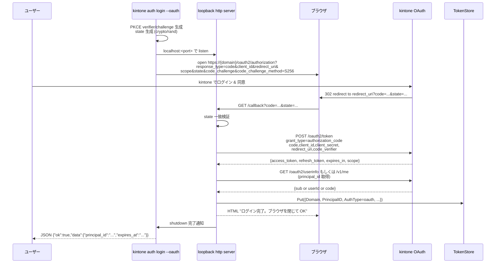
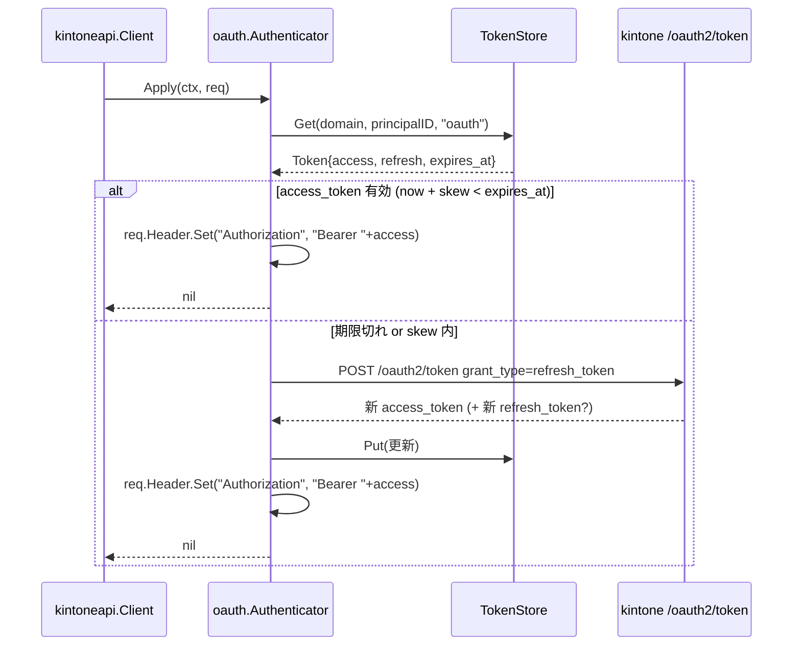

# M09 詳細計画: OAuth 認証 + 自動更新

## メタ
| 項目 | 値 |
|------|---|
| マイルストーン | M09 - OAuth 認証 + 自動更新 |
| 親ロードマップ | plans/kintone-roadmap.md |
| ブランチ | feat/m09-oauth-auth |
| 作成日 | 2026-04-29 |
| 想定期間 | 1〜2 セッション |
| 完了条件 | (1) `internal/auth/oauth` パッケージが Authorization Code + PKCE フロー / refresh / Authenticator 実装を提供 (2) `kintone auth login --oauth` でブラウザ起動 → 認可コード受領 → access/refresh token を TokenStore に保存できる (3) `kintone auth status` / `kintone auth logout` の JSON 出力 (4) HTTP リクエスト時に access_token 期限切れを検知して透過的に refresh する Authenticator 実装 (5) PKCE / state / loopback HTTP サーバの安全停止が CSRF・盗用に対して堅牢 (6) `go test -race -cover ./...` 全 pass、golangci-lint クリーン (7) README/CLAUDE/roadmap を M09 完了状態に更新 |

## ゴール
- 仕様書「認証」(OAuth: access_token=1h / refresh_token=無期限 / 自動更新) の実装
- kintone OAuth 2.0 (`https://{domain}/oauth2/authorization` / `https://{domain}/oauth2/token`) に対応
- PKCE (S256) と state の crypto/rand 生成・検証で CSRF・認可コード盗用を防止
- M07 の `tokenstore` と統合し、Domain + PrincipalID + AuthType をキーにマルチユーザー対応の素地を整える
- `kintoneapi.Client` に対し OAuth Authenticator を渡せば、access_token 期限切れ時に自動で refresh して継続できるようにする
- CLI: `kintone auth login --oauth` (interactive ブラウザ flow) / `kintone auth status` / `kintone auth logout`

## 非ゴール（M09 ではやらない）
- idproxy + multi-user remote MCP（M10）
- principal_id の `provider:sub` 形式の確定（M10 で OIDC と併せて確定。M09 では暫定 `oauth:<sub>` または kintone のユーザー識別子）
- TokenStore の暗号化（M11 polish 候補）
- `kintone auth login --api-token`（既存の env/config で代替可能、M11 検討）
- MCP 側の OAuth 認可フロー連携（M10）
- refresh token rotation の能動制御（kintone OAuth が rotation するなら新値を保存するだけ）
- completion / Docker / Release（M11）

---

## 前提知識（kintone OAuth 仕様 / 公開ドキュメント検証済み）

kintone の OAuth 2.0 (Authorization Code Grant) 仕様。**実装前に context7 / cybozu.dev 公式ドキュメントで以下を確定済み**（2026-04-29 計画作成時）:

| 項目 | 値 | 出典 |
|------|---|------|
| Grant Type | **Authorization Code Grant のみ**（Confidential Client） | `cybozu.dev/ja/common/docs/oauth-client/add-client/` |
| 認可エンドポイント | `https://{domain}/oauth2/authorization` | 同上 |
| トークンエンドポイント | `https://{domain}/oauth2/token` | 同上 |
| **client 認証** | **HTTP Basic 認証必須** (`Authorization: Basic base64(client_id:client_secret)`) | 同上 |
| 認可リクエスト必須パラメータ | `client_id`, `redirect_uri`, `state`, `response_type=code`, `scope` | 同上 |
| 認可コード有効期限 | **10 分** | 同上 |
| Refresh Token 制約 | **ユーザーあたり最大 10 個** | 同上 |
| クライアント登録上限 | 20 個 | 同上 |
| Scope（kintone） | `k:app_record:read` / `k:app_record:write` / `k:app_settings:read` / `k:app_settings:write` / `k:file:read` / `k:file:write`（**6 個確定**） | `cybozu.dev/ja/common/docs/oauth-client/scope-kintone/` |
| token レスポンス JSON | `access_token`, `token_type` (Bearer 想定), `expires_in`, `refresh_token`, `scope` | OAuth 2.0 RFC 6749 標準 + cybozu.dev サンプル |
| **PKCE 対応** | **公式ドキュメントに明記なし** → 後述「PKCE 戦略」を参照 | 検証済み |
| **redirect_uri loopback 登録可否** | **公式ドキュメントに明記なし** → 後述「redirect_uri 戦略」を参照 | 検証済み |

**検証で「明記なし」だった項目への対処**: 不確定情報は実装で「あれば送る、なくても動く」設計にする（後述 PKCE / redirect_uri 戦略）。

**access_token 形式**: 標準 Bearer Token（`Authorization: Bearer <token>`）。kintone REST 側でも `Authorization: Bearer` を受け付ける（kintone REST 認証方式に「OAuth 認証」として明記、`cybozu.dev/ja/kintone/docs/rest-api/overview/authentication/`）。

### PKCE 戦略

kintone 公式ドキュメントに PKCE の明示的サポート記載がないため、以下のハイブリッドアプローチを採用：

- **常に PKCE パラメータ（`code_challenge` + `code_challenge_method=S256`）を送信**する
- token endpoint 呼び出し時にも `code_verifier` を送信
- kintone が PKCE を**無視**するなら、これらは単に余分なパラメータとして無視されるだけで害はない（OAuth 2.0 仕様上 server は知らないパラメータを無視するのが原則）
- kintone が PKCE を**サポート**しているなら、追加の盗用対策となる
- どちらに転んでも State (CSRF 対策) は必須なので、PKCE は **「あれば嬉しい」深化として実装**する

万一 kintone OAuth サーバが知らないパラメータを **拒否**するエッジケースに備え、`KINTONE_OAUTH_PKCE_DISABLE=1` 環境変数で PKCE 送信を抑止できるようにする（escape hatch）。本番接続時のみテストできる項目なので M11 polish で確認する想定。

### redirect_uri 戦略（loopback 利用）

公式ドキュメントの redirect_uri 例は `https://app.example.com/oauth/callback` で、HTTPS 形式の登録が想定されている。**しかし loopback 不可と明記もない**。CLI 用 OAuth では RFC 8252 (OAuth 2.0 for Native Apps) に従い loopback を使うのが標準的。

採用方針:
- **redirect_uri は環境変数 `KINTONE_OAUTH_REDIRECT_URL` でユーザーから受け取る**（kintone 管理者が登録した値と完全一致させる責任はユーザー）
- 値の検証: ホストが `127.0.0.1` / `localhost` / `[::1]` のいずれかで、スキームが `http` であることを CLI 側で強制する（外部 IP / 別ホストへの redirect を阻止）
- ポートはユーザー指定値をそのまま `net.Listen` に渡す
- 実際に loopback 登録を kintone 側が拒否した場合、kintone 管理者が `https://callback.example.com:<port>/callback` のような自前リバースプロキシを用意する運用が必要だが、これは README で「kintone 側設定」として案内するに留め、CLI の責務外
- **本番接続検証は M11 polish で実施**。CLI/MCP の単体テストは httptest で完結する

---

## 設計方針

### レイヤー（更新版）
```
CLI (auth login/status/logout)
   ↓
internal/auth/oauth      ← M09 新規（フロー・PKCE・state・refresh・Authenticator）
   ↓                      ※ TokenStore に保存・読み出し
internal/tokenstore      ← M07 既存
   ↓
internal/cache/path.go   ← DefaultTokensPath
```

```
HTTP リクエスト時（kintoneapi.Client → Authenticator.Apply）
   ↓
oauth.Authenticator.Apply(ctx, req)
   ├─ TokenStore から最新 token を取得（毎回 / SQLite なので低コスト）
   ├─ access_token 有効? → Authorization: Bearer をセットして return
   └─ 期限切れ → refresh エンドポイントを叩き、TokenStore へ保存 → Authorization をセット
```

### 接合面: Authenticator interface（M03 で確立）
- `auth.Authenticator.Apply(ctx, req)` をそのまま実装する（ctx は refresh 用に必須）
- M03 の APITokenAuthenticator と同等の置き換え可能性
- `kintoneapi.NewFromResolved` の switch に `AuthModeOAuth` ケースを追加

### Mermaid シーケンス図 (1) login フロー


### Mermaid シーケンス図 (2) 自動 refresh フロー


### PKCE 設計
- code_verifier: 32 byte の crypto/rand → URL-safe Base64 エンコード（RFC 7636 推奨 43〜128 文字）
- code_challenge: `BASE64URL(SHA256(verifier))`
- code_challenge_method: `S256` 固定
- verifier はメモリ内のみで保持し、認可コード受領後に token endpoint へ送信
- ローカル loopback サーバ（auth flow 専用）にハンドオフ

### state 設計
- 16 byte の crypto/rand → URL-safe Base64
- callback で受け取った state と完全一致しなければ `ErrStateMismatch`
- ロード時に「期待した state」と「受信 state」のみを比較する（ハッシュ化や TTL は M11 検討）
- 同一 CLI プロセス内のみで保持（永続化しない）

### loopback HTTP サーバ設計

**ポート選択**:
- 仕様書で固定ポート指定なし。kintone OAuth クライアント登録は redirect_uri を完全一致でしか許可しないと考えられるため、**設定で固定ポートを指定する**運用が現実的。
- 採用: `KINTONE_OAUTH_REDIRECT_URL` を環境変数で受ける（ユーザーが kintone 側登録と一致させる責務）。値は `http://127.0.0.1:<port>/callback` 形式を期待。
- パース失敗・ホストが loopback 以外（127.0.0.1 / localhost / [::1]）の場合は USAGE エラー（外部 IP に redirect させない安全策）。

**ライフサイクル**:
- `net.Listen("tcp", "127.0.0.1:<port>")` で listen
- `http.Server.Serve(listener)` を goroutine で起動
- `/callback` ハンドラのみ実装。それ以外のパスは 404
- callback を受信したら HTML を返してから `srv.Shutdown(ctx)` を呼ぶ
- timeout (5 min, 設定可) で listen を打ち切り → context cancel
- ハンドラは 1 度だけ動作（2 度目以降は早期終了 / state 二重検証問題回避）。`sync.Once` で保護
- `srv.Shutdown` の context は短いタイムアウト（5s）

**プロセス停止フロー**:
1. callback ハンドラがレスポンス書き込み後 `result chan<- result` に成功/失敗を送る
2. メインフロー側は `select { case r := <-result: case <-ctx.Done(): }` で受信
3. メインフローが `srv.Shutdown(graceful ctx)` を呼ぶ
4. listener は閉じられるが、進行中レスポンスは graceful 完了まで待つ

### 自動 refresh 設計

**スキュー**: `expires_at - now < 60s` のときに refresh する（時計ずれ・ネットワーク遅延を吸収）。

**並行制御**: 複数 goroutine が同時に Apply した際、複数回 refresh を発生させないよう、Authenticator 内で `sync.Mutex` を持つ。
- `refreshOnce` 戦略の代わりに、Apply ごとに mutex を取得 → TokenStore から最新 Token を取り直す → 期限切れなら refresh → unlock。
- これにより最初の Apply が refresh 完了後、次の Apply は新 token を使う。
- mutex は Apply のホットパスにあるため、TokenStore.Get の SQLite 呼び出しが軽量であることに依存する（M07 確認済み: SQLite WAL モード、busy_timeout 5s）。

**refresh 失敗時の挙動**:
- 401 / `invalid_grant`: refresh_token が無効 → `ErrRefreshTokenRevoked` を返し、CLI 側で「再 login が必要」を出す
- ネットワークエラー: そのまま返す（kintoneapi の retry policy に乗せない / refresh は冪等性なし）
- 5xx: 1 回のみリトライ（ジッタ付き）→ それでもダメなら error

**rotation 対応**: kintone レスポンスに `refresh_token` が含まれていれば常に上書き保存。含まれていなければ既存の refresh_token を維持。

### TokenStore 統合

| 項目 | 値 |
|------|---|
| Domain | Resolved.Domain |
| PrincipalID | **CLI フラグ `--principal-id <id>` 必須**（後述「principal_id 戦略」確定版） |
| AuthType | `tokenstore.AuthTypeOAuth` |
| AccessToken | `access_token` |
| RefreshToken | `refresh_token` |
| ExpiresAt | `time.Now().Add(time.Duration(expires_in) * time.Second)` |
| UpdatedAt | `time.Now()` |

**principal_id 戦略（advisor 指摘 #3 反映 / 確定版）**:

選択肢を検討した結果、以下の理由で**「(b) `--principal-id` を CLI フラグで必須にする」を採用**する:

| 案 | 評価 |
|----|------|
| (a) login 時に `/v1/me.json` を呼んで principal_id 自動取得 | kintone OAuth scope 一覧に「ユーザー情報取得」専用 scope は存在しない。`k:app_settings:read` でも `/v1/me.json` を叩ける保証がない（要本番検証）。失敗時の挙動が分岐し、silent corruption リスクが残る |
| (b) `--principal-id <id>` 必須（採用） | 明示性が高く、ユーザーが意図する識別子で TokenStore を分離できる。silent corruption ゼロ。M10 OIDC 対応時に provider:sub に正規化するマイグレーションが書きやすい |
| (c) access_token のハッシュ化短縮値 | refresh されるたびに principal_id が変わり、同一ユーザーの login が複数エントリを生む。NG |

**M09 の principal_id 規約**:
- 形式: 任意の文字列（ユーザー指定）
- 推奨: `oauth:<任意の識別子>` プレフィックス（M10 で `provider:sub` に正規化するときに区別しやすい）
- 例: `oauth:alice@example.com` / `oauth:default` / `oauth:my-bot`
- CLI 側で空文字 → `USAGE` エラー（明示要求）
- ドキュメント（README）に「同一ドメインで複数ユーザーが login する場合は異なる `--principal-id` を指定すること」を明記
- M10 OIDC 対応時、`/v1/me.json` または `id_token.sub` から自動取得し、設定がなければ自動値、あれば手動値を尊重するハイブリッドに切り替える
- M10 でマイグレーション関数を提供（`oauth:foo` → `kintone:<sub>` への置換）

### CLI 構造

```
kintone auth                                                  ← 親コマンド
  login    --oauth                                            ← OAuth フロー必須フラグ（M09）
           --principal-id <id>                                ← 必須。tokenstore キー識別子
           [--no-browser]                                     ← ブラウザ起動を抑止して URL を stderr 出力
           [--timeout <duration>]                             ← callback 待ち上限（既定 5min）
  status   [--principal-id <id>]                              ← 省略時はドメイン内全 OAuth エントリ
  logout   --principal-id <id>                                ← 必須（誤削除防止）
           [--all]                                            ← ドメイン内全 OAuth エントリを削除
```

`kintone auth login --oauth --principal-id oauth:alice` の挙動:
1. config.Load で Domain / OAuth 設定を取得（Domain / ClientID / ClientSecret / RedirectURL は必須、不足は USAGE）
2. `--principal-id` が空なら USAGE エラー
3. `RedirectURL` のホストが loopback (127.0.0.1 / localhost / [::1]) でなければ USAGE エラー
4. PKCE verifier/challenge / state を crypto/rand で生成
5. loopback サーバ起動（RedirectURL のポートで `net.Listen("tcp", "127.0.0.1:<port>")`）
6. `--no-browser` 未指定なら OS 別 exec.Command でブラウザを開く。指定 or exec 失敗時は authorize URL を stderr に出力（stdout は JSON envelope 専用）
7. callback 受信 → state 検証 → token endpoint 呼び出し → 成功 → TokenStore.Put({Domain, PrincipalID, AuthType=oauth, ...})
8. 成功 JSON 出力 / 失敗 JSON 出力（CLI 共通エラーマッピング）

`kintone auth status`:
- TokenStore から該当 (Domain, PrincipalID=`<flag>` or 全件, AuthType=oauth) を取得
- access_token を **マスク**（先頭 4 + "..." + 末尾 4）
- expires_at（RFC3339）, has_refresh_token, principal_id, scope を JSON 配列で出力

`kintone auth logout`:
- 引数: `--principal-id <id>` 必須 / `--all` で当該 Domain の全 OAuth エントリ削除（誤操作防止）
- TokenStore.Delete を呼ぶ
- 成功 JSON 出力（deleted_count を含む）

### 設定拡張

`config.Resolved` に OAuth フィールド追加:
```go
type Resolved struct {
    // 既存...
    OAuthClientID     string `json:"oauth_client_id"`     // KINTONE_OAUTH_CLIENT_ID
    OAuthClientSecret string `json:"oauth_client_secret"` // KINTONE_OAUTH_CLIENT_SECRET (mask)
    OAuthRedirectURL  string `json:"oauth_redirect_url"`  // KINTONE_OAUTH_REDIRECT_URL
    OAuthScopes       []string `json:"oauth_scopes,omitempty"` // optional, デフォルト all read/write
}
```

`internal/config/env.go` の `LoadEnv` に 3 環境変数を追加。
`config show` のマスキング: client_secret は `***`、client_id は表示。
`config.toml` に `[profiles.<name>.oauth]` セクション追加（client_id/client_secret/redirect_url/scopes）。優先順位は CLI > ENV > toml で揃える（CLI フラグは M09 では追加しない）。

### エラー設計

```go
// internal/auth/oauth/errors.go
var (
    ErrStateMismatch        = errors.New("oauth: state mismatch")
    ErrAuthorizationCodeMissing = errors.New("oauth: authorization code missing")
    ErrCallbackTimeout      = errors.New("oauth: callback timeout")
    ErrRefreshTokenRevoked  = errors.New("oauth: refresh token revoked")
    ErrTokenExpired         = errors.New("oauth: access token expired and no refresh token")
    ErrInvalidRedirectURL   = errors.New("oauth: redirect URL must be loopback http://127.0.0.1:<port>/callback")
    ErrMissingClientCredentials = errors.New("oauth: client_id / client_secret / redirect_url must be set")
)

// kintone OAuth エラーレスポンス
type OAuthError struct {
    Code        string // "invalid_grant" / "invalid_request" / ...
    Description string
    HTTPStatus  int
}
func (e *OAuthError) Error() string { ... }
```

### CLI / facade エラーマッピング

`internal/cli/errors.go` の `MapToOutputError` に追加:

| sentinel / 型 | output コード |
|---|---|
| `oauth.ErrStateMismatch` | `OAUTH_STATE_MISMATCH` |
| `oauth.ErrCallbackTimeout` | `OAUTH_CALLBACK_TIMEOUT` |
| `oauth.ErrRefreshTokenRevoked` | `OAUTH_REFRESH_REVOKED` |
| `oauth.ErrTokenExpired` | `KINTONE_UNAUTHORIZED` |
| `oauth.ErrInvalidRedirectURL` | `USAGE` |
| `oauth.ErrMissingClientCredentials` | `USAGE` |
| `*oauth.OAuthError` | `OAUTH_PROVIDER_ERROR`（details に code/description） |

facade 側は M10 で MCP 経由 OAuth が必要になった時点で対応（M09 では追加しない / Generator 注意）。

### 既存テスト・既存挙動への影響

| 影響箇所 | 内容 | 対処 |
|----------|------|------|
| `kintoneapi.NewFromResolved` の switch | `case AuthModeOAuth` 追加 | 既存テストは `AuthModeAPIToken` のままなので影響なし。新規テスト追加 |
| `config.Resolved` の JSON タグ | フィールド追加（後方互換） | 既存テストの diff を確認。`config show` のスナップショットを更新 |
| `config.LoadEnv` | 3 環境変数追加 | 既存テストは設定無しを期待しているのでデフォルト空文字で OK |
| TokenStore の使われ方 | 初の本格利用 | M07 の interface に変更なし。テスト追加で動作確認 |
| `cli.MapToOutputError` | OAuth エラー分岐追加 | 既存テスト無修正で pass |

---

## パッケージ構造

```
internal/
  auth/
    oauth/
      pkce.go              ← code_verifier/challenge 生成
      pkce_test.go
      state.go             ← state 生成・検証
      state_test.go
      flow.go              ← Authorization Code Grant の orchestrator
      flow_test.go
      callback.go          ← loopback HTTP サーバ
      callback_test.go
      token.go             ← TokenResponse 型 + token endpoint 呼び出し
      token_test.go
      refresh.go           ← refresh_token grant + Authenticator 自動更新ロジック
      refresh_test.go
      provider.go          ← Authenticator 実装（access_token を Bearer ヘッダに付与）
      provider_test.go
      errors.go            ← sentinel + OAuthError 型
      browser.go           ← OS 別ブラウザ起動（差し替え可能 hook）
      browser_test.go
  cli/
    auth/
      root.go              ← `kintone auth` 親コマンド
      login.go             ← `kintone auth login --oauth`
      login_test.go
      status.go            ← `kintone auth status`
      status_test.go
      logout.go            ← `kintone auth logout`
      logout_test.go
      helpers.go           ← TokenStore 構築 hook（並列テスト禁止注釈）
  config/
    config.go              ← Resolved に OAuth フィールド追加
    env.go                 ← LoadEnv に 3 環境変数追加
    profile.go             ← OAuth ProfileBlock セクション
    resolver.go            ← Resolve に OAuth マージ
    *_test.go              ← 既存ファイルにテスト追加
  kintoneapi/
    client.go              ← NewFromResolved に AuthModeOAuth ケース追加
```

### 公開 API（重要部分）

```go
// internal/auth/oauth/pkce.go
package oauth

// PKCEPair は code_verifier と challenge のペア。
type PKCEPair struct {
    Verifier  string // 43〜128 文字 URL-safe
    Challenge string // S256 ハッシュ済み URL-safe Base64
    Method    string // "S256" 固定
}

// GeneratePKCE は crypto/rand から PKCE ペアを生成する。
// rand が nil の場合 crypto/rand.Reader を使用。
func GeneratePKCE(rand io.Reader) (PKCEPair, error)
```

```go
// internal/auth/oauth/state.go
package oauth

// GenerateState は 16 byte の crypto/rand を URL-safe Base64 で返す。
func GenerateState(rand io.Reader) (string, error)
```

```go
// internal/auth/oauth/flow.go
package oauth

// Config は login flow の入力。
type Config struct {
    Domain       string        // kintone domain (host only)
    ClientID     string
    ClientSecret string
    RedirectURL  string        // http://127.0.0.1:<port>/callback
    Scopes       []string      // デフォルト all read/write
    HTTPClient   *http.Client  // nil なら 30s timeout
    OpenBrowser  func(url string) error // nil なら DefaultOpenBrowser
    Now          func() time.Time
    RandReader   io.Reader
    Timeout      time.Duration // callback 待ち上限。0 なら 5min
}

// Result は login の成功結果。
type Result struct {
    PrincipalID  string
    AccessToken  string
    RefreshToken string
    ExpiresAt    time.Time
    Scope        string
}

// Login は Authorization Code + PKCE フローを完走し、Result を返す。
// loopback HTTP サーバの起動・ブラウザ起動・state/PKCE 検証を内包。
func Login(ctx context.Context, cfg Config) (*Result, error)
```

```go
// internal/auth/oauth/refresh.go
package oauth

// Refresher は TokenStore に保存された Token を refresh する責務。
type Refresher struct {
    httpClient   *http.Client
    domain       string
    clientID     string
    clientSecret string
    now          func() time.Time
}

// Refresh は refresh_token grant を実行して新しい Token を返す。
// レスポンスに refresh_token が含まれない場合、引数 oldRefresh を維持する。
func (r *Refresher) Refresh(ctx context.Context, oldRefresh string) (*Result, error)
```

```go
// internal/auth/oauth/provider.go
package oauth

// Authenticator は kintone API リクエストに Authorization: Bearer を付与する。
// TokenStore から最新トークンを取得し、期限切れなら自動で refresh する。
type Authenticator struct {
    store        tokenstore.Store
    domain       string
    principalID  string
    refresher    *Refresher
    skew         time.Duration // 0 なら 60s
    now          func() time.Time
    mu           sync.Mutex
}

// NewAuthenticator は OAuth 用 Authenticator を構築する。
// store は M07 tokenstore、refresher は本パッケージで構築。
func NewAuthenticator(store tokenstore.Store, domain, principalID string, refresher *Refresher) *Authenticator

// Apply は req に "Authorization: Bearer <access_token>" を付与する。
// access_token が期限切れの場合、refresh を試みた上でセットする。
// auth.Authenticator interface を満たす。
func (a *Authenticator) Apply(ctx context.Context, req *http.Request) error
```

```go
// internal/cli/auth/login.go
// 設計: cobra cmd + Run 関数を分離してテスト容易化。
// Run の引数で TokenStore / OAuth.Login を hook 可能にする。
func newLoginCmd() *cobra.Command
```

---

## TDD テスト設計

### サブパッケージ別テストケース表

#### `internal/auth/oauth/pkce_test.go`

| ID | テストケース | 期待 |
|----|--------------|------|
| PK-1 | GeneratePKCE で verifier 長 43〜128 | OK |
| PK-2 | challenge は SHA256(verifier) を URL-safe base64 | パディングなし、`+/=` 含まない |
| PK-3 | method は "S256" | 固定 |
| PK-4 | rand が常に同じバイト → 同じ verifier/challenge | 決定論性 |
| PK-5 | rand が io.EOF → エラー伝播 | error |

#### `internal/auth/oauth/state_test.go`

| ID | テストケース | 期待 |
|----|--------------|------|
| ST-1 | GenerateState で 16 byte → URL-safe base64 | パディングなし、長さ 22 |
| ST-2 | rand エラー伝播 | error |

#### `internal/auth/oauth/token_test.go`

| ID | テストケース | 期待 |
|----|--------------|------|
| TK-1 | httptest で正常レスポンス → TokenResponse パース | access/refresh/expires_in/scope |
| TK-2 | 400 invalid_grant → *OAuthError{Code:"invalid_grant", HTTPStatus:400} | |
| TK-3 | 5xx → *OAuthError + 1 回リトライ | retry counter == 1 |
| TK-4 | ネットワークエラー → そのまま返却 | url.Error |
| TK-5 | client_id/secret が POST body にエンコード済み | form 確認 |
| TK-6 | code_verifier が POST body に含まれる | form 確認 |

#### `internal/auth/oauth/callback_test.go`

| ID | テストケース | 期待 |
|----|--------------|------|
| CB-1 | callback ハンドラに正常 code/state → 結果チャンネルへ送信 | code 取得 |
| CB-2 | state 不一致 → ErrStateMismatch | |
| CB-3 | code パラメータ欠落 → ErrAuthorizationCodeMissing | |
| CB-4 | 二重 callback → 1 回目のみ受理、2 回目は 400 | sync.Once |
| CB-5 | timeout → ErrCallbackTimeout | context |
| CB-6 | listen ポート競合 → bind error | |
| CB-7 | shutdown 後の listener clean up | net.Listen で再利用可能 |

#### `internal/auth/oauth/flow_test.go`

| ID | テストケース | 期待 |
|----|--------------|------|
| FL-1 | OpenBrowser hook が authorize URL を受け取る | URL 検証（response_type=code, client_id, redirect_uri, scope, state, code_challenge, S256） |
| FL-2 | 正常 flow（mock OAuth サーバ + hook ブラウザ） → Result | access/refresh/expires_at |
| FL-3 | OpenBrowser エラー → URL を stdout に出力（呼び出し元責務）。Login は継続 | hook 失敗で fallback できる |
| FL-4 | redirect URL が loopback でない → ErrInvalidRedirectURL | http://example.com/cb |
| FL-5 | client_id/secret/redirect 未設定 → ErrMissingClientCredentials | |
| FL-6 | callback timeout 適用 | Config.Timeout で短くしてテスト |
| FL-7 | scope 未指定 → デフォルト 6 scope | k:app_record:read/write 等 |

#### `internal/auth/oauth/refresh_test.go`

| ID | テストケース | 期待 |
|----|--------------|------|
| RF-1 | refresh_token で新 access_token | Result |
| RF-2 | レスポンスに refresh_token なし → 引数 oldRefresh を維持 | |
| RF-3 | invalid_grant → ErrRefreshTokenRevoked | unwrap で確認 |
| RF-4 | 5xx → 1 回リトライ後 *OAuthError | |
| RF-5 | client_id/secret が form に乗る | |

#### `internal/auth/oauth/provider_test.go`

| ID | テストケース | 期待 |
|----|--------------|------|
| PR-1 | access_token 有効 → req に Bearer ヘッダ付与 | |
| PR-2 | 期限切れ → refresh が呼ばれて TokenStore 更新 → Bearer ヘッダ | |
| PR-3 | 並行 Apply → refresh は 1 回のみ（mutex 動作） | refresher 呼び出し counter == 1 |
| PR-4 | refresh エラー → ErrRefreshTokenRevoked → req 未変更 | |
| PR-5 | TokenStore.Get 失敗 → エラー伝播 | |
| PR-6 | nil request → エラー | |
| PR-7 | skew 内（now+60s >= expires_at）→ refresh トリガ | |
| PR-8 | refresh 後の new refresh_token を TokenStore 保存 | |
| PR-9 | refresh レスポンスに refresh_token なし → 旧 refresh_token を維持 | |

#### `internal/auth/oauth/browser_test.go`

| ID | テストケース | 期待 |
|----|--------------|------|
| BR-1 | DefaultOpenBrowser は OS 別 exec.Command を構築 | darwin/linux/windows で命令切替（runtime.GOOS フィルタ）|
| BR-2 | exec エラー → 戻り値 error | |

#### `internal/cli/auth/login_test.go`

| ID | テストケース | 期待 |
|----|--------------|------|
| AL-1 | OAuth.Login hook が呼ばれ、結果を TokenStore.Put | |
| AL-2 | 必須環境変数欠落 → USAGE エラー JSON | exit !=0 |
| AL-3 | OAuth.Login エラー（state mismatch）→ OAUTH_STATE_MISMATCH | |
| AL-4 | 成功時 JSON envelope: principal_id, expires_at, scope | |
| AL-5 | --oauth フラグ未指定（M09 では必須）→ USAGE | M09 では `--oauth` が必須 |
| AL-6 | --no-browser フラグ指定 → ブラウザ起動せず authorize URL を stdout に出力（**JSON envelope の前段で別途出力**、stderr 利用） | CI / SSH 越しユーザー対応（advisor #4） |
| AL-7 | --principal-id 未指定 → USAGE エラー | principal_id 必須化（advisor #3） |
| AL-8 | --principal-id 空文字 → USAGE エラー | |

#### `internal/cli/auth/status_test.go`

| ID | テストケース | 期待 |
|----|--------------|------|
| AS-1 | TokenStore に複数 PrincipalID → 配列で出力 | |
| AS-2 | access_token がマスクされる | "abcd...wxyz" |
| AS-3 | TokenStore に該当なし → 空配列 / ok=true | |
| AS-4 | DB オープン失敗 → INTERNAL | |

#### `internal/cli/auth/logout_test.go`

| ID | テストケース | 期待 |
|----|--------------|------|
| AO-1 | --principal-id 指定 → 該当のみ Delete | |
| AO-2 | 未指定 → 当該 Domain の全 OAuth トークン Delete | |
| AO-3 | 該当なし → ok=true / deleted=0 | |

#### `internal/config/env_test.go` 拡張

| ID | テストケース | 期待 |
|----|--------------|------|
| EC-1 | KINTONE_OAUTH_CLIENT_ID/SECRET/REDIRECT_URL を読み取る | EnvConfig フィールド |

#### `internal/config/resolver_test.go` 拡張

| ID | テストケース | 期待 |
|----|--------------|------|
| CR-1 | ENV → Resolved.OAuthClientID | source 記録 |
| CR-2 | toml profile → file ソース | |
| CR-3 | 両方 → ENV 優先 | |

#### `internal/cli/config_test.go` 拡張

| ID | テストケース | 期待 |
|----|--------------|------|
| CL-1 | `config show` で client_secret がマスク | "***" |

#### `internal/kintoneapi/client_test.go` 拡張

| ID | テストケース | 期待 |
|----|--------------|------|
| CK-1 | NewFromResolved + AuthModeOAuth + 必要設定 → Client 構築成功 | (TokenStore/Refresher は外注) |

> **設計確定（advisor 指摘 #2 反映）**: NewFromResolved 内で TokenStore/Refresher を直接ビルドすると依存爆発が起きるため、以下の二段構成を採用する:
>
> 1. `kintoneapi.NewFromResolved(*config.Resolved)` のシグネチャは**維持**。`case AuthModeOAuth:` は「OAuth は NewFromResolvedWithAuth を使え」という明示的な error (`ErrUseExtendedConstructorForOAuth`) を返す。
> 2. **新規**に `kintoneapi.NewFromResolvedWithAuth(r *config.Resolved, a auth.Authenticator) (*Client, error)` を追加。Authenticator の構築は CLI 側の責務として完全に切り出す。
> 3. **CLI ヘルパー (`cli/auth/helpers.go`)** が以下を担う:
>    - TokenStore を `cache.DefaultTokensPath` + `tokenstore.Open` で構築
>    - `oauth.Refresher` を `Resolved.Domain` + `Resolved.OAuthClientID/Secret` で構築
>    - `oauth.NewAuthenticator(store, domain, principalID, refresher)` で Authenticator 構築
>    - `kintoneapi.NewFromResolvedWithAuth(r, authenticator)` で Client 構築
> 4. **既存の cli/api・cli/ops・cli/mcp ヘルパー (`defaultNewAPI`)** に `Resolved.Auth` の switch を追加し、`AuthModeAPIToken` は今まで通り `NewFromResolved`、`AuthModeOAuth` は cli/auth helpers の builder を呼ぶように分岐させる
>
> これにより:
> - `NewFromResolved` の既存シグネチャと既存テストは無変更（後方互換）
> - OAuth に固有の依存（tokenstore, oauth パッケージ）は kintoneapi から見えない（依存方向が cli → auth/oauth → tokenstore のままになり、循環なし）
> - CLI ヘルパー側で「auth-token のときは Token、oauth のときは TokenStore + principal_id」を読み分けるだけで済む

---

## ステップ別実装順序（TDD: Red → Green → Refactor）

各ステップの最後で `go test -race -cover ./...` を流す。

### Step 1: PKCE / state（依存なし）
- [ ] Red: `pkce_test.go` PK-1〜5 を書く（コンパイルエラーで赤）
- [ ] Green: `pkce.go` 実装
- [ ] Red: `state_test.go` ST-1〜2
- [ ] Green: `state.go`
- [ ] Refactor: 共通 helper があれば抽出

### Step 2: token endpoint クライアント（httptest）
- [ ] Red: `token_test.go` TK-1〜6（httptest でモック）
- [ ] Green: `token.go`（authorization_code grant、refresh_token grant 共通の post helper）
- [ ] Refactor

### Step 3: callback サーバ（loopback HTTP）
- [ ] Red: `callback_test.go` CB-1〜7（実際に net.Listen でテスト・自前 GET で叩く）
- [ ] Green: `callback.go`
- [ ] Refactor

### Step 4: errors（sentinel + OAuthError）
- [ ] `errors.go` を作成（テストは Step 5/6 で間接的にカバー）

### Step 5: flow（orchestrator）
- [ ] Red: `flow_test.go` FL-1〜7（モック OAuth サーバ httptest）
- [ ] Green: `flow.go`
- [ ] Refactor

### Step 6: refresh
- [ ] Red: `refresh_test.go` RF-1〜5
- [ ] Green: `refresh.go`
- [ ] Refactor

### Step 7: Authenticator (provider)
- [ ] Red: `provider_test.go` PR-1〜9
- [ ] Green: `provider.go`
- [ ] Refactor: mutex / sync.Once 整理

### Step 8: browser
- [ ] Red: `browser_test.go` BR-1〜2（exec.Command を mock）
- [ ] Green: `browser.go`

### Step 9: config 拡張
- [ ] Red: `env_test.go` EC-1
- [ ] Green: env.go 修正
- [ ] Red: `resolver_test.go` CR-1〜3
- [ ] Green: resolver.go 修正
- [ ] Red: cli `config_test.go` CL-1
- [ ] Green: config show のマスキング修正

### Step 10: kintoneapi 統合
- [ ] Red: `client_test.go` CK-1
- [ ] Green: NewFromResolved に AuthModeOAuth case 追加（あるいは新規ビルダー）

### Step 11: CLI auth 一式
- [ ] Red: login_test / status_test / logout_test
  - login: `--principal-id` 必須、`--oauth` 必須、`--no-browser` フラグ追加
- [ ] Green: 各 cmd 実装
- [ ] root.go でルート登録
- [ ] cli/api・cli/ops・cli/mcp の `defaultNewAPI` に AuthMode 分岐を追加（OAuth のときは TokenStore 経由）

### Step 12: errors マッピング
- [ ] Red: cli/errors_test.go に OAuth エラー分岐テスト追加
- [ ] Green: MapToOutputError 拡張

### Step 13: docs / roadmap 更新
- [ ] README にインストール後の OAuth 手順 / 環境変数表
- [ ] CLAUDE.md の現状を M09 完了に更新
- [ ] plans/kintone-roadmap.md の M9 チェックボックス → [x]、Current Focus → M10

### Step 14: 総合テスト
- [ ] `go test -race -cover ./...`
- [ ] `golangci-lint run ./...`
- [ ] `gofmt -l .`
- [ ] `go vet ./...`
- [ ] `go run ./cmd/kintone auth --help` で挙動確認（実 OAuth は環境がないので login までは実行しない / unit テストでカバー）

---

## コミット戦略（advisor 指摘反映）

M09 は M08 より大規模（14 ステップ・60+ テスト・7 サブパッケージ）。M03 で usage limit に到達した観測を踏まえ、**各 Step 完了時に必ずコミットを刻む**:

| Step | コミット種別 | コミット例 |
|------|-------------|-----------|
| Step 1 | feat | `feat(oauth): PKCE / state 生成ヘルパーを実装` |
| Step 2 | feat | `feat(oauth): token endpoint クライアントを実装` |
| Step 3 | feat | `feat(oauth): loopback callback サーバを実装` |
| Step 4 | feat | `feat(oauth): エラー型を定義` |
| Step 5 | feat | `feat(oauth): Authorization Code Grant フローを実装` |
| Step 6 | feat | `feat(oauth): refresh_token grant を実装` |
| Step 7 | feat | `feat(oauth): 自動更新 Authenticator を実装` |
| Step 8 | feat | `feat(oauth): クロスプラットフォームブラウザ起動を実装` |
| Step 9 | feat | `feat(config): OAuth 設定読み込みを追加` |
| Step 10 | feat | `feat(kintoneapi): OAuth 用 NewFromResolvedWithAuth を追加` |
| Step 11 | feat | `feat(cli): auth login/status/logout コマンドを実装` |
| Step 12 | feat | `feat(cli): OAuth エラーマッピングを追加` |
| Step 13 | docs | `docs: M09 完了に伴い README/CLAUDE/roadmap を更新` |
| Step 14 | (なし) | (テストのみ。新規変更があれば fix/refactor で適宜追加) |

**コミット規律**:
- 1 Step = 1 コミットを基本とし、テストと実装を同じコミットに含める（TDD なので Red→Green の差分が同時に発生）
- ただし Refactor フェーズで明確な構造変更がある場合は別コミット (`refactor:`) に分ける
- push は最終 Step まで保留（指示通り）

---

## セキュリティ考慮事項

### CSRF / 認可コード盗用対策
- state は crypto/rand 16 byte。callback で完全一致チェック必須。
- PKCE S256 を必須採用（kintone OAuth が PKCE 任意でも常に送る）。
- PKCE verifier はメモリ内のみ。ログ出力禁止。

### secret マスキング
- TokenStore.Token.AccessToken / RefreshToken / APIToken / OAuthClientSecret は **stdout / stderr に平文で出さない**:
  - `auth status` は先頭 4 + "..." + 末尾 4 のマスク
  - `config show` は client_secret を `***`、access_token/refresh_token は持たない（status 専用）
  - エラーログにトークン断片が混入しないよう、OAuth/Token endpoint からのレスポンスを丸ごとログ出力しない
- `*OAuthError.Description` にトークンが混じる可能性はゼロではないが、kintone がエラー応答にアクセストークンを含めることは仕様上ないと想定。details に含める前にバリデーション不要（暫定）。

### loopback サーバ
- `net.Listen("tcp", "127.0.0.1:<port>")` のように bind を **127.0.0.1 限定**。"0.0.0.0" にしない。
- redirect_url のホストが `127.0.0.1` / `localhost` / `[::1]` 以外 → ErrInvalidRedirectURL。
- callback ハンドラは sync.Once で 1 度のみ受理（state 再利用を防ぐ）。
- HTTP server には `ReadHeaderTimeout: 5s` を設定（slowloris 対策）。

### TokenStore のファイル権限
- M07 で 0o600 で作成済み。新規作成時のみ強制。既存ファイルは尊重。

### 環境変数の取り扱い
- `KINTONE_OAUTH_CLIENT_SECRET` は `config show` で `***` にマスク。
- exec で渡すブラウザコマンドの URL に secret を含めない（authorize URL は secret 含まない / 仕様）。

### コンテナ運用 (M11 で本格対応)
- `/data/kintone/cache.db` パスが既存。tokens.db も同様に `/data/kintone/tokens.db` を `KINTONE_TOKENS_PATH` で上書き可能（M07 で実装済み）。

---

## リスク評価

| # | リスク | 影響 | 軽減策 |
|---|--------|------|--------|
| 1 | principal_id の自動取得不可 / 衝突 | tokenstore キー衝突で silent corruption | **解消**: `--principal-id` を CLI フラグで必須化（advisor #3 反映）。M10 OIDC で自動取得に切替 |
| 2 | redirect_uri ポート衝突 | login が起動できない | bind 失敗をエラーとして停止。ユーザーは別ポートで再試行（環境変数で切替） |
| 3 | refresh token rotation の有無 | rotation 時に新 refresh_token を保存しないと次回 refresh で失敗 | レスポンスに refresh_token があれば常に上書き。M09 では rotation 想定で実装 |
| 4 | TokenStore.Put が SQLite write 競合で失敗 | refresh 失敗 | M07 設定済み busy_timeout=5s + WAL で多くは吸収。失敗時は ErrRefreshTokenRevoked ではなく一時的エラーとして上層に伝播し、kintoneapi の retry policy には乗せない |
| 5 | secret 平文保存 | TokenStore (SQLite) ファイルが流出すると refresh_token 漏洩 | M11 で keyring / AES-GCM 暗号化を検討。M09 では権限 0o600 + warning を README に明記 |
| 6 | スキュー設定値 | 60s が大きすぎ・小さすぎ | デフォルト 60s。設定可能にする（環境変数 `KINTONE_OAUTH_REFRESH_SKEW_SEC`、未指定なら 60）|
| 7 | 同時リフレッシュ多発 | 同 refresh_token を複数回使うと revoke 扱いされうる | Authenticator 内 sync.Mutex + 「lock 取得後に最新 token を読み直す」二重チェック |
| 8 | OAuth 標準と kintone の差異 | scope 名 / token_type / expires_in 単位の食い違い | **scope 名 6 個 / endpoint パス / Basic 認証は確定済み**（公式ドキュメント検証）。PKCE 対応・loopback redirect は不確定だが「あれば嬉しい / なくても動く」設計で吸収。本番接続は M11 で確認 |
| 13 | --no-browser 未対応で CI / SSH 環境で login 不能 | CI/CD パイプラインでの認証不能 | **解消**: `--no-browser` フラグで authorize URL を stderr に出力（advisor #4 反映）|
| 9 | ブラウザ未起動環境（CI / SSH 越し）| login 不能 | OpenBrowser 失敗時は authorize URL を stdout に出力して手動操作を促す。`--no-browser` フラグで強制 stdout モードを M09 で追加 |
| 10 | 単一バイナリで Authorization Code を扱う UX | ユーザーがブラウザを閉じてしまうと callback が来ない | 5min timeout で諦める。エラー JSON で再実行を促す |
| 11 | NewFromResolved の API 設計 | OAuth 用 Authenticator 構築の依存爆発 | **解消**: `NewFromResolvedWithAuth` を新設し、OAuth 構築は cli/auth helpers の責務（advisor #2 反映）|
| 12 | M10 で principal_id 形式変更 | 既存 tokenstore エントリのキー migration | M10 着手時に migration 関数を追加（M09 では暫定 prefix `oauth:` を使い、M10 で `provider:sub` に正規化） |

---

## 実装ガード / Generator への注意

- **TDD 厳守**: 各ステップで Red → Green → Refactor。テスト無しに本実装ファイルを置かない
- **net/http のみ**: `golang.org/x/oauth2` 等の外部ライブラリを追加しない
- **secret マスキング**: log/print に access_token / refresh_token / client_secret を平文で出さない
- **mutex**: Authenticator.Apply の並行性テスト（PR-3）を必ず通す
- **httptest**: kintone OAuth エンドポイントは全て httptest.Server でモック。実 kintone への接続は行わない
- **runtime.GOOS**: browser.go は `runtime.GOOS == "darwin" / "linux" / "windows"` で分岐。テストは hook 経由
- **golangci-lint**: M07 同様、新規違反 0。既存の transport.go errcheck 2 件は M11 polish 対象（残存可）
- **コミット**: Conventional Commits（日本語）。1 ステップ = 1 コミット推奨
- **エラーマッピング**: facade/errors.go は M09 では追加しない（M10 で MCP OAuth 公開時に対応）
- **principal_id 暫定**: `oauth:<userCode>` または `oauth:default`。コメントで M10 マイグレーション必要と明示
- **CLI 動作確認**: `go run ./cmd/kintone auth --help` のヘルプ出力で 3 サブコマンドが見えることを目視確認

---

## 完了チェックリスト

- [ ] internal/auth/oauth パッケージ全テスト pass
- [ ] internal/cli/auth パッケージ全テスト pass
- [ ] config 拡張テスト pass
- [ ] kintoneapi NewFromResolved（または builder）テスト pass
- [ ] go test -race -cover ./... 全 pass
- [ ] golangci-lint run ./... 新規違反 0
- [ ] gofmt -l . 差分なし
- [ ] go vet ./... クリーン
- [ ] `kintone auth --help` でヘルプ表示
- [ ] README.md に OAuth セットアップ手順追加
- [ ] CLAUDE.md の現状記載を M09 完了に更新
- [ ] plans/kintone-roadmap.md の M9 チェックボックス → [x]、Current Focus → M10
- [ ] Conventional Commits（日本語）でコミット、push しない
