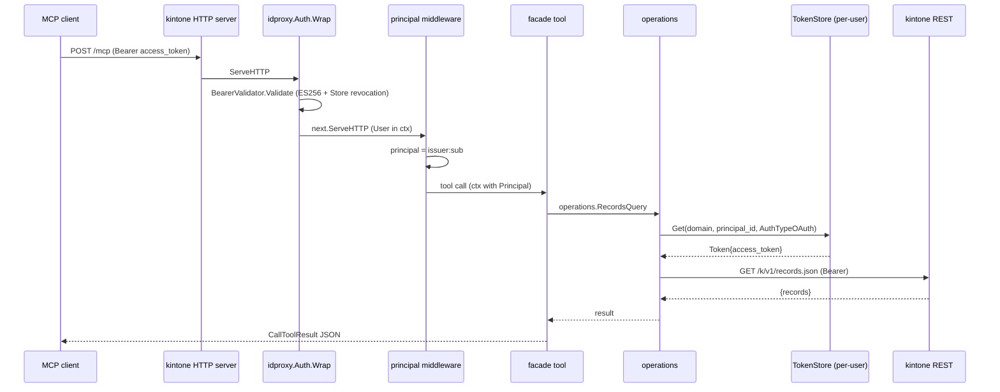

# M10: idproxy + multi-user MCP（remote / OIDC）詳細計画

- ロードマップ: `plans/kintone-roadmap.md` M10
- スペック: `docs/specs/kintone_spec.md`
- ブランチ: `feat/m10-idproxy-multiuser-mcp`
- 前提: M09 完了（OAuth + 自動更新 + multi-user TokenStore 基盤）

---

## 0. 重要な前提（idproxy v0.4.2 調査結果）

### 0.1 import path
- `github.com/youyo/idproxy` v0.4.2（2026-04-29 リリース）
- サブパッケージ: `github.com/youyo/idproxy/store`, `/store/sqlite`, `/store/redis`
- 依存: `coreos/go-oidc/v3`, `golang-jwt/jwt/v5`, `gorilla/securecookie` 等
- Go 1.26.1（kintone 側 1.26 と互換）

### 0.2 v0.4.2 の差分
- **CI deps bump のみ**（actions/checkout, setup-go, golangci-lint-action 等）
- API 破壊変更なし
- v0.4.0 で SQLite/Redis/Momento Store + Cognito サポートが入った（互換維持）

### 0.3 公開 API（kintone から使う部分）
| 識別子 | 概要 |
|-------|------|
| `idproxy.New(ctx, Config) (*Auth, error)` | Auth コンポーネント構築（`Config.OAuth` 設定で自動的に AS / BearerValidator が有効化） |
| `auth.Wrap(next http.Handler) http.Handler` | リクエスト認証ミドルウェア（Bearer / Cookie / OAuth AS / BrowserAuth を内部で振り分け） |
| `idproxy.UserFromContext(ctx) *User` | 認証済み User 取得（next ハンドラ用） |
| `idproxy.User { Email, Name, Subject, Issuer, Claims }` | OIDC sub/iss を保持。`principal_id = Issuer + ":" + Subject` を派生 |
| `idproxy.Config` | Providers, ExternalURL, CookieSecret, OAuth, Store, AllowedDomains 等 |
| `idproxy.OAuthConfig { SigningKey crypto.Signer }` | ES256 / RS256 自動判定 |
| `idproxy.Store` interface | Session/AuthCode/AccessToken/RefreshToken/Client（DCR）等 |
| `store.NewMemoryStore()`, `store.sqlite.NewStore(...)` | Store 実装 |

### 0.4 設計上の含意
- **JWT/JWKS 検証は idproxy 内部で完結**。kintone 側は `auth.Wrap` を被せ、ハンドラ内で `idproxy.UserFromContext(ctx)` を呼ぶだけ
- `Auth.Wrap` の振り分けで `/.well-known/*`, `/authorize`, `/token`, `/register`, `/login`, `/callback`, `/select` が予約される。kintone MCP のエンドポイントはこれらと衝突しないパスを使う
- OAuth AS（DCR / authorize / token）まで idproxy が提供するため、kintone 側 MCP は **OIDC IdP に対する依存だけで multi-user 化できる**
- `principal_id = provider:sub` は `User.Issuer + ":" + User.Subject` でそのまま満たせる
- **テスト**: idproxy 同梱の `github.com/youyo/idproxy/testutil` を使う。`testutil.MockIdP` で OIDC discovery + JWKS + token endpoint を httptest で完結。自前で go-oidc の mock IdP を書かない

### 0.5 mark3labs/mcp-go v0.49.0 HTTP/SSE API 検証済み
実ソース確認済み（`v0.49.0/server/streamable_http.go`, `v0.49.0/server/sse.go`）:

| シンボル | 用途 |
|--------|------|
| `server.NewStreamableHTTPServer(s, opts...) *StreamableHTTPServer` | 主要 transport |
| `(*StreamableHTTPServer).ServeHTTP(w, r)` | http.Handler 実装 |
| `(*StreamableHTTPServer).Start(addr) error` | 内部 ListenAndServe |
| `(*StreamableHTTPServer).Shutdown(ctx) error` | graceful |
| `server.NewTestStreamableHTTPServer(s, opts...) *httptest.Server` | **テスト専用ヘルパ**（H1-H4 で利用） |
| `server.NewSSEServer(s, opts...) *SSEServer` | SSE 互換 |
| `(*SSEServer).SSEHandler() http.Handler` / `.MessageHandler() http.Handler` / `.ServeHTTP` | mux に登録可能 |
| `server.NewTestServer(s, opts...) *httptest.Server` | SSE テスト用 |

設計選択: kintone は **StreamableHTTP を主に推奨**し、SSE は互換のため任意（`KINTONE_MCP_SSE=1` で有効）。理由は MCP 仕様 2025-03-26 から StreamableHTTP が推奨 transport。中間ミドルウェアは `auth.Wrap(streamableHTTPServer)` で被せる（StreamableHTTPServer は http.Handler を実装している）。

---

## 1. ゴール / 非ゴール

### 1.1 ゴール
- `kintone mcp serve` に **HTTP/SSE remote モード**を追加（`--listen` フラグ / `KINTONE_MCP_LISTEN_ADDR`）
- **MCP Auth モード**: `none` / `oidc`（既定 `none`）
- **MCP AuthZ モード**: `oauth` / `api-token`（既定 `api-token`）
- `oidc` モード時は idproxy v0.4.2 で前段保護 → `idproxy.UserFromContext` から Principal を取り出し → リクエストごとに `principal_id = issuer:sub` を解決
- multi-user TokenStore: リクエスト Context の Principal を使い `TokenStore.Get(domain, principal_id, auth_type)` でユーザー別トークン参照
- 既存 stdio mode（auth=none）は **完全後方互換**（apitoken / OAuth 単一ユーザー経路は無変更で動作）
- M09 で「OAuth principal_id 暫定形式」と note した部分を `provider:sub` に統一する移行パスを敷く

### 1.2 非ゴール（M11 以降）
- idproxy を kintone と別プロセスでデプロイする運用ドキュメント（README は最低限のみ）
- WebSocket transport
- DCR でのクライアント永続化を kintone DB に統合（idproxy の Store に委譲）
- HTTP listener の TLS 終端（reverse proxy / idproxy 自身に任せる）
- スコープ別 ACL（OAuth scope による record/app 制限）
- **MCP リクエスト時の自動 kintone OAuth ログイン誘導**（後述「プロビジョニングモデル」参照）

### 1.3 プロビジョニングモデル（重要決定）

multi-user MCP では「各ユーザーの kintone OAuth refresh_token を TokenStore にどう入れるか」が課題になる。M10 では以下の **事前プロビジョニングモデル** に絞る:

1. **管理者または各ユーザー本人が CLI で事前ログイン**:
   ```bash
   kintone auth login --oauth --principal-id "https://accounts.google.com:117..."
   ```
2. M10 では `kintone auth login` が `--principal-id` を **OIDC issuer:sub 形式で受け取る**よう拡張する（ヘルプに idproxy 連携の説明を追記）
3. MCP リクエスト時は idproxy が抽出した `User.Issuer + ":" + User.Subject` を **そのまま** TokenStore キーに使う
4. TokenStore に該当キーが無い場合は **`AUTH_REQUIRED` エラーを MCP client に返却**（client は管理者にログイン手順を案内）

**M11+ で扱う高度モデル**（明示非ゴール）:
- MCP リクエスト時に kintone OAuth flow を自動起動するヘルパー endpoint
- idproxy DCR と kintone OAuth flow を 1 ステップに連結する Web UI
- principal_id の自動正規化と migration（既存 OAuth ユーザーの再ログイン検知）

このモデル選択により M10 のスコープが明確化し、kintone MCP は idproxy 経由 JWT を持つ Principal が **既に TokenStore に登録済みであること** だけを期待すればよい。

---

## 2. パッケージ構造

```
internal/
  idproxy/                            ← 新規（idproxy v0.4.2 thin wrapper）
    config.go                         ← env→idproxy.Config 構築 + Validate
    config_test.go
    middleware.go                     ← idproxy.Wrap + principal 抽出ヘルパ
    middleware_test.go
    principal.go                      ← Principal{ID,Email,Issuer,Subject} と context key
    principal_test.go
    doc.go
  mcp/
    server/
      server.go                       ← 既存（無変更）
      http.go                         ← 新規: HTTP/SSE transport + graceful shutdown
      http_test.go                    ← 新規: httptest で 200/401 + tools 往復
      auth.go                         ← 新規: Auth/AuthZ モード判定 + ハンドラ組立
      auth_test.go
  cli/
    mcp/
      serve.go                        ← --listen / --auth / --authz フラグ追加
      serve_test.go                   ← 既存 + HTTP 起動テスト
      helpers.go                      ← per-request API ビルド（principal 注入）
  service/
    api/
      principal.go                    ← context.Context から principal を引き次の API を構築するファクトリ
      principal_test.go
  tokenstore/
    store.go                          ← 既存（無変更）
docs/
  README.md                           ← multi-user / remote MCP セクションを追加
```

---

## 3. 設計詳細

### 3.1 環境変数 / フラグ

| 変数 / フラグ | 値 | 既定 | 意味 |
|-------------|----|------|------|
| `--listen` / `KINTONE_MCP_LISTEN_ADDR` | `host:port` or `""` | `""` | 空 → stdio。値あり → HTTP/SSE |
| `--auth` / `KINTONE_MCP_AUTH_MODE` | `none` / `oidc` | `none` | `oidc` で idproxy.Wrap を有効化 |
| `--authz` / `KINTONE_MCP_AUTHZ_MODE` | `api-token` / `oauth` | `api-token` | upstream kintone 認証方式 |
| `KINTONE_MCP_OIDC_ISSUER` | URL | 必須(oidc) | idproxy.Config.Providers[0].Issuer |
| `KINTONE_MCP_OIDC_CLIENT_ID` | 文字列 | 必須(oidc) | idproxy.Config.Providers[0].ClientID |
| `KINTONE_MCP_OIDC_CLIENT_SECRET` | 文字列 | 任意 | idproxy.Config.Providers[0].ClientSecret |
| `KINTONE_MCP_EXTERNAL_URL` | URL | 必須(oidc) | idproxy.Config.ExternalURL |
| `KINTONE_MCP_COOKIE_SECRET` | hex >=32B | 必須(oidc) | idproxy.Config.CookieSecret |
| `KINTONE_MCP_ALLOWED_DOMAINS` | csv | 任意 | idproxy.Config.AllowedDomains |
| `KINTONE_MCP_ALLOWED_EMAILS` | csv | 任意 | idproxy.Config.AllowedEmails |
| `KINTONE_MCP_OAUTH_SIGNING_KEY` | PEM path | 任意 | 未指定なら起動時に ES256 鍵を ephemeral 生成（development のみ） |

優先順位は既存と同じ: CLI フラグ > ENV > config

### 3.2 起動マトリクス

| listen | auth | authz | 用途 | 振る舞い |
|--------|------|-------|------|---------|
| `""` | none | api-token | 既存 stdio（無変更） | 完全後方互換 |
| `""` | none | oauth | 単一ユーザー OAuth | M09 の `kintone auth login` 経由トークンを TokenStore から取得 |
| `addr` | none | api-token | LAN 内 share（信頼済みネットワーク） | 認証なし HTTP |
| `addr` | oidc | oauth | **multi-user remote MCP**（M10 主要） | idproxy が JWT 発行 → kintone はユーザー別 TokenStore 参照 |
| `addr` | oidc | api-token | multi-user だが共通 API Token | kintone API は 1 アカウント、Principal は監査用 |

### 3.3 Principal Context

```go
// internal/idproxy/principal.go
type Principal struct {
    ID      string // issuer + ":" + subject
    Email   string
    Issuer  string
    Subject string
    Name    string
}

func WithPrincipal(ctx context.Context, p *Principal) context.Context
func FromContext(ctx context.Context) *Principal // nil for anon
```

`internal/idproxy/middleware.go` は `auth.Wrap` を被せた直後に内部 next で `idproxy.UserFromContext` → `Principal` を構築 → kintone Principal context に詰め替える。

### 3.4 Multi-user TokenStore 解決

`internal/cli/mcp/helpers.go` の `defaultNewAPI` を二系統化:

1. **request-scoped builder**: HTTP モードでは MCP ツール呼び出しごとに `principal := idproxy.FromContext(req.Context())` → `tokenstore.Get(domain, principal.ID, AuthTypeOAuth)` → `kintoneapi.NewFromResolvedWithAuth(...)`。失敗時は `AUTH_REQUIRED` MCP error
2. **process-scoped builder**: 既存 stdio + auth=none + authz=api-token は今と同じ単発構築

`service/api/principal.go` に `APIFactory(ctx) (API, error)` を導入し、facade からは context 経由で API を引く。これで stateless に。

### 3.5 HTTP / SSE transport

mark3labs/mcp-go v0.49.0 は `server.NewStreamableHTTPServer(s)` / `server.NewSSEServer(s)` を提供（v0.49 で安定化済み）。

```go
// internal/mcp/server/http.go
func ServeHTTP(ctx context.Context, s *MCPServer, addr string, mw func(http.Handler) http.Handler) error {
    streamable := server.NewStreamableHTTPServer(s) // /mcp POST
    sse        := server.NewSSEServer(s)            // /mcp/sse, /mcp/message
    mux := http.NewServeMux()
    mux.Handle("/mcp",         streamable)
    mux.Handle("/mcp/sse",     sse.SSEHandler())
    mux.Handle("/mcp/message", sse.MessageHandler())
    handler := mw(mux) // idproxy.Wrap or no-op
    srv := &http.Server{Addr: addr, Handler: handler, ReadHeaderTimeout: 10*time.Second}
    // graceful shutdown: ctx.Done で srv.Shutdown(ctx2)
}
```

衝突回避: idproxy が予約する `/login`, `/callback`, `/select`, `/.well-known/*`, `/authorize`, `/token`, `/register` には kintone 自身のエンドポイントを置かない。MCP は `/mcp/*` に固定。

### 3.6 OIDC モード組立

```go
// internal/idproxy/config.go
func BuildAuth(ctx context.Context, env Env) (*idproxy.Auth, error) {
    cfg := idproxy.Config{
        Providers: []idproxy.OIDCProvider{{
            Issuer: env.Issuer, ClientID: env.ClientID, ClientSecret: env.ClientSecret,
        }},
        ExternalURL:  env.ExternalURL,
        CookieSecret: env.CookieSecret, // hex デコード済み 32B
        AllowedDomains: env.AllowedDomains,
        AllowedEmails:  env.AllowedEmails,
        Store: idproxy_store.NewMemoryStore(), // M10 は memory 既定。M11+ で sqlite に拡張
        OAuth: &idproxy.OAuthConfig{ SigningKey: env.SigningKey }, // 未指定時は ephemeral
    }
    return idproxy.New(ctx, cfg)
}
```

### 3.7 Mermaid シーケンス図



### 3.8 既存 stdio との非後退

- `--listen` 未指定 + `--auth=none` + `--authz=api-token` は **コードパスが完全に分かれる**（HTTP/idproxy import を実行しない）
- `internal/idproxy` パッケージは serve.go から **listen != "" のときだけ参照**
- 既存テスト（`internal/cli/mcp/serve_test.go`）は無変更で pass する制約

---

## 4. TDD テストケース

### 4.1 internal/idproxy パッケージ

| # | ケース | 期待 |
|---|------|-----|
| T1 | `Env.Validate` issuer 空 | error: issuer required |
| T2 | `Env.Validate` cookie_secret < 32B | error |
| T3 | `Env.Validate` external_url が https でも localhost でもない | error |
| T4 | `BuildAuth` 正常系（go-oidc を httptest mock IdP に向ける） | `*idproxy.Auth` 返却 |
| T5 | `WithPrincipal/FromContext` 往復 | 同一 pointer |
| T6 | `Middleware` Wrap: idproxy.User 注入後 → Principal context に変換 | next ハンドラで FromContext non-nil |
| T7 | `Middleware` 未認証（idproxy.UserFromContext nil） | next で FromContext nil |

### 4.2 internal/mcp/server/http.go

| # | ケース | 期待 |
|---|------|-----|
| H1 | `ServeHTTP` no-op middleware で `/mcp` POST tools/list | 200 + tool 配列 |
| H2 | `ServeHTTP` idproxy 中継: Bearer なし | 401 |
| H3 | `ServeHTTP` ctx cancel で graceful shutdown | エラーなし return |
| H4 | `ServeHTTP` Bearer 有効: tools/call apps_search | 200 + Principal が facade に届く |

### 4.3 internal/mcp/server/auth.go（モード判定）

| # | ケース | 期待 |
|---|------|-----|
| A1 | listen="" auth=none authz=api-token | stdio + 単発 builder |
| A2 | listen=":8080" auth=none authz=api-token | HTTP + no-op mw |
| A3 | listen=":8080" auth=oidc authz=oauth + 環境変数欠落 | error: KINTONE_MCP_OIDC_ISSUER required |
| A4 | listen=":8080" auth=oidc authz=oauth + 全環境変数あり | idproxy.Wrap が組み込まれる |
| A5 | auth=oidc 必須項目: ExternalURL https check | error |

### 4.4 service/api per-principal factory

| # | ケース | 期待 |
|---|------|-----|
| P1 | ctx に Principal あり + TokenStore に該当トークンあり | API 構築成功 |
| P2 | ctx に Principal あり + TokenStore 不在 | `ErrAuthRequired` |
| P3 | ctx Principal なし + authz=api-token | フォールバックで config の API Token 使用 |
| P4 | ctx Principal なし + authz=oauth | `ErrAuthRequired` |

### 4.5 facade レベル統合

| # | ケース | 期待 |
|---|------|-----|
| I1 | OIDC mock IdP → idproxy で発行した Bearer → /mcp tools/call apps_search → kintone モック叩く | 全 stack 通過、Principal が TokenStore キーに使われる |
| I2 | Bearer revoked（idproxy.Store.SetAccessToken Revoked=true） | 401 |
| I3 | Principal A と B で TokenStore 分離（並行） | 互いのトークンが漏れない |

### 4.6 既存テスト非後退
- `internal/cli/mcp/serve_test.go`: 無変更で pass
- `internal/mcp/server/server_test.go`: 無変更で pass

### 4.7 Red → Green → Refactor 順序
1. T1-T3 (Validate)
2. T5 (Principal context)
3. T6-T7 (middleware)
4. P1-P4 (factory)
5. A1-A5 (mode 判定)
6. H1-H3 (HTTP)
7. T4 + H4 + I1-I3（go-oidc httptest mock IdP 必要）
8. ドキュメント更新

---

## 5. 依存追加

```bash
go get github.com/youyo/idproxy@v0.4.2
go mod tidy
```

副次依存（idproxy 経由・新規 indirect）:
- `coreos/go-oidc/v3` v3.18
- `golang-jwt/jwt/v5` v5.3
- `gorilla/securecookie` v1.1
- `golang.org/x/oauth2` v0.36
- `go-jose/go-jose/v4` v4.1

注意: `aws-sdk-go-v2/*`, `redis/go-redis/v9`, `alicebob/miniredis/v2` は idproxy の `store/dynamodb`, `store/redis` 専用パッケージにしか依存していないため、kintone が `idproxy/store` の Memory のみ使う限り **indirect 取り込みされない**（Go モジュールの sub-package 単位の依存解決）。`go mod tidy` 後に `go.sum` を確認する。

---

## 6. セキュリティ考慮

| リスク | 対策 |
|------|------|
| JWT alg=none 攻撃 | idproxy が `jwt.WithValidMethods([]string{"ES256"})` で限定（bearer.go 確認済） |
| kid 偽装 | idproxy ES256 直接公開鍵で検証（JWKS 介在しない自前 AS） |
| 失効トークン受理 | idproxy.Store に jti リボケーション登録、Validate で検査済 |
| audience / issuer mismatch | idproxy parser で `WithIssuer/WithAudience` 自動検証 |
| Principal 偽装 | kintone 側は idproxy.UserFromContext のみ信用、Header から直接読まない |
| Cookie secret 漏洩 | hex デコード後メモリで保持。`config show` でマスク |
| OIDC 設定欠落で `auth=oidc` 起動 | 起動時 Validate で fail-fast |
| 並行リクエストの TokenStore 競合 | tokenstore は M07 で sqlite + 単一接続、`Get/Put` は SQLite ロックで serialize（既存基盤） |
| ログから JWT/access_token 漏洩 | logger は `slog` でフィールド名のみ。値は出さない |
| ephemeral SigningKey で再起動時 token 失効 | M10 は development 警告ログ。本番は `KINTONE_MCP_OAUTH_SIGNING_KEY` で永続化 |

---

## 7. リスク評価

| リスク | 確度 | 影響 | 対策 |
|------|------|------|------|
| idproxy v0.4.2 リリース直後の不安定性 | 中 | 中 | v0.4.2 自体は CI bump のみで API 互換。v0.4.0 から続く Auth.Wrap I/F は安定 |
| HTTP/SSE 実装難度（mark3labs/mcp-go の transport API 変更） | 低 | 中 | v0.49.0 で StreamableHTTPServer / SSEServer は安定。テストは httptest で完結 |
| principal_id 移行（M09 暫定 → provider:sub） | 中 | 低 | 既存 OAuth ユーザーの再ログインで自然解消。CLI に warning log のみ |
| 並行リクエスト時の TokenStore 競合 | 低 | 中 | 既存 sqlite 基盤の保証範囲 |
| ephemeral 鍵での運用ミス | 中 | 中 | 起動ログで明示警告、README に永続鍵手順を記載 |
| go-oidc の DNS / ネットワーク失敗で起動が遅い | 低 | 低 | mock IdP テストは httptest 完結 |
| TokenStore に多数ユーザーのトークンが溜まる | 低 | 低 | 期限切れトークンの Cleanup は M11+ で扱う（明示非ゴール） |

---

## 8. 受入条件 (DoD)

- [ ] `go test -race -cover ./...` 全 pass
- [ ] `golangci-lint run ./...` 新規違反 0
- [ ] `gofmt -l .` 差分なし
- [ ] `go vet ./...` clean
- [ ] 既存 stdio mode（auth=none + authz=api-token）が無変更で動作
- [ ] HTTP モードで httptest 統合テスト I1-I3 が pass
- [ ] `kintone mcp serve --listen :8080 --auth oidc --authz oauth` が起動し、idproxy 発行 JWT で MCP tools/call が通る
- [ ] README.md / CLAUDE.md / plans/kintone-roadmap.md が M10 完了状態に更新
- [ ] Conventional Commits（日本語）でコミット
- [ ] `kintone version` JSON 出力が壊れていない

---

## 9. 実装順序

1. (Red) `internal/idproxy/principal_test.go` + `principal.go` (T5)
2. (Red) `internal/idproxy/config_test.go` + `config.go` Validate (T1-T3)
3. (Red) `internal/idproxy/middleware_test.go` + `middleware.go` (T6-T7)
4. `go get github.com/youyo/idproxy@v0.4.2`（T4 で必要になった時点）
5. (Red) `internal/idproxy/config_test.go` BuildAuth + go-oidc httptest mock (T4)
6. (Red) `service/api/principal_test.go` + `principal.go` factory (P1-P4)
7. (Red) `internal/mcp/server/auth_test.go` + `auth.go` モード判定 (A1-A5)
8. (Red) `internal/mcp/server/http_test.go` + `http.go` (H1-H4) — `server.NewTestStreamableHTTPServer` を使い httptest 直書きを避ける
9. (Red) `internal/cli/mcp/serve.go` 拡張 + `serve_test.go` 追加 ケース
10. (Red) facade integration test (I1-I3)
11. Refactor: 共通ヘルパ抽出、godoc、エラーラッピング
12. ドキュメント更新（README / CLAUDE / roadmap）
13. コミット（フェーズごとに Conventional Commits）

---

## 10. 既存パターン踏襲

- sentinel error → cli/facade で MAP（M09 確立）→ `ErrAuthRequired` を facade で `AUTH_REQUIRED` に変換
- PersistentFlags は root.go で集中登録（M09 パターン）→ `--listen`, `--auth`, `--authz` を `kintone mcp` に局所登録（global にはしない）
- TokenStore キー: Domain + PrincipalID + AuthType（M07 確立）→ そのまま使用
- 出力 envelope: `output.Success/Failure`（全 M で確立）→ HTTP transport でも CallToolResult に乗せる方式は変えない
