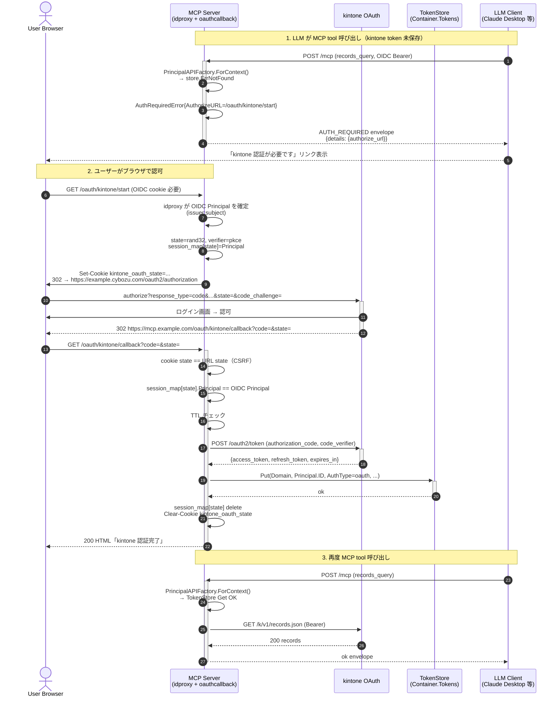

# M13 — Remote MCP 用 サーバホスト型 OAuth callback 実装計画

## メタ

| 項目 | 値 |
|------|---|
| マイルストーン | M13 |
| ブランチ | feat-auth-model-cli-apitoken-mcp-oauth（継続） |
| 仕様 | docs/specs/kintone_spec.md |
| ロードマップ | plans/kintone-roadmap.md（M13 ll.175-185） |
| 関連コミット | 668c33d（ローカル CLI loopback OAuth 廃止） |
| ステータス | Plan — devils-advocate / advocate / advisor 通過待ち |
| TDD | Red → Green → Refactor 厳守 |

## 背景

- kintone OAuth の `redirect_uri` は HTTPS 必須・完全一致照合・RFC 8252 例外非適用。
- ローカル CLI の loopback (`http://127.0.0.1:<port>/callback`) は成立しない（commit 668c33d で廃止済み）。
- 残った経路は「リモート MCP サーバ自身が OAuth client になり、サーバホスト型 callback で kintone トークンを取得・保存する」モデル。
- multi-user 対応の責務は OIDC（既存 idproxy）が担い、kintone トークンは Container.Tokens に Domain + sub + AuthType=oauth で永続化される。
- 既存 `internal/auth/oauth` のうち token exchange / refresh / PKCE / state ロジックは再利用可能。loopback サーバ部分（`callback.go` / `flow.go`）は M13 のサーバホスト型では使わない。

## ゴール（成功条件）

1. `mcp serve --listen :8080 --auth oidc --authz oauth` 起動時に `/oauth/kintone/start` と `/oauth/kintone/callback` が公開される。
2. OIDC 認証済みユーザーが `/oauth/kintone/start` にアクセスすると kintone の authorize URL に 302 リダイレクト、state は OIDC sub に紐付く。
3. kintone の認可後、ブラウザは `/oauth/kintone/callback?code=...&state=...` に戻り、サーバが token exchange を行い `Container.Tokens.Put(Domain, sub, AuthType=oauth)` で永続化、成功 HTML を返す。
4. MCP ツール呼び出し時に Principal トークン不在の場合、`AUTH_REQUIRED` envelope に authorize URL を `details.authorize_url` として含めて返す（LLM クライアントが UI で表示できる）。
5. CSRF 対策が成立する（state は乱数 + HMAC、TTL 5 分、cookie でバインド）。
6. E2E テスト: oidcstub + kintonefake を拡張し、authorize → callback → MCP ツール呼び出しが OK になる一連を build tag `e2e` で検証。
7. `golangci-lint run` / `go test -race -cover ./...` がパス、新規 lint 違反 0。
8. README / spec / CHANGELOG を更新（`/oauth/kintone/*` 仕様、`AUTH_REQUIRED.details.authorize_url`、新 env）。

## 設計判断

### D1: ルーティング配置 — `internal/mcp/oauthcallback` 専用パッケージ

- 候補 A: `internal/mcp/server/http.go` 内に handler を増やす。
  - 利点: ファイル数最小。
  - 欠点: server パッケージが kintone OAuth 設定・TokenStore に依存し、責務肥大化。テストの分離が困難。
- 候補 B: `internal/mcp/oauthcallback` 専用パッケージで `Handler` を提供、`internal/cli/mcp/serve.go` から mux に登録する。
  - 利点: 単一責務 / 依存方向クリア（oauthcallback → store / config / internal/auth/oauth）/ ユニットテストが httptest で完結。
  - 欠点: パッケージ追加（許容範囲）。
- **採用: B**。Core Principles の Simplicity First は「責務単位の最小」を意味する。

### D2: state ↔ session の管理

- **構造**（StateEntry）:
  ```go
  type StateEntry struct {
      State        string    // 乱数 32 bytes base64url（map key）
      PrincipalID  string    // OIDC sub-based principal_id（issuer:subject）
      Verifier     string    // PKCE code_verifier（callback で token exchange に渡す）
      Method       string    // "S256"
      CreatedAt    time.Time
  }
  ```
- **TTL**: **10 分**（SSO + MFA のあるユーザーの実体験を考慮）。期限切れは Get 時に削除。
- **interface 化**:
  ```go
  type StateStore interface {
      Put(ctx context.Context, entry StateEntry) error
      Take(ctx context.Context, state string) (*StateEntry, error) // Get + Delete を atomic に
      Close() error
  }
  ```
  - `Take` は使い捨て semantics（OAuth state の OAuth 2.0 仕様準拠：one-shot）。
  - M13 では in-memory + sync.Mutex 実装のみ提供。M14 で `RedisStateStore` / `DynamoDBStateStore` を Container 配下に追加できる設計。
- **CSRF 三重保護（Option A: callback も idproxy を通す）**:
  - 前提: idproxy v0.4.2 の session cookie は `SameSite=Lax + HttpOnly + Secure` 既定（確認済み: `idproxy@v0.4.2/session.go:150`）。kintone → callback への 302 は top-level GET navigation なので Lax cookie は送信される。
  - layer 1: callback handler は idproxy.Auth.Wrap の後段に置く → request context に OIDC Principal あり前提
  - layer 2: state cookie（kintone_oauth_state）と URL 中 state を `subtle.ConstantTimeCompare` で照合
  - layer 3: `Take` で取り出した PrincipalID と、callback リクエストの OIDC Principal が一致するかを `subtle.ConstantTimeCompare` で照合。不一致なら 403。
- **dev 例外**: `KINTONE_MCP_EXTERNAL_URL=http://localhost...` のとき idproxy cookie は `Secure=false` で発行される（idproxy upstream の挙動）。`KINTONE_OAUTH_ALLOW_PLAINTEXT_REDIRECT=1` opt-in 時のみ動作。
- **再起動耐性**: M13 in-memory 実装ではプロセス再起動時に未完了 state は失効。ユーザーは authorize URL を踏み直す（OAuth flow は本質的に retry 可）。multi-replica 対応とともに M14 で Storage 拡張を計画。**README で明示**。

### D3: token exchange 流用範囲

- `internal/auth/oauth/token.go` の `ExchangeCode` / `RefreshToken` をそのまま再利用。
- `internal/auth/oauth/pkce.go` の `GeneratePKCE` も流用。
- `internal/auth/oauth/state.go` の `GenerateState` も流用。
- **削除しないもの**: `flow.go` / `callback.go` の loopback サーバ。
  - 理由: M09 単体テスト群が `flow.go` の `Login()` API を叩いており、削除は影響範囲広。**deprecated コメント追加に留め、CLI からの呼び出しは既に 668c33d で削除済**。M14 で完全撤去候補。

### D4: TokenStore 保存

- `Container.Tokens()` 経由で `store.Token{Domain, PrincipalID, AuthType=oauth, AccessToken, RefreshToken, ExpiresAt, UpdatedAt}` を Put。
- M07/M12 既存スキーマをそのまま使う（変更なし）。
- TokenStore の Put 失敗時は `STORE_*` 系エラーを HTML レスポンスにマップ（raw error は表示しない）。

### D5: AUTH_REQUIRED envelope 拡張（責務分離型）

- 既存 `facade.MapError` の `errors.Is(err, serviceapi.ErrAuthRequired)` 分岐を拡張。
- `service/api` 側エラー（最小情報のみ持つ）:
  ```go
  type AuthRequiredError struct {
      PrincipalID string
      Domain      string
  }
  func (e *AuthRequiredError) Error() string { ... }
  func (e *AuthRequiredError) Unwrap() error { return ErrAuthRequired }
  ```
- **authorize URL の組立は facade 層に置く**（HTTP 層・External URL の知識を service/api に持ち込まない）:
  - `facade.ToolDeps` に `AuthorizeURLBuilder func(principalID string) string` を追加（オプショナル）。
  - `facade.MapError` は `errors.As(&AuthRequiredError)` でエラーを掴み、ToolDeps の builder で URL を作って details に入れる。
  - builder が nil の場合は details に URL を入れず Code=AUTH_REQUIRED のみ返す（後方互換）。
- このアプローチで、`internal/service/api` は HTTP 公開 URL（KINTONE_MCP_EXTERNAL_URL）を知らない。
- 既存 `errors.Is(err, ErrAuthRequired)` 経路（M11 で導入）も維持（plain envelope）。
- **MapError signature 変更**: 既存 `MapError(err error)` → `MapError(err error, builder func(principalID string) string)`。呼び出し元の handler は `deps.AuthorizeURLBuilder` を渡す。

### D6: 環境変数 / 設定

- `KINTONE_OAUTH_REDIRECT_URL` を redirect_uri として再利用。
- 検証: scheme は `https://` 必須。例外として `KINTONE_OAUTH_ALLOW_PLAINTEXT_REDIRECT=1` の opt-in 時のみ `http://localhost` / `http://127.0.0.1` を許容（test / dev）。
- path prefix `/oauth/kintone` は **M13 固定**（複数インスタンス同居の env 化は M14）。
- 公開 URL prefix は `KINTONE_MCP_EXTERNAL_URL` から取得（idproxy 用と兼用）。
- `start` URL: `{ExternalURL}/oauth/kintone/start`、`callback` URL: `{ExternalURL}/oauth/kintone/callback`。
- redirect_uri の組立は `internal/cli/mcp` で行い、kintone OAuth Application 側登録値と完全一致することをドキュメントで強調。

### D7: loopback 関連の整理

- `internal/auth/oauth/flow.go` の `Login` / `parseLoopbackRedirectURL` は v0.3.0 で CLI から呼ばれなくなった（commit 668c33d）。
- **M13 では `Login` / `CallbackServer` / `NewCallbackServer` を unexported (`login` / `callbackServer` / `newCallbackServer`) に格下げ + Deprecated コメント + テスト維持** のみ。
  - 物理削除しない理由: ExchangeCode / RefreshToken / PKCE のテストが flow_test.go / callback_test.go と相互依存。テスト網への影響を最小化。
  - **重要**: `golangci-lint --enable unused` で残骸が検出されないよう unexport は全 public シンボルに適用。test 内でも internal な参照に統一。
  - 物理削除は M14 で計画。
- `ErrInvalidRedirectURL` のメッセージを「loopback only」から「http(s) URL 文法エラー」汎用へ変更（M13 server side では別 validator を作るため）。

### D8: cookie 設計

- `kintone_oauth_state` cookie:
  - Value: state 文字列（map key）
  - Path: `/oauth/kintone/`
  - HttpOnly: true
  - Secure: true（`KINTONE_MCP_EXTERNAL_URL` が https のとき自動 true）
  - SameSite: Lax（OAuth redirect は cross-site GET なので Strict 不可）
  - MaxAge: 600 秒（state TTL より長め、callback で削除）

## 影響範囲

| 領域 | 変更内容 |
|------|---------|
| 新規 | `internal/mcp/oauthcallback/{handler,state,session,handler_test,state_test,session_test}.go` |
| 拡張 | `internal/service/api/principal.go`（AuthRequiredError + AuthorizeURLBuilder） |
| 拡張 | `internal/mcp/facade/errors.go`（errors.As(&AuthRequiredError) 分岐） |
| 拡張 | `internal/cli/mcp/serve.go` + `idproxy_glue.go`（callback handler を mux に登録） |
| 拡張 | `internal/mcp/server/http.go`（mux に追加 path 登録できるよう拡張 — option 引数追加） |
| 拡張 | `internal/testsupport/kintonefake`（authorize endpoint 追加） |
| 拡張 | `internal/auth/oauth/errors.go`（メッセージ汎用化） |
| 拡張 | `internal/auth/oauth/flow.go` / `callback.go`（deprecated コメント追加のみ） |
| 拡張 | `internal/config/*`（OAuthRedirectURL の HTTPS 検証） |
| 拡張 | `docs/specs/kintone_spec.md` / `README.md` / `README.ja.md` / `CHANGELOG.md` |
| 拡張 | E2E: `internal/cli/mcp/serve_e2e_test.go` に kintone OAuth フロー追加 |

## アーキテクチャ図

### サーバホスト型 OAuth callback シーケンス



## TDD ステップ

### Step 0: 既存テスト確認（pre-Red）

```bash
go test -race ./... 2>&1 | tee /tmp/m13-pre.log
golangci-lint run 2>&1 | tee /tmp/m13-pre-lint.log
```
ベースラインを記録。

### Step 1: state map / session（Red → Green → Refactor）

- ファイル: `internal/mcp/oauthcallback/state.go` + `state_test.go`
- 型: `StateStore` interface + `MemoryStateStore` 実装 + `StateEntry` struct（PrincipalID / Verifier / Method / CreatedAt）
- TDD:
  - **Red**: 
    - `TestMemoryStateStore_PutTake`（put した state を Take で取り出せ、2 回目は ErrNotFound）
    - `TestMemoryStateStore_TTLExpire`（Now を差し替えて 10 min 経過後 ErrNotFound）
    - `TestMemoryStateStore_ConcurrentPutTake`（goroutine 100 並列で race-free）
    - `TestMemoryStateStore_StoresVerifier`（PKCE verifier を保持し Take で正しく返す）
  - **Green**: `sync.Mutex` + `map[string]*StateEntry` + `Now func() time.Time`（テストで差し替え）
  - **Refactor**: 期限切れ自動 GC（Put 時に過去エントリ削除、別 goroutine 不要）

### Step 2: AuthRequiredError 構造体（service/api 側）

- ファイル: `internal/service/api/principal.go`
- TDD:
  - **Red**: `TestAuthRequiredError_UnwrapAndErrorsIs`（`errors.Is(err, ErrAuthRequired)` true / `errors.As` で PrincipalID/Domain 取得）
  - **Green**: `AuthRequiredError struct + Error() + Unwrap()`、`ForContext` で Principal あり + token 不在のとき `AuthRequiredError{PrincipalID, Domain}` を返す
  - **Refactor**: `Error()` に "kintone OAuth not authorized for principal %q" のメッセージ統一
- **責務**: `service/api` は HTTP/External URL を知らない（URL builder は facade に置く）

### Step 3: facade.MapError + ToolDeps 拡張（authorize URL builder）

- ファイル: `internal/mcp/facade/errors.go` + `facade.go` + 各 handler
- 変更:
  - `ToolDeps` に `AuthorizeURLBuilder func(principalID string) string` を追加
  - `MapError` を `MapError(err error, builder func(string) string) *output.Error` にシグネチャ変更
  - 各 handler は `MapError(err, deps.AuthorizeURLBuilder)` を呼ぶ
- TDD:
  - **Red 1**: `TestMapError_AuthRequiredWithBuilder` — builder != nil + AuthRequiredError → `details.authorize_url` + `details.principal_id` 含む
  - **Red 2**: `TestMapError_AuthRequiredWithoutBuilder` — builder == nil → details なし、Code=AUTH_REQUIRED のみ
  - **Red 3**: `TestMapError_PlainErrAuthRequired` — `errors.Is(err, ErrAuthRequired)` のみ true（principal info なし）でも Code=AUTH_REQUIRED を返す
  - **Green**: `errors.As(&AuthRequiredError)` → builder 呼び出し、`details` 構築
  - **Refactor**: handler 群の全 callsite を一括更新

### Step 4: oauthcallback Handler の Start + Callback（PKCE 必須）

- ファイル: `internal/mcp/oauthcallback/handler.go` + `handler_test.go`
- Dependencies (struct):
  ```go
  type Handler struct {
      Domain        string   // kintone domain
      ClientID      string
      ClientSecret  string
      RedirectURL   string   // 公開 URL の callback
      Scopes        []string
      ExternalURL   string   // start handler の path 前段
      States        *StateStore
      Tokens        store.TokenStore
      HTTPClient    *http.Client
      Now           func() time.Time
      RandReader    io.Reader
      AuthorizeBase string   // kintone authorize endpoint（テストで差し替え）
      TokenEndpoint string   // kintone token endpoint（テストで差し替え）
      PrincipalFn   func(*http.Request) *idproxy.Principal // ctx から Principal を取得（テスト差し替え可能）
  }
  ```
- TDD:
  - **Red 1**: `TestStartHandler_RedirectsToAuthorize`
    - OIDC Principal あり → 302、Location が authorize URL に code_challenge + state を含む
    - state cookie が Set-Cookie で返る、HttpOnly/SameSite=Lax
  - **Red 2**: `TestStartHandler_NoPrincipal_401`
    - Principal なし → 401
  - **Red 3**: `TestCallbackHandler_Success`
    - state cookie + URL state 一致、kintonefake が token 返す → TokenStore に Put、200 HTML
  - **Red 4**: `TestCallbackHandler_StateMismatch_403`
  - **Red 5**: `TestCallbackHandler_PrincipalMismatch_403`（cookie の state は valid だが OIDC Principal が違う）
  - **Red 6**: `TestCallbackHandler_StateExpired_400`
  - **Red 7**: `TestCallbackHandler_TokenExchangeFails_502`
  - **Red 8**: `TestCallbackHandler_PKCEVerifierSentToTokenEndpoint`（PKCE Verifier が token exchange 時に form param `code_verifier` で送信される）
  - **Red 9**: `TestCallbackHandler_ErrorLogDoesNotLeakSecrets`（エラーログに access_token / refresh_token / code が含まれないことを確認）
  - **Green**: 実装最小化
  - **Refactor**: HTML テンプレートを定数化、エラー HTML から detail を出さない。slog.Error は state の prefix（最初 4 文字 + ...）と principalID のみ記録、secret は出さない

### Step 5: HTTP server に mux 拡張（具体型）

- ファイル: `internal/mcp/server/http.go` + `internal/cli/mcp/serve.go` + `idproxy_glue.go`
- **採用設計（Option A 採用により全 route で middleware を通す）**:
  ```go
  // HTTPServeOptions に追加
  type RouteEntry struct {
      Path    string       // 例: "/oauth/kintone/start"
      Handler http.Handler
  }
  type HTTPServeOptions struct {
      Addr              string
      Middleware        MiddlewareFunc
      ReadHeaderTimeout time.Duration
      ShutdownTimeout   time.Duration
      ExtraRoutes       []RouteEntry // 追加
  }
  ```
- mux 構築は次の単純化:
  ```go
  mux := http.NewServeMux()
  mux.Handle("/mcp", streamable)
  for _, r := range opts.ExtraRoutes {
      mux.Handle(r.Path, r.Handler) // panic on duplicate
  }
  httpServer.Handler = mw(mux) // 全 route に middleware 適用（Option A）
  ```
- TDD:
  - **Red 1**: `TestServeHTTP_AdditionalRoutes`（`/oauth/kintone/start` を ExtraRoutes で登録して GET → 期待 handler 動作）
  - **Red 2**: `TestServeHTTP_AdditionalRoutes_DuplicatePathPanics`（`/mcp` を ExtraRoutes に入れると `http.ServeMux.Handle` が panic することを確認、もしくは ExtraRoutes 構築前に重複検出で error を返す）— **推奨: 重複検出で error**
  - **Red 3**: `TestServeHTTP_AdditionalRoutes_MiddlewareApplied`（middleware は ExtraRoutes に対しても適用される）
  - **Green**: `ServeHTTP` 実装変更（重複 path 検出で error 返却、その後 mux 構築）
  - **Refactor**: opts 検証ロジックを `validateOptions` に切り出し

### Step 6: 配線（serve.go / facade ToolDeps への authorize URL builder 注入）

- `internal/cli/mcp/serve.go` で `KINTONE_MCP_EXTERNAL_URL` から
  `func(principalID string) string { return externalURL + "/oauth/kintone/start?principal_id=" + url.QueryEscape(principalID) }`
  を構築し、`facade.ToolDeps.AuthorizeURLBuilder` に設定。
- AuthZ=oauth + listen 経由のときのみ設定。auth=none / stdio では nil。
- TDD:
  - **Red**: `TestRegisterTools_WithAuthorizeURLBuilder` — facade のテスト helper で ToolDeps を構築し、handler 呼び出し時に `MapError(err, deps.AuthorizeURLBuilder)` が呼ばれることを検証（既存 `factory_test.go` を拡張）
  - **Green**: handler 群が `deps.AuthorizeURLBuilder` を MapError に渡す改修

### Step 7: redirect_uri の HTTPS 検証 + ExternalURL 整合チェック（startup fail-fast）

- 配置: `internal/mcp/oauthcallback/validate.go` に `ValidateRedirectURL(redirectURL, externalURL string, allowPlaintext bool) error`
  - 配置理由: M13 server-side 検証は CLI 経由の OAuth flow.go の `parseLoopbackRedirectURL` と排他。config 層に置くと既存テスト互換性が壊れる。
- 検証ルール（全 fail-fast、`mcp serve` 起動時に実施）:
  - **R7.1**: `redirectURL` の scheme は `https://`、または `KINTONE_OAUTH_ALLOW_PLAINTEXT_REDIRECT=1` opt-in 時の `http://localhost` / `http://127.0.0.1` のみ
  - **R7.2**: `redirectURL == externalURL + "/oauth/kintone/callback"` を path/host/port/scheme 完全一致でチェック（URL 正規化後）
  - **R7.3**: 不一致なら error メッセージ「KINTONE_OAUTH_REDIRECT_URL must equal `<externalURL>/oauth/kintone/callback`. Update the kintone OAuth Application's redirect URI to match.」
- Handler 構築時に `serve.go` がチェックし、エラーなら fail-fast（kintone OAuth は不一致時に opaque error しか返さず operator pain）。
- TDD:
  - **Red 1**: `TestValidateRedirectURL_HTTPSOnly`（http://example.com は error、https://x.cybozu.com/oauth/kintone/callback は OK）
  - **Red 2**: `TestValidateRedirectURL_LocalhostWithEnvOptIn`（opt-in 時のみ http://localhost を許容）
  - **Red 3**: `TestValidateRedirectURL_ExternalURLMismatch_FailFast`（redirect path/host が externalURL と整合しない → error）
  - **Red 4**: `TestValidateRedirectURL_ExternalURLMatch_OK`
  - **Green**: scheme + host + path 検証
  - **Refactor**: error type sentinel 化（`ErrRedirectURLMismatch`）

### Step 8: E2E テスト

- ファイル: `internal/cli/mcp/serve_e2e_test.go` 拡張（既存 build tag `e2e`）
- kintonefake 拡張: `GET /oauth2/authorization` で `redirect_uri` に code + state を付与し 302 を返す（テスト簡略化のため UI なし即発行）
- 流れ A（新規 OAuth フロー）:
  1. oidcstub 起動 → OIDC issuer 確定
  2. kintonefake 起動（authorize endpoint 追加版）
  3. sqlite Container 起動
  4. `mcp serve --listen 127.0.0.1:0 --auth oidc --authz oauth` を goroutine で起動
  5. **cookiejar が二重に必要**: (a) idproxy session cookie（OIDC login で発行） + (b) kintone_oauth_state cookie（/oauth/kintone/start で発行）。`net/http/cookiejar` の `PublicSuffixList` ありで両方 capture できることを確認。
  6. OIDC login → `/oauth/kintone/start` GET → 302（kintone authorize） → kintonefake authorize → 302（callback） → 200
  7. `Container.Tokens.Get(Domain, PrincipalID, AuthTypeOAuth)` で Token 永続化を確認
  8. `/mcp` に records_query を投げて 200 envelope を確認
- **テストヘルパー**: oidcstub は localhost なので idproxy の `Secure=false` 経路で発行された cookie を cookiejar が受理できることを事前検証する。fail した場合は cookiejar をカスタムにする（advisor non-blocker 対応）
- 流れ B（既存 Token + access_token 期限切れ → refresh）:
  1. Container.Tokens.Put で「access_token 期限切れ・refresh_token 有効」な Token を seed
  2. `/mcp` に records_query → 初回 kintone API 401 → refresh → 200 envelope を確認
  3. Container.Tokens.Get で refresh 後の新 access_token を確認
- 流れ C（AUTH_REQUIRED envelope）:
  1. Container.Tokens は空
  2. `/mcp` に records_query → 200（envelope 内 `ok:false` Code=AUTH_REQUIRED, details.authorize_url 含む）を確認

### Step 9: ドキュメント

- `README.md` / `README.ja.md`:
  - 「リモート MCP の OAuth セットアップ」セクション追加
  - 必要 env: `KINTONE_OAUTH_CLIENT_ID` / `_SECRET` / `_REDIRECT_URL`（HTTPS）/ `_SCOPES` / `KINTONE_MCP_EXTERNAL_URL`
  - エンドポイント仕様: `/oauth/kintone/start` / `/oauth/kintone/callback`
  - LLM 側体験: AUTH_REQUIRED envelope の `details.authorize_url`
- `docs/specs/kintone_spec.md`:
  - 「MCP認証モデル」セクションに OAuth flow 図と endpoint 仕様を追記
- `CHANGELOG.md`:
  - 新エントリ「リモート MCP で OAuth サーバホスト型 callback を追加」

## リスク評価

| # | リスク | 深刻度 | 緩和策 |
|---|--------|-------|--------|
| R1 | state TTL 内に kintone 画面でユーザーが時間をかけ過ぎる | Medium | TTL=10min（SSO + MFA を考慮）。expire 時はわかりやすい日本語 HTML を返し再試行を促す |
| R2 | CSRF 攻撃（state なし forged callback） | High | state cookie + URL state の double-check（subtle.ConstantTimeCompare）+ session map の PrincipalID 一致検証 |
| R3 | multi-replica で state map が孤立 | Medium | M13 では in-memory 限定 + README で明記。M14 で Storage に拡張するため interface 化（StateStore interface） |
| R4 | refresh_token rotation で旧 token が DB に残る | Low | TokenStore.Put は同キー上書き。kintone は rotation する想定で `oauth.Refresher.Refresh` 既存実装が正しく動く |
| R5 | redirect_uri ポート / scheme 不一致で kintone が拒否 | High | `KINTONE_OAUTH_REDIRECT_URL` の HTTPS validator + README で「kintone OAuth client 設定と完全一致」を強調 |
| R6 | loopback 廃止に伴う既存 `auth/oauth/flow.go` の死コード化 | Low | deprecated コメント + 既存テスト維持。M14 で物理削除 |
| R7 | OIDC Principal なし状態で `/oauth/kintone/start` 直叩き | Medium | `/oauth/kintone/start` は idproxy.Auth.Wrap + PrincipalMiddleware を経由（mux 登録時に wrap）→ Principal 不在で 401 |
| R8 | callback で OIDC Principal を取れない | Medium | idproxy v0.4.2 の cookie は SameSite=Lax で top-level GET navigation に同伴。kintone → callback の 302 は top-level GET なので Lax cookie が同伴される（実装検証済）。Option A: callback も idproxy.Auth.Wrap + PrincipalMiddleware を通す。これにより layer 1 = Principal 認証、layer 2 = state cookie、layer 3 = state map の PrincipalID 比較の三重保護 |
| R9 | エラー HTML から secret 漏洩 | High | HTML には固定メッセージのみ。詳細は slog.Error で記録（KINTONE_LOG_LEVEL） |
| R10 | AUTH_REQUIRED envelope を読まない LLM クライアントがハマる | Low | details.authorize_url は plain string なので最低限「エラーコードだけ」でもユーザー応答可能 |

## 完了確認チェックリスト

- [ ] `go test -race -cover ./...` が全パッケージで pass
- [ ] `golangci-lint run` が新規違反 0
- [ ] `go vet ./...` クリア
- [ ] E2E (`make test-e2e` または `go test -tags=e2e ./internal/cli/mcp/...`) が pass
- [ ] `/oauth/kintone/start` → kintone authorize URL に 302、cookie/state 設定確認
- [ ] `/oauth/kintone/callback` → TokenStore Put + 200 HTML
- [ ] AUTH_REQUIRED envelope に `authorize_url` 含まれる
- [ ] README.md / README.ja.md / docs/specs / CHANGELOG.md 更新済み
- [ ] CSRF: cookie state 不一致で 403、Principal 不一致で 403、TTL 切れで 400 の各テスト追加
- [ ] multi-replica の制約を README に明記
- [ ] Conventional Commits 形式・日本語コミット

## 推定工数

| ステップ | 推定 |
|---------|------|
| Step 1 state | 0.5 h |
| Step 2 AuthRequiredError | 0.5 h |
| Step 3 MapError 拡張 | 0.3 h |
| Step 4 Handler | 2.0 h |
| Step 5 http.go mux 拡張 | 0.5 h |
| Step 6 PrincipalAPIFactory 配線 | 0.5 h |
| Step 7 config validator | 0.3 h |
| Step 8 E2E | 1.5 h |
| Step 9 ドキュメント | 1.0 h |
| 合計 | 7.1 h |

## 未決定事項（実装中に判断）

- HTML テンプレートを embed FS にするか文字列定数にするか — 文字列定数で十分（出力 1 ページずつ）。
- redirect_uri path を `/oauth/kintone/callback` で固定するか env で可変にするか — M13 では固定、env は M14。

## 明示的に M13 スコープ外

- multi-replica（kubernetes scale-out）での state 共有 → M14: `RedisStateStore` / `DynamoDBStateStore`
- 1 ユーザー × 複数 kintone domain → M14: config 拡張
- envelope encryption（KMS / Vault） → M14+
- `internal/auth/oauth/flow.go` の物理削除 → M14
- `/oauth/kintone/*` path prefix の env 化 → M14
