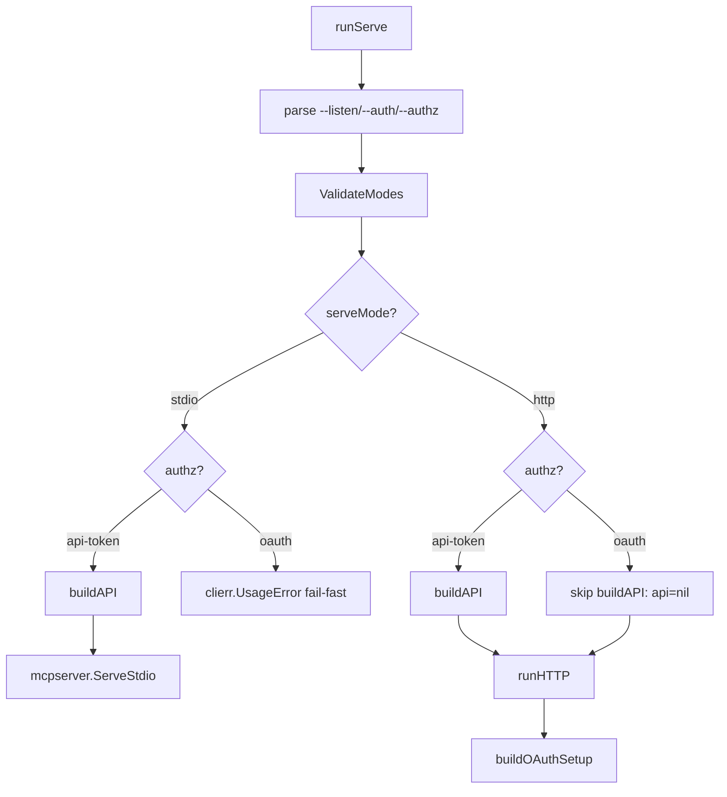

# M15: MCP serve wiring hardening 詳細計画

**目的**: M14 の copilot:code-review で指摘された MCP serve wiring の 2 件の運用事故リスクを fix-only で解消する patch リリース（v0.4.1）。

**ブランチ**: `feat-m15-mcp-serve-wiring-hardening`

## 背景

M14 完了時のレビューで以下 2 件の既存課題が指摘された:

1. **stdio + authz=oauth が silent no-op**
   - 現状: stdio 起動時 `--authz=oauth` 指定または `KINTONE_MCP_AUTHZ_MODE=oauth` 設定があっても、`internal/mcp/server/auth.go::ValidateModes` は stdio+oauth を許容し、`runServe` の stdio 分岐は `buildOAuthSetup` を呼ばずに `mcpserver.New(api)` で立ち上げる。結果として **OAuth 設定が黙って無視**され、運用者は OAuth で動いていると勘違いするまま API Token 認証で稼働する事故が起こる。
   - 影響: 認証モデルの誤認による設定ミスが本番稼働時に検出されない。

2. **HTTP + authz=oauth で起動時 buildAPI が無条件に呼ばれる**
   - 現状: `runServe` は serveMode 判定の前に `buildAPI(cmd)` を呼ぶ。HTTP + OAuth 構成では `PrincipalAPIFactory` が per-request にユーザー別 token から API client を生成するため、起動時の固定 API client は不要。さらに OAuth 構成では config.toml に API Token が無いことが普通であり、起動時 `buildAPI` が「Token 未設定」を理由に失敗するか、無意味な共通 API Token を読み込む。
   - 影響: OAuth 専用デプロイで起動できない、または誤った API client が `facade.ToolDeps.API` に残留する。

## 解決方針

### 修正 1: stdio + authz=oauth を起動時に fail-fast

- **方針**: `internal/mcp/server/auth.go::ValidateModes` に stdio+oauth の拒否を追加する。`clierr.UsageError` ではなく `errors.New` のままにする（`server` パッケージは `cli/clierr` を import しない方針=層分離）。`cli/mcp/serve.go::runServe` は `ValidateModes` のエラーを **clierr.UsageError でラップ**してから return し、CLI のエラーマッパーが `USAGE` envelope に分類できるようにする。
- **エラーメッセージ**:
  ```
  mcp serve: authz=oauth is not supported on stdio transport
  (stdio runs in a single-user process; OAuth requires per-request principal binding which is only available with --listen for HTTP).
  Fix: drop --authz=oauth (or unset KINTONE_MCP_AUTHZ_MODE) to use API Token,
       or specify --listen <addr> --auth oidc --authz oauth for multi-user HTTP mode.
  ```
- **影響範囲**: `ValidateModes` は server パッケージで参照される唯一の wiring 関数。stdio+oauth が許容されていた**過去のテスト**（`auth_test.go:80` の `stdio+none+oauth` ケース）は既存挙動が silent no-op だったため、この行を **新規期待値 = error** に変更する。breaking ではないか？ → ロードマップに記載の通り「過去ドキュメントで動作未保証」かつ「silent no-op で実質誰も使えていなかった」ため breaking では**ない**。CHANGELOG で明示する。

### 修正 2: HTTP + authz=oauth では buildAPI を skip

- **方針**: `runServe` を以下のように再構成する:
  1. parse / validate（既存）
  2. **serveMode + authz** で分岐:
     - `ServeModeStdio` → 既存通り `buildAPI` → `mcpserver.New(api)` → `ServeStdio`
     - `ServeModeHTTP` + `AuthZModeAPIToken` → 既存通り `buildAPI` → `runHTTP(...)`
     - `ServeModeHTTP` + `AuthZModeOAuth` → **`buildAPI` を skip** し `runHTTP(ctx, nil, resolved, addr, auth, authz)` を呼ぶ
  3. `runHTTP` は `api` 引数が nil でも動作するように、`setup != nil` のとき（=OAuth）は `deps = setup.Deps` で上書きされ `api` は使われない。nil-safe のため `deps := facade.ToolDeps{API: api}` を `deps := facade.ToolDeps{}; if api != nil { deps.API = api }` に変更。

- **後方互換性**:
  - stdio + api-token（最も多いユーザ）: **無影響**（buildAPI 呼ぶ、変更なし）
  - http + api-token: **無影響**（buildAPI 呼ぶ、変更なし）
  - http + oauth: **改善**（buildAPI skip。今まで失敗していた構成が動く）
  - stdio + oauth: **fail-fast に変更**（silent no-op → UsageError）

### 認証マトリクス（before/after）

| serveMode | auth | authz    | Before                                | After                                       |
| --------- | ---- | -------- | ------------------------------------- | ------------------------------------------- |
| stdio     | none | apitoken | buildAPI → stdio (OK)                 | 同左                                        |
| stdio     | none | oauth    | buildAPI → stdio (silent no-op, OAuth 無視) | **UsageError fail-fast**                |
| stdio     | oidc | \*       | ValidateModes が既に reject            | 同左                                        |
| http      | none | apitoken | buildAPI → runHTTP (OK)               | 同左                                        |
| http      | oidc | apitoken | buildAPI → runHTTP (OK)               | 同左                                        |
| http      | none | oauth    | buildAPI → runHTTP → OAuth setup (起動時 buildAPI で Token 未設定なら失敗) | **buildAPI skip** → runHTTP → OAuth setup OK |
| http      | oidc | oauth    | 同上                                  | **buildAPI skip** → runHTTP → OAuth setup OK |

## TDD ステップ

### Red 1: server.ValidateModes に stdio+oauth 拒否テスト
- `internal/mcp/server/auth_test.go` の `TestValidateModes` の `stdio+none+oauth` 行を期待 `wantErr: "stdio"` に変更し、新たに `stdio+none+oauth (rejected)` という名前にする。実装前は falling → fail。

### Red 2: cli/mcp の wiring テスト追加
- `internal/cli/mcp/serve_test.go` に新規テスト `TestServeCmd_StdioOAuth_Rejected`:
  - `cmd.SetArgs([]string{"serve", "--authz=oauth"})` で起動。
  - `NewAPIBuilder` を「called=true で panic 的に検知」できる stub に差し替え。
  - 期待: error が返り、`errors.As(err, *clierr.UsageError)` で true、`called == false`（=buildAPI 呼ばれない、即時 fail-fast）。

- `TestServeCmd_HTTPOAuth_SkipsBuildAPI`:
  - `cmd.SetArgs([]string{"serve", "--listen=127.0.0.1:0", "--auth=oidc", "--authz=oauth"})`
  - `NewAPIBuilder` は「呼ばれたら fatal」な stub。
  - 起動を blocking させないため、`runHTTP` のテストフックは現状無いので、**`buildOAuthSetup` 段階で必須 env が無くて fail** する経路を利用して「buildAPI 未呼出 + buildOAuthSetup のエラー」を確認する。
  - 期待: `NewAPIBuilder.called == false`、エラーメッセージに `KINTONE_OAUTH_CLIENT_ID` 等の OAuth 必須 env 文言が含まれる。

- `TestServeCmd_HTTPAPIToken_CallsBuildAPI`（後方互換確認）:
  - `--listen=127.0.0.1:0`（authz は default=api-token）。
  - `NewAPIBuilder` を stub に差し替え（呼ばれた回数を記録）し、stub error を返して即終了。
  - 期待: `called == true` & エラーが stub error。

### Green: 実装
1. `internal/mcp/server/auth.go::ValidateModes` に stdio+oauth 拒否を追加（具体的な復旧手順を含むメッセージ）。
2. `internal/cli/mcp/serve.go::runServe` を以下に書き換え:
   - `ValidateModes` の error を `errors.As(*server.AuthZStdioError)` で検出 … は重い。シンプルに **`runServe` で先に `mode == stdio && authz == oauth` をチェック**し `clierr.NewUsageError(<具体メッセージ>)` を返す。`ValidateModes` 側にも同じ拒否を追加して二重防御（server パッケージ単体でも安全）。
   - `buildAPI` 呼び出しを mode 分岐後に移動。HTTP+OAuth では skip。
3. `runHTTP` を `api serviceapi.API` が nil でも安全に動くよう微調整（`deps := facade.ToolDeps{}` を初期値、OAuth setup 無い場合のみ `deps.API = api`）。

### Refactor
- 過剰 refactor 禁止。コメントを最新化のみ。

## リスク評価

| リスク                                                   | 緩和策                                                                         |
| -------------------------------------------------------- | ------------------------------------------------------------------------------ |
| stdio+oauth を意図的に使っていたユーザがいる             | 既存挙動は silent no-op で OAuth は実質動いていなかった。CHANGELOG で明示する。 |
| buildAPI skip で何かが nil dereference する              | `runHTTP` で `deps.API` を nil 許容にし、OAuth setup が無い HTTP+api-token 経路では従来通り `api` を必ず渡す。テストで全 4 経路を網羅。 |
| `cli/clierr` の import が server パッケージへ逆流        | server パッケージは `errors.New` のままにし、cli/mcp 側で UsageError ラップする。層分離は維持。 |
| gofmt / golangci-lint 違反                               | 実装後 `gofmt -l .` `golangci-lint run` `go vet` `go test -race` を順に確認。 |

## ドキュメント更新

- `README.md` / `README.ja.md`: MCP serve の認証マトリクス節に「stdio + authz=oauth は USAGE エラー」を明記。
- `docs/specs/kintone_spec.md`: MCP 認証モデル節（wiring 表）に修正後の matrix を反映。
- `CHANGELOG.md`: 新規 `## v0.4.1 (2026-05-12)` エントリ。`### Fixed` セクションで 2 件を記述。breaking notice は付けない（silent no-op の正規化）。
- `plans/kintone-roadmap.md`: 既に M15 セクションあり。本コミット時に未完了チェックボックスを `[x]` に更新し、Changelog 末尾に進捗エントリを追加。

## Wiring フロー（Mermaid）



## 検証項目

- [ ] `go test -race -cover ./...` 全 PASS（24 パッケージ以上）
- [ ] `go test -race -tags e2e ./...` PASS
- [ ] `gofmt -l .` 差分 0
- [ ] `golangci-lint run` 違反 0
- [ ] `go vet ./...` クリア
- [ ] 手動: `kintone mcp serve --authz=oauth` が UsageError で即時 fail し復旧手順を含むメッセージを表示
- [ ] 手動: `kintone mcp serve --listen=:8080 --auth=oidc --authz=oauth` で起動時 API Token 未設定でも buildAPI 由来の失敗にならない（OAuth 必須 env のチェックは別途通る）

## 完了条件

- すべての検証項目が pass
- ドキュメント 3 ファイル更新
- ロードマップ M15 のチェックボックスが `[x]`
- Conventional Commits 形式の日本語コミット 1〜2 本（`fix: ` / `docs: `）
