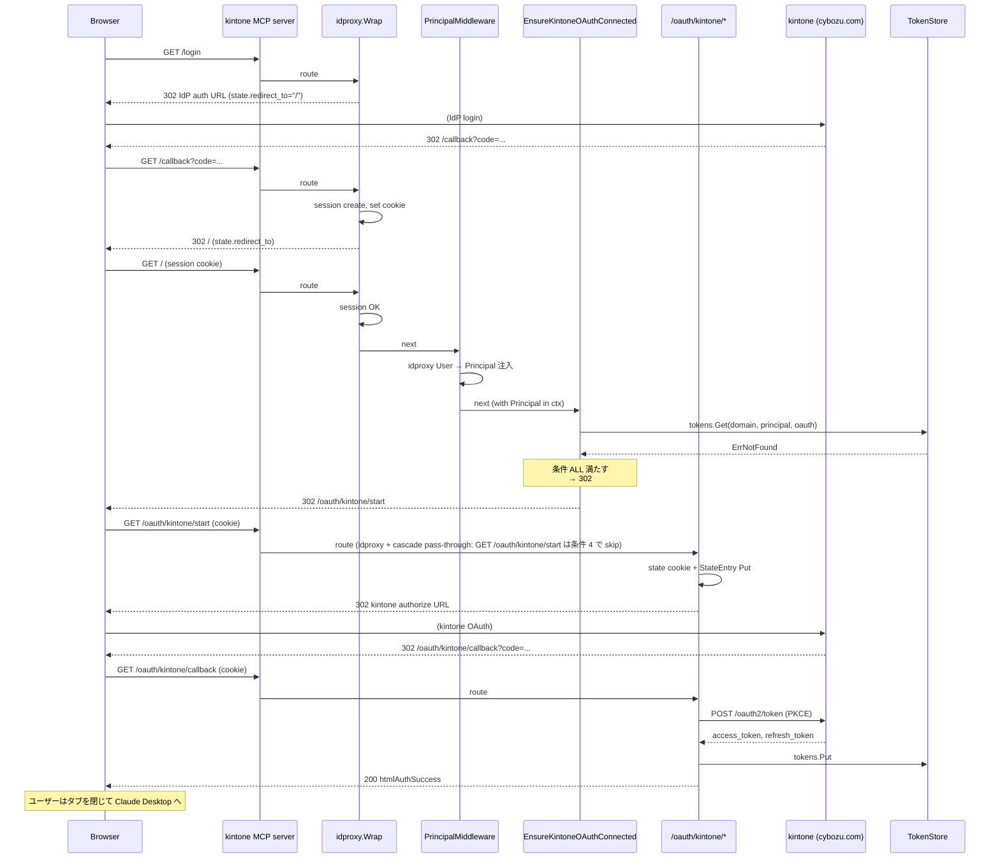

# M16: OIDC callback ブラウザフロー自動カスケード

## Context

issue #5: `kintone mcp serve --auth oidc --authz oauth` で Entra ID 等の OIDC ログイン完了後、ブラウザが `/` にリダイレクトされ 404 となる。Claude Desktop から接続したときも "Authorization with the MCP server failed" で失敗する。

**根本原因（コード追跡で確定）:**

1. ユーザーが `https://<external>/login` を開く（idproxy v0.4.2 `BrowserAuth.LoginHandler` 経由）
2. `redirect_to` クエリ未指定 → state には既定値 `"/"` が保存される（`idproxy/browser_auth.go:110-113`）
3. Entra ID 認証完了 → `/callback` → idproxy が `http.Redirect(w, r, "/", http.StatusFound)`（`idproxy/browser_auth.go:301`）
4. kintone の MCP server は `mux.Handle("/mcp", ...)` と `ExtraRoutes` の `/oauth/kintone/{start,callback}` しか登録していない（`internal/mcp/server/http.go:80-84`）
5. `/` には何もない → 404

logvalet の同等構成では `EnsureBacklogConnected` ミドルウェアが「OIDC 認証済み + Backlog 未接続 + ブラウザ GET」を検出して自動で `/oauth/backlog/authorize` へ 302 リダイレクトしているため、本バグが発生しない。

**M16 のスコープ判断（advisor レビューを反映）:**

issue #5 の本文には 2 つの症状が報告されている:
- **(A) ブラウザフロー**: `/login → /callback → / (404)` — cascade middleware 1 つで解決可能
- **(B) Claude Desktop OAuth AS**: `/authorize` 経由の MCP OAuth が「kintone token なし」で進まない — gate + continue URL + StateEntry 拡張 + 4-backend schema 変更が必要

M16 では **(A) のみ** を解決し、リスク最小で issue #5 の最も visible な症状を即パッチ（v0.4.2）でリリースする。**(B) は M17** として、Claude Desktop の OAuth AS フロー全体を別途設計レビューしてから実装する。

理由（advisor 指摘の要約）:

- (A) は ~100 行 + middleware 1 つ + テストで完結。store / handler / SQLite migration を一切触らない
- (B) は SQLite migration を含み、4 backend に schema 変更が伝播。idproxy SessionManager の取得経路設計（getter なし、`NewSessionManager(cfg)` を kintone 側で別建て）も必要で、複雑度 H
- Lambda + Function URL 環境（issue 報告元）はまず (A) が解決すれば「`/login → /callback → kintone OAuth → 完了」のブラウザフローが通る。issue の Impact 章は Claude Desktop の話も併記されているが、kintone 設定済みユーザーは MCP token 取得後の運用に影響しないので、即時 patch の価値が大きい

issue #5 は M16 で部分解決し、Claude Desktop 経路完成まで open のままにする（M17 で close）。

## スコープ

### 実装範囲（M16）

1. **新規 middleware `EnsureKintoneOAuthConnected`**（ブラウザ自動カスケード）
   - idproxy `Wrap` の **内側**（PrincipalMiddleware の後）に挿入
   - 条件をすべて満たすときのみ `http.Redirect(302, externalURL+"/oauth/kintone/start")`
2. **`internal/cli/mcp/idproxy_glue.go::buildOIDCMiddleware` の合成変更**
   - `(auth=oidc, authz=oauth)` のときに cascade middleware を追加
   - その他は従来どおり（後方互換）
3. **kill switch `KINTONE_MCP_DISABLE_OAUTH_CASCADE=1`**（advisor 非ブロッキング推奨を採用）
   - 環境変数で cascade middleware を no-op 化できるようにする
   - 運用障害時の即時 rollback 用
4. **テスト**（TDD: Red → Green → Refactor）
   - `cascade_test.go`（テーブル駆動、httptest）
   - `serve_e2e_test.go` に N9 経路を追加（oidcstub + kintonefake で `/login → /callback → / → /oauth/kintone/start → /oauth/kintone/callback → htmlAuthSuccess`）
5. **Lambda + Function URL 検証**（hard completion criterion）
   - 開発者の手元では oidcstub + kintonefake で動作確認できるが、issue の発生環境（AWS Lambda + Function URL + Lambda Web Adapter + Entra ID）でも動くことを deploy ベースで確認する
   - reporter（issue 作成者）の検証協力を歓迎し、merge 前に動作確認ログを issue に添える

### スコープ外（M17 へ持ち越し）

- `KintoneAuthorizeGate` middleware（idproxy `/authorize` 先回り）
- `continue` URL（`/oauth/kintone/start?continue=...`）対応
- `StateEntry.ContinueURL` フィールド追加と 4-backend 拡張
- `ValidateContinueURL`（open redirect 対策）
- idproxy `NewSessionManager` の外側からの利用

これらは M17 で「Claude Desktop OAuth AS カスケード」として、独立した設計レビュー + devils-advocate を経て実装する。M17 計画は M16 完了後に `/devflow:plan` で起票する。

### Step 7: upstream（idproxy）への improvement issue 作成（M16 完了時）

issue #5 の根本原因は kintone 固有ではなく、idproxy ライブラリ利用時の落とし穴であるため、`youyo/idproxy` リポジトリに improvement issue を作成する。

- 提案 A: `Config.OnAuthenticated func(w, r, *User) (redirectTo string, handled bool)` — callback 成功時のフック
- 提案 B: `Config.DefaultPostLoginPath string` — デフォルト `"/"` を上書きするオプション
- 提案 C: README に「ライブラリ利用側は `/` ハンドラを必ず登録するか、上記フックを設定すること」と明示

これにより idproxy を採用する他プロジェクトが同じ落とし穴に踏み込むのを防ぐ。

## アーキテクチャ検討

### 既存 middleware スタック（現状、`internal/cli/mcp/serve.go` runHTTP）

```
ServeHTTP(opts.Middleware → mux)
        │
        ▼
opts.Middleware = buildHTTPMiddleware(...)
        = (auth=oidc) → idproxy.Auth.Wrap + PrincipalMiddleware
        = (auth=none) → no-op
        │
        ▼
mux: /mcp + ExtraRoutes（/oauth/kintone/{start,callback}）
```

問題: `/` を含む未登録パスはここで 404。

### 修正後の middleware スタック（M16 / `(auth=oidc, authz=oauth)` 時）

```
ServeHTTP
        │
        ▼
idproxy.Auth.Wrap                 ← 既存: /login, /callback, /authorize, セッション検証
        │
        ▼
PrincipalMiddleware               ← 既存: idproxy User → kintone Principal
        │
        ▼
EnsureKintoneOAuthConnected      ← 新規: ブラウザ GET / + Principal + token なし → /oauth/kintone/start
        │
        ▼
mux: /mcp + /oauth/kintone/{start,callback}
```

**順序の根拠（logvalet `internal/cli/mcp.go:248-281` の middleware stack を参照）:**

- cascade は OIDC ログイン後の認証済みリクエストでないと Principal が取れないため、idproxy + PrincipalMiddleware の **後ろ** に置く

### `EnsureKintoneOAuthConnected` の発火条件（ALL）

logvalet `mcp_auto_redirect.go:32-73` をそのまま kintone 用に置換:

| # | 条件 | 理由 |
|---|------|------|
| 1 | `r.Method == GET or HEAD` | API/MCP リクエストは redirect すべきでない |
| 2 | `Accept` ヘッダに `text/html` を含む | JSON API は対象外 |
| 3 | `idproxy.FromContext(ctx)` が非 nil の Principal を返す | 未認証は idproxy が `/login` へ送る |
| 4 | `r.URL.Path` が `/oauth/kintone/` で **始まらない** | 無限ループ防止 |
| 5 | `r.URL.Path` が `/mcp` ちょうど or `/mcp/` で始まる、ではない | MCP クライアントの JSON-RPC 保護 |
| 6 | `tokens.Get(ctx, store.Key{Domain, PrincipalID, AuthTypeOAuth})` が `errors.Is(err, store.ErrNotFound)` | token 既取得なら redirect 不要 |

満たさないとき / 条件 6 で `ErrNotFound` 以外のエラー: `next.ServeHTTP`（安全側 pass-through）。
満たすとき: `http.Redirect(w, r, externalURL+"/oauth/kintone/start", http.StatusFound)`。

**advisor 指摘の sentinel 確認（実装ファクト）:**
- `internal/store/errors.go:12` `ErrNotFound = errors.New("store: not found")`
- `internal/store/tokens.go:9` `// Get はキーに対応する Token を返す。不在は [ErrNotFound]。`
→ cascade 条件は `errors.Is(err, store.ErrNotFound)` のみを redirect トリガーとする

## テスト設計書

### 正常系ケース

| ID | テスト対象 | 入力 | 期待 |
|----|------------|------|------|
| N1 | cascade | GET / + `Accept: text/html` + Principal=p1 + tokens 空 | 302 `Location: <external>/oauth/kintone/start` |
| N2 | cascade | 同上 + tokens に p1 のトークン有 | next（200） |
| N3 | cascade | GET /static/foo 同条件 | 302（path によらず動く、ただし `/mcp` `/oauth/kintone/` 以外） |
| N9 | E2E | `kintone mcp serve --auth oidc --authz oauth` + oidcstub + kintonefake で `/login → /callback → / → /oauth/kintone/start → kintone authorize → /oauth/kintone/callback` を cookie jar 付きで自動巡回 | 最終的に `htmlAuthSuccess` ページ + `tokens.Get(...)` で永続化された token が取れる |

### 異常系ケース

| ID | テスト対象 | 入力 | 期待 |
|----|------------|------|------|
| E1 | cascade | POST / + 他条件全 OK | next（302 しない） |
| E2 | cascade | GET / + `Accept: application/json` + 他条件全 OK | next |
| E3 | cascade | GET / + Principal nil | next（idproxy が後段で /login 送出） |
| E4a | cascade | GET /mcp + 他条件全 OK | next（MCP 保護）|
| E4b | cascade | GET /mcp/foo + 他条件全 OK | next |
| E5 | cascade | GET /oauth/kintone/start + 他条件全 OK | next（無限ループ防止）|
| E13 | cascade | tokens.Get が `ErrNotFound` 以外のエラー（例: `errors.New("io")`） | next（安全側 pass-through）|
| E14 | cascade kill switch | `KINTONE_MCP_DISABLE_OAUTH_CASCADE=1` で middleware が no-op 化される | 全条件 satisfied でも next |

### TDD 実装順

1. **Red**: `cli/mcp/cascade_test.go` で N1〜N3, E1〜E5, E13, E14 のテーブルテスト → 失敗
2. **Green**: `cli/mcp/cascade.go` に `EnsureKintoneOAuthConnected` 実装 → 全 pass
3. **Red**: `cli/mcp/serve_e2e_test.go` に N9 を追加 → middleware 配線 (`oauth_glue.go`/`idproxy_glue.go`) 未完で失敗
4. **Green**: middleware 配線 + kill switch チェックを実装 → pass
5. **Refactor**: middleware 構築ヘルパを `oauth_glue.go` 内に集約、無用な context.Value lookup を排除

## 実装手順

### Step 1: `EnsureKintoneOAuthConnected` middleware（独立、TDD で先行）

- ファイル: `internal/cli/mcp/cascade.go` + `cascade_test.go`
- 公開シグネチャ:
  ```go
  func EnsureKintoneOAuthConnected(
      tokens store.TokenStore,
      domain string,
      startURL string,
  ) func(http.Handler) http.Handler
  ```
- ロジック（疑似コード）:
  ```go
  func EnsureKintoneOAuthConnected(tokens store.TokenStore, domain, startURL string) func(http.Handler) http.Handler {
      if os.Getenv("KINTONE_MCP_DISABLE_OAUTH_CASCADE") == "1" {
          return func(next http.Handler) http.Handler { return next }
      }
      return func(next http.Handler) http.Handler {
          return http.HandlerFunc(func(w http.ResponseWriter, r *http.Request) {
              if r.Method != http.MethodGet && r.Method != http.MethodHead {
                  next.ServeHTTP(w, r); return
              }
              if !strings.Contains(r.Header.Get("Accept"), "text/html") {
                  next.ServeHTTP(w, r); return
              }
              p := idproxy.FromContext(r.Context())
              if p == nil || p.ID == "" {
                  next.ServeHTTP(w, r); return
              }
              if strings.HasPrefix(r.URL.Path, "/oauth/kintone/") {
                  next.ServeHTTP(w, r); return
              }
              if r.URL.Path == "/mcp" || strings.HasPrefix(r.URL.Path, "/mcp/") {
                  next.ServeHTTP(w, r); return
              }
              _, err := tokens.Get(r.Context(), store.TokenKey{
                  Domain: domain, PrincipalID: p.ID, AuthType: store.AuthTypeOAuth,
              })
              if errors.Is(err, store.ErrNotFound) {
                  http.Redirect(w, r, startURL, http.StatusFound)
                  return
              }
              // 他のエラー（network 等）も pass-through で safe default
              next.ServeHTTP(w, r)
          })
      }
  }
  ```
- 依存: なし（既存 `internal/store`, `internal/idproxy` のみ）
- ⚠️ 実 API 名（`store.TokenKey` / `store.AuthTypeOAuth`）は `internal/store/tokens.go` を読んで合わせる。型名が異なる場合は実装時に調整

### Step 2: middleware 配線 (`idproxy_glue.go` / `oauth_glue.go` / `serve.go`)

- `oauth_glue.go::buildOAuthSetup` の戻り `oauthSetup` 構造体に `Tokens store.TokenStore` を含める（既存ローカル変数を export）
- `serve.go::runHTTP` で `setup != nil && auth == oidc` のときに cascade middleware を `mw` に合成:
  ```go
  if setup != nil {
      startURL := strings.TrimRight(externalURL, "/") + "/oauth/kintone/start"
      cascade := EnsureKintoneOAuthConnected(setup.Tokens, resolved.Domain, startURL)
      mw = chain(mw, cascade) // chain は h -> outer(inner(h)) で適用
  }
  ```
- `mw` の組立: `idproxy.Auth.Wrap → PrincipalMiddleware → EnsureKintoneOAuthConnected` の順
- `(authz=api-token)` では cascade を加えない（kintone OAuth トークン不要、API Token は環境変数）
- 依存: Step 1

### Step 3: E2E テスト追加（既存 `serve_e2e_test.go` 拡張）

- 既存 `oidcstub` + `kintonefake` を活用
- `http.Client` に `cookiejar.New(nil)` を持たせ、`/login` → 自動で IdP authorize → callback → / → /oauth/kintone/start → /oauth/kintone/callback まで自動ナビゲートさせる
- 検証: 最終応答が 200 + `htmlAuthSuccess` の expected 文字列を含む / `tokens.Get(...)` で永続化された token が取れる
- 依存: Step 2

### Step 4: ドキュメント / ロードマップ更新

- `plans/kintone-roadmap.md`:
  - Progress に M16 セクション追加（チェックボックス）
  - Current Focus を M16 に更新
  - Architecture Decisions に「OIDC + OAuth カスケードを middleware 1 つで実装、logvalet パターンを踏襲」追記
- `docs/specs/kintone_spec.md`: HTTP middleware スタック節に cascade 行を追加
- `README.md` / `README.ja.md`:
  - `mcp serve --auth oidc --authz oauth` の動作説明を更新（自動カスケードに言及）
  - トラブルシュート章に「`KINTONE_MCP_DISABLE_OAUTH_CASCADE=1` で旧挙動に戻せる」と記載
- `CHANGELOG.md`: v0.4.2 として `fix(mcp): OIDC コールバックから kintone OAuth への自動カスケード (#5 一次修正)` を記録、M17 で完全解決予定の旨を追記
- 依存: Step 1〜3 完了

### Step 5: ローカル動作確認

```bash
go test -race -cover ./...
go test -tags e2e -race ./internal/cli/mcp/...
golangci-lint run
go vet ./...
gofmt -l .
```

### Step 6: Lambda + Function URL 環境での再現確認（hard completion criterion）

- v0.4.2-rc image を ECR push → Lambda update → Function URL アクセス
- issue #5 の再現手順（`<FUNCTION_URL>/login` → Entra ID）が `/oauth/kintone/start` まで自動カスケードすることを確認
- 観察結果（HTTP status / redirect chain / cookie 属性）を issue #5 にコメント追記して reporter とすり合わせ
- 通れば v0.4.2 タグ push → リリース → issue にリリースリンクを返信

### Step 7: upstream（idproxy）への improvement issue 作成

実装完了後、`youyo/idproxy` に以下のような issue を作成:

```
title: BrowserAuth: callback 後リダイレクト先のデフォルト "/" がライブラリ利用時の落とし穴
body:
- 現状 v0.4.2 `BrowserAuth.LoginHandler` は `redirect_to` 未指定時に state へ `"/"` を保存し、`CallbackHandler` がそこへ 302 する
- 利用側が `/` ハンドラを用意しないと 404 になる（kintone の issue #5 が実例: <URL>）
- 提案 A: `Config.OnAuthenticated func(w, r, *User) (redirectTo string, handled bool)` フック追加
- 提案 B: `Config.DefaultPostLoginPath string` を Config に追加
- 提案 C: README に「ライブラリ利用側は `/` ハンドラを登録するか OnAuthenticated を設定すること」と明記
labels: enhancement, dx
```

## ドキュメント更新一覧

| ドキュメント | 更新内容 |
|--------------|----------|
| `plans/kintone-roadmap.md` | M16 を Progress に追加、Current Focus 更新 |
| `docs/specs/kintone_spec.md` | MCP HTTP middleware スタック節に cascade 行を追加 |
| `README.md` / `README.ja.md` | mcp serve 動作説明 + トラブルシュート（kill switch） |
| `CHANGELOG.md` | v0.4.2 エントリ |

## アーキテクチャ整合性チェック

- [x] 命名規則: `EnsureKintoneOAuthConnected` は logvalet 命名と整合し、kintone 接頭辞も付与
- [x] 設計パターン: middleware の高階関数返却（`func(http.Handler) http.Handler`）は既存 `PrincipalMiddleware` と一致
- [x] モジュール分割: TokenStore 依存を持つ middleware は `internal/cli/mcp` に配置（既存 `helpers.go` / `oauth_glue.go` と同層）。`idproxy` パッケージは upstream に近い純粋層として keep
- [x] 依存方向: `internal/cli/mcp → internal/store + internal/idproxy` で既存方向を維持。新規循環ゼロ
- [x] 類似機能との統一性: logvalet パターンの直訳

## リスク評価

| リスク | 重大度 | 対策 |
|--------|--------|------|
| 無限リダイレクトループ（cascade → /oauth/kintone/start → idproxy → cascade ...） | High | 条件 4（`/oauth/kintone/` prefix で next 委譲）で physical に防ぐ + N9 E2E テストで `/oauth/kintone/start` が cascade に再突入しないことを assert |
| `/mcp` への誤 redirect で Claude Desktop の JSON-RPC が壊れる | High | 条件 2（Accept: text/html）と条件 5（`/mcp` 除外）の double guard。テスト E2 / E4a / E4b で防御確認 |
| token はあるが期限切れ → cascade が拒否しない、しかし上流の Factory が失敗 | Medium | cascade は token 「存在」だけ判定（`ErrNotFound` のみが redirect トリガー）。期限切れは PrincipalAPIFactory の `Refresher` が refresh する設計のため、cascade で 302 を出すと UX が悪化する |
| `tokens.Get` が network エラー等で `ErrNotFound` 以外を返した場合 | Medium | E13: pass-through（safe default）。idproxy が後段で何らかの応答を出す。redirect 連鎖を起こさない |
| ロールバック | — | (1) `KINTONE_MCP_DISABLE_OAUTH_CASCADE=1` の kill switch で即時無効化 (2) `--authz=api-token` で middleware 自体が刺さらない (3) v0.4.1 への切り戻し |
| パフォーマンス | — | GET + text/html + Principal あり + 非 /mcp 非 /oauth/kintone のパスのみで TokenStore.Get 1 回。常時アクセスされる `/mcp` は条件 5 で短絡。許容範囲 |
| セキュリティ（CSRF / Open redirect） | Low | リダイレクト先は固定 `externalURL+"/oauth/kintone/start"`（外部入力なし）。Open redirect 攻撃面ゼロ。state cookie / state map / Principal 三重保護は既存通り温存 |
| Lambda 環境固有差異（cookie 属性、host header） | Medium | Step 6 で hard criterion として実環境検証 |

## シーケンス図（M16 対象: ブラウザフロー）



## チェックリスト

### 観点1: 実装実現可能性と完全性

- [x] 手順の抜け漏れがないか — Step 1-7 で全経路カバー
- [x] 各ステップが十分に具体的か — file path / 関数名 / 疑似コード明示
- [x] 依存関係が明示されているか — Step 末尾に `依存:` 記載
- [x] 変更対象ファイルが網羅されているか — 新規 2 (cascade.go / cascade_test.go) + 修正 5（idproxy_glue.go / oauth_glue.go / serve.go / serve_e2e_test.go / docs 4 種）
- [x] 影響範囲が正確に特定されているか — `(auth=oidc, authz=oauth)` 限定で他経路影響ゼロを明記

### 観点2: TDD テスト設計

- [x] 正常系テストケース網羅 — N1-N3, N9
- [x] 異常系テストケース定義 — E1-E5, E13, E14
- [x] エッジケース考慮 — 無限ループ / MCP path 保護 / kill switch / network error pass-through
- [x] 入出力が具体的 — テスト表で具体 path / header / 期待 status・Location
- [x] Red→Green→Refactor — Step 1 〜 5 の順序で明記
- [x] モック/スタブ設計 — `idproxy.FromContext` の context 注入 + 軽量 fake TokenStore + 既存 oidcstub/kintonefake を活用

### 観点3: アーキテクチャ整合性

- [x] 命名規則: 既存 `PrincipalMiddleware` 等と一致
- [x] 設計パターン: 高階関数 middleware で統一
- [x] モジュール分割: TokenStore 依存は `cli/mcp`、純粋層は触らない
- [x] 依存方向: 循環なし
- [x] 類似機能との統一性: logvalet パターンの直訳

### 観点4: リスク評価と対策

- [x] リスク特定 — 無限ループ / MCP 破壊 / 期限切れ / network error / Lambda 環境差異 / rollback / perf / CSRF
- [x] 対策が具体的 — kill switch / double guard / pass-through fallback / test カバレッジ / 実環境検証
- [x] フェイルセーフ — `ErrNotFound` 以外は pass-through で safe default
- [x] パフォーマンス影響 — GET + html + non-MCP/non-OAuth path のみで TokenStore.Get 1 回
- [x] セキュリティ観点 — Open redirect 攻撃面ゼロ（リダイレクト先固定）/ CSRF 既存保護温存
- [x] ロールバック計画 — kill switch + authz 切替 + バージョン切り戻しの 3 段階

### 観点5: シーケンス図

- [x] 正常フロー — ブラウザフロー mermaid 図（M16 対象）
- [x] エラーフロー — リスク表で網羅
- [x] 相互作用 — Browser / kintone MCP / idproxy / PrincipalMiddleware / cascade / kintone OAuth / TokenStore を全部明示
- [x] タイミング・同期 — 302 連鎖 + cookie 同伴 + state cookie SameSite=Lax の前提を明示
- [x] リトライ・タイムアウト — N/A（cascade は単一判定。state 10 分 TTL は既存 handler の仕様）

## 検証手順（マニュアル）

1. ローカルで oidcstub + kintonefake を起動し `kintone mcp serve --listen :8080 --auth oidc --authz oauth` を立てる
2. ブラウザで `http://localhost:8080/login` を開く
3. oidcstub のスタブログインを完了 → `/callback` → 自動で `/oauth/kintone/start` へ → kintonefake authorize → `/oauth/kintone/callback` → `htmlAuthSuccess` が表示されることを確認
4. `KINTONE_MCP_DISABLE_OAUTH_CASCADE=1` を付与して再起動 → 同手順で `/` が 404 になる（kill switch 動作確認）
5. AWS Lambda + Function URL 環境で v0.4.2-rc を deploy し、issue #5 の再現手順がブラウザ操作で完結することを確認（hard criterion）

## オープン質問（実装着手前に確認したい）

| # | 質問 | 推奨案 |
|---|------|--------|
| 1 | M16 のスコープを「cascade のみ（split 案）」で確定して良いか、Claude Desktop OAuth AS も同 PR に含めるか（bundled-H 案） | ★ split 推奨（advisor 評価 + リスク最小 + patch リリースの速さ） |
| 2 | `KINTONE_MCP_DISABLE_OAUTH_CASCADE=1` kill switch を実装するか | ★ 実装推奨（advisor 非ブロッキング指摘 + 運用障害時の rollback 用） |
| 3 | リリースバージョン | ★ v0.4.2 patch（バグ修正扱い）|
| 4 | issue #5 の close タイミング | ★ M16 リリース時に「partial fix」コメント、M17 完了時に close |

## Next Action

このプランを実装するには:
- `/devflow:implement` — TDD で Step 1〜3 を実装、Step 4 でドキュメント更新、Step 5/6 で動作確認、Step 7 で upstream issue
- `/devflow:cycle` — M16 を自律ループで完了させる（plan → devils-advocate → advocate → implement → review）

実装前に確認したいこと:
- 上記「オープン質問」4 点（特に split 案で進めて OK か）
- plan ファイルへのインライン注釈での修正指示 → 注釈反映後、再度 `/devflow:plan`

完了後の次マイルストーン:
- M17: Claude Desktop OAuth AS カスケード（`KintoneAuthorizeGate` + `continue` URL + `StateEntry.ContinueURL` + 4-backend schema 拡張）。M16 リリース後に `/devflow:plan` で詳細起票。
